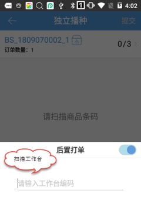
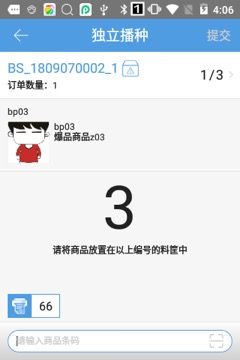
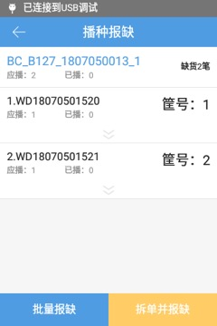

# PDA-独立播种

独立播种，可以帮助用户使用料框模式盲扫商品来验货，当扫到的商品匹配上订单后，会显示对应的筐号，用户只需要将商品放入对应的播种筐中，不提交验货。

(1) 点击“独立播种”，进入独立播种扫描页面。

(2) 扫描波次或拣货筐，进入播种页面，点击左下角开启后置打印，扫描工作台编码。

(3) 扫描波次中相应的商品条码，显示商品和对应的筐号。

    提示

    ①.条码截取：pc上流程配置开启验货商品条码截取，pda会自动生效。若截取条码前3位，商品条         码是new0001，则pda只需要扫描条码new即可完成验货。

(4) 播种完成后，自动跳到，播种筐分布页面，点击提交，提交播种并打印快递单。

    提示

    ①.播种筐中的“X”，表示该订单被拦截或者挂起或者不在验货环节了。

    ②.打印快递单，pc和pda需处于同一局域网下且快递是开启电子面单的。

(5)若播种的过程中，发现订单中的商品缺失了，可以进行缺货报缺。

    提示

    ①.批量报缺：多笔订单可以同时报缺且是整笔订单都报缺。

    ②.拆单并报缺：订单缺货的部分拆出一个新订单，未缺货的可以正常提交播种。

(6)查看商品详情，不区分订单的。

 

**注：独立播种和播种验货只能二选其一，在****PC****端****-****仓内策略****-****业务配置****-****出库配置中开启验货环节订单独立播种，则显示独立播种菜单；否则显示播种验货菜单。**

 

 

> 更新: 2023-12-21 09:28:17  
> 原文: <https://hupun.yuque.com/unzko7/lsbfg0/mgy11boewo3b2ym5>