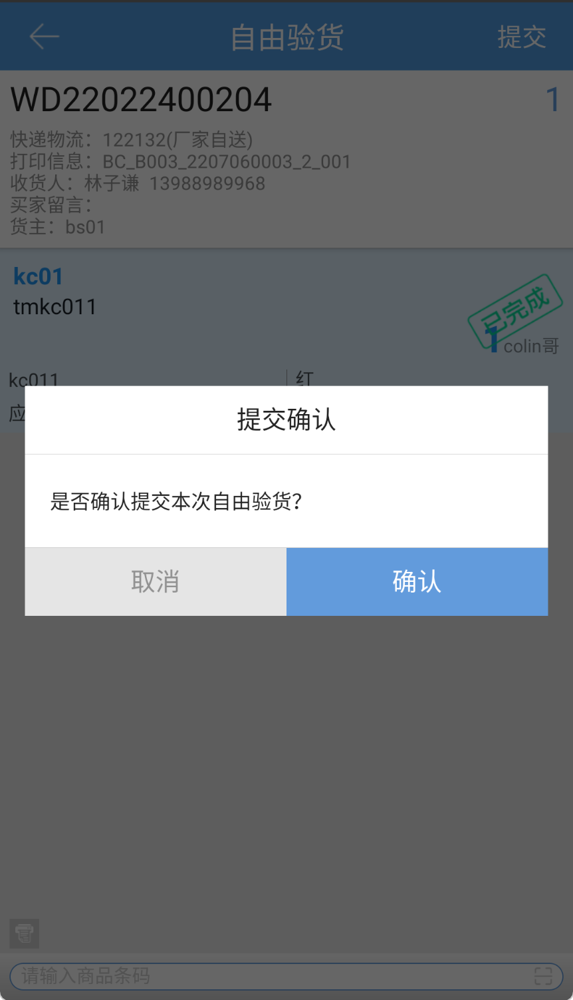

# PDA-自由验货

业务场景：针对一种一件的商品，特别是服装相关行业（订单比例可大于60-70%），希望有比目前系统更加相对便捷简单的拣货、验货方式。希望可以在验货的时候直接扫描商品条码，系统自由匹配订单后置打印出快递单。

自由验货，通过操作员手拿实物去扫商品条码匹配订单，进行验货并后置打印快递单。

具体页面如下：

1.先选择货主，默认选择是不限货主；

2.开启后置打印，输入工作台编码；

3.扫描商品条码，匹配订单并自动验货，提交验货并打印快递单；

4.待处理订单数，是处于待验货且是归属自由波次下的订单数。

> 更新: 2024-02-06 10:48:21  
> 原文: <https://hupun.yuque.com/unzko7/lsbfg0/vvgpnoq5ktdufg0g>