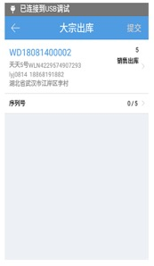

# PDA-大宗出库

大宗出库，针对大宗单提交出库，也支持序列号的输入，操作步骤如下

1.点击大宗出库按钮，用户可见如图页面，输入或扫描订单号/运单号，操作需出库订单。                     

2.选择订单后，可以查看订单信息和商品，点击提交，提交出库。                      

                     

 

> 更新: 2024-02-06 09:34:21  
> 原文: <https://hupun.yuque.com/unzko7/lsbfg0/pzqyu282uyhvsahs>