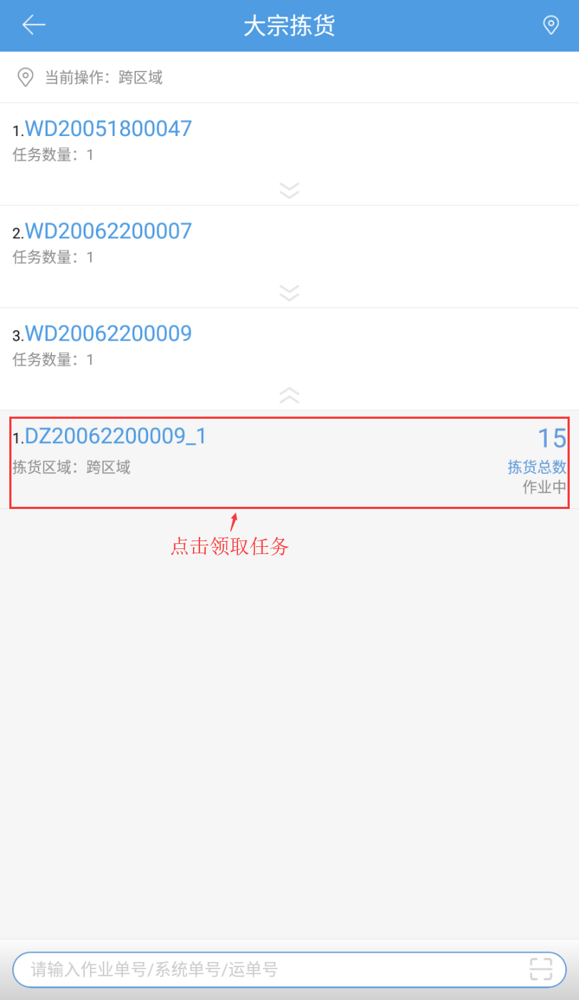
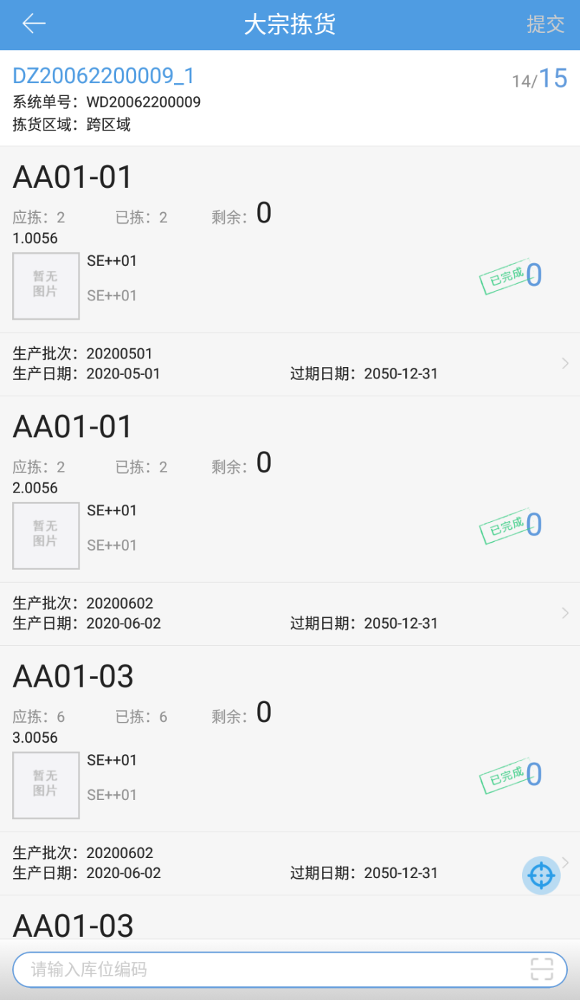

# PDA-大宗拣货

业务场景：订单是大宗件，商品种类和数量很多，可以把该订单拆分多个任务，分配给多人操作，也支持部分拣货，实现边拣货边装箱。

1. 点击大宗拣货按钮，用户可见如图页面，扫描作业单号/系统单号/运单号或选择作业区域下拉选择任务。                       

  

注意：订单锁定成功未拆分，大宗拣货扫描系统单号/运单号，会直接生成一个拣货任务

2.页面下拉，加载作业区域下的任务所属订单，点击选择任务。

  

提示：

①、加载订单：作业区域下的任务所属订单且该订单下有任务时未完成的，全部任务完成的订单不加载、被拦截的订单不加载。

②、扫描任务单号时，不限制作业区域。

③、订单中任务排序显示：作业中无操作员>未作业>作业中有操作员>已完成.

3.选择任务，跳到拣货页面，进行拣货。

   

4.若仓库中的业务配置开启了大宗订单部分出库，部分拣货，点击提交，可以先提交已拣货的部分。

提示：已拣的部分提交并拆出新的任务，状态是作业完成，提交后剩余未拣货的仍属于原任务且还是被当前操作员领取到。

 

> 更新: 2024-02-06 09:34:02  
> 原文: <https://hupun.yuque.com/unzko7/lsbfg0/dqsavnzc1gdgi0fe>