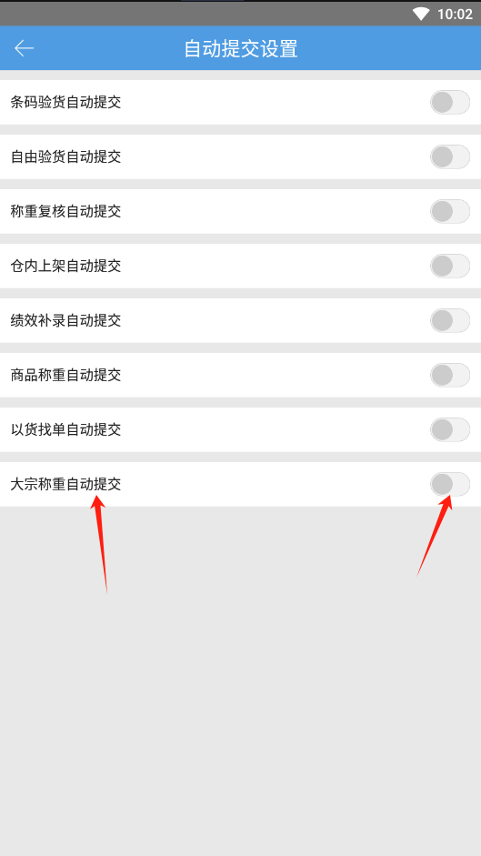

# PDA-大宗称重

大宗订单称重时搬箱子到工作台不方便，希望提供快捷大宗称重功能。

1.支持扫描未装箱的大宗订单系统单号/运单号，已装箱的支持扫描大宗箱号/箱运单号匹配。

注：订单/箱子已被称重过，支持再次称重。

2.支持连接蓝牙电子秤操作设备称重，连接成功下次进入菜单默认自动连接。

3.商品净重=商品重量×商品数量

4.是否自动提交关联系统设置-大宗称重自动提交配置。

已开启配置：

a.先手动输入重量，再扫订单，自动提交。

b.先扫订单，再手动输入重量，自动提交。

c.连接外部蓝牙电子秤，先输入重量，再扫订单，自动提交。

注：连接外部蓝牙电子秤，先扫订单，再输入重量，需手动提交。

暂时不支持耗材录入和重量校验配置。

5.大宗称重，支持提交后按照运费设置自动计算快递成本（按重量计算、按体积计算，并且按重量计算支持计算计抛比）

> 更新: 2026-08-17 14:03:42  
> 原文: <https://hupun.yuque.com/unzko7/lsbfg0/cqkzdblv3p5ga272>