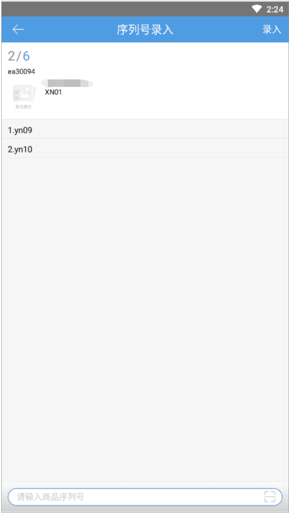
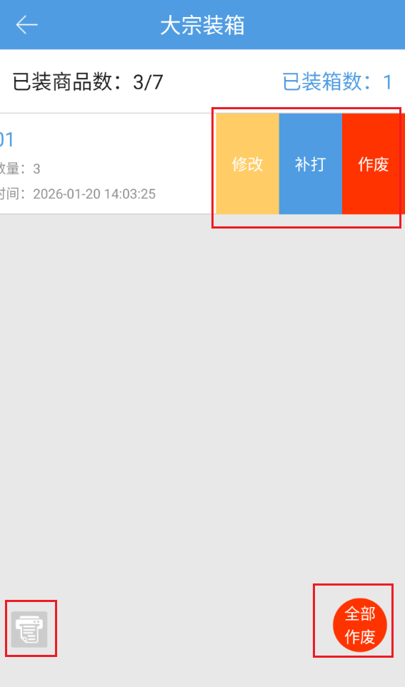
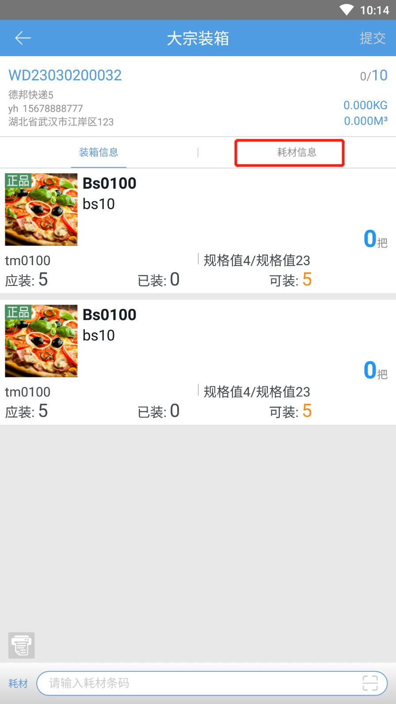
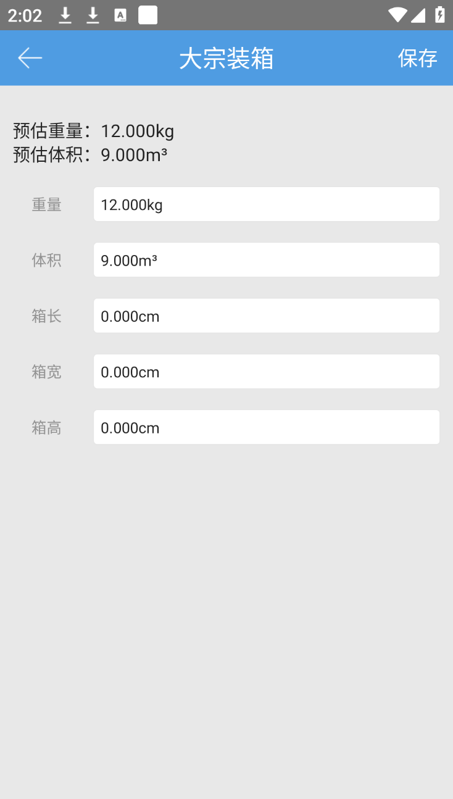

# PDA-大宗装箱

wms安卓端-WMS:PDA-大宗装箱

大宗装箱

业务场景：大宗订单数量比较多，拣货完成后存放的区域比较大，电脑端不方便进行操作。

1.点击大宗装箱菜单，支持扫描系统单号/运单号来匹配订单。（外贸订单、生产批次标准模式下含有生产批次商品的订单、已生成子母件的订单不支持大宗装箱）

2.匹配到订单后，大宗装箱作业页面显示订单信息和商品信息。

3.支持自定义配置蓝牙打印机来打印装箱单和箱唛，保存后设置才有效。装箱单和箱唛打印机和模板全部配置好之后，蓝牙打印机图标亮起。（也支持配装箱单/箱唛中的一个，配置哪个就打印哪个单据）若已经配置过，下次进入大宗装箱作业页面，蓝牙打印自动连接。

4.扫条码匹配商品，显示装箱情况（可装、已装、应装、本次装箱数量）。提交装箱后，已完成装箱的明细不显示。

a.若商品为生产批次商品，且明细锁定>1个生产批次，则扫条码后弹出生产批次列表，支持选择批次

b.若商品为序列号商品，扫条码后跳转至序列号录入页面，扫序列号时校验序列号的有效性。（注：跟仓库开关：序列号管理的标准/简洁模式有关），序列号支持左滑删除。

录入序列号的数量=商品数量时，自动返回到大宗装箱作业页面。（可录入部分，录几个序列号，装箱数量就是几）

c.支持扫描规格箱和唯一箱的箱条码。

d.支持条码截取。

5.提交装箱后页面显示已装按钮，明细清空，配置蓝牙打印的，根据配置打印单据。

6.点击已装按钮，跳转至已装箱页面，显示箱号、装箱数等，点击箱号跳转至箱内明细页。

a.左滑支持补打、作废和修改，已装箱页面支持修改蓝牙打印的配置。

b.箱子排序按照装箱时间从晚到早，可看到所有操作员的箱子

c.全部作废按钮，支持将已装的包裹全部作废，重新去操作装箱。

（ps：若需要将全部装箱完成的订单进行全部作废，需联系客服开启技术开关）

7.订单内全部商品装箱后，仍停留在大宗装箱作业页面，且作业页面、已装箱明细页等显示的数据不清空。

8.PDA大宗装箱后支持统计大宗装箱的绩效。

9.若订单已拦截挂起，扫单号后跳至异常页面；若扫单号后订单拦截挂起，提交装箱时跳至异常页面。

10.若序列号商品锁定规格箱/唯一箱，扫箱条码后跳转至录入序列号页面，未录满不允许返回，录完后自动返回至作业页面。点击图片跳转至货箱明细页面，点击数量跳转至装箱明细页。

例：序列号商品1：4个 锁定规格箱2个（1箱内2个），录完两箱序列号后，点击图片，货箱明细页显示数量为2；点击数量跳转至装箱明细页，显示数量为4

11.为方便拣货，在开启商品多单位管理出库快速换算推荐下大宗装箱库位支持显示推荐单位

12.支持批量装箱，装箱数量计算：当前箱规该明细的数量/当前箱规明细中最小的可装数量，例：43/5，显示最多可装8箱，点击提交时校验可装数量>1弹出。唯一箱或序列号,无可重复装箱的按原弹窗提醒显示。

13.大宗装箱商品排序支持按路径优先级和锁定库位展示，先按路径优先级从小到大展示，路径优先级一致时按锁定库位编码从小到大展示，库位相同按商品编码排序，货箱商品优先于拆零。

14.在开启耗材管理-实际使用的前提下，大宗装箱支持录入耗材，下面可切换商品/耗材录入，支持记忆。若开实际使用-记录一个耗材，录入一个耗材后会自动切换至商品录入或自动提交，批量提交时耗材同步记录至多个箱号上。

15.大宗装箱显示重量、体积，支持编辑，每录入一个商品，体积、重量会随之变化

16.大宗装箱支持扫箱号进行编辑箱内信息，如下图点击确认后可进入编辑状态，包括修改装箱商品、耗材、重量、体积。

17.大宗装箱支持显示已装商品的预估体积和估重

> 更新: 2026-08-17 14:02:16  
> 原文: <https://hupun.yuque.com/unzko7/lsbfg0/uh438065rggd1gnp>