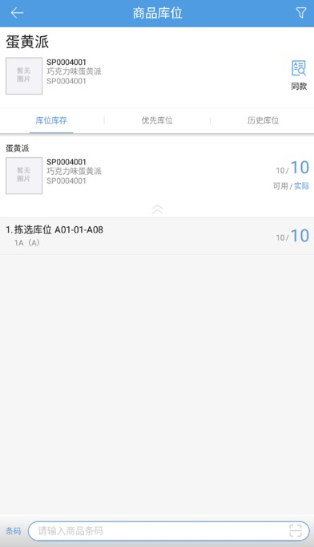
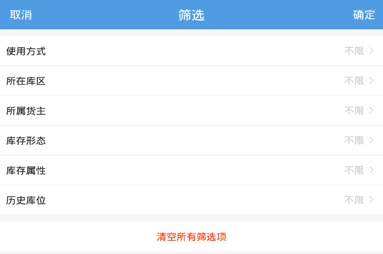
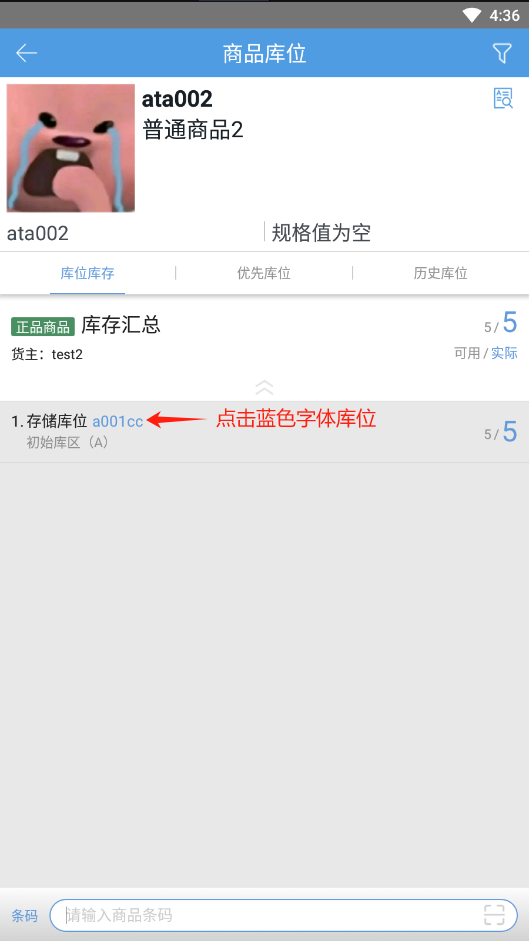

# PDA-商品库位

商品库位，用户可扫描输入商品，查看商品的库位库存情况。

点击商品库位按钮，扫描输入条码，即可显示这个商品的所有库位库存数量，如图所示。

提示：

1.点击底部输入框左边的按钮即可切换条码、编码、名称查询商品。

条码：精确匹配，支持辅助条码(多条码)功能，支持条码截取功能;

编码：精确匹配，先匹配商品编码(匹配到会带出所有规格)，再匹配规格编码

名称：模糊匹配

2.若商品无库存，设置了优先库位，扫描输入条码后展示优先库位tab页；

3.若商品无库存、优先库位，有历史库位，扫描输入条码后展示历史库位tab页；

4.若商品无库存、优先库位、历史库位，扫描输入条码后展示库位库存tab也。

点击同款按钮跳转到查询商品同款页面，展示同SPU下的其他sku商品，如图所示：

5.点击右上角的筛选按钮，即可选择库位使用方式、所在库区、所属货主、库存形态、库存属性、历史库位，如图所示。

6.设置了筛选项并确定后，操作员再次在同一机器上查询商品库位后，会记忆上一次设置的筛选项。

7.可点击库位蓝色字体后，快捷跳转操作仓内业务。支持通过键盘数字快捷键跳转。

 

> 更新: 2024-02-05 16:56:37  
> 原文: <https://hupun.yuque.com/unzko7/lsbfg0/rtk6gsfmuqk9rcaw>