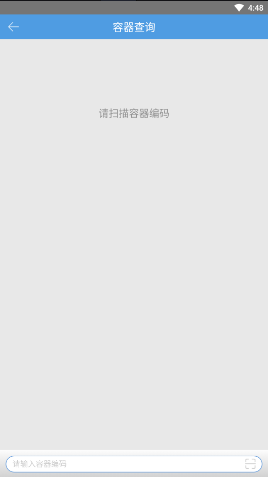

# PDA-容器查询

容器查询：查询容器当前的状态和历史操作记录。

1.打开容器查询页面，扫描容器编码。

2.扫描拣货类型的容器编码后，若容器绑定了领取的波次任务，则容器绑定的波次号、绑定时间、绑定的操作员。订单明细页面显示波次中的订单以及对应订单的状态。点击右边的解锁按钮，将会强制解锁容器绑定的波次。

3.点击操作记录，可以查询容器曾经做过的作业。

4.查询存储类型的容器，查看到该容器中的商品信息、实际数量、所属货主、库存属性。

5.查询未使用的容器，直接显示该容器的作业记录和当前状态。

 

> 更新: 2024-02-02 16:53:41  
> 原文: <https://hupun.yuque.com/unzko7/lsbfg0/ybgq8s8fakmc2gvi>