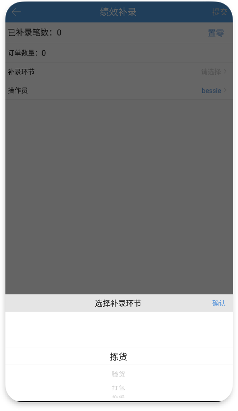

# PDA-绩效补录

绩效补录主要用于补录指定环节、指定操作员的工作绩效，并记录到绩效表中。

具体操作：先选择需要补录的环节，扫需要补录的单号或配货单号，若支持补录，会带出订单信息，否则会报错提示，操作员默认是当前登录账号，可手动切换成其他操作员，录入后点击提交即可，对应订单上会更新操作员信息。在绩效报表中可查看到对应数据。

其中：

1.扫描多个订单号后会累加显示到列表中；扫描多个配货单号会覆盖之前的；

2.若订单指定环节已有操作员，则不允许补录该环节操作员；

3.若订单在验货环节拦截挂起了，可补录之前环节的绩效，不支持补录验货环节的绩效。

4.已补录笔数显示的是当前选中环节已补录的订单数，与操作员无关，可手动置零。

> 更新: 2024-03-19 14:32:28  
> 原文: <https://hupun.yuque.com/unzko7/lsbfg0/iq7t80cicob0h6id>