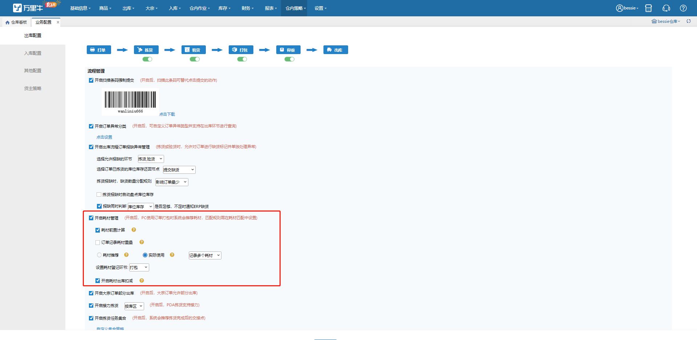
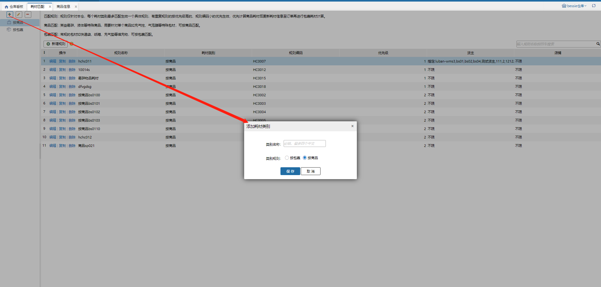
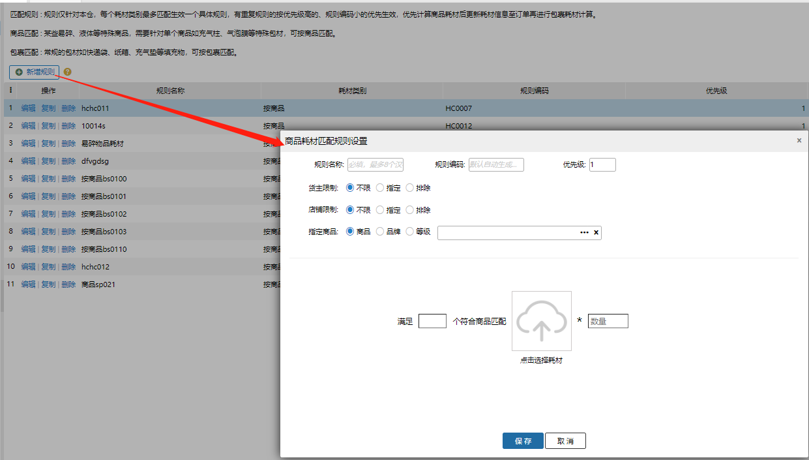
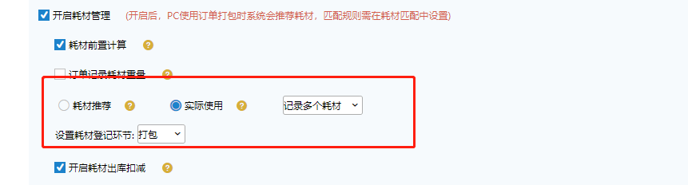
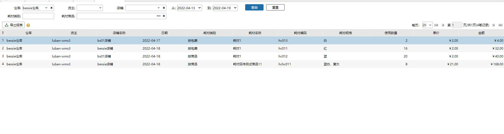
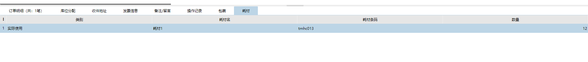
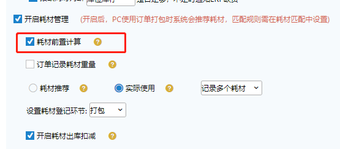
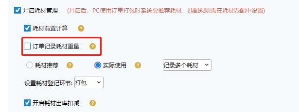

# WMS-耗材管理

行业背景：国家停止进口洋垃圾 以后，纸浆下游链路一路飞涨，导致电商卖家在发货时的包材、纸箱成本大幅上升。耗材的管理成为了仓库中重要的降本管理要素。结合此种背景，我们推出了耗材管理模块，旨在帮助商家进行有效的耗材库存管理和使用管理，避免浪费。

    耗材管理达成的效果：

    1.通过商品和包裹特性，系统推荐应该使用的耗材，避免员工乱用

    2.通过登记的耗材，记录耗材使用量。便于财务核算成本

    3.管理耗材库存用量并回传ERP系统

    耗材管理的功能清单

    1.耗材推荐策略

    2.耗材使用报表

    3.耗材使用登记

    4.耗材预设

    一、耗材策略的配置

 1.启用耗材策略

打开耗材使用开关即可

位置：业务配置--出库策略

2.策略的配置

位置：仓内策略--耗材匹配

①主页面

    ②设置类型

     按商品设定

    耗材匹配规则中，商品匹配多用于易碎品、贵重品等商品的包装，也就是说是属于保护商品完整性的一类耗材，例如气泡柱、充气膜、瓦楞纸、泡沫块等

     按包裹设定

    在规则中，按包裹匹配多用于针对订单的体积、重量、目的地等特性的匹配，相当于是打包的外箱、快递袋等

    ③商品类型

     使用耗材推荐势必会有特定的耗材，严格意义上，耗材也是商品的一种，那么我们需要将耗材商品做类型设定

     位置 基础信息-商品信息

     ④商品匹配策略

点击添加选择按商品指定策略，填写自定的策略名称

新增一个规则

规则中可选择对应的货主、店铺

选择指定的商品或者等级分类通过设定每X个商品使用某个耗材的方式进行配置

包裹匹配策略

新增按包裹的分类后，新增一个规则

包裹规则中可设定包裹的物流属性、地区特性（冷链行业尤为重要）同时还可搭配商品特性进行设定

匹配规则：当符合规则存在多条时，系统取优先级最高的规则进行匹配并产出结果

二、耗材推荐结果的展示

①配置

在耗材配置中选择对应的录入、展示环节

同时耗材功能提供了耗材推荐（推荐查看） 和实际使用（使用登记）两种

耗材推荐即系统将计算好的耗材展示出来，操作员只需查看

实际使用则需要操作员在看到推荐结果后再进行扫码录入的操作

②录入耗材

当配置了称重时录入耗材，页面增加耗材录入展示

③查看耗材记录

已经录入的会在耗材统计报表中展示

同时也可以在对应订单上显示

三、其他设定

①前置计算

有些商家并无繁琐冗长的流程，希望能把耗材打印到面单上在打包贴单的时候看一下做个引导

则在配置项中开启前置计算即可，同时快递单模板、发货单模板均可以选择耗材信息打印

②记录耗材重量

系统在接收到订单的时候会通过维护的商品重量来计算整个订单的重量，但是当包装过程中商品增加了一些包装耗材时，此时订单重量会相应增加

为保证称重时估重的参考值正确，可选择订单记录耗材重量选项

③记录耗材数量

部分商家仅用耗材记录最外箱的耗材，每个包裹通常只有一个，若开启了记录单个耗材时，操作页面（如订单打包）则会在录入完一个耗材后自动提交订单提升作业效率

④库存扣减

由于ERP需要对耗材的使用进行成本计算，故可开启耗材出库扣减功能。目前已知除万里牛ERP外还无其他ERP支持扣减

功能效果：开启之后，订单正常出库，在ERP订单中会增加耗材记录

> 更新: 2023-12-21 10:47:51  
> 原文: <https://hupun.yuque.com/unzko7/lsbfg0/kamrg6goukkgg372>