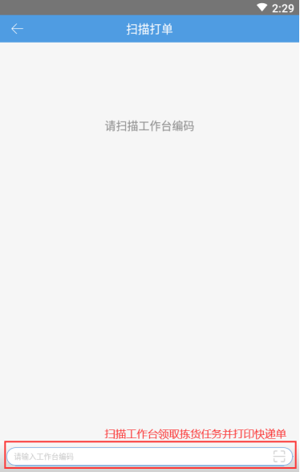
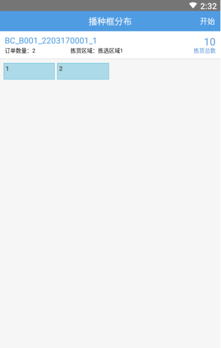
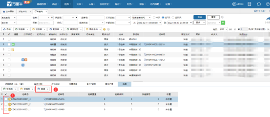
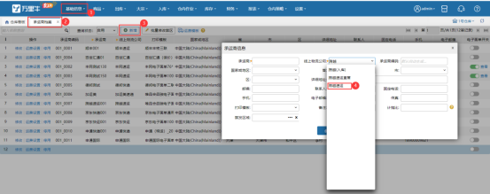
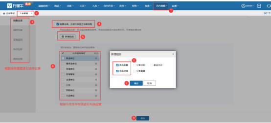
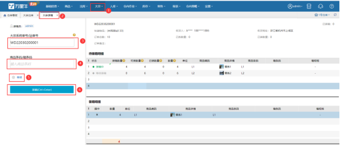
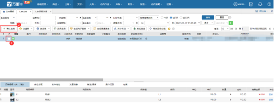
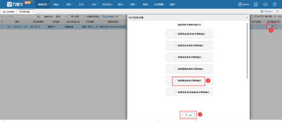
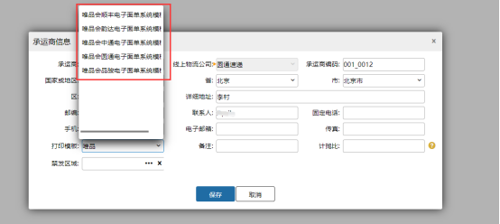

# WMS-唯品会JIT与JITX专题

# 一、JIT业务
## 1.1业务简介
JIT业务为唯品会为解决纯入仓给商家带来库存压力的一种业务模式,即买家下单后商家在一定时间内需将档期内的销售商品发货至唯品会仓,由唯品会仓将货品打包给买家.

针对WMS来说,唯品会JIT订单也仅是多样化订单中的一种,并未过于特别的地方,只要上游ERP可正常推送创建订单即可

## 1.2发货方式介绍
唯品会JIT单据由于发货时效较高,且箱体上需粘贴指定格式的箱唛,故可根据当日单量大小选择不同功能进行操作

1.2.1小单量拣货

此种订单多发于档期运营后期,此时单量较小,可以走组波次--批量拣货--播种验货,或者组波次--边拣边播的的操作方式

波次生成技巧:波次策略选择指定店铺,可把不同唯品仓的JIT订单一并拣货然后做分拣

策略设置如下:

 

生成后PDA操作功能示意

1扫描工作台领取任务并打印快递单

 

2.选择边拣边播模式

 

3.根据播种框分布设置播种车

 

 

 

 

4. 扫描库位进行拣货

 

5.拣货完成后进行播种

 

1.2.2小单量订单装箱打箱唛

可在拆包补打页面切换子母件装箱页面进行装箱,设置后置打印箱唛

 

装箱过程补打箱唛

 

订单查询补打箱唛

 

 

1.2.3快递单号获取

系统支持直接在波次打单页面获取跨越电子面单/顺丰电子面单

跨越电子面单开通方式

 

 

 

 

也可在手动填写单号

唯品专配特别提醒:使用唯品专配入仓的,需ERP推送唯品专配承运商,唯品专配的无需生成快递单号,单号由ERP从平台获取提供

1.2.4打包称重出库

同普通订单一样装箱后称重出库即可

 

## 1.3大单量出库
1.3.1订单策略

由于大单量业务的特点,我们建议使用大宗订单作业链路,通过设定指定店铺及商品数量属性设定策略

 

1.3.2拆分作业

订单商品数量较多时我们推荐使用拆分拣货的的方式作业

 

1.3.3装箱

拣货完成后可通过大宗装箱页面进行装箱,后置打印箱唛

 

1.3.4

确认出库较普通订单会跟便捷,直接点击出库即可

 

 

# 二、JITX业务
## 2.1业务简介
在JIT模式下通常买家收到货会比平时长约24H,为了提高买家的收货时效，减少供应商的重复操作、降低供应商的发货成本，现唯品会JIT发货模式新增JITX发货模式，JITX发货模式主要是针对买家收货地址属于供应商仓库覆盖范围之内，故唯品会将此类订单筛选出来，就近在供应商的仓库给唯品会员（买家）发货，从而提高会员的满意度，同时我们为方便商家操作，提高商家的发货效率故我们系统对该业务做了相应对接，方便供应商在系统中完成操作，无需切换VC后台，减少工作量。

 

 

## 2.2订单特性
①JITX订单为全脱敏订单,商家无法解密

②JITX订单需要通过唯品会平台获取单号,且承运商不可改

③打印模板只能使用唯品会JITX专用模板

## 2.3出库作业
JITX订单同其他平台正常销售订单一样,生成波次后批量操作出库

## 2.4获取电子面单
2.4.1店铺授权

点击店铺授权，填写供应商ID（JITX&JIT模式下，商家的店铺ID在唯品会中称之为供应商ID）

2.4.2开通电子面单

选择对应的线上快递后,在开启电子面单入口选择唯品会电子面单,点击开启即可

 

 

 

 

2.4.3配置模板

开通电子面单后,承运商模板需选择唯品会JITX模板

 

> 更新: 2026-02-28 13:56:53  
> 原文: <https://hupun.yuque.com/unzko7/lsbfg0/thkcasp1g601mkww>