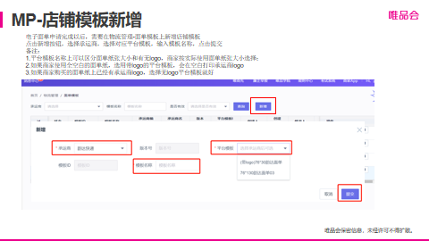
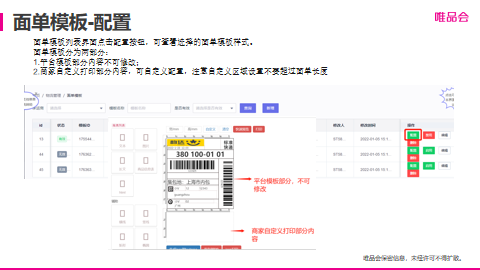
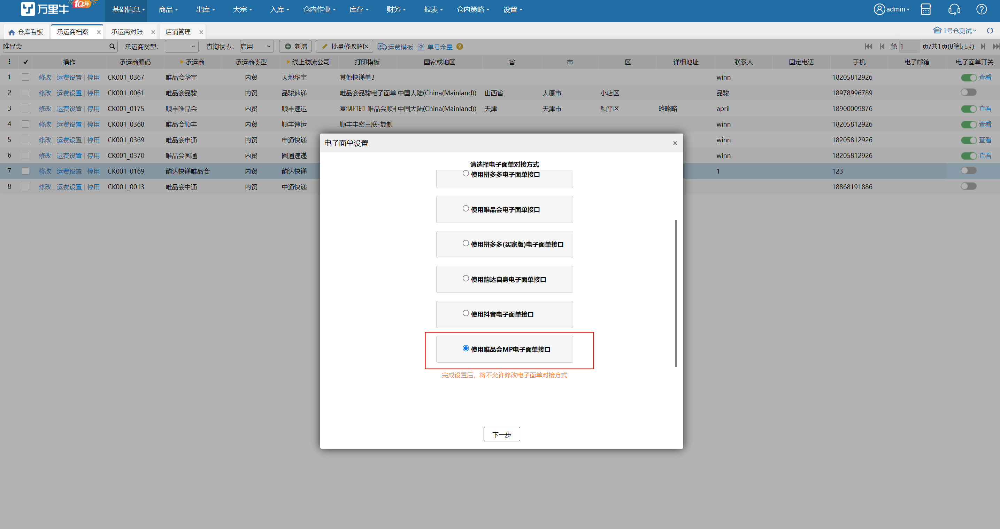

# WMS-唯品会MP专题

近日唯品会MP启动了收件人信息脱敏，并禁止解密。必须使用唯品会MP电子面单才可以打单发货。以下将讲述具体操作步骤

# 一、商家准备
1.根据平台要求，使用第三方系统的商家需要签署相关协议

平台指导公告链接如下：

[https://edu.vip.com/?p=12529&_ppp=634dd2472c](https://edu.vip.com/?p=12529&_ppp=634dd2472c)

2.开通电子面单

请商家根据自身发货需要在店铺后台订购相关快递服务

2.1商家后台开通电子面单

①登录 唯品会MP商家后台->物流管理->电子面单服务->选择对应快递服务商申请合作

②输入必填内容（直营型物流公司电子面单需填写客户月结编号；加盟型物流公司需根据发货地区选择对应的物流网点），点击【保存】即可，需要通知合作的快递网点进行审核操作

③加盟型快递需要充值单量

注意：每个店铺只能用自己的快递，唯品会目前不支持跨店铺使用

3.店铺后台配置快递单模板

根据唯品会提供的方案，商家需要在店铺后台配置快递单的打印模板，建议使用较为稳定的一联单 尺寸为 76*130

官方操作指南如下

4.店铺模板中扩展信息与系统模板的字段对应

扩展信息1：打印批次号

扩展信息2：波次打印序号

其余陆续增加中……

# 二、店铺授权准备
1.新增店铺授权

2.已有店铺授权

特别说明

2.1前期由于标准接口无法区分MP店铺类型，故使用万里牛ERP的商家自近日起看到的将是一个无店铺标记的店铺，可在修改中授权

点击修改

选择MP店铺授权

2.2使用其他ERP的需要让友商ERP按照标准接口的定义推送MP店铺，附图如下：

正常推送后可进行店铺授权，方式同2.1

请注意，店铺信息中【网店昵称】必须填写正确，否则申请电子面单就会出错!

样例：

# 三、系统电子面单开通
1.承运商新增唯品会电子面单

新增承运商并开启电子面单

2.开启电子面单

配置店铺、网点以及相应的快递服务

3.打印模板选择

请选择唯品会MP一联单

此处特殊说明

由于面单模板在唯品会店铺后台配置，WMS暂不支持自定义模板设定

# 四、唯品会MP打印组件下载
建议打单电脑设置为开机启动

[https://pan.corp.vipshop.com/os/share.html?pc=cwdxvk](https://pan.corp.vipshop.com/os/share.html?pc=cwdxvk)

下载密码：BP98xn

打印组件设置打印机

特别说明唯品会MP支持同其他平台面单混合打印！！！！

人肉实操店铺授权和模板编辑步骤：[https://hupun.kf5.com/hc/kb/article/1588586/](https://hupun.kf5.com/hc/kb/article/1562040/)

# 商家常见问题一览

| 序号 | 操作节点 | 商家常见问题Q | 解答A |
| --- | --- | --- | --- |
| 1 | 添加仓库 | 新增仓库出现报错“新增仓库失败，需要输入store ID”，怎么办？ | 请先清除电脑缓存（ctrl+H）,重新登陆操作尝试。 |
| 2 | 添加仓库 | 系统只能添加5个仓库，如果有超过5个仓库地址要添加，怎么办？ | 目前系统仅支持添加5个仓库，如果仓库超过5个，需要联系商务增加仓库。 |
| 3 | 添加仓库 | 同一个店铺， 同一个网点，可以用不同的地址申请两次面单吗？ | 支持。 |
| 4 | 添加仓库 | 仓库管理的地址必须跟电子面单的发货地址一样嘛？ | 是的 |
| 5 | 面单申请 | 同一个店铺， 同一个网点，可以用不同的仓库地址申请两次面单吗？ | 支持的。 |
| 6 | 面单申请 | 承运商列表中，没有“德邦”选项，要如何申请？ | 德邦快递之前还有问题待处理，平台暂时把申请入口关闭了。等后续调试好后会重新开放，请你耐心等待即可，相关部门已经在尽快完成；同时也建议您选择多个承运商合作。 |
| 7 | 面单申请 | "承运商列表"中没有商家的合作网点怎么办？是否可以新增？比如丰网快递。 | 不支持新增，只能从列表选择；建议商家可以与多个快递合作。 |
| 8 | 面单申请 | 商家是ERP将数据传输给WMS，再由仓库发货，这种场景下：面单申请，是需要填写仓库对接账号吗？ | 是的。 |
| 9 | 面单申请 | 申请承运商面单时，出现报错： request detail.linkman Tel不能为空，要怎么处理？ | 报错提示说明仓库联系人没有填写，需要补全。 |
| 10 | 面单申请 | 填写面单申请时候，在后台找不到对应的网点怎么办？ | 后台填写的网点名称可能跟商家输入的名称有偏差，请直接输入网点代码查询即可 |
| 11 | 面单申请 | 面单申请填写账号、网点错误，并且显示“审核中”，要如何驳回？ | 面单有承运商审核，请直接联系网点驳回申请，之后重新提交。 |
| 12 | 面单申请 | 面单申请一直显示“审核中”，但是网点又无法完成审核，怎么办？ | 面单由承运商审核。若网点无法审核，告知网点联系快递商总部客服协助处理；若需要驳回也请直接联系承运商处理。若承运商总部还是无法处理，可以提供与承运商的沟通记录截图、网点编码发送至唯商先；唯商先会反馈至承运商处理。 |
| 13 | 面单申请 | 面单申请一直显示“审核中”，但是网点又无法完成审核，怎么办？ | 面单由承运商审核。若网点无法审核，告知网点联系快递商总部客服协助处理；若需要驳回也请直接联系承运商处理。若承运商总部还是无法处理，可以提供与承运商的沟通记录截图、网点编码发送至唯商先；唯商先会反馈至承运商处理。 |
| 14 | 面单申请 | 申请通过的面单是否可以作废？如何修改面单中月结账号、面单网点信息、联系人信息？ | 面单上的信息不支持修改；但是支持商家在页面操作“取消订购”之后重新提交申请即可。如右图 |
| 15 | 物流服务 | 添加物流服务时，为什么圆通承运商显示无数据？ | “物流服务”是用来填写增值服务的信息；若无数据则表明不用填写；同时顺丰、京东物流必须填写增值服务。 |
| 16 | 店铺面单模版设置 | 店铺面单模版如何设置？ | 到商学院[https://edu.vip.com/?p=12529&_ppp=2cd5b5eb50](https://edu.vip.com/?p=12529&_ppp=2cd5b5eb50) 下载《商家后台操作20220311》观看,第3个视频 |
| 17 | 店铺面单模版设置 | 打印的面单只显示商家后台的商品名称、数量；没有显示对应的商家SKU编码，要如何设置？ | 设置店铺面单模版。如右图 |
| 18 | 店铺面单模版设置 | 面单要如何设置显示“打印批次”等信息？ | “打印批次”等信息在商家后台没有对应的字段，若ERP有设置，可以通过面单模版的“扩展信息”添加。 |
| 19 | 店铺面单模版设置 | 不同仓库，不同网点，同一个承运商，是支持启用一个面单吗？ | 是的，同一个承运商仅支持启用一个面单模版。 |
| 20 | 充值面单 | 如何充值面单？是不是每个承运商都需要提前充值面单？ | 1）联系承运商充值唯品会MP电子面单； 2）顺丰、邮政月结账号无需要提前充值面单。 |
| 21 | 充值面单 | 充值面单后，面单余额在哪里查看？使用明细在哪里查看？ | 1）剩余单号在【我的承运商】菜单页面查看，目前不支持同步到ERP后台； 2) 使用明细在承运商系统查看。若是申通快递，需要先添加申通的客户编码、密码信息才能看到。 申通的客户编码有申通管理，需要联系申通客服获取。 |
| 22 | 获取面单 | ERP发货系统MP电子面单报错提示面单库存不足，出现如下报错提示，怎么办？ | 报错提问说明商家的唯品会MP电子面单不足，需要联系承运商充值面单。 |
| 23 | 获取面单 | 获取顺丰单号的时候，出现报错提示“有错误Other-承运商返回失败 当carrierCode = shunfeng时, 增值服务值不能为空”怎么办？ | 报错提示说明物流服务没有填写，顺丰快递需要填写至少一个增值服务，如右图。  若是通过ERP打印，也需要在ERP的设置；ERP的设置，需要联系ERP客服咨询 |
| 24 | 获取面单 | 申通快递获取面单时，ERP报错“other-承运商返回失败，当carrierCode=shentong时，客户编码不能为空”，怎么办？ | 报错提示说明申通面单申请中，客户编码信息没有填写，需要联系申通客服查询编码并补充。如右图 |
| 25 | 获取面单 | 设置完电子面单后，ERP系统无法获取面单，怎么办？ | 需要商家先检查下面设置是否完成：1、面单是否申请；2、店铺面单模版是否设置并启用；3、是否充值面单 如果还有问题，需要提供ERP报错截图反馈至唯商先核实。 |
| 26 | 获取面单 | 获取中通面单时提示参数异常，出现如下报错，怎么办？ | 发货地址维护不够详细，需要维护到四级地址（XX街；XX号）。 |
| 27 | 获取面单 | 旺店通ERP对接唯品会店铺中通电子面单报错需要在店铺后台配置密钥，密钥如何获取呢？ 是直接联系旺店通吧？ | 报错说明店铺没有店铺配置面单模板并启用面单。请检查设置。 |
| 28 | 获取面单 | 获取京东运单号出现报错提示：推送接单管道异常，原因：SOP商家销售平台必须为京东。如下截图，要如何处理？ | 请检查京东月结账号是否正确，若有误，请直接更换了月结账号。 |
|  | 获取面单 | ERP捉取不到订单号，报错提示：decryption is forbidden cause the store use electronic waybill | 报错说明唯品会已禁止解密；需要商家按照加密流程发货（获取唯品会MP电子面单发货）。ERP具体发货操作步骤，请联系ERP客户经理协助。 |
| 29 | 打印面单 | 打印的面单显示【object object】如下图，是什么原因？ | 面单模版设置错误，如果左边用的是文本，就会显示object；正确设置如右图。 |
| 30 | 打印面单 | 打印快递单总是出两张纸，一张是正常的，一张是空白，是什么原因？ | 面单模版设置纸质尺寸不对，需要调整。请调整对应的宽（按照实际情况设置），高（20），点击自定义，点击蓝色的生成JSON按钮，最后点红色的保存按钮。参考右图。 |
| 31 | 打印面单 | 打印出的面单上面的寄件地址怎么修改？ | 这是模板预览的内容,不是实际打印的。寄件方取的是商家申请电子面单时候的地址和联系人。 |
| 32 | 打印面单 | 面单打压出现偏移，要如果调整？ | 使用打印组件调整偏移量，如果向左偏移右侧出现大量，可先尝试组件偏移量调整为40,0,0,0；看打印效果后再做微调。参考右图 |
| 33 | 发货操作-ERP | 商家直接在ERP系统修改会员收件地址，为什么无法重新获取运单号？ | 1、因为第三方修改的地址没有同步到唯品会系统里，唯品系统存的也是老地址，所以即使重新获取运单，运单上的收货地址也是有问题的。 2、需引导会员在唯品会APP/PC端操作修改地址；无需联系唯品客服下发工单至商家修改。修改完成后，商家取消取消之前的原单号；重新获取运单号发货。 3、所以一定要求会员在唯品会上修改地址。直接点击修改地址的选项完成输入提交即可。如右图所示。 |
| 34 | 发货操作-ERP | 老接口支持拆单发货，新接口拆单发货如何传参呢？比如一个订单需要回传多个物流单号怎么传，新的发货接口支持多次回调吗？ | package_type=2。新旧发货接口都支持多次回传发货 |
| 35 | 发货操作-ERP | 如何操作部分？（商家在ERP创建了补寄单为什么无法回传？） | 新的发货流程不支持直接在ERP创建补寄单；ERP创建的补寄单在唯品平台无数据，无法获取运单号，物流轨迹无法同步至唯品会系统。需要在store.vip.com 创建。 |
| 36 | 发货操作-ERP | 不管顾客买多少件商品，面单打印出来数量都是1，这要怎么解决？ | 请联系ERP客户经理处理，让客户经理获取运单号时传入正确数量就可以了；参考文档[https://vop.vip.com/doccenter/viewdoc/128](https://vop.vip.com/doccenter/viewdoc/128)  第3点说明：新增接口说明。 |
| 37 | 发货操作-ERP | 如何修改成订单的快递单号？ | 需要取消之前的运单号，之后重新获取运单号发货即可。 |
| 38 | 包裹揽收 | 使用唯品会MP电子面单，邮政快递员无法缆车揽收？ | 我们核实到是快递操有误（快递员选择的订单渠道有误，别指定菜鸟电子面单或者其他渠道进行收寄），让快递员拨打邮政的24H运维电话-010-63010086协助处理。 |
| 39 | 商家后台-物流轨迹同步 | 按照按流程发货后，订单物流轨迹（顺丰）没有同步；还提示超时未发货？ | 1、物流轨迹无法同步的很可能的原因是：商家实际发货的电话号码与会员下单收件人手机号不一致，将无法获取物流轨迹。 2、使用顺丰发货的运单为子母运单形式，如果商家在系统操作发货的运单号为子单号，唯品系统将无法获取到物流轨迹。 3、处理方案：  登录商家平台—物流管理—物流综合管理—专线物流轨迹，选择承运商为顺丰（shunfeng）并自行更新物流轨迹进系统（需要确保轨迹准确）（如下图所示） 望知悉！ |
| 40 | 包裹配送 | 按照新流程发货，面单上无法显示会员详细信息，快递员如何配送？ | 面单虽然不显示，但是快递员还是可以登陆快递商后台查看（扫描枪），不影响配送。 |

> 更新: 2026-02-28 13:59:30  
> 原文: <https://hupun.yuque.com/unzko7/lsbfg0/qck08uzw5szo34rv>