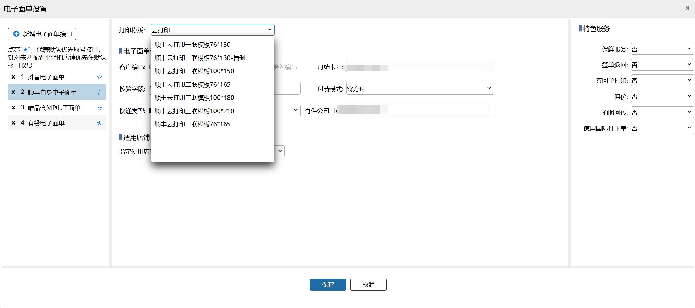
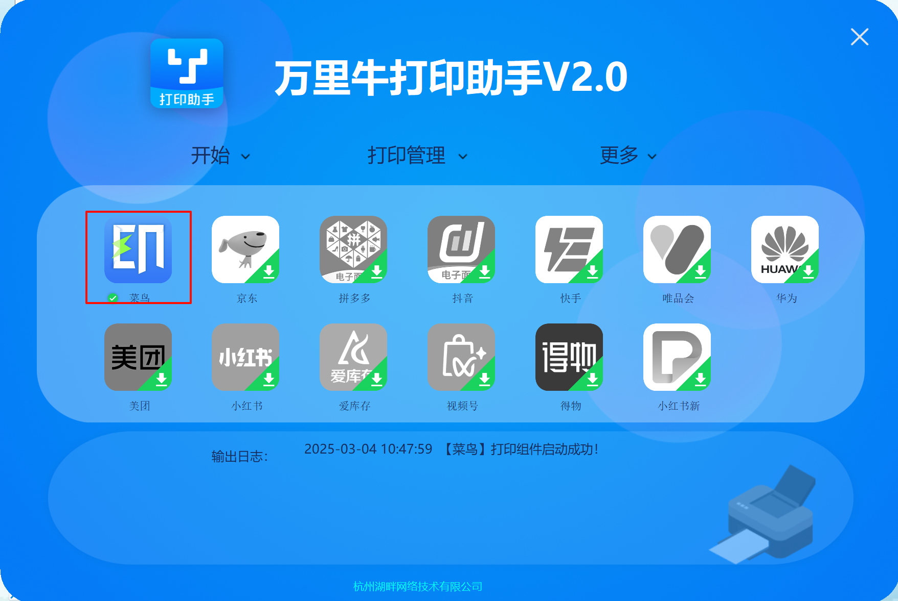

# WMS-顺丰云打印升级

### 背景
应顺丰集团直联顺丰下单的所有商家须尽快完成切换云打印，万里牛已完成云打印接入。使用顺丰直连电子面单的用户需要尽快切到此方式来打印面单。【特别提醒】新签约顺丰的商家，必须使用新的云打印方式打印面单，否则可能造成顺丰不揽收。

### 使用方式
本次增加了一些不同尺寸的顺丰云打印模板，尺寸如下

在配置承运商时搜索云打印选择对应的模板即可

云打印使用菜鸟打印组件

请提前在万里牛打印助手中安装菜鸟打印组件

> 更新: 2025-03-05 11:17:22  
> 原文: <https://hupun.yuque.com/unzko7/lsbfg0/qtsqatu6l2es01t2>