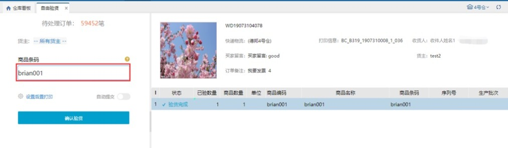

# WMS-单品订单自由出库

场景：日常业务中，针对一种一件的商品，特别是某些行业类目（订单比例可大于60-70%），希望有比目前系统更加相对便捷简单的拣货、验货方式，抛开波次的束缚可以在验货的时候直接扫描商品条码，系统自由匹配订单后置打印出快递单。

作业环节介绍：

这种类型的订单如何设定波次？

新增【[自由波次策略](https://hupun.yuque.com/unzko7/plvu1m/vmipnr)】。波次策略默认是混品和默认都是一种一件。

生成了自由波次的订单如何进行拣货？

自由波次生成后，操作员可以通过PDA上【[自由领单](https://hupun.yuque.com/unzko7/plvu1m/xxlkh3)】领取任务进行拣货。

通过PDA自由领单完成拣货任务，这样状态的订单就可以进入验货后置打单的环节了

如何对这些订单验货？

通过PC上【[自由验货](https://hupun.yuque.com/unzko7/plvu1m/pdrg0n)】，直接扫描商品匹配订单进行快速验货。

我们推荐在自由验货中配置后置打印，这样就可以扫一个商品打一张面单。

> 更新: 2023-12-21 10:47:43  
> 原文: <https://hupun.yuque.com/unzko7/lsbfg0/bc2f0bpfyr6fv1kf>