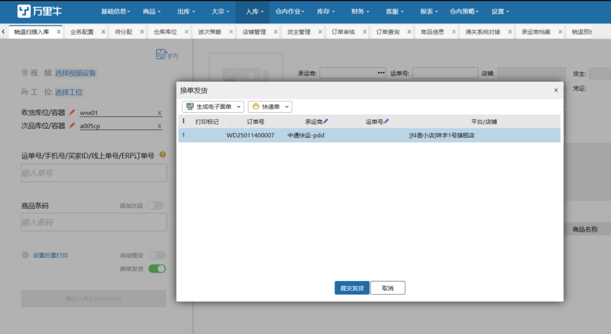

# WMS-售后入库快速发货

#### 背景
系统已发货实际快递还未取走的退款关闭订单/快递拦截回来的订单/原单退回的订单，或是售后回来无需做二次包装维护的货品，入库后，目前需要拆包上架。每笔订单都需要拆包上架并浪费包材，流程重复，浪费仓库人力。

#### 功能效果
通过识别入库的商品，自动搜集系统中代发订单，将其快速提取打印，进行发货。从而省去了在仓库周转的过程

#### 操作方式
开启换单发货配置

可根据实际业务情况选择可换出发货的订单条件

在相应的页面进行入库后如果待分配及前置环节有未发货的订单则会自动触发换单

1.提交入库成功后，页面会根据存量订单自行匹配，匹配到后则会立即弹出换单弹窗，

2.操作员可在此出进行申请运单号，打印面单等操作，

3.操作完成后提交发货，发货成功意味着换单完成。

> 更新: 2025-02-14 09:21:11  
> 原文: <https://hupun.yuque.com/unzko7/lsbfg0/gege07h6tgmzbrms>