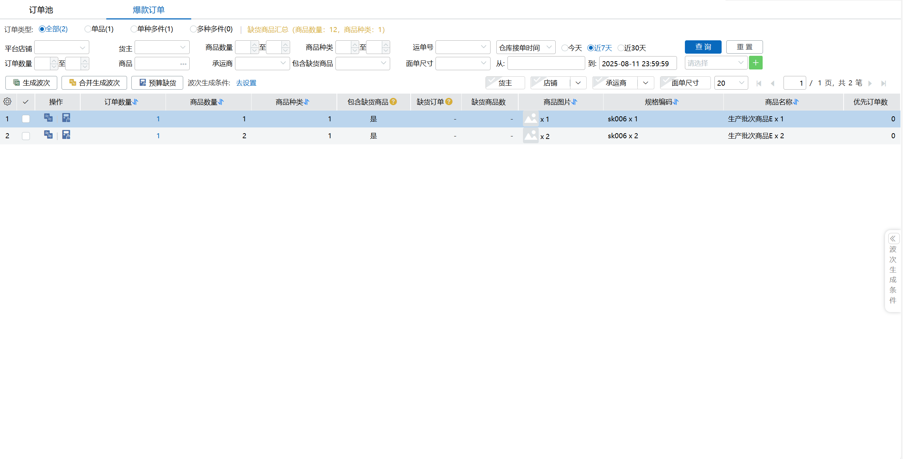
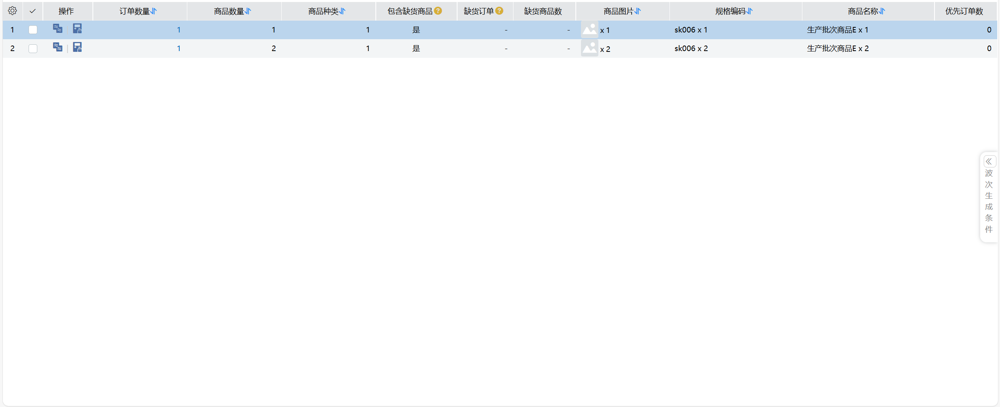
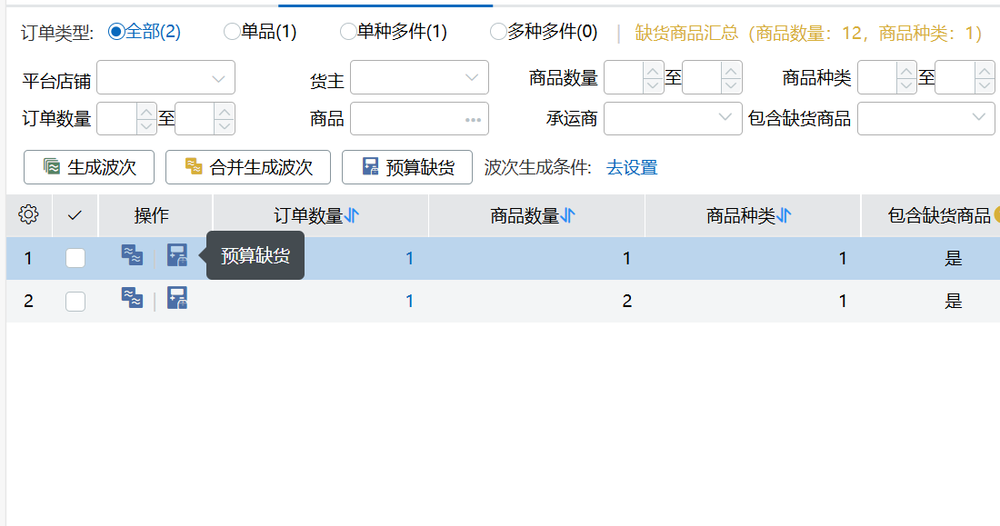
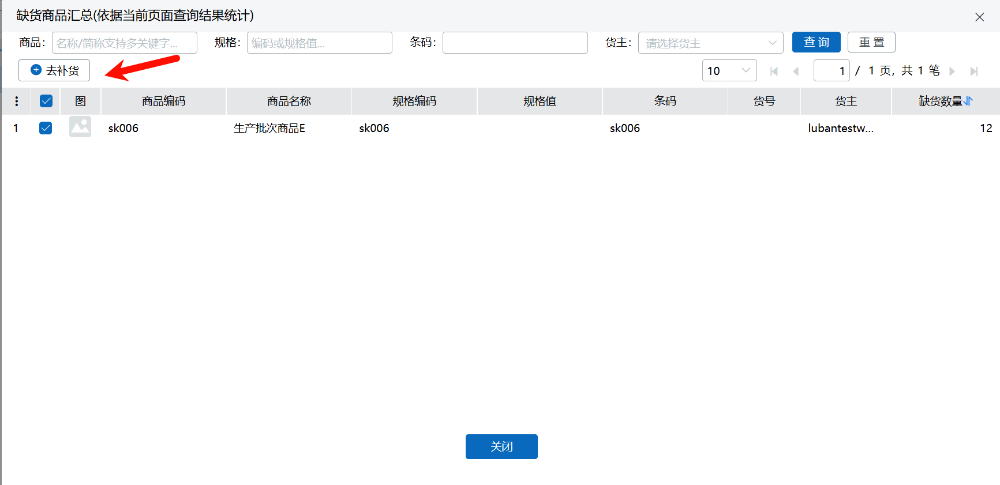

# WMS-待分配-爆款订单

### 背景
直播、爆款等业务叠加快递价格及重量区间不断压缩，越来越多的商家在走爆款模式。同样也有越来越多的小商家委托三方云仓进行发货。致使云仓订单结构更多的侧重于爆品、单品结构。复杂订单出现的占比持续降低 

### 释义
爆款订单：若干订单中单品或商品组合数量均完全一致

### 功能简介
通过对订单池的分析，将相同结构的订单按用户需要的维度进行组合展示，做到选择即生成，所见即所得的效果。

### 操作介绍
#### 页面

#### 页面元素
订单类型：针对当前查询结果中，按结构展示相应的订单数

缺货汇总：针对当前订单所需分配商品计算出的总缺货情况

点击可见缺货列表

条件查询：订单池的查询条件

操作栏：操作栏

分组设置：针对相同的订单按什么样的粒度去分组，可以多选

分组列表：根据分组设置计算出的列表

生成条件：波次生成条件设置，可以预设一些方案

#### 生成波次方式
目前生成波次的方式有两种

1.针对单个分组去生成，即生成出的都是同品波次

操作上可在单个分组详情上点击生成，也可以选择多个分组点击操作栏生成波次按钮

2.选择多个分组合并生成，即类似一筐同品波次

勾选多个分组后点击操作栏的合并生成按钮

#### 预算缺货
生成波次时常会出现订单缺货从而影响波次生成质量，导致部分订单不能跟随同品波次一起生成。

缺货预算即解决这个问题

可以指定你即将要生成的分组来预计算是否缺货

也可以勾选多个分组来计算

计算时是取当前可用库存逐一计算订单，得出不足数量的订单和缺货的商品

#### 跳转补货
当我们获知缺货商品时我们可以通过点击来快速的进行补货点击

点击预算缺货后的缺货商品数

或者勾选缺货汇总中的商品点击去补货

都会把当前涉及的商品带出并弹出补货窗口。直接点击确认即可

未尽事宜也可以参看页面介绍 -[爆款订单](https://hupun.yuque.com/unzko7/lsbfg0/ow8unkls4z7dpqys#ksHxC)

> 更新: 2025-08-12 11:44:44  
> 原文: <https://hupun.yuque.com/unzko7/lsbfg0/dno1hyoncvzf7uvh>