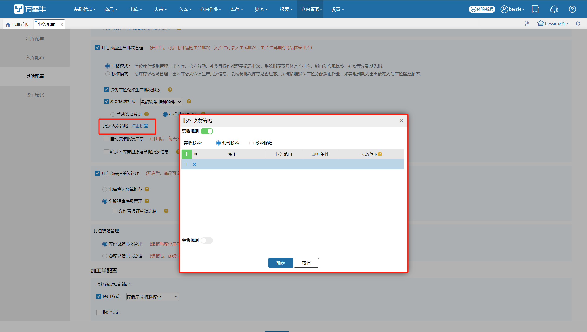
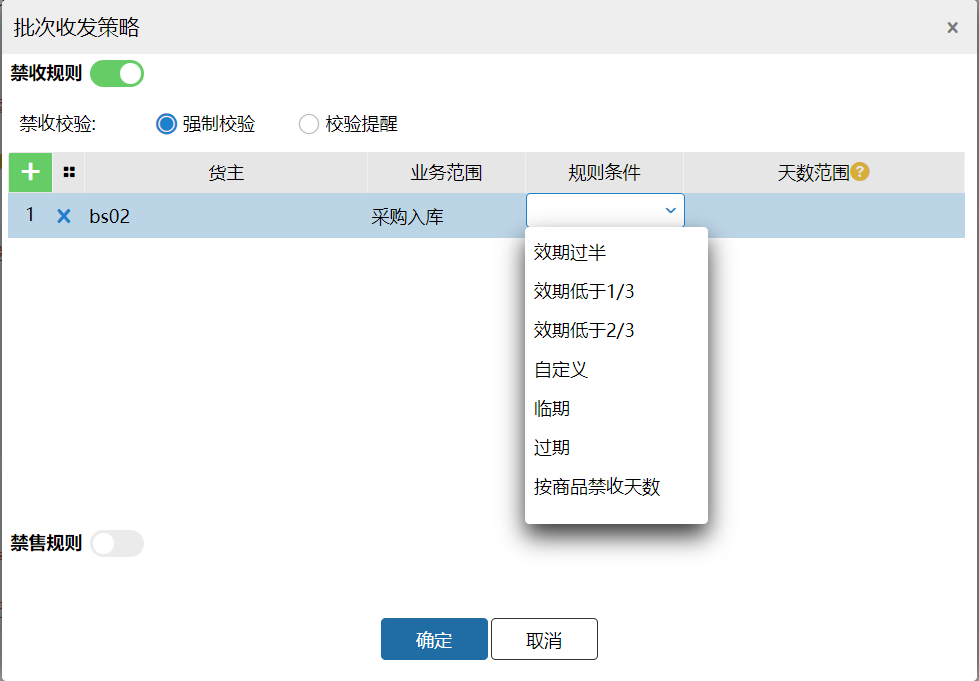
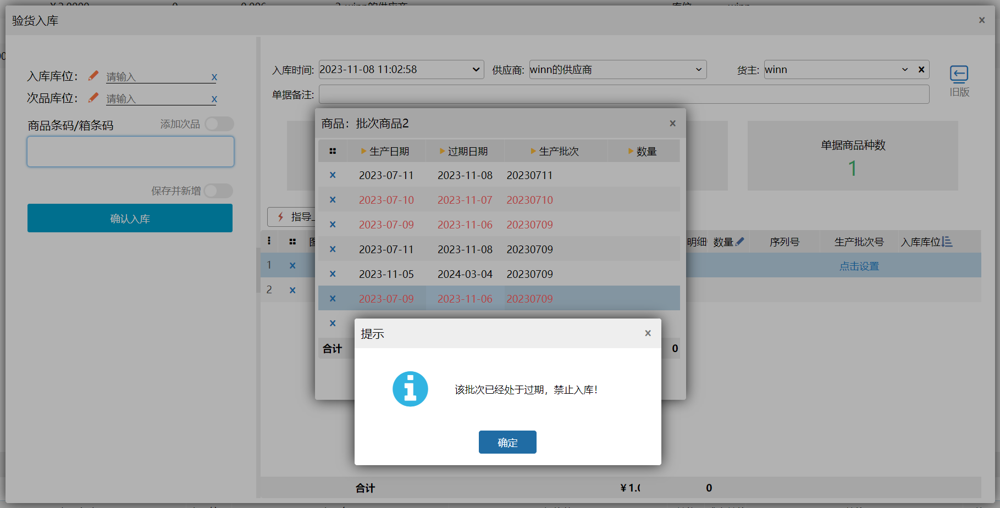
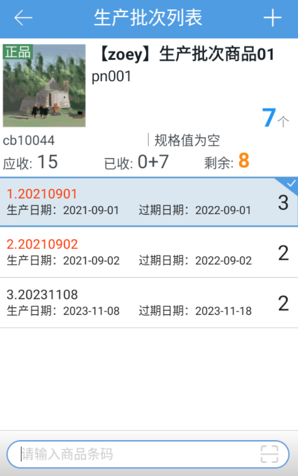
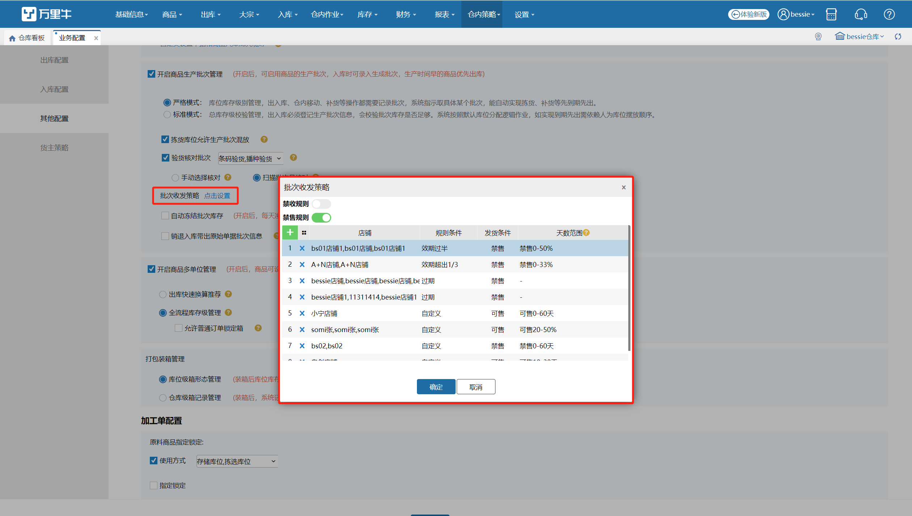
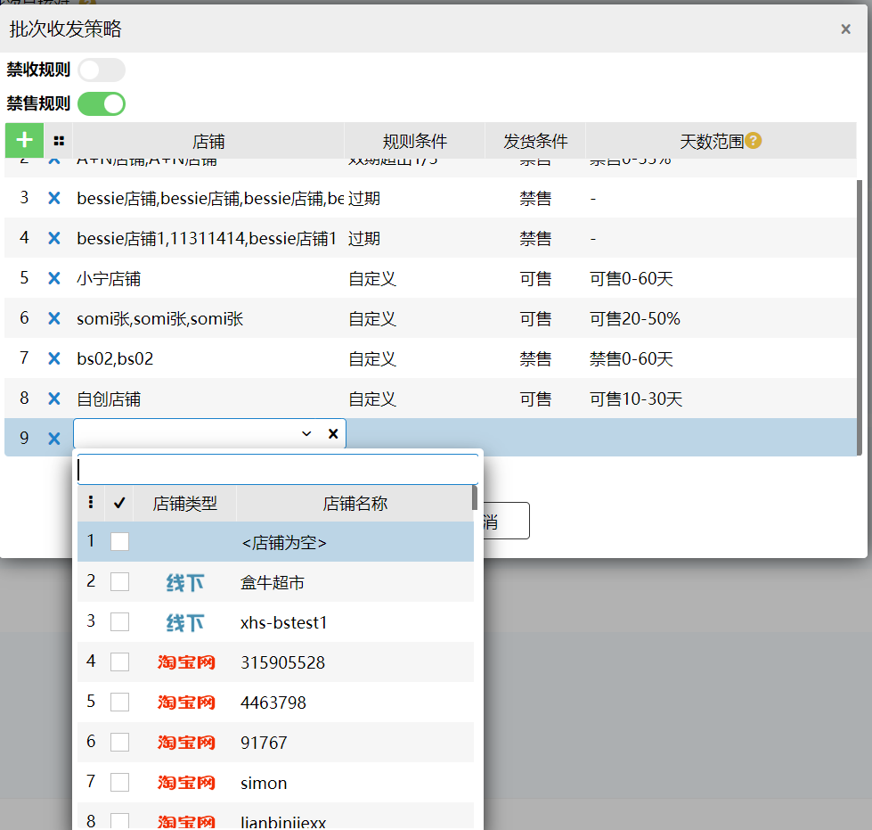
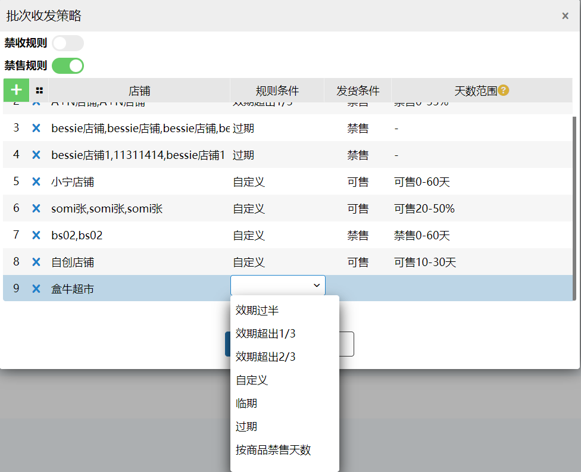
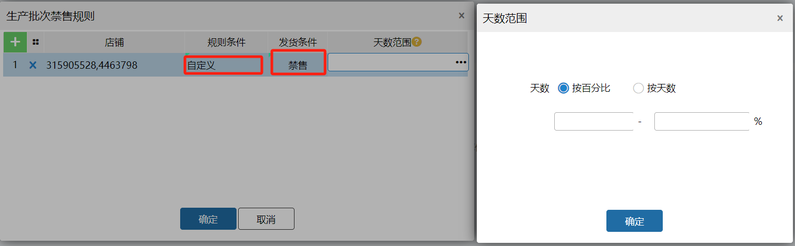
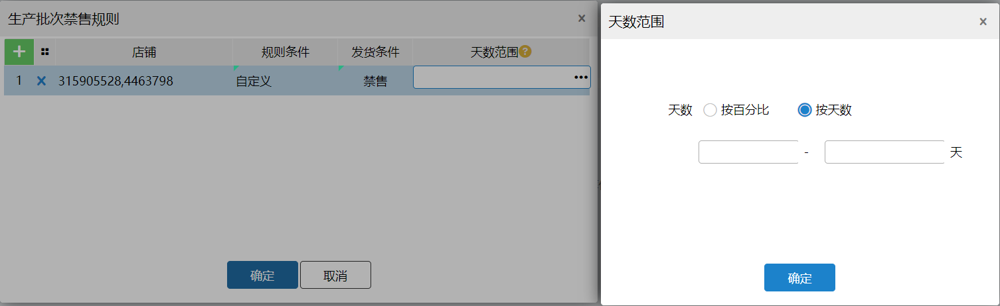
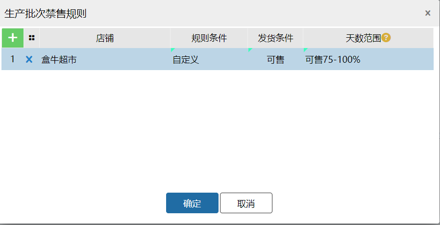

# WMS-保质期禁收/禁售

行业背景

通常做食品、药品、日化等具有保质期特性类目的，对于保质期的管理都是供应链管理的重中之重。那么收发货的时候会着重对于商品保质期

禁收管理

使用场景：

食品、药品等效期商品在入库时，若商品剩余保质期不够长或者接近临期，此时收货入库很可能就滞留在仓库发不出去了，给仓库带来资损风险

使用效果：

设置禁收规则后，所有入库批次商品均会经过系统检验是否符合规则，若不符合则提醒操作员不可入库

操作方式：

开启业务配置

点击收发策略打开禁收规则开关

开启后，就可以配置货主/业务单据以及规则条件

规则条件中有一些预设规则，也可以遵循按商品上配置的禁收期或者自定义禁收期

配置好后，入库时系统则开始逐一进行校验

注意：校验规则有两种，①强制，表示无论如何都不可入库，没有协商余地 ②提醒，表示可以上报采购和供应商交涉

PC页面在录入批次时的校验如下，问题批次会标红处理

PDA校验样式如下

禁售管理

使用场景：

平台、经销商（客户）、超市等都会对采购商品的剩余保质期有要求，比如，保质期大于180天、保质期不可低于1/3，如XX超市等要求会更加高，甚至要求保质期大于300天或2/3.抖音平台要求不可发临期商品等，如上所述商家在发货时往往碰到，同一个商品在不同的店铺、渠道内所要求的保质期范围不同。这就给仓库发货水平提出了极高的要求。

使用效果：

设定了保质期发货规则后，系统在锁定库存时将为订单自动分配符合要求的批次。

设置方式详解：

业务模块开关开启

必须是开启生产批次严格模式系统才可以使用禁售规则

设置规则

在设置页面我们可以通过配置指定店铺及其发货规则

配置店铺，注意同一个店铺只能设置一条规则

设置规则条件，系统中提供了若干常用的设置，可以直接选配

当然也可以设置自定义规则

设置自定义规则

自定义规则中我们可以设置发货条件，即可发/禁发，便于配置

同样的为了兼容一些商超的硬性要求，我们可以在天数范围选择按保质期的百分比设置或是按照天数范围设置

下面我们模拟一下场景进行一次设置

商家老马是一个做零食的商家，这个月他有幸傍上了大腿，盒牛生鲜超市与他签订了供货商采购协议，根据协议条款中要求老马供货的商品保质期不可低于3/4.

于是老马可进行如下配置

选择盒牛店铺，发货规则选择自定义，发货条件选择可售，天数范围选择按百分比，75-100%即可

保存配置成功后，老马系统中所有新进盒牛店铺的订单，均会按照此规则进行批次分配。

> 更新: 2023-12-21 10:50:27  
> 原文: <https://hupun.yuque.com/unzko7/lsbfg0/yynabuf7mai36tam>