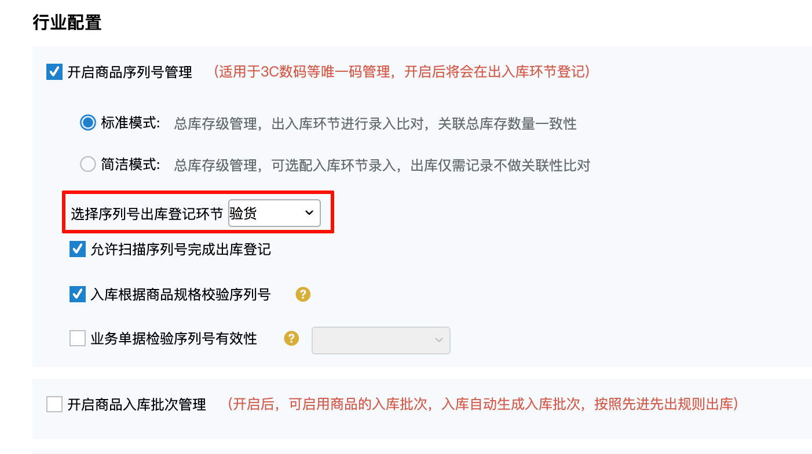
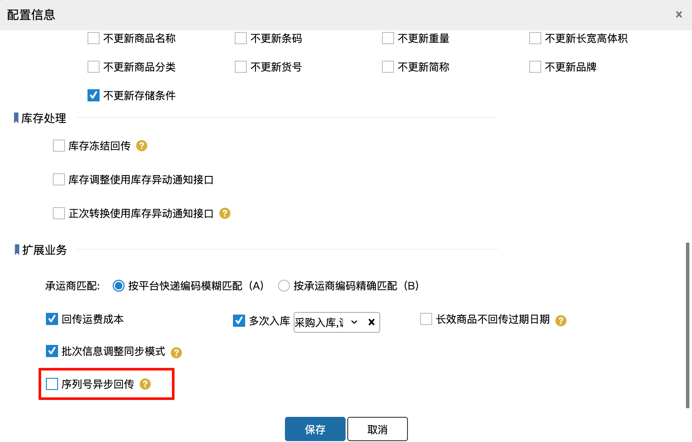
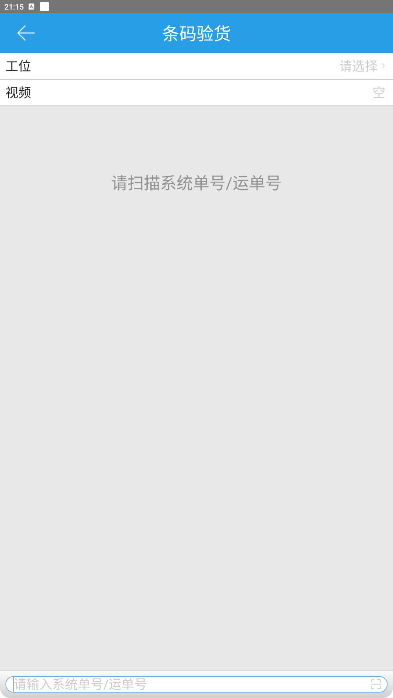
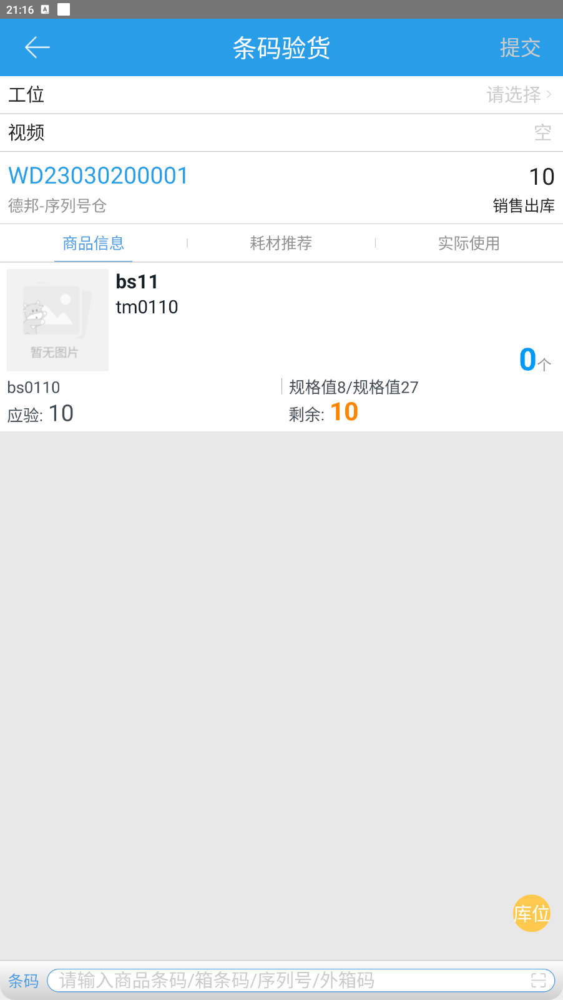
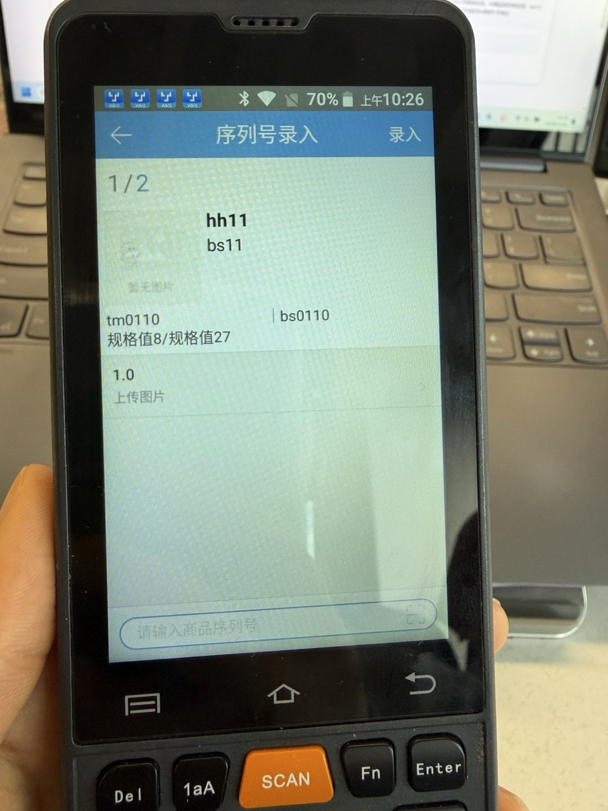
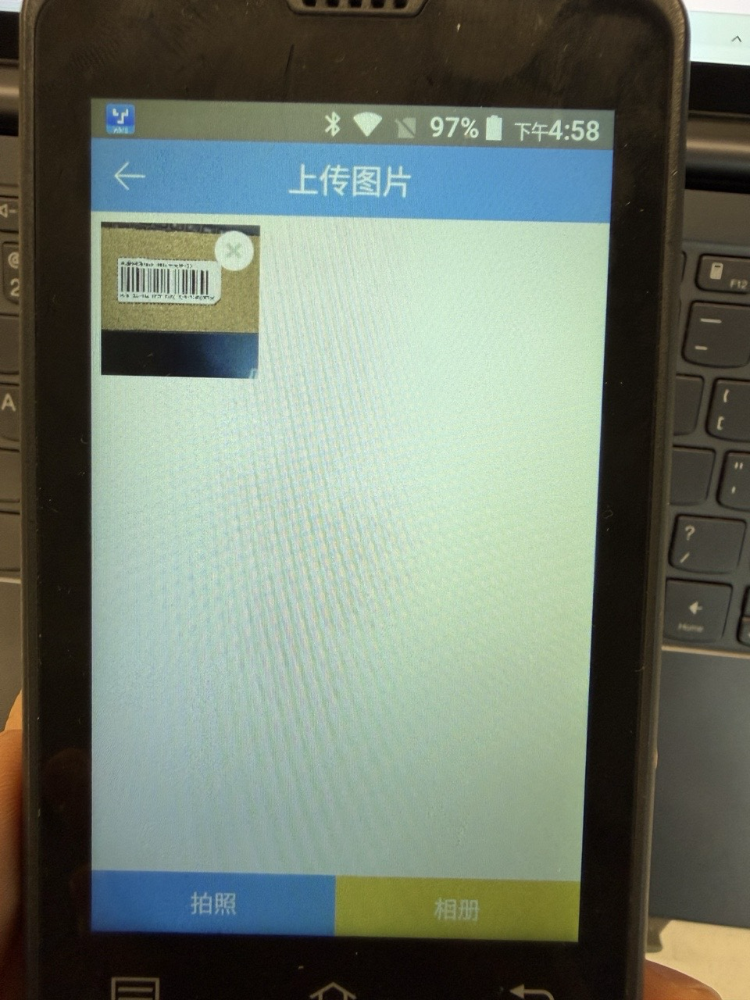
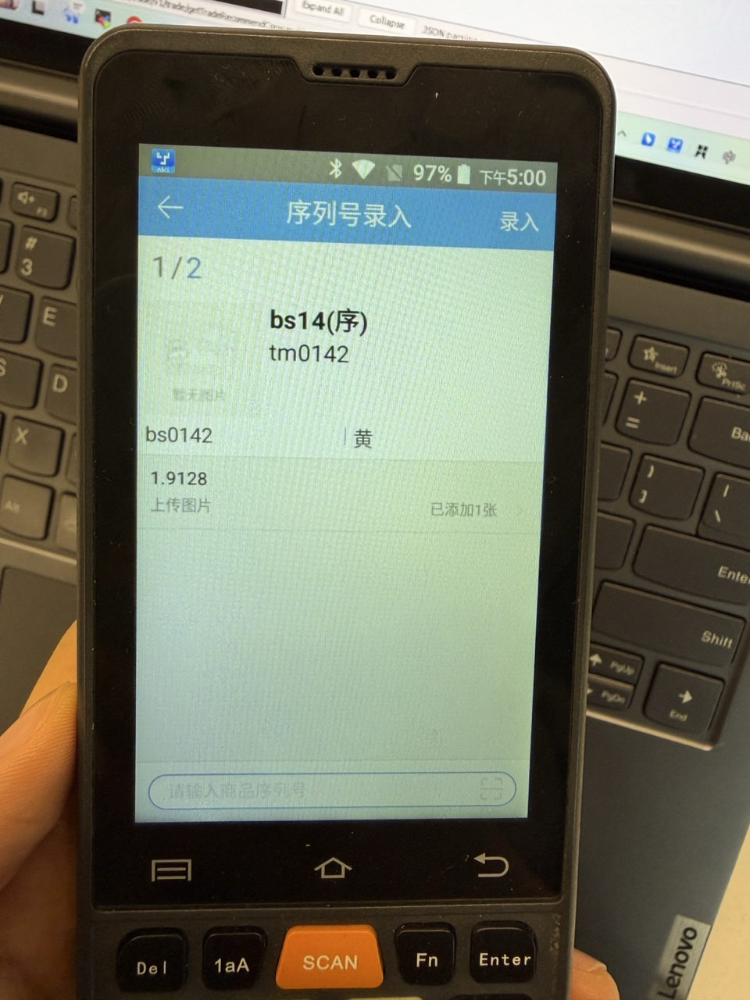

# WMS-序列号拍照上传

### 背景
拼多多公告

【平台补贴商品需上传商品SN识别码和SN识别码图片信息】

基于平台补贴商品的风控，平台补贴订单最晚在4月30日，会全部上线商品识别码发货上传功能。

商品识别码发货上传功能说明：

商家通过商家后台或者开放平台接口需在订单发货前【上传】或发货后24小时内【补传】商品识别码和识别码图片信息。

上传教程说明：[https://mms.pinduoduo.com/daxue/detail?courseId=9493](https://mms.pinduoduo.com/daxue/detail?courseId=9493)

功能影响：平台补贴订单若未正确上传识别码和图片，目前不会拦截商家发货，但是会影响商家后续的平台补贴结算。

### 操作方式
本次考虑作业便利性，拍照功能入库在PDA条码验货功能下支持。具体操作步骤如下

#### 系统配置要求：
序列号登记环节需设置在验货

SN回传模式调整为同步模式

设置-对接配置

对接配置中，对应货主的设置保留图上示例样式，**不要勾选**

#### 录入操作
扫描拼多多平台且带【SN上传图片】标记的订单号进入验货

匹配成功后展示商品列表

扫描商品校验成功后进入序列号登记页

此处用真实PDA展示

扫描后点击上传图片字样

可使用PDA自带摄像头进行拍照，也可选择相册添加图片

拍照后返回

系统记录上传图片数量，注意每个序列号拍一张即可

上传不通过场景：因平台对图片大小、格式、及拍摄清晰度有要求，所以提交验货时存在不成功的情况则会报错，相应序列号会标红显示，可重新删除图片再次上传

#### 回传ERP
拍照后图片会回传ERP提供发货上传，对应接口字段位置为

orderLine—>extendProps—>extSnList—>extSn—>snImageUrl

> 更新: 2026-06-15 15:52:23  
> 原文: <https://hupun.yuque.com/unzko7/lsbfg0/izydyvvvxo58sagh>