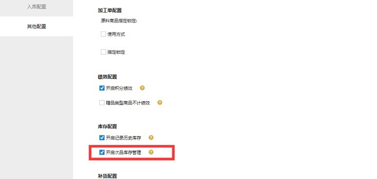

# WMS-残次品

引言

       在仓储作业时我们常常会碰到部分的商品性状发生改变，不再符合常规销售条件，即我们通常所说的次品的产生。次品的产生途径是多样的，有时入库的时候就发生了，有时仓内搬运的时候不小心造成的，还有随着存储时间过长加之存储条件不良导致商品慢慢由正品变成了次品。

       本次更新通过开发团队的一致努力，我们抛弃了当前行业市场中普遍点到为止的粗劣展现方式，从业务使用角度，遵循合理化、标准化、可持续化的原则进行开发。力求给到用户正确的业务引导和便捷的操作。

 

作业环节介绍：

 

如何开启残次品功能？

 

如何进行次品入库？

场景：当商品入库时，发现待入商品中夹杂着次品商品，在记录入库数量时，我们需要分别统计正品和次品的数量

系统支持全部的入库渠道，【[采购入库](https://hupun.yuque.com/unzko7/plvu1m/cxzlgl)】、【[验货入库](https://hupun.yuque.com/unzko7/plvu1m/cxzlgl)】、【[调拨入库](https://hupun.yuque.com/unzko7/plvu1m/wqotu6)】、【[其他入库](https://hupun.yuque.com/unzko7/plvu1m/wqotu6)】、【[销退入库](https://hupun.yuque.com/unzko7/plvu1m/sxd4mz)】以及两种

扫描入库作业【[收货入库](https://hupun.yuque.com/unzko7/plvu1m/av97be)】和【[销退扫描入库](https://hupun.yuque.com/unzko7/plvu1m/kcgaec)】在录入时支持添加次品商品

如何进行次品出库？

场景：次品商品库存积累一定程度后，根据不同的业务要求需要将次品进行出库返厂或报废折价处理

鉴于当前市场主流ERP不支持标准的残次品处理流程，我们开放了线下【[出库单](https://hupun.yuque.com/unzko7/plvu1m/drrosh)】这一出库渠道，支持分别选择正次品进行出库

线下出库单功能仅限对万里牛ERP生效，需通过技术人员开启

*WMS 3PL版本暂不支持开通验货出库,暂可通过盘点进行次品扣减

 

如何进行正、次品转换？

场景：仓内理货或者质检时，发现某些商品已经破损或发生性状改变，需要与正常商品做区分，这时就需要将正品库存转为次品库存

可通过【[正次转换](https://hupun.yuque.com/unzko7/plvu1m/twcqyf)】页面，支持正、次品间互相转换

 

如何查看次品库存？

场景：日常财务核账、仓库整顿、向上级部门反馈库存情况时，需要分别体现仓库中正次品的库存数量

【[库存总量](https://hupun.yuque.com/unzko7/plvu1m/rfrfut)】【[库位库存](https://hupun.yuque.com/unzko7/plvu1m/xcsa7g)】【[历史库存](https://hupun.yuque.com/unzko7/plvu1m/mta0ou)】【[出入库明细报表](https://hupun.yuque.com/unzko7/plvu1m/bdgcba)】均会在库存数据列表中区分正品&次品的数量，同时可查看对应属性的库存流水记录

 

如何进行次品盘点？

场景：在做仓库盘点时，库位上发现有次品商品存在时，需要能准确盘点不同属性的库存数量

【[盘点任务](https://hupun.yuque.com/unzko7/plvu1m/ngv6eg)】新增盘点任务时，有次品商品库存的将会自动带出

【快速盘点】支持盘点时录入次品商品

 

如何进行次品移库上架？

场景：仓内作业时，需要将库位上的商品进行移动或上架操作，移动时需要给到操作员提示对应商品的库存属性是正品还是次品

【[仓库库位](https://hupun.yuque.com/unzko7/plvu1m/gvnyhb)】新增次品库位使用方式，作为次品商品指导结果存在

【[库存移动](https://hupun.yuque.com/unzko7/plvu1m/sngiou)】支持移动时分别显示库位上正品和次品的数量

【[指导上架](https://hupun.yuque.com/unzko7/plvu1m/dsf6ht)】针对次品商品，系统会指导有同样属性库存的库位进行上架指导

> 更新: 2023-12-21 10:47:25  
> 原文: <https://hupun.yuque.com/unzko7/lsbfg0/mnhglobh0191r1fa>