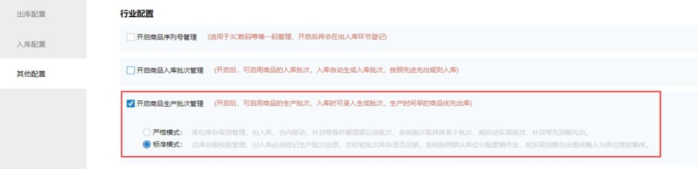
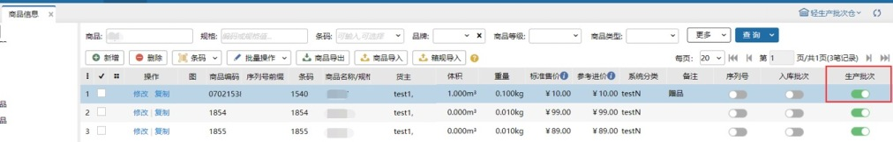

# WMS-生产批次标准模式

引言

生产批次商品常见于食品及药品类，具有严格的生产日期、保质期限等管理要求，在生产批次商品的库存管理上不同的商品有着不同的管控力度；如保鲜食品或是处方药等都是需要强制管理生产批次的拣货移库等作业，但也有一些生产批次商品无需做很精细的管理，仅在出库和入库有记录即可，这就是本次所做的--生产批次标准模式

该模式下，生产批次信息不再记录至库位库存，极大的减轻了日常的仓内作业强度，符合仅登记类商户的作业需求。

作业环节介绍：

开启商品生产批次标准模式：

开启前的准备：请先在出库环节开启验货环节、库位分配处开启待分配环节强制锁定库位。

注：生产批次标准模式与次品库存管理暂不能同时开启。

设置生产批次商品：

仓内策略-业务配置开启商品生产批次管理标准模式后，在【[商品信息](https://hupun.yuque.com/unzko7/plvu1m/sw4dcf)】新增商品并开启生产批次开关。

生产批次商品入库登记：

标准模式下的生产批次商品入库仍需登记生产批次，【[采购入库](https://hupun.yuque.com/unzko7/plvu1m/cxzlgl)】、【[验货入库](https://hupun.yuque.com/unzko7/plvu1m/cxzlgl)】、【[调拨入库](https://hupun.yuque.com/unzko7/plvu1m/wqotu6)】、【[其他入库](https://hupun.yuque.com/unzko7/plvu1m/wqotu6)】、【[销退入库](https://hupun.yuque.com/unzko7/plvu1m/sxd4mz)】以及两种扫描入库作业【[收货入库](https://hupun.yuque.com/unzko7/plvu1m/av97be)】和【[销退扫描入库](https://hupun.yuque.com/unzko7/plvu1m/kcgaec)】。

生产批次商品出库登记：

标准模式下生产批次商品出库登记批次信息在验货环节，此模式下生产批次商品普通订单出库登记生产批次暂支持【[条码验货](https://hupun.yuque.com/unzko7/plvu1m/tpd69m)】和【[待验货](https://hupun.yuque.com/unzko7/plvu1m/uti1vb)】两种验货方式，以及大宗订单的【[大宗出库](https://hupun.yuque.com/unzko7/plvu1m/hwq2kk)】。

本次生产批次标准模式下验货新增扫码验货方式

场景：商品包装上有二维码，其中包含了商品条码、批次号、等信息，验货时根据扫描的二维信息解析出条码、批次号进行录入。

【[扫码验货](https://hupun.yuque.com/unzko7/plvu1m/ktubl8)】为生产批次标准模式特有，适合通过二维码一次性录入商品及批次信息，需技术人员开启后台开关。

查看生产批次商品库存：

场景：日常财务核账、清点库存情况时，需要查看仓库中生产批次商品对应批次的库存数量

【[库存总量](https://hupun.yuque.com/unzko7/plvu1m/rfrfut)】【[历史库存](https://hupun.yuque.com/unzko7/plvu1m/mta0ou)】【[出入库明细报表](https://hupun.yuque.com/unzko7/plvu1m/bdgcba)】均会在库存数据列表中展示批次的库存数量，同时也可查看对应批次的库存流水记录

【[库位库存](https://hupun.yuque.com/unzko7/plvu1m/xcsa7g)】会展示商品所在库位以及库存数量，但在该模式下不会显示对应批次库存情况。

生产批次商品盘点：

场景：操作员仓内作业时，只需给到商品的库位以及数量而不需管理商品的批次

【[盘点任务](https://hupun.yuque.com/unzko7/plvu1m/ngv6eg)】新增盘点任务时，生产批次商品不会带出批次信息

【快速盘点】、【[库存移动](https://hupun.yuque.com/unzko7/plvu1m/sngiou)】、【[补货上架](https://hupun.yuque.com/unzko7/plvu1m/she782)】、【[库存冻结](https://hupun.yuque.com/unzko7/plvu1m/nev32d)】支持正常操作生产批次商品

【[指导上架](https://hupun0901.kf5.com/hc/kb/article/1159602/)】生产批次商品系统指导时，将不考虑批次一致性进行指导。

生产批次商品库存调整：

场景：当盘点库位库存后，库位库存与库存总量产生差异量时，需要把库存调整成和仓库实际库存一致。

【[库存调整](https://hupun.yuque.com/unzko7/plvu1m/umrsep)】支持生产批次商品选择批次后调整批次库存。

【[库存差异量](https://hupun.yuque.com/unzko7/plvu1m/ucsxv4)】实际调整时，才会选择有差异的批次进行调整。

> 更新: 2023-12-21 10:48:27  
> 原文: <https://hupun.yuque.com/unzko7/lsbfg0/gxxyzl5mx593ir2m>