# 码上放心溯源上传

### 背景
2025年3月12日，国家医保局联合人力资源社会保障部、国家卫生健康委、国家药监局印发《关于加强药品追溯码在医疗保障和工伤保险领域采集应用的通知》，明确要求：自2025年7月1日起，定点医药机构销售环节按要求扫码后方可进行医保基金结算；自2026年1月1日起，所有医药机构都要实现药品追溯码全量采集上传。

### 业务开启
溯源模块使用前请联系产品同学确认

### 操作方式
#### 系统配置
溯源系统配置选择码上放心

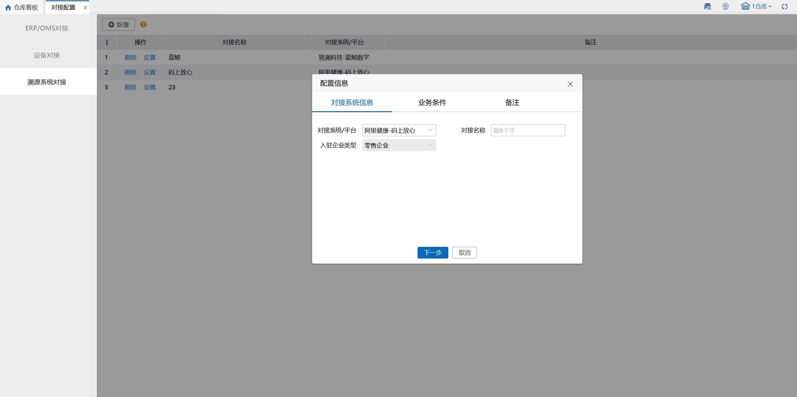

填写企业身份，配置好业务所在仓库和货主和单据

企业标识和企业ID在码上放心-基础信息中查看

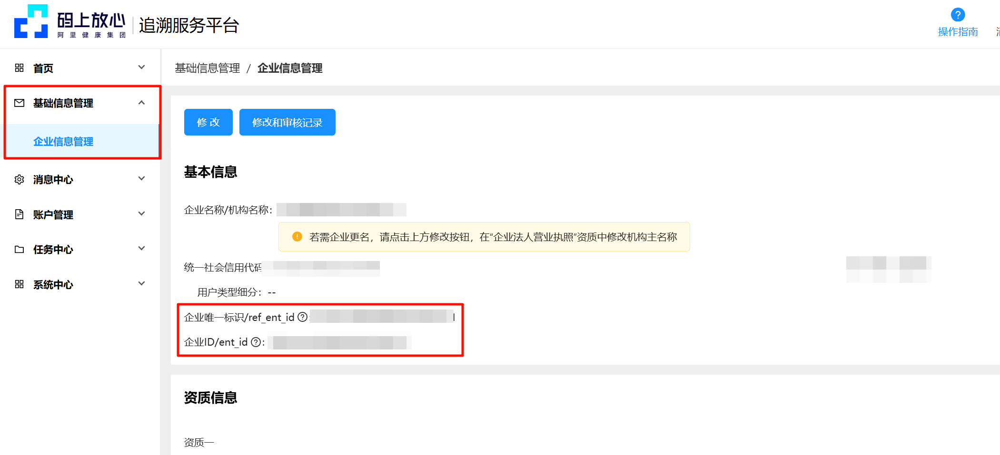

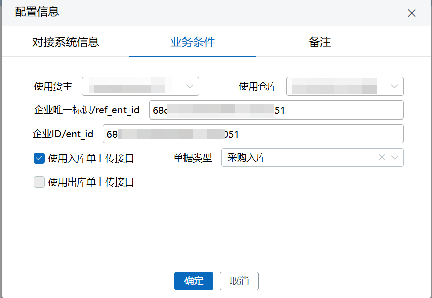

#### 客户侧绑定万里牛服务商
绑定操作见平台教程：[点击查看](https://qg6r2i.yuque.com/qg6r2i/ravqhr/oty6fvsgyza1hs6l?singleDoc)

填写教程

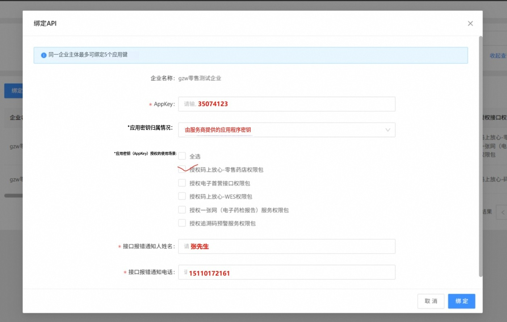

绑定成功后显示如下

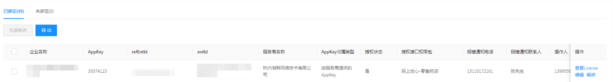

#### 溯源码上传
根据配置，符合的仓库中产生入库单后，系统会自动像平台上传入库单。

上传任务发起后，系统中会产生溯源上传记录

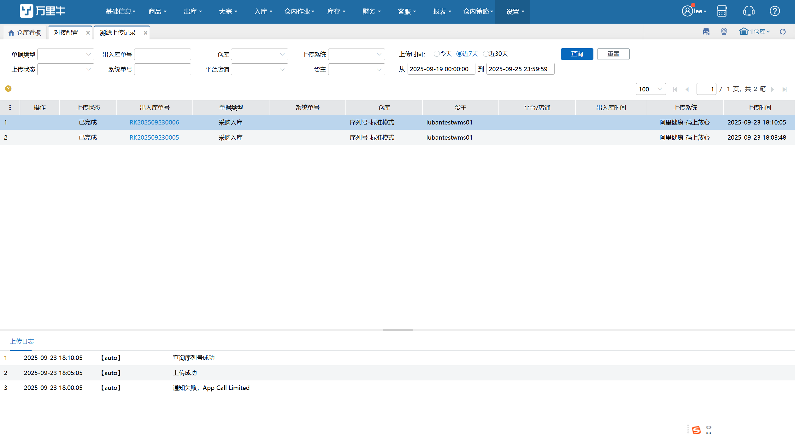

#### 大、中码的录入方式
在码上放心编码规则中，药品是存在3级包装，有大（箱）、中（包）、小（盒、瓶等最小单位），

对于企业的实际的入库作业中，不可能拆箱逐个扫描商品的码，这时就需将大、中码转换为小码进行录入

##### 启用序列号外箱码管理
联系服务人员开启模块开关

开启商品外箱码管理，注意商品需是序列号商品

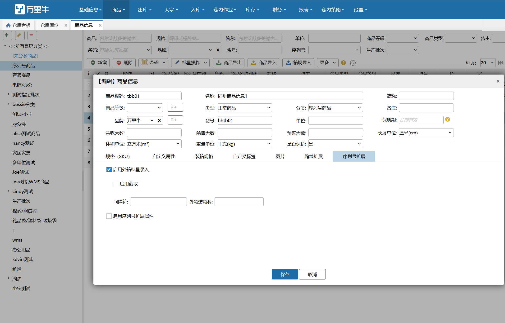

##### 策略配置
启用入库单审核并开启码上放心箱码不强制填写开关

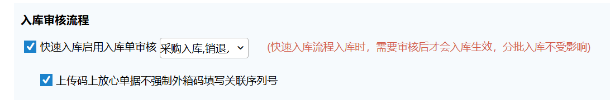

##### 入库操作
入库时录入若是整箱/包到货则录入箱码，无需录入序列号保存即可

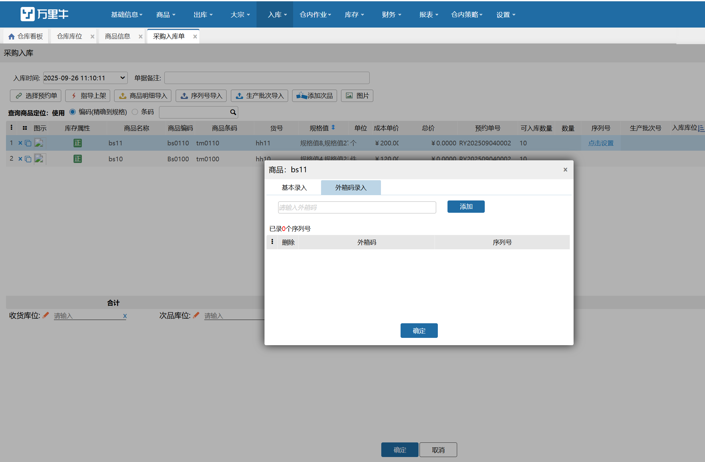

如果是最小包装则在基本录入中填写序列号

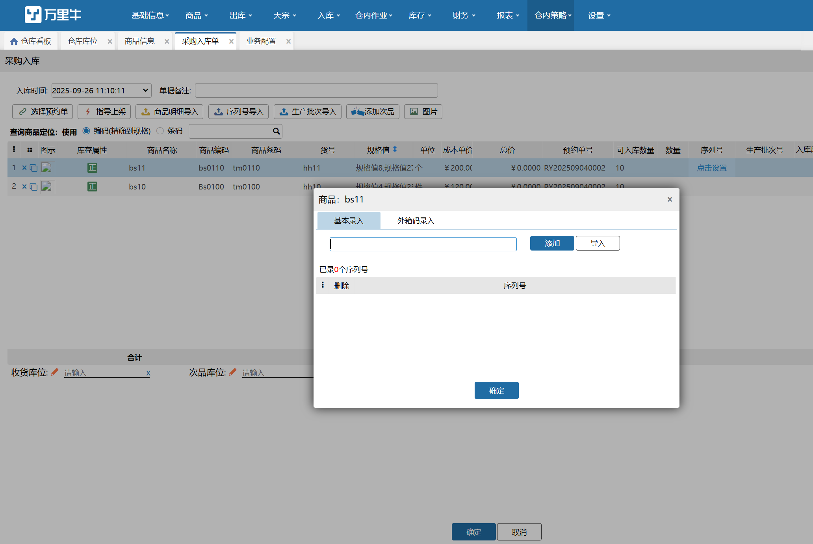

录入完成后提交单据等待系统自动解码

##### 查看上传和处理进度
上传状态显示已完成的，即视为系统完成解码的工作

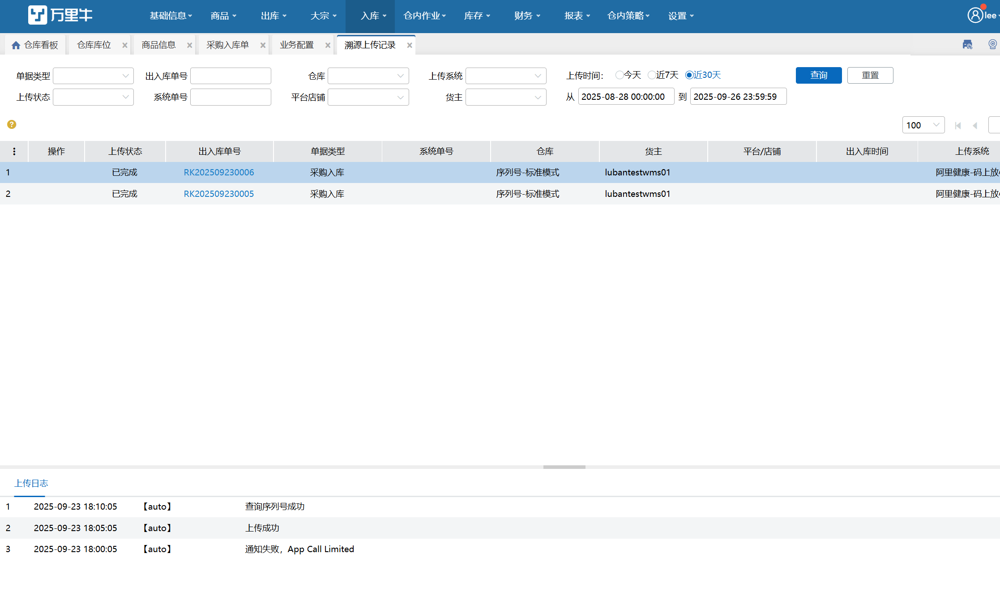

可点击单号跳转至入库单页面查看结果，若数量无误则可点击审核完成进行入库

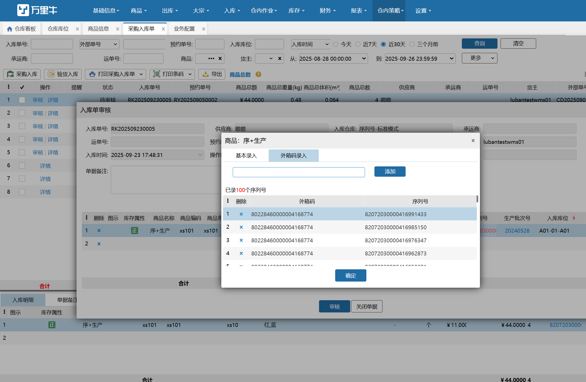

#### 异常的处理
##### 上传单据异常
1.上传异常：接口/配置错误导致上传码上放心单据异常

解决方案：检查溯源系统配置和单据相关配置，在溯源记录中重试操作。

2.溯源码异常：因为可能存在上游企业未上传出库溯源码信息，可能会导致商家在入库时上传溯源码异常

解决方案：

①联系发货企业补传溯源码  
②删除码上放心平台中已上传的入库单  
③系统中关闭失败的入库单，重新创建入库单  
3.部分箱码解码异常：入库扫描时可能会错误的将序列号（子码也是最小包装的溯源码）填写到箱码中或箱码填写错误

解决方案：

①在码上放心平台查询正确溯源码和关联序列号，复制到系统中替代系统解码过程。

或

②删除码上放心平台中已上传的入库单  
③系统中关闭失败的入库单，重新创建入库单填写正确箱码

> 更新: 2025-09-26 13:59:15  
> 原文: <https://hupun.yuque.com/unzko7/lsbfg0/mmy9htlxtyghutdg>