# 生产批次扩展属性管理（医药）

### 引言
       生产批次商品常见于食品及药品类，具有严格的生产日期、保质期限等管理要求。但在医药行业中，除进行正常的效期管理外，还需记录药品批次、批准文号、准字号、械字号等等国家相关法律发规中强制要求追溯的药品批次信息。所以在医药这类特殊类型的的批次管控中，WMS为满足GSP规范，将这类信息作为批次扩展属性进行管理。

### 使用及操作
#### 功能配置
前置条件：开启生产批次管理

维护批次扩展属性

考虑不同地区的管控要求和不同管控等级的药品，系统可自定义设置扩展属性名供使用。

注意：所有属性值设置后一经使用不支持删除，仅可进行属性名修改。属性名最多可设置10个

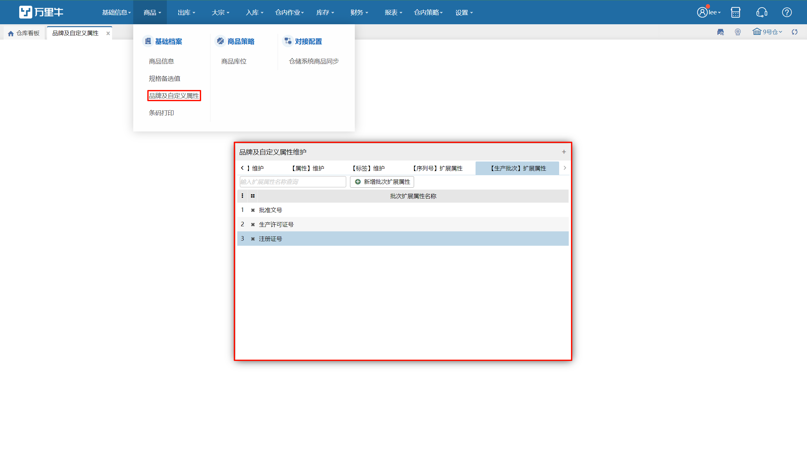

#### 入库登记批次
##### PC入库
已采购类入库举例，我们在录入商品批次时可同步登记批次扩展属性

入下图

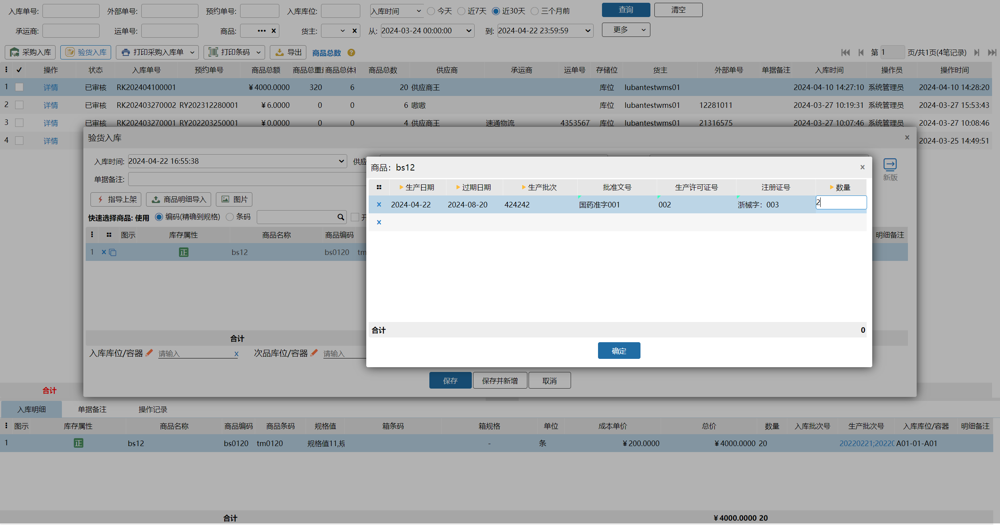

考虑不同的商品需录入的扩展属性值不同，故所有的属性值都是非必填项。

入库完成后可以在单据中看到汇总信息。

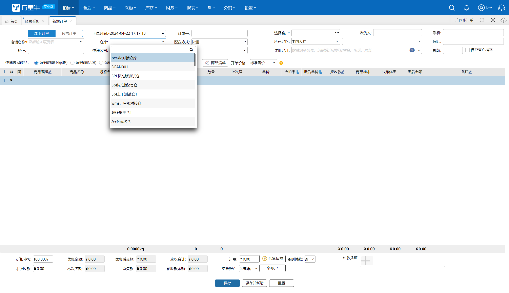

##### PDA入库
手持端PDA的入库我们也是在录入批次页面增加了相应的扩展属性录入

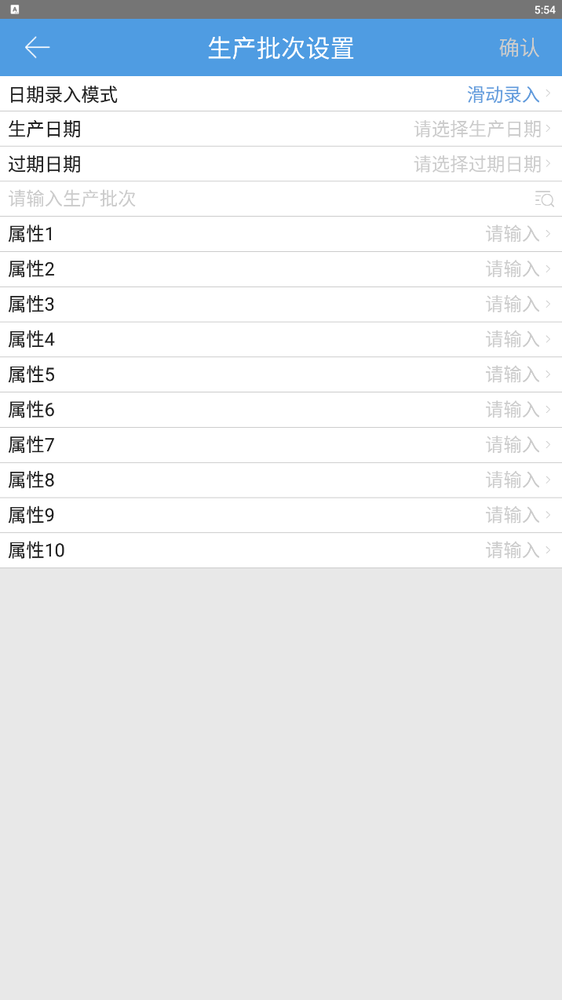

##### 单据的打印
在入库单的相关打印模板中，我们也增加了扩展属性的打印项

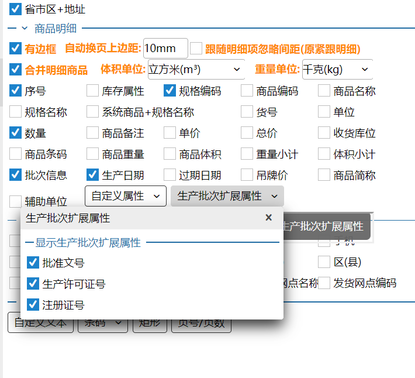

#### 出库作业
##### 扩展属性的查看
在正常的出库页面中，我们可以通过点击查看订单分配/录入的批次号来查看其扩展属性

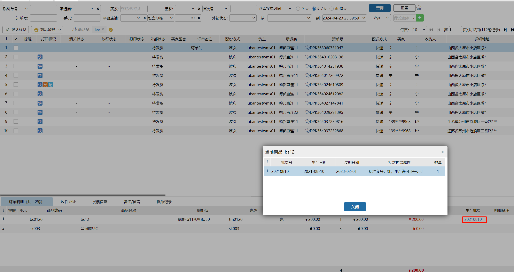

##### ToC验货（复核）的批次复核
在GSP相关规范中要求，药品出库需要进行复核，我们在验货页面中也适配了相应要求

已条码验货为例

第一步：调整页面显示粒度

选择按批次明细显示

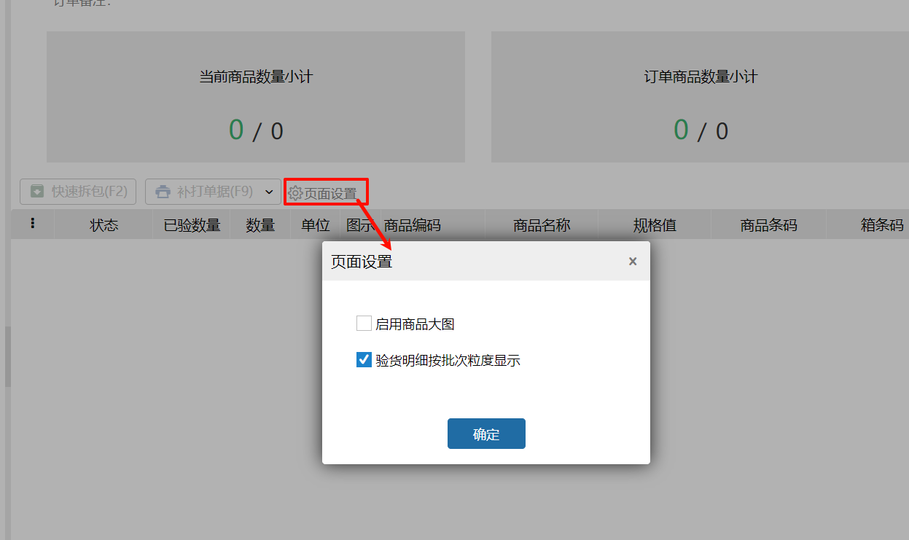

第二步：配置界面选择适合的地方显示批次属性

配置之后需保存保存

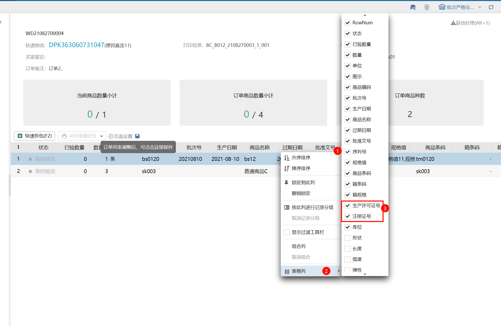

接下来扫描核对即可

##### 指定批次出库与手动分配批次
若订单是指定某批次发货的，则订单明细会显示指定批次信息。

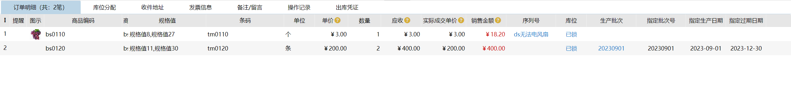

手动分配锁定批次时，此处以大宗出库页面举例

可在选择批次的时候查看到相应的扩展属性

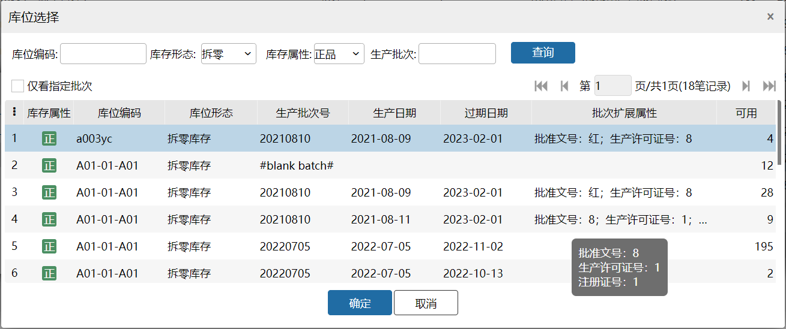

#### 盘点及库存调整
盘点作业时，我们可以新增创建批次

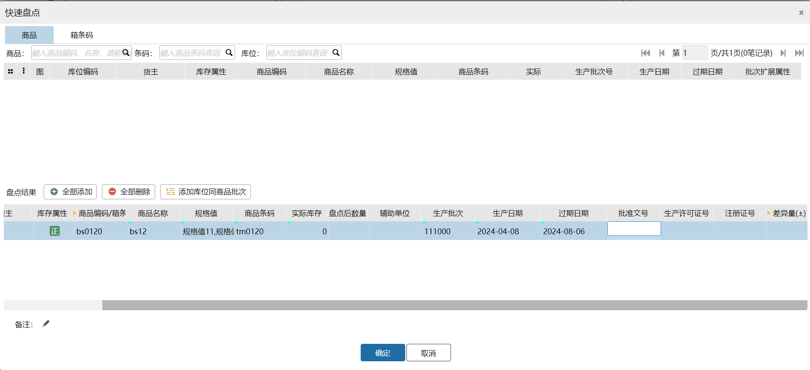

在调整库存时，我们也可以填写批次扩展属性相关

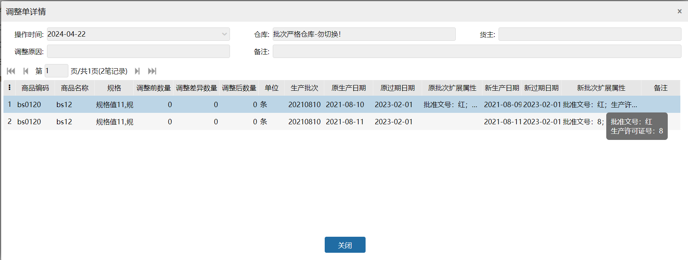

#### 批次扩展属性的修改和变更
如果严格按照GSP规范进行药品批次管理的话，仓库内是不允许进行批次等信息的修改。

但考虑到通用性，我们提供了如下几种变更修改的方式

1.入库时修改，提交入库单成功后，单据中最后一次录入的批次扩展属性会更新覆盖原系统中记录的属性内容

2.盘点修改，通过盘点变更扩展属性，修改后盘点提交会执行覆盖

3.批次调整，创建批次调整单，可修改批次及扩展属性

> 更新: 2024-04-24 15:43:17  
> 原文: <https://hupun.yuque.com/unzko7/lsbfg0/hsi50e3g0rz2uazs>