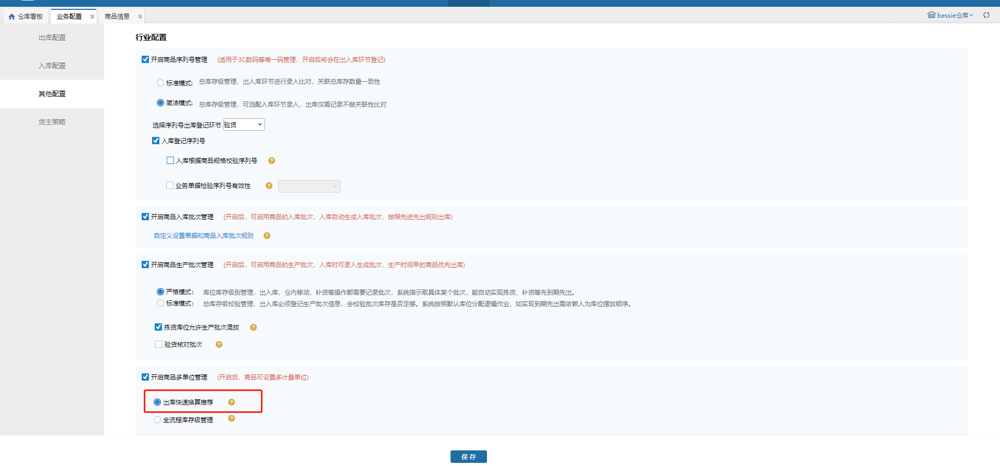
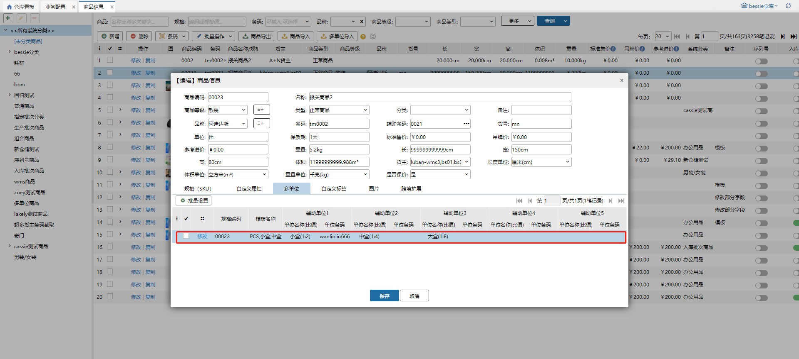
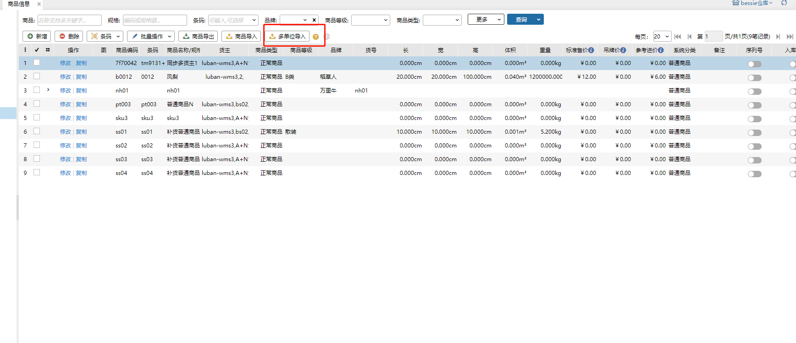
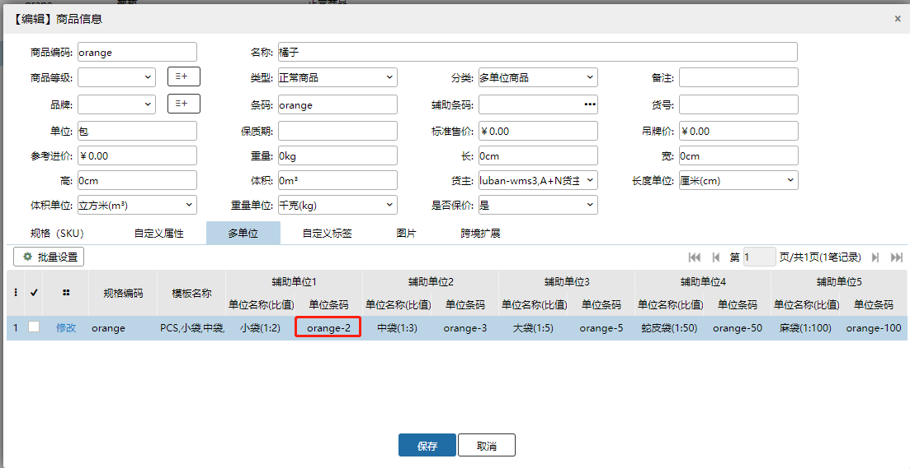
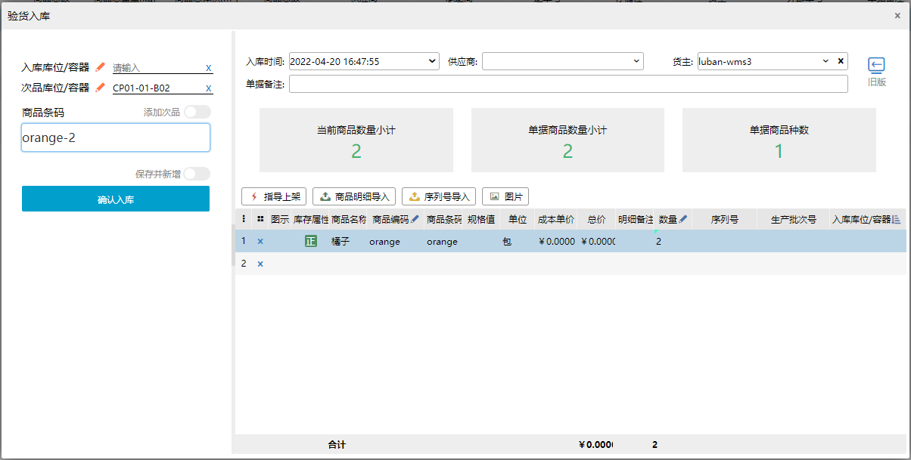
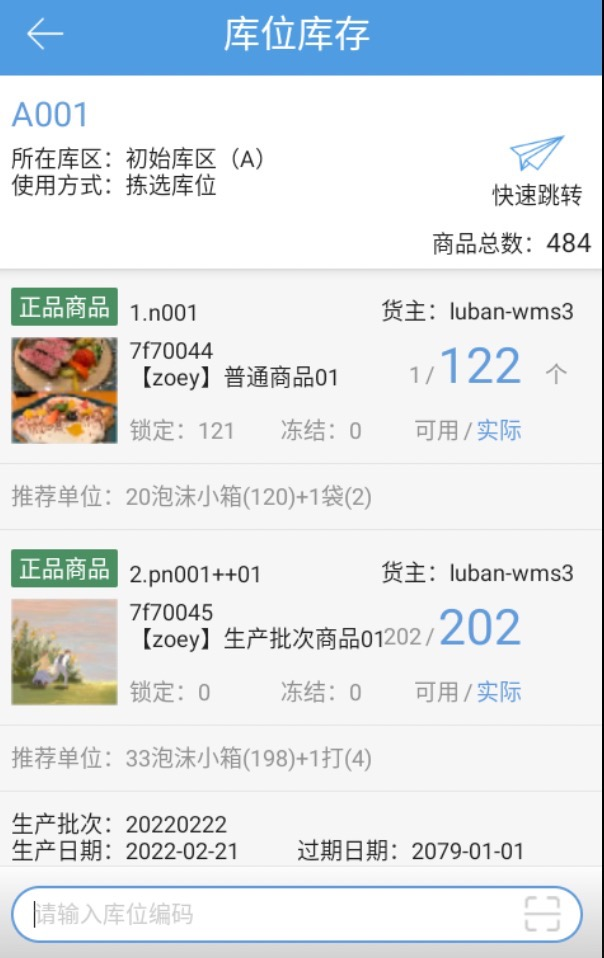
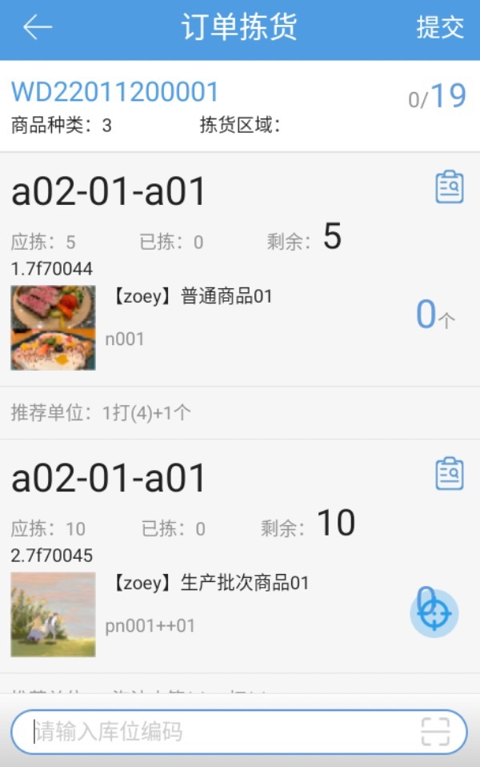
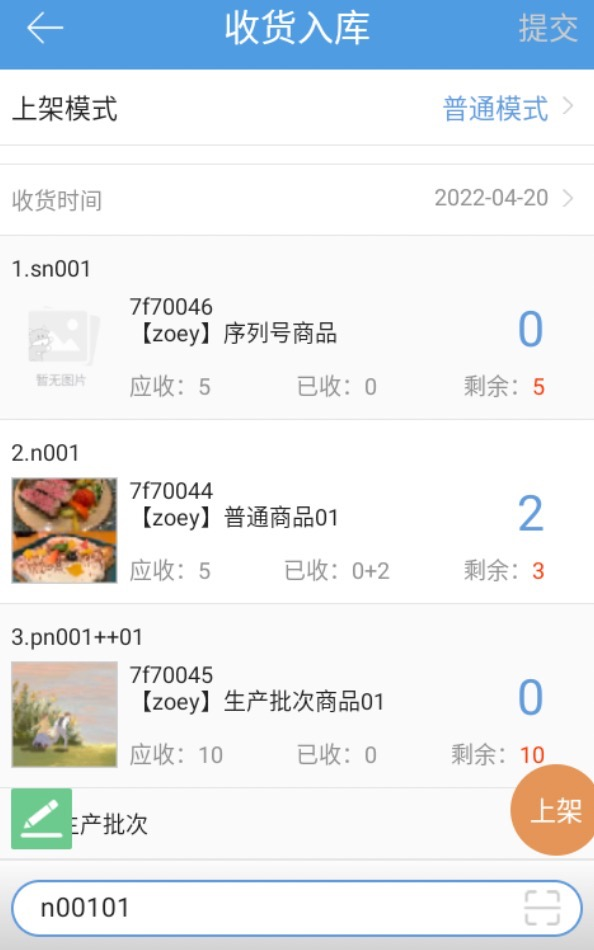

# WMS-商品多级单位管理

不少酒类、食品类商家的商品通常会已箱、小包的包装规格出现，那么日常在作业中，如果是以较为严格的箱规进行管理则会大大增加操作复杂度和维护成本，本功能旨在通过单位数量换算的方式提升作业时商品数量录入的效率

功能效果

扫码转换数量，可通过扫上级单位条码对SKU数量进行转换录入

单位换算推荐，系统根据商品维护的辅助单位比值对需求量（如：拣货数量）进行换算

一、配置及商品设定

开启多单位配置

路径：仓内策略-业务配置-其他配置

开启出库快速换算推荐

记得保存生效哟

设置多单位商品

路径：商品-商品信息

在商品信息中可针对每个SKU进行多单位比值以及条码设定，最大支持5种单位设定

如果仅看单位换算推荐的话也可以不填写条码

导入设置

针对批量的商品，我们提供了导入设置的方式

二、操作展示

PC端验货入库举例

我们录入商品辅助单位中的条码orange-2

在入库页面每次录入该条码即可将该商品数量+2

PDA操作展示

单位推荐展示

拣货推荐展示

不仅可在作业页面查看推荐的结果，PDA也支持通过扫多单位条码来添加商品

> 更新: 2023-12-21 10:48:19  
> 原文: <https://hupun.yuque.com/unzko7/lsbfg0/hel5o8y3dbe2u3zc>