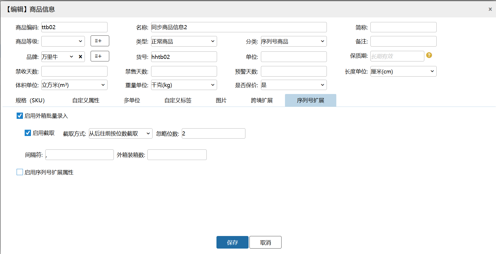

# WMS-序列号外箱码

### 背景
在快消品、电商及物流行业，为提升供应链效率，SN商品（序列号管理单品）常采用“一物一码”实现全流程追溯。外箱汇总二维码整合箱内单品信息，便于仓储扫码入库/出库、物流追踪及防窜货管理，同时支持渠道管控、消费者验真等场景，是数字化供应链与智慧物流中的关键应用。

### 目的
本功能模块主要解决有箱包装的序列号产品，在出入库作业时通过扫描箱码批量带出序列号，避免 用户拆箱操作从而提升作业效率

### 功能介绍
#### 外箱码的启用
在序列号商品信息中我们选择序列号扩展，启用外箱批量录入

#### 外箱二维码截取
一般来说，序列号商品，例如手机一类的电子数码产品，其外箱都会黏贴箱内商品的所有序列号集合。

其样式有两种

一种是把每个序列号单独列出，

另外 一种是把所有序列号汇集到一个二维码中，比如手机.

入库填写页面：

PC：采购入库、其他入库、销退入库、销退扫描入库

PDA：收货入库

出库填写匹配页面：

PC:条码验货、大宗装箱

PDA：条码验货，订单拣货，大宗拣货

> 更新: 2026-08-19 18:24:45  
> 原文: <https://hupun.yuque.com/unzko7/lsbfg0/tsg6dpuc4nlcm68z>