# WMS-箱规模块(箱规)

万里牛WMS“箱规”使用说明

一、概述

箱规：即有包装箱规格，在实际的仓储应用中扮演重要的角色，主要用于产品的集合管控、存储、搬运、出库等作业。

 

使用箱规的场景：

例1：

行业：小饰品

主要产品：发饰，小玩具等

业务模式：以线上订单为主，少量批发性质的大单

箱规情况：大部分商品可单个零售也可按小包出售，因产品价值低，小包商品销量更高

需求场景：

入库：按小包入库

拣货：拣货区分小包和散件两块区域，日常出库时，如果需求数量大于一个小包的数量那么先拣小包剩下的零散数量再从散件区域拣

验货：人工验货，无需扫条码

盘点：按小包数量计算商品总数

 

例2：

行业：百货

主要产品：洗化用品、洗发水、牙刷等

业务模式：批发订单为主，线上订单较少

箱规情况

所有商品包装都印有条码

部分商品10或12个为一盒，盒子上也有条码

部分盒装商品6盒为一箱  

需求场景：

入库：按箱、按盒入，扫描箱子或者盒子上的条码进行入库

拣货：订单数量复杂，需要计算最优的箱+盒子+散件的配比

如：某款牙刷 1盒12支，一箱6盒

当订单需要200支时需提示拣货2箱+4盒+8支

验货：扫描条码进行验货，拣了箱子就扫箱子条码

补货：对应拣货未的箱子或者散货不足时提示按箱进行补货，可补箱或者散货

盘点：扫箱条码盘点，盘点结果是箱子数量变化

 

二、使用方式（普通订单）

1、业务配置

在使用箱规前我们需要在业务配置中开启业务开关

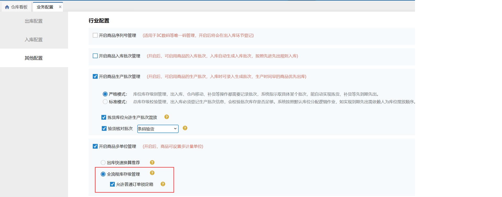

 2、基础信息维护

仓库库位中新增箱拣选库位，用于规格箱的存放和拣选使用

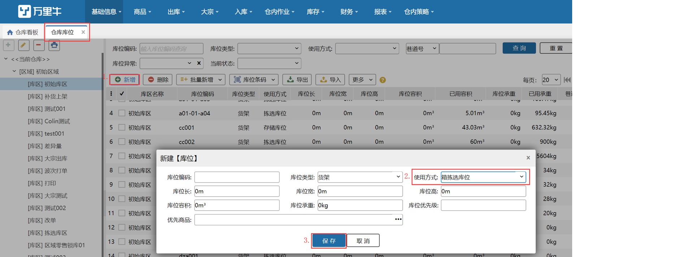

2.1、商品维护

商品信息中修改对应商品的装箱规则填好箱条码比值关系及单位等信息

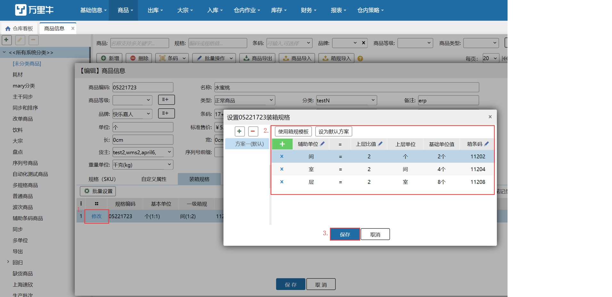

2.2、商品箱规导入

新建仓初始化时可考虑通过箱规模板批量导入箱规信息

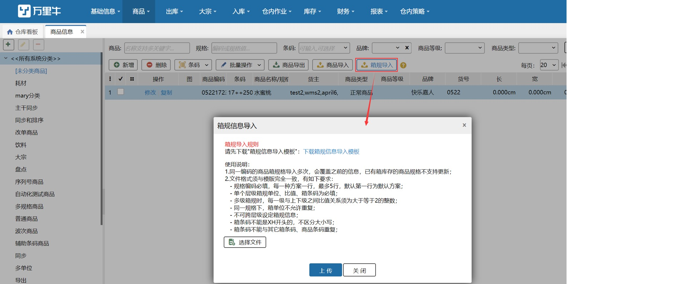

3  验货入库

考虑到按箱收货体积较大的因素，我们推荐在PDA移动端执行验货入库

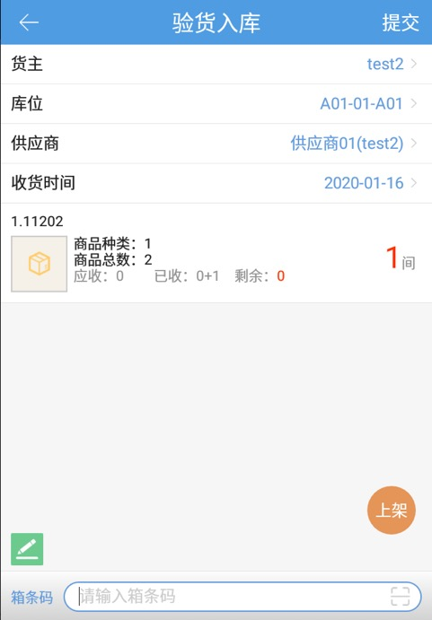

4 锁定与波次生成

当基础信息和货品都准备完成后，订单进入系统后，系统就开始根据设定的波次策略进行锁库和波次生成了

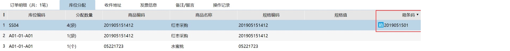

5 拣货

在系统已锁定了规格箱的情况下使用PDA进行拣货页面上会显示需要拣的箱子信息

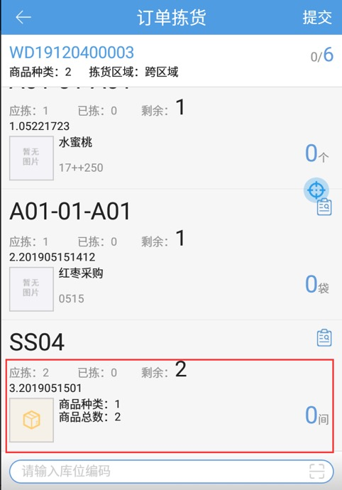 

6  验货

当拣货拣取箱子后，后续的验货也会支持扫描箱条码验箱，支持PDA播种验货、独立播种

快速验货；PC端播种验货、独立播种、条码验货、快速验货等多种验货形式

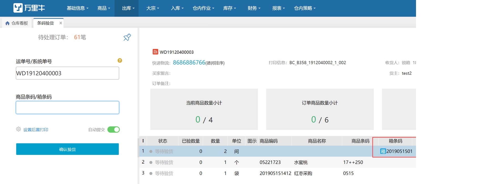

7  补货

当库位上可用库存低于我们设定的下限时补货任务开始启动

但使用箱规的情况下，我们需要优先补充出货量较大的箱子，而且同时需要兼顾到散件区域的补货

①设置补货

开启自动补货任务选择按箱补货

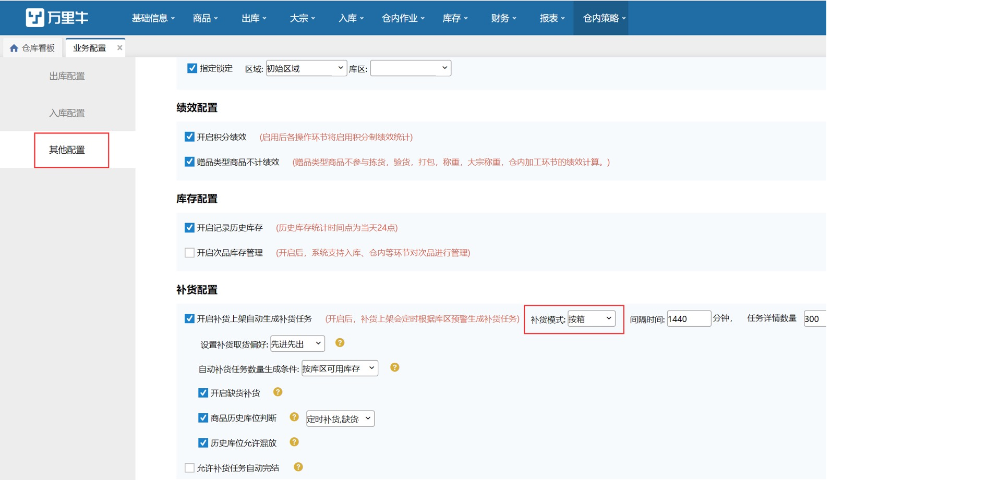

设置库区预警上下限

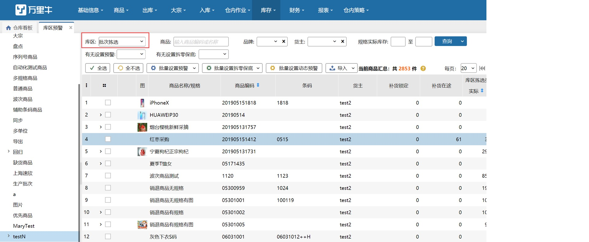

注意：设置了拆零保底值的任务才会在补货时补箱，拆零保底设置的值决定了每次补货需要拣选库位补多少散件

 

补货任务

设置完成后，系统自动生成的补货任务就会要求按箱进行补货

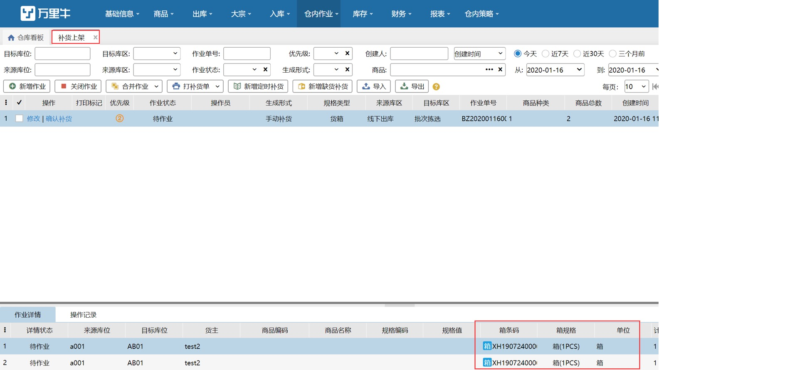

8  盘点

当开始使用箱规时，盘点时根据箱子数量X箱内商品数量的方式已经无法满足业务需要了

所以我们支持了PC端或者PDA的盘点支持盘箱，只需扫描箱条码系统就会记录箱子盘点情况

 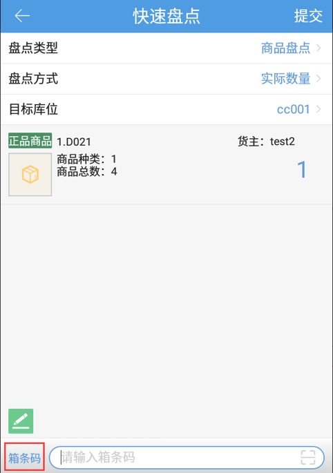

 

9  装箱

日常业务中如果箱规格是自己定义的，而非厂家生产出来就有的固定规格，那么我们需要将仓库内的散货进行装箱操作

打开规格装箱，点击新增，选择正确的库位】商品、箱信息即可完成装箱作业，同时还会记录装箱员绩效

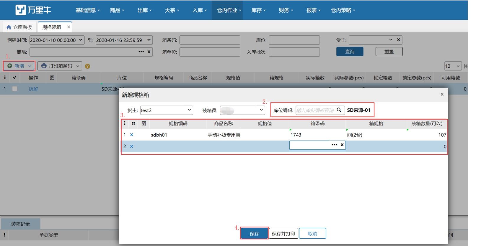

三、使用方式（大宗订单）

在了解了普通订单的箱规使用方式，再来看一下大宗订单是如何使用的

1、策略配置

大宗策略开启出库流程时可配置需要锁定的库位使用方式和形态的锁定顺序

锁定顺序方式可自定义拖动调整

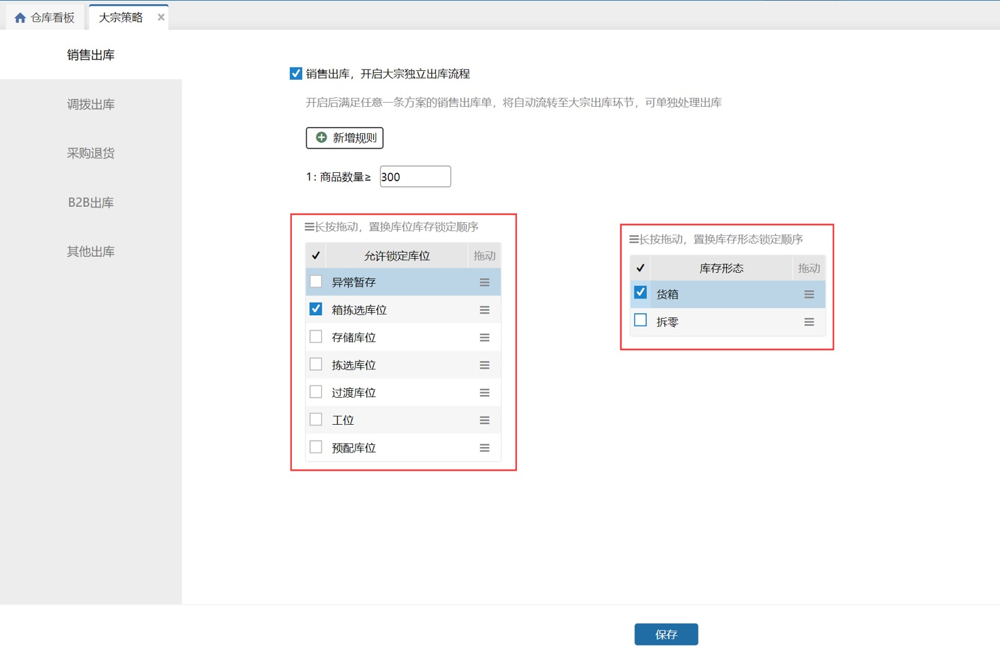

2、锁定

大宗订单锁定会遵循配置的锁定规则进行锁定

这里选择先锁箱再锁拆零的的锁定模式

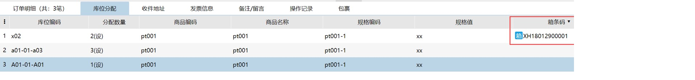 

3、拣货

大宗拣货同普通订单的拣货，锁定了箱子会提示拣选箱子

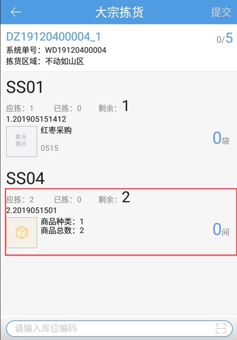

4、装箱

大宗装箱可支持将已拣的箱子扫描箱条码进行装箱

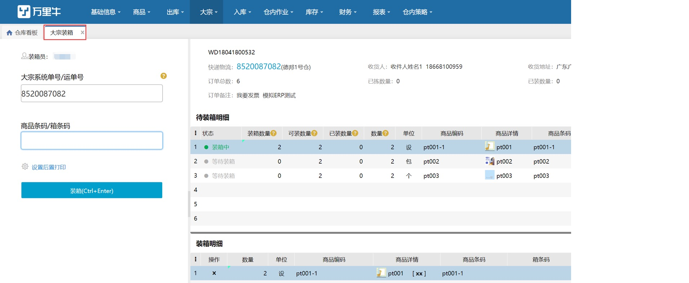

四、其他作业

1、上架

使用箱规时，系统支持将库位上的货箱进行上架

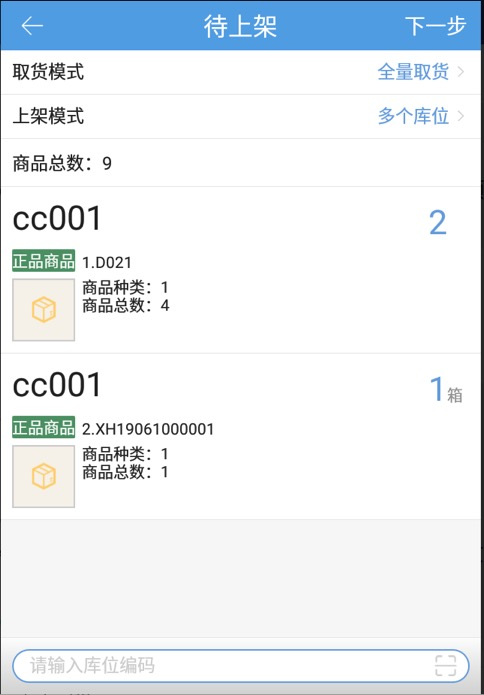

2、移库

日常的移库作业我们也支持将箱子进行移库操作，

移库作业系统支持PC端和PDA端的移库

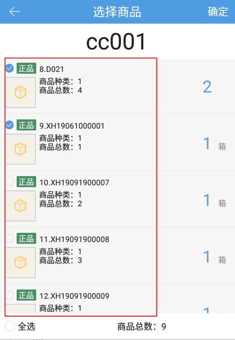

> 更新: 2023-12-21 10:50:03  
> 原文: <https://hupun.yuque.com/unzko7/lsbfg0/ctaax9gpgvl4rprp>