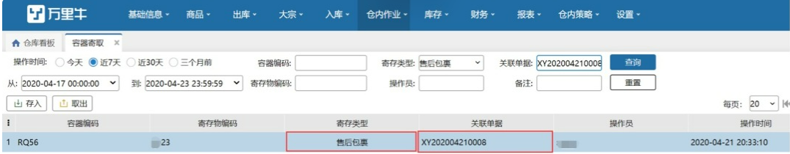
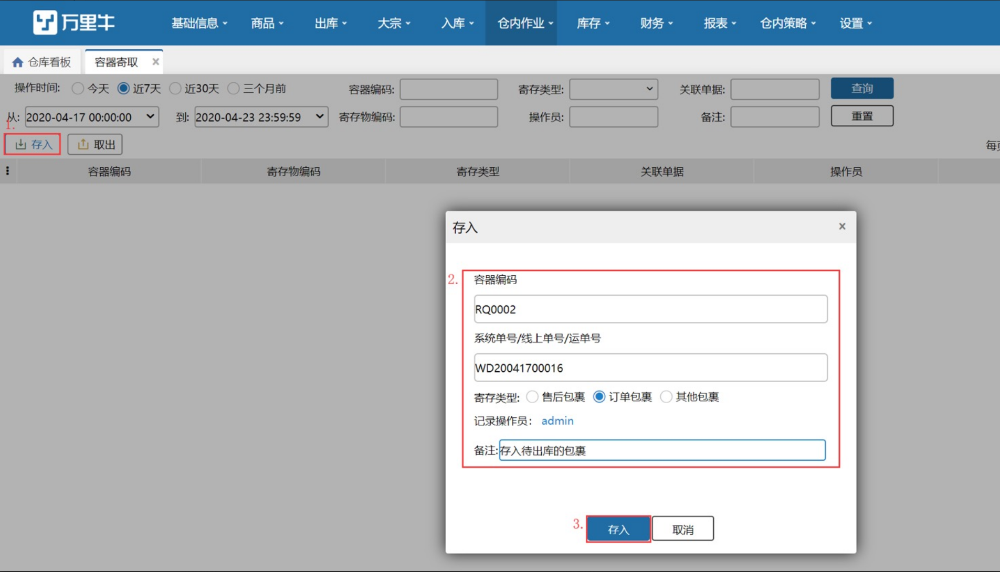
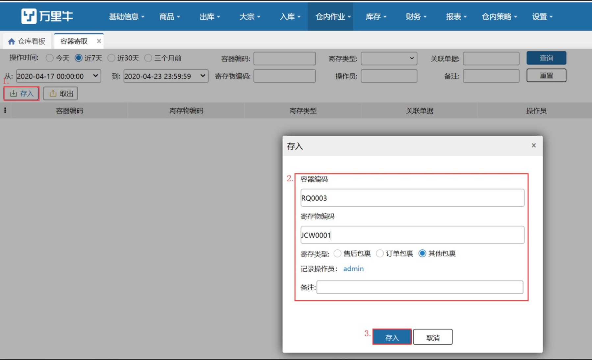

# 容器寄取

处理退货包裹时，遇到退货无法查询到销退预约单的疑难件时，需要有个地方暂时存放无头件，待售后人员确认为某一售后单据后取出；

订单出库时，在某一环节需要将包裹暂时存放，根据订单信息申请快递单号，根据打印好的快递单号找到对应的包裹；

现推出暂存柜功能-容器寄取，支持将包裹放入保存，并通过放入时填写的识别码，待需要取出时通过扫码寻找置入的容器。

## **1.存入**
#### 01.售后包裹
（1）点击'存入'按钮，选择要存入的包裹类型-售后包裹，扫描容器编码，选择交接承运商后，扫描包裹上的运单号后点击存入即可。

**注意：**

1. 相同承运商，相同运单号的包裹，已经存入过一次，未取出前，不允许再次存入；

2.已经存入过包裹的容器，未取出前，不能再次存入其他的包裹；

3.存入售后包裹时，选择的承运商和扫描的运单号和销退预约单上的承运商、运单号完全一致时，此容器会与销退预约单进行关联；例：存入售后包裹，承运商德邦快递，运单号：DB123；现有预约单01：承运商德邦快递，运单号DB123；存入售后包裹的容器会与预约单01进行关联。                    

4.如果暂时没有匹配到销退预约单，则直接存入，不关联单据，再次向系统推送销退预约单时，会与容器内存入的售后包裹进行匹配。                     

                                      

#### 02.订单包裹                     
点击'存入'按钮，选择要存入的包裹类型-订单包裹，扫描容器编码和订单的系统单号、线上单号、运单号后点击存入即可。

注意：

1. 存入订单包裹时，输入订单上的系统单号、线上单号、运单号其中一项即可，无需选择交接承运商；

2.存入订单包裹时，识别码（系统单号/线上单号/运单号）需在当前仓库存在，否则存入报错；

3.同一订单包裹，已存入未取出，再次存入会报错。

#### 03.其他包裹
点击'存入'按钮，选择要存入的包裹类型-其他包裹，扫描容器编码和寄存物编码后点击存入

## **2.取出**
取出包裹时，支持扫描容器编码，查找容器和扫描容器编码，查找寄存物两种方式。

#### 01.按寄存物编码取出
点击‘取出’按钮，编码类型选择按寄存物编码，选择要取出的包裹类型（售后包裹、订单包裹、其他包裹），扫描寄存物编码后即可查询当前包裹所在容器，点击取出。

·                          

**注意：**

1. 取出售后包裹时，需要选择交接承运商，寄存物编码扫描存入时，扫描的运单号；

2. 取出订单包裹时，无需选择交接承运商，寄存物编码扫描订单的系统单号、线上单号、运单号其中一项即可；

3.取出其他包裹时，无需选择交接承运商，寄存物编码扫描存入包裹时，录入的编码。                       

#### 02.按容器编码取出                    
点击‘取出’按钮，编码类型选择按容器编码，扫描存入包裹的容器编码后即可查询当前容器内的包裹信息，点击取出。                       

                     

**注意：       **              

按容器编码取出包裹时，无需选择寄存类型

> 更新: 2023-12-21 17:23:22  
> 原文: <https://hupun.yuque.com/unzko7/lsbfg0/gmffk0rly6s3md3v>