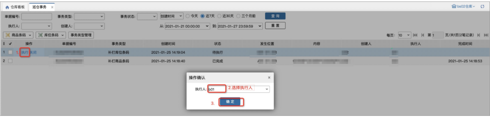

# 巡仓事务

PC端巡仓事务页面主要用于管理事务类型、查看和操作事务数据，数据来源于PDA。

### **1.事务类型管理**
事务类型管理具体操作如下：

注意：

1.事务类型最多20条；

2.需要输入的值包括：无、数量、文本；

3.在PC端新增或修改事务类型后，可在PDA上使用。

### **2.执行事务**

### **3.关闭事务**
### **4.打印条码**
勾选1或多个数据，点击打印按钮，即可打印出对应数据的商品条码或库位条码，其中商品条码是根据数量打印的。

> 更新: 2023-12-21 17:47:27  
> 原文: <https://hupun.yuque.com/unzko7/lsbfg0/vmuguvglr7ofgioe>