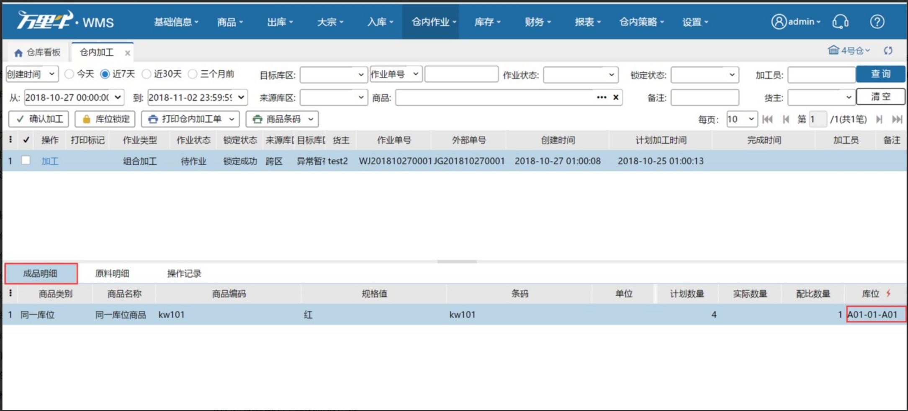
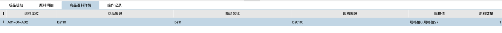

# 仓内加工

适用业务场景：用户需要将多个商品加工成另一个商品来适应当时的销售策略，例如：1个商品A+1个商品B组成1个商品C，通过建立仓内加工任务即可操作完成。

### 1.组合加工
#### 01.原料
原料即组装成品需要的商品，一个成品一般对应多个原料。

原料锁定的库位根据业务配置中库位分配规则锁定。

配比数量等于该原料组成一个成品需要的数量。

#### 02.成品
成品即组装后的商品。

目标库位有两种填充方式：

a.业务配置-加工单配置，开启默认成品过渡库位并配置默认库位，配置后加工单会按指定库位默认填充成品库位；

b.可选仓库任意库位，当原料锁定时，会根据原料锁定的库位所在区域指导出来一个成品的目标库位。若目标库位已经存在，根据锁定触发的指导，不会覆盖更新已有的目标库位。手动点击指导按钮时，会覆盖更新已有的目标库位。

目前一个加工单只有一个成品。

#### 03.单个加工
点击加工即可操作，填写原料实际用量和成品完成数量后即可点击完成。

原料的实际用量填写范围：0-锁定数量+锁定库位的可用数量。实际用量可以小于大于等于计划数量，但是保存的时候会校验，不能超过这个库位可用+该加工单锁定的数量。

成品实际生成的数量没有限制，可以小于计划数量也可以大于等于计划数量。

加工员可选择有这个仓库权限的操作员。

**注：业务配置-加工单配置，开启成品和原料实际数量免输入，原料和成品的实际数量会按照如下规则填充：**

a.待领料状态：原料和成品的实际数量会按照计划数量填充

b.待加工状态+全部领料：原料和成品的实际数量会按照计划数量填充

c.待加工+拣部分：原料默认填充已拣数量，按最大配比计算成品数量

（例：2个原料A+1个原料B，组合成1个成品C。计划成品数量4个，已拣4个原料A，1个原料B。默认填充成品C数量1个，原料A4个，原料B1个）

d.成品包含生产批次商品：不自动填充

#### 04.批量加工
批量加工可勾选多个加工单加工，选择后点击确认加工。

原料的计划数量就是实际用量，成品的计划数量就是完成数量，加工员即当前登录账号。

### **2.拆分加工**
适用业务场景：把一种商品拆分成多种商品进行销售。在系统中即一种原料拆分成多种成品。

#### 01.原料
原料：被拆分的商品，一个拆分单据目前只支持一个原料。

原料锁定的库位根据业务配置中库位分配规则锁定。

配比：原料计划数量/成品计划数量。

#### 02.成品
成品：拆分后的商品。

成品的目标库位：可配置默认过渡库位，或手动选择仓库任意库位，当原料锁定时，会根据原料锁定的库位所在区域指导出来一个成品的目标库位。若目标库位已经存在，根据锁定触发的指导，不会覆盖更新已有的目标库位。手动点击指导按钮时，会覆盖更新已有的目标库位。

### **3.生产批次严格模式下加工支持生产批次**
#### 01.原料库存的锁定
1）原料锁定根据锁定区域，按照先进先出顺序锁定。先空批次，再根据生产日期从早到晚，再根据生产批次号从小到大，最后根据过期日期从早到晚。

#### 02.成品批次的匹配
##### ①加工单推送过来指定了成品的批次。
a.成品在wms有库存和指定批次批次号一致，但是生产日期/过期日期不一致，推送报错。

b.成品在wms无库存和指定批次批次号一致，正常推送。

c.成品在wms有库存和指定批次批次号&生产日期&过期日期一致，正常推送。

##### ②加工单推送过来未指定成品批次。
成品批次会在原料锁定后，自动填充原料批次中最早过期的一个批次。

a.成品有历史批次和被填充的原料批次，批次号一致，但生产日期/过期日期不一致，成品批次不填充。

b.成品无历史批次和被填充的原料批次一致或者批次号&生产日期&过期日期全部一致，正常填充。        

##### ③批次商品的库存。
单据推送过来时，原料锁定加在空批次上，成品在途也加在空批次上，加工完成后，再增加/减少对应批次库存。

##### ④生产批次标准模式下，加工单成品或原料包含生产批次商品时，推送加工单报错。
#### 03.加工单指定批次
上游推送的加工单带有指定批次信息，会在WMS系统中显示，并且锁定原料批次库存和增加成品批次库存在途。最终库存赠减按照加工单最后选择的批次库存进行。

### **4.生成加工任务**
勾选多个加工单，可以生成一个加工任务，以任务形式作业。

允许手动生成加工任务的前提条件：作业状态待领料+外部状态待完成+状态一致+加工类型一致+相同货主+未在加工任务中+未被领取+非冻结状态(erp批量推送的加工单，未全部推完前，单据是冻结状态)+库位锁定成功

**注：生成加工任务后，生成系统任务号，单笔加工单不允许修改原料锁定库位、加工。**

### 5.加工完成通知ERP
由pda快速加工发起的加工单或仓内加工完成加工通知ERP失败后，加工单状态不变，可重新加工。

### 6.退料
在确认加工时，若原料实际使用数量<已拣数量时，系统会自动计算退料数量，填写退料库位可将超出部分还回指定库位（**注：退料数量>0时，退料库位必填**），退料完成后，在商品退料详情tab可查看数据： 

### **7.加工单关闭**
待领料状态的加工单，erp发起关闭后，外部状态显示拦截，加工单自动关闭；

待加工状态的加工单，erp发起关闭后，外部状态显示拦截，点击加工或确认加工时，系统提示退料，退料数量自动计算，将已拣原料还回指定库位：

### **8.加工单打印商品条码顺序支持多种**

1.按成品编码-按成品商品编码顺序打印。

2.按原料锁定-按每个加工单中原料锁定的最小库位作为该加工单排序依据。

3.选择记忆在操作员上。

4.加工单的部分/全部原料未锁定库位/锁定失败、已完成的加工单，选择按原料锁定顺序打印报错。

例：

加工单1    成品-xy01：2个   原料-ss01：2个（原料全锁库位n001）   即原料最小库位n001

加工单2    成品-sku1:3个     原料-ss02：6个（原料锁库位k003：4个   n002:2个）即原料最小库位n002

加工单3    成品-xy02：1个   原料-ss03：2个  ss04：1个  （原料ss03锁库位c001：1个  d001：1个   原料ss04锁库位z001）   即原料最小库位z001

按成品编码顺序打印-sku1（3张）  xy01（2张）  xy02（1张）

按原料锁定顺序打印-xy02（1张）  sku1（3张）  xy01（2张）

> 更新: 2026-04-13 11:46:22  
> 原文: <https://hupun.yuque.com/unzko7/lsbfg0/cdki7dfr9uk688sx>