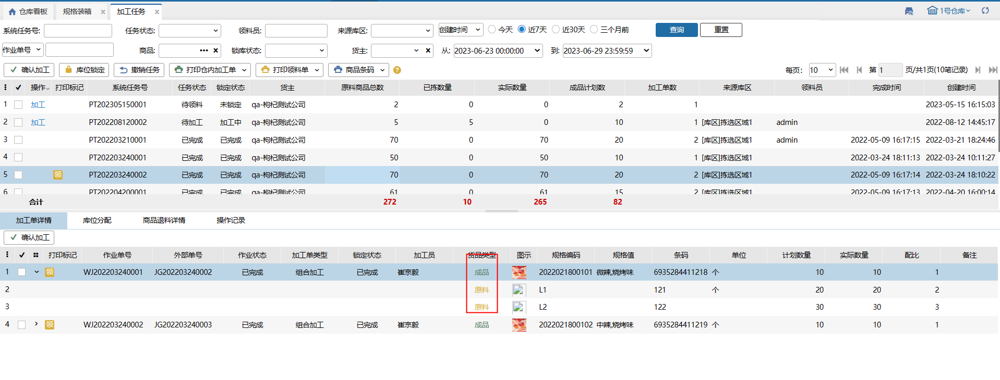

# 加工任务

将多个加工单生成同一个加工任务，进行加工作业。

### 1.页面数据
#### 01.数据来源
1.erp批量推送带任务号的加工单，推送完成后，会自动生成加工任务

前提是开启业务配置-加工单配置-接收外部ERP推送的任务

2.手动在仓内加工页面勾选加工单，点击生成加工任务

#### **02.加工任务显示**
组合加工单，成品显示在上，原料显示在下：

拆分加工单，原料在上，成品在下：

### 2.库位锁定
根据业务配置-加工单配置锁定原料库位

### **3.确认加工**
#### **01.单个任务加工**
点击加工，按加工单层级显示数据，填写原料实际用量和成品完成数量后即可点击完成。

待领料加工单原料的实际用量填写范围：0-锁定数量+锁定库位的可用数量。实际用量可以小于大于等于计划数量，但是保存的时候会校验，不能超过这个库位可用+该加工单锁定的数量。

待加工加工单原料的实际用量填写范围：0-已拣数量。实际用量可以小于已拣数量，剩余部分进行退料操作。

成品实际生成的数量没有限制，可以小于计划数量也可以大于等于计划数量。

加工员可选择有这个仓库权限的操作员。

注：业务配置-加工单配置，开启成品和原料实际数量免输入，原料和成品的实际数量会按照如下规则填充：

a.待领料状态：原料和成品的实际数量会按照计划数量填充

b.待加工状态+全部领料：原料和成品的实际数量会按照计划数量填充

c.待加工+拣部分：原料默认填充已拣数量，按最大配比计算成品数量

（例：2个原料A+1个原料B，组合成1个成品C。计划成品数量4个，已拣4个原料A，1个原料B。默认填充成品C数量1个，原料A4个，原料B1个）

d.待加工+拣部分：原料在多个加工单中，若已拣<全部计划原料，则不填充数量；若已拣=全部计划原料，则按计划数量分摊到加工单中；若原料只在一个加工单中，且已拣<=全部计划原料，则填充已拣数量。

#### **02.批量确认加工**
批量加工可勾选多个加工任务加工，选择后点击确认加工。

原料的计划数量就是实际用量，成品的计划数量就是完成数量，加工员即当前登录账号。

注：

(1) 仅待领料+锁库成功、待加工+全部领料的加工任务允许批量确认加工，待加工+部分领料的加工任务不允许批量确认加工

(2) 若有加工单被拦截，点击加工/确认时提示异常，提示退料，退料明细：被拦截加工单原料明细，退料数量：该加工单原料已拣数量，退料完成后，库存流水单据类型：加工退料，主体是任务主体，明细显示退料明细

#### **03.单个加工单确认加工**
操作步骤同仓内加工页面-手动加工逻辑一致，若有导致该任务完成/关闭的操作，若有退料，先强制退料，再加工；否则直接完成加工；

若不会导致该任务关闭/完成的操作，若有退料，不会提示。

### 4.撤销任务
(1) 已领取、已完成加工任务不允许撤销

(2) 待领料加工任务允许撤销，撤销后不解锁加工单锁定库位

(3) 待加工任务允许撤销，点击撤销时提示退料，退料明细：原料已拣数量>0的明细，退料数量：原料已拣数量，退料后解锁加工单锁定库位

### 5.打印单据
#### 01.打印仓内加工单
单笔打印时，一笔加工单一张单据，打印后任务层级、加工单层级显示标记；

合并打印时，一个加工任务一张单据，加工单合并显示，若勾选多个任务，则打印出多张单据，打印后任务层级、加工单层级显示标记。

#### 02.打印领料单
一个加工任务一张单据，勾选多个任务，则打印出多张单据，打印后任务层级、加工单层级显示标记。

#### 03.打印商品条码
按成品编码：按成品规格编码从小到大打印出成品条码

按原料锁定：打印时以每个加工单原料锁定最小库位作为该加工单成品打印顺序，按原料最小库位编码从小到大排序打印出成品条码，若有原料未锁定，则报错提示。

> 更新: 2023-12-21 17:47:04  
> 原文: <https://hupun.yuque.com/unzko7/lsbfg0/utgr9tksmpu468go>