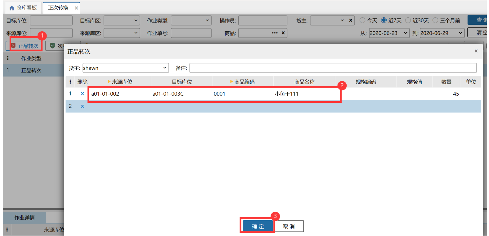
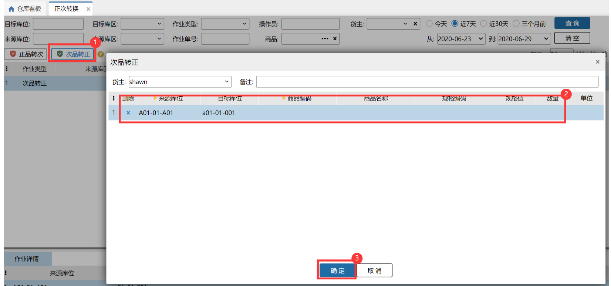
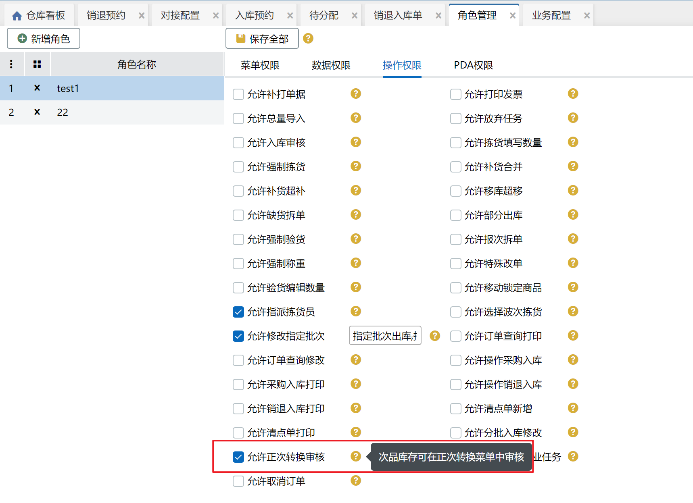

# 正次转换

当入库或仓内作业发现商品有损坏等情况不能进行出库时，则需要将这些商品库转成次品，当商品进行返修或其他操作后可以贩售了，则需要将商品转为正品；

该页面主要有两个功能：正品转次、次品转正。

具体的次品转正和正品转次后，系统自动生产库存调整单，调整类型为数量调整，在【库存】-【库存总量】、【库位库存】页面能看到对应的库存会有相应的变化。

### **1.正品转次**
具体操作如下：

提示：

1. 来源库位只能选择非次品库位，目标库位无限制；

2.选择的商品只能是该来源库位下存在的实际库存大于0的商品；

3. 目标库位选填，若不填，则该sku在来源库位上全量转次；

4.所选商品锁定、冻结的数量不允许转次；

5.同一个库位下同一个sku不会同时存在正品大于0且次品也大于0的情况；

案例如下：

前提：来源库位A，目标库位B，要将商品a的正品库存转成次品库存

1）B中有商品a 正品库存10个，此时A向B转次a商品5个，点击报错：目标库位上有同商品的不同属性库存；

2）A中有商品a 正品库存20个，其中可用15个，锁定5个，B中无商品a的正品库存，此时A向B转次a商品，可转次的数量为15个；

3）A中有商品a 正品库存20个，其中可用0个，冻结20个，此时A向B转次a商品，点击报错：正次转换不允许转冻结的商品；

4）A中有商品a 正品库存20个，其中可用20个，B中无商品a的正品库存，此时A向B转次a商品，点击保存成功。

开启入库批次的商品转成次品后，清空入库批次号；

开启序列号的商品支持录入序列号后转成次品，转次后，录入的序列号标记为次品的序列号，普通订单出库时，不允许录入次品的序列号。

若上次正品转次所选目标库位都为同一库位，再次操作正品转次时，选择来源库位和商品后，目标库位会自动带出上次转次操作的目标库位。

正次转换后系统自动生成对应的库存调整单。

### **2.次品转正**
具体操作如下：

1. 来源库位选择无限制，目标库位过滤次品库位；

2. 选择的商品只能是该来源库位下存在的实际库存大于0的商品；

3. 目标库位选填，若不填，来源库位为次品库位，保存报错：次品目标库位不能存放正品库存；若来源库位为非次品库位，则该sku在来源库位上全量转正；

4.所选商品锁定的数量不允许转次；

5.同一个库位下同一个sku不会同时存在正品大于0且次品也大于0的情况；

案例如下：

前提：来源库位A次品库位，目标库位C，要将商品a的次品库存转成正品库存

1）C中有商品a次品库存10个，此时A向C转正a商品5个，点击报错：目标库位上有同商品的不同属性库存；

2）A中有商品a 次品库存20个，其中可用15个，锁定5个，C中无商品a的次品库存，此时A向C转正a商品，可转正的数量为15个；

3）直接在A库位上转正a商品，保存报错：次品目标库位不能存放正品库存；

4）A中有商品a 次品库存20个，其中可用20个，C中无商品a的次品库存，此时A向C转正a商品，点击保存成功。

6.正次转换后系统自动生成对应的库存调整单。

### 3.正次转换审核
#### 3.1 未设置审批管理
前提：开启次品审核+账号有审核权限

正次转换生成待审核单据，确认审核后单据生效，具体操作如下：

#### 3.2 设置审批管理
在审批管理页面配置正次转换审批流程后，符合配置的正次转换单据保存后会生成待转换+审批中的转换单，具体操作请参考[采购入库审核](https://hupun.yuque.com/unzko7/lsbfg0/crl0rycd2i8g3a23#M1x2b)。

> 更新: 2025-11-26 16:51:52  
> 原文: <https://hupun.yuque.com/unzko7/lsbfg0/vggggk8zdxt3eqfs>