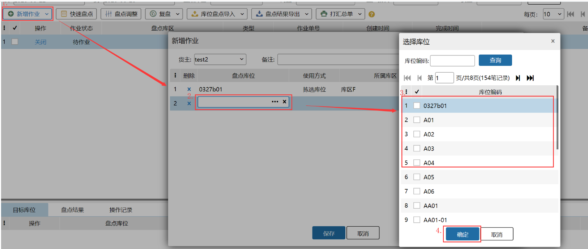
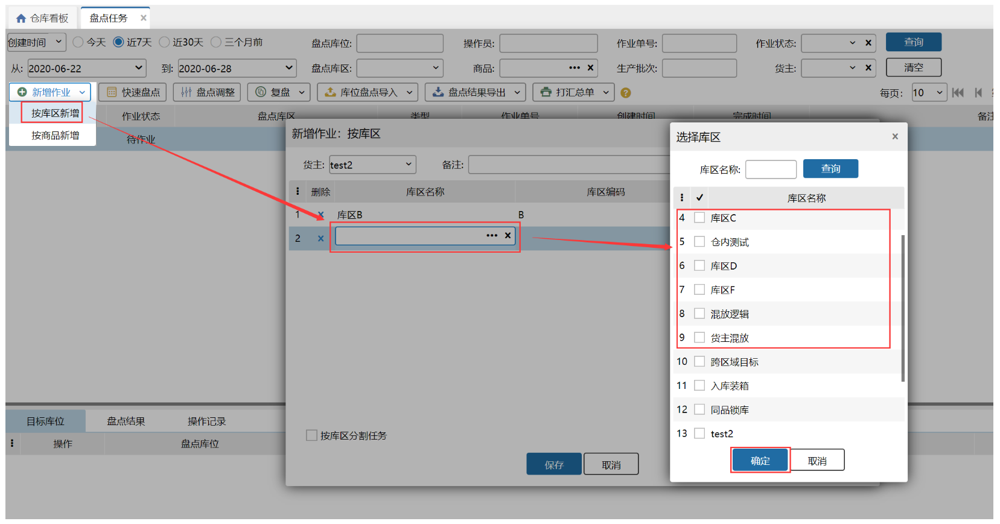
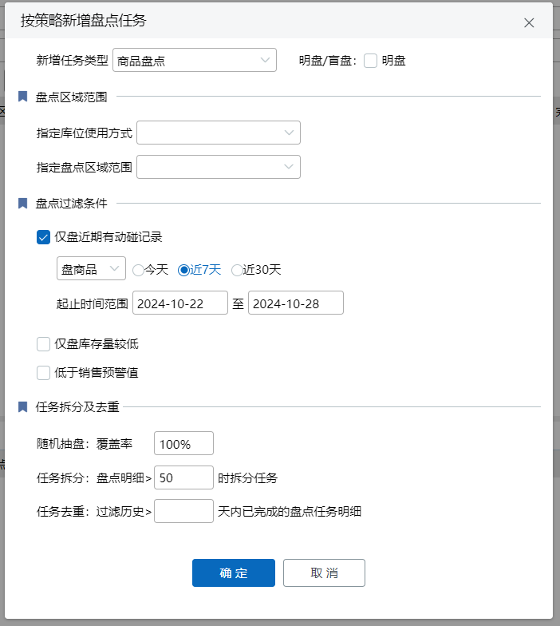
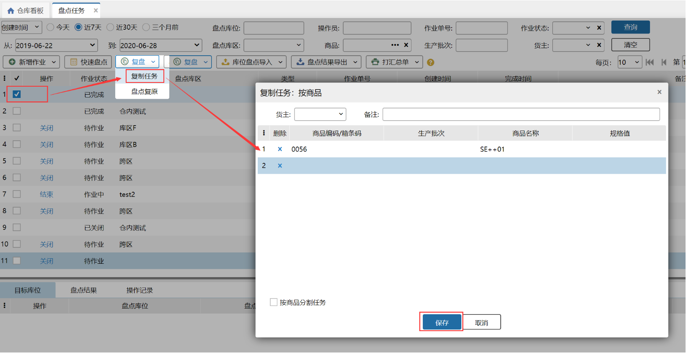
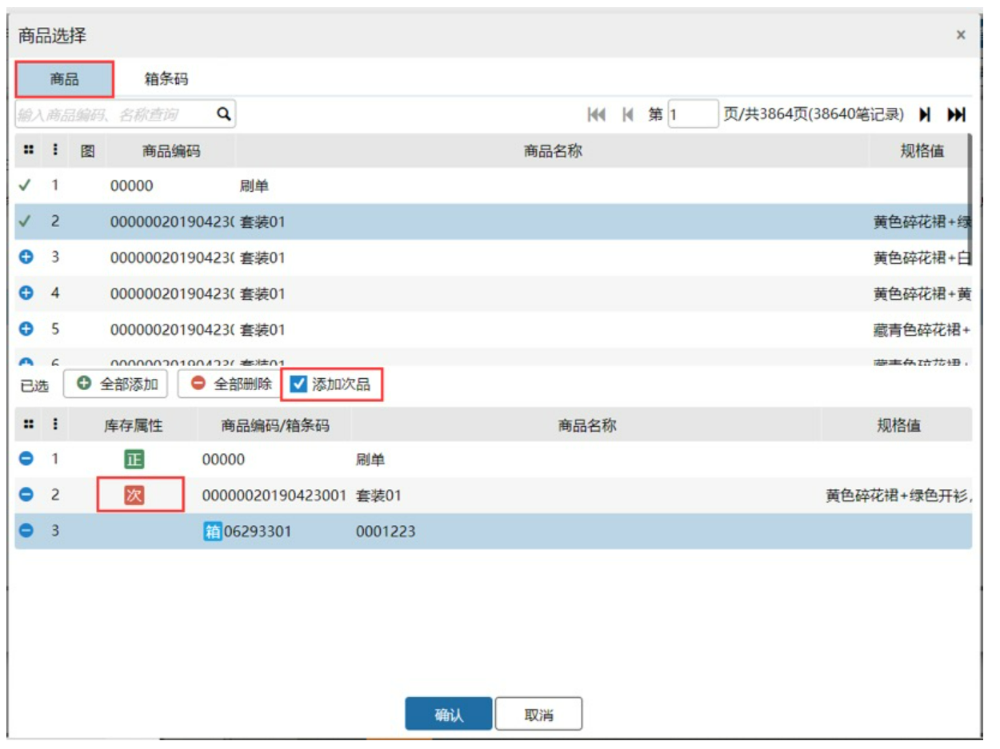
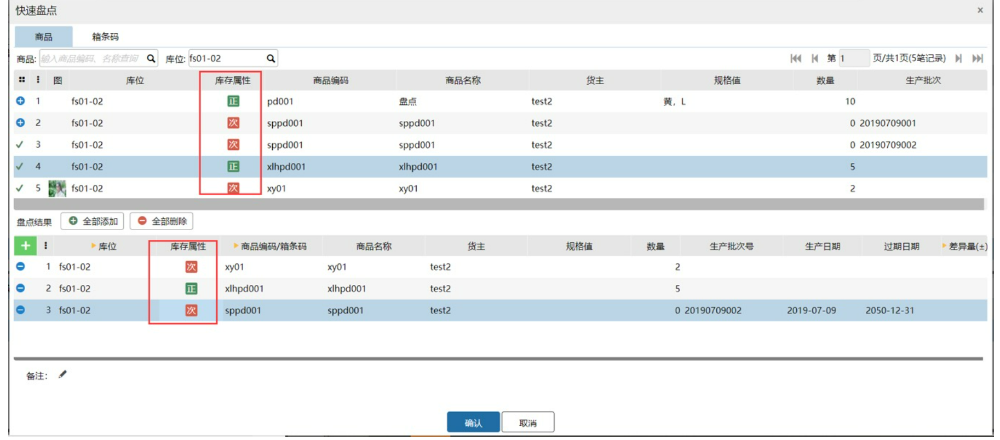
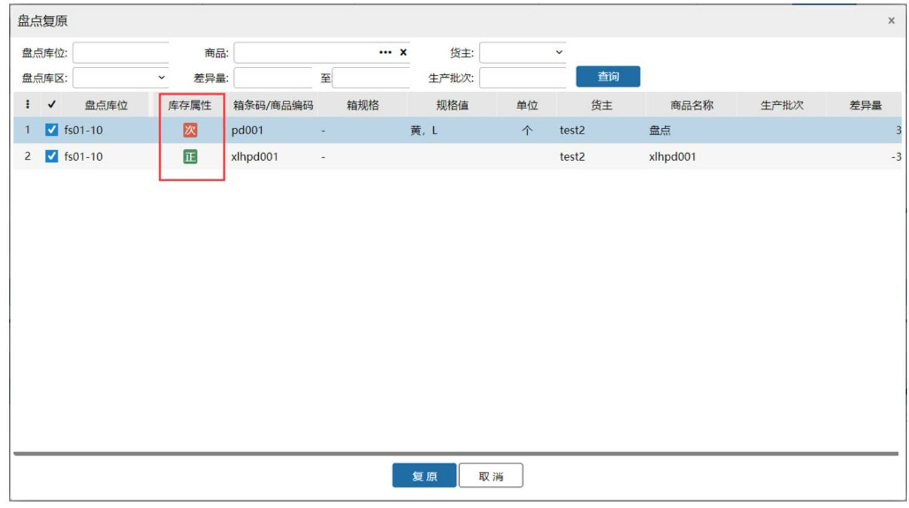
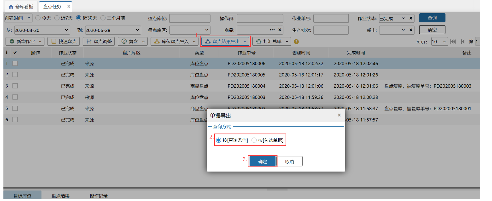
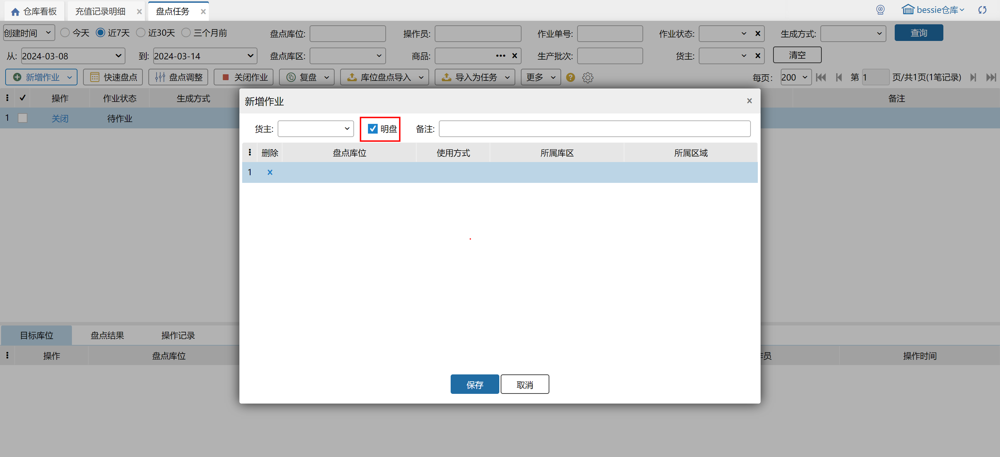
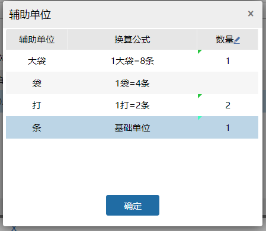

# 盘点任务

名词解释：盘点任务

1.盘点是为了精确的计算当日（或周、月、年）的营运状况,以日（或周、月、年）为周期执行清点仓库内的货品数量及账面价值,以便对仓储货品的收发结存等活动进行有效控制,保证仓储货品完好无损、帐物相符。

2.简单的说，系统里库存和仓库库存对不上了，那么就在wms系统里，把库存盘点成和仓库实际库存一致。

3.WMS库存盘点会更新箱子库存。

### **1.新增盘点任务**
新增盘点任务分有以下几种方式：

#### 01.按库位新增盘点任务
直接点击页面上的新增任务就表示按库位新增盘点任务，具体如下图所示：

#### 02.按库区新增盘点任务
在新增作业页面选择想要盘点的库区，点击保存即可生成盘点任务，具体操作页面如下：

#### 03.按商品新增盘点任务
在新增作业页面选择想要盘点的商品，点击保存后目标库位上就会展现目前系统中有存在这个商品的库位，具体新增页面如下：

**提示**

1.按库区新增盘点任务：点击保存时系统会带出该库区下的所有库位，即可对每个库位进行盘点；

2.按库区分割任务：若勾选此项，则若有选择多个库区，则保存任务后会生成多条任务，每个库区一个任务；若不勾选此项，则点击保存后只会生成一个任务，即表示多个库区的盘点是在一个任务中；

3.按商品分割任务：若勾选此项，则若有选择多个商品，则保存任务后会生成多条任务，每个商品一个任务；若不勾选此项，则点击保存后只会生成一个任务，即表示商品的盘点是在一个任务中。

#### 04.按策略新增盘点任务

a.支持创建库位/商品盘点，是否选择明盘取决于勾选项。

b.动碰记录

   (1).盘商品+商品盘点：仅盘点所选时间段内有库存变动的sku。

   (2).盘商品+库位盘点：盘点所选时间段内有库存变动的sku的所在库位。

   (3).盘库位+库位盘点：盘点所选时间段内有库存变动的库位。

c.盘库存量较低

   (1).盘点库存总量实际数量(区分货主)在区间内的有库存变动的sku。

   (2).支持单区间填写。

   (3).仅商品盘点时支持该模式。

d.销售预警值

   (1).后台统计货主+正品+sku在近30天内销售出库平均值a，销售库存数量不足b天

   盘点范围：货主+正品+sku库存总量实际数量<=a*b的sku

注：正品符合条件的sku次品也对应生成盘点任务；生产批次商品计算粒度也到sku级。

   (2).仅商品盘点时支持该模式。

**选择多个模式生成盘点任务时，盘点结果取交集范围。**

e.盘点任务去重

   (1).生成盘点任务时过滤历史 X 天内有盘点结果的盘点任务明细。

   (2).新增任务类型：库位盘点

        仅去重历史盘点类型为库位盘点+X天内有盘点结果的盘点明细（只要库位在时间段内有盘点结果，不管库位上的商品，整个库位剔除）。

   (3).新增任务类型：商品盘点

       去重历史类型为商品、库位盘点+符合策略sku在X天内有盘点结果的盘点明细（库位+商品级剔除）。

f.抽盘覆盖率

   (1).任务类型：盘商品  商品种类数*覆盖率

   (2).任务类型：盘库位  库位个数*覆盖率

### **2. 复制任务**
当同一个任务已经盘点完成，但是发现盘点错误时，则可以复制之前的盘点任务进行重新盘点，页面与新增页面相似，具体操作如下：

### **3.盘点单导入**
盘点单导入可以时用户批量导入库位的商品，导入规则如页面显示，具体页面如下：

**提示**

1.同一个sku同一个库位导入文件中出现多次，导入的结果为它们的和；

### **4.任务状态**
盘点任务分为以下几种状态：待作业、作业中、已完成、已关闭，只有待作业和作业中的任务可以进行盘点，且只有待作业的任务能关闭，作业中的任务只能强制完成。

点击盘点，填写实际盘点的数量，点击保存即完成了盘点，具体页面如下：

当点击保存后，在盘点结果就会有对应的记录：

**提示**

1.盘点时库位为最小单位，即一个库位只能盘点一次；

2.当库位上一商品的实际数量与系统中该库位此商品的冻结数量不符时盘点后会增加或减少此库位的冻结库存；

3.盘点后点击保存后，则页面上会增加对应的盘点结果。

4.盘点结果中的盘点差异量=盘点后数量-盘点前数量；

5.此处的盘点结果中的库存差异量会记录到【库存】-【库存差异量】页面的详情中，会影响该仓库中此商品的库存差异量。

6.WMS系统支持盘点箱子库存。

### **5.支持残次品盘点**
在做仓库盘点时，库位上发现有次品商品存在时，需要能准确盘点不同属性的库存数量，如图所示。

1.盘点目标库位页面，显示库存属性，商品显示正、次，货箱不显示库存属性。

2.盘点目标库位，选择商品，商品默认添加的是正品，勾选添加次品添加的是次品，选择箱条码tab页是没有添加次品显示的。

3.快速盘点和盘点调整页面，直接显示的是库位上的商品属性。

4.盘点页面，选择商品，默认添加的是正品，勾选添加次品添加的是次品，选择箱条码tab页是没有添加次品显示的。

5.复盘和复制任务页面都不显示库存属性列，复原页面显示库存属性列。

6.盘点单打印，增加库存属性打印项，商品显示正品、次品，货箱显示空白；库存属性打印项和次品管理开关无关，开关关闭，库存属性都显示为空白。

**注意：**

商品盘点，创建任务时，不会带出库存为0的库位了；打开盘点目标库位页面时显示的是实时查询的库存结果，有正品库存就显示正品，有次品库存就显示次品库存，正次品库存都为0，则显示创建时的库存属性。

例如：若创建任务时，库位01有商品A的正品库存时，通过正次转换转成次品库存，打开盘点目标库位页面则显示的时A次品；若创建任务时，库位01有商品A的正品库存时，通过正次转换转成次品库存并把该次品库存盘成0，打开盘点目标库位页面则显示的时A正品。

### **6.生产批次标准模式下不支持生产批次商品盘点调整**

### **7.盘点结果导出**
支持导出已盘点完成的盘点单，可以按[查询条件]，按[勾选单据]两种方式导出

### **8.待作业任务导出**
支持导出待作业的盘点明细，可以按[查询条件]，按[勾选单据]两种方式导出

### 9.明盘
创建盘点任务时，勾选“明盘”，生成盘点任务后，会显示对应sku在库位上的实际数量，不勾选则不会显示：

### 10.辅助单位
新增辅助单位换算商品数量，关联开启商品多单位管理+出库快速换算推荐模式显示。

1.辅助单位弹窗显示商品多单位信息，编辑后自动把辅助单位数量换算基础单位数量后相加，更新到数量，辅助单位显示已填数量辅助单位拼接结果。

2.修改数量后辅助单位清空。

已支持页面：PC端入库模块、仓内盘点任务。

> 更新: 2025-03-24 14:01:39  
> 原文: <https://hupun.yuque.com/unzko7/lsbfg0/zwp8zuv4645fu28y>