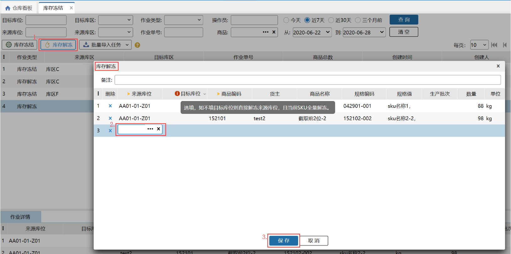
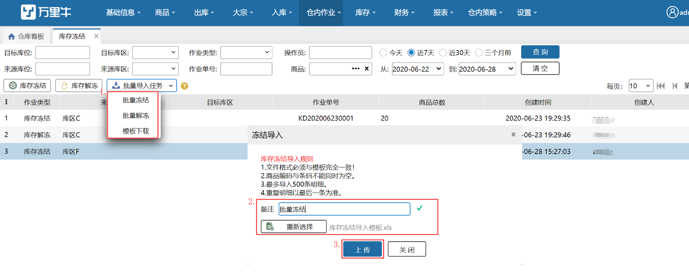

# 库存冻结

当仓库中商品有损坏等情况不能进行出库时，则需要将这些商品进行冻结，当商品进行返修或其他操作后可以贩售了，则需要将商品解冻；

该页面主要有两个功能：库存冻结、库存解冻和批量导入任务。

具体的库存冻结和库存移动后，在【库存】-【库位库存】页面能看到对应的库存会有相应的变化。

### **1. 库存冻结**
具体操作如下：

提示

1.选择的商品只能是该来源库位下存在的可用库存大于0的商品；

2.同一个库位下同一个sku不会存在可用或锁定大于0且冻结也大于0的情况，具体如下案例：

前提：来源库位为A，目标库位为B，要冻结商品为a

1）B中有a商品状况为可用2个，锁定0个，此时A向B冻结a商品5件，点击保存报错：目标库位a商品的可用库存大于0；

2）B中有a商品状况为可用0个，锁定2个，此时A向B冻结a商品5件，点击保存报错：目标库位a商品的锁定库存大于0；

3）B中有a商品状况为可用0个，锁定0个，冻结0个，此时A向B冻结a商品5件，点击保存成功；

4）B中有a商品状况为可用0个，锁定0个，冻结1个，此时A向B冻结a商品5件，点击保存成功；

### **2. 库存解冻**
具体操作如下：

提示

1.选择的商品只能是该来源库位下存在的冻结库存大于0的商品；

2.同一个库位下同一个sku不会存在可用或锁定大于0且冻结也大于0的情况，具体如下案例：

前提：来源库位为A，目标库位为B，要解冻商品为a

1）B中a商品状况为可用2个，锁定0个，此时A向B解冻a商品5件，点击保存成功；

2）B中a商品状况为可用0个，锁定2个，此时A向B解冻a商品5件，点击保存成功；

3）B中a商品状况为可用0个，锁定0个，冻结0个，此时A向B解冻a商品5件，点击保存成功；

4）B中a商品状况为可用0个，锁定0个，冻结1个，此时A向B解冻a商品5件，点击保存报错：目标库位a商品存在冻结库存大于0；

### **3. 批量导入库存冻结或库存解冻**
批量导入库存冻结或库存解冻，可以方便用户批量进行库存冻结或解冻，具体如下如：

**提示**

1.用户可先下载模板，对内容进行编辑后进行导入，库存冻结与库存解冻的模板相同；

2.导入文件中来源库位必填，目标库位可不填写；

3.导入文件中商品编码与条码其中至少填写1个；

4.当填写的商品编码与条码对应的不同一个商品时，以商品编码为准；

5.导入的文档明细不能超过500条；

6.导入的明细若有重复，则导入时以最后一条明细为准。

> 更新: 2023-12-21 17:40:45  
> 原文: <https://hupun.yuque.com/unzko7/lsbfg0/trcsyd52gec68x5t>