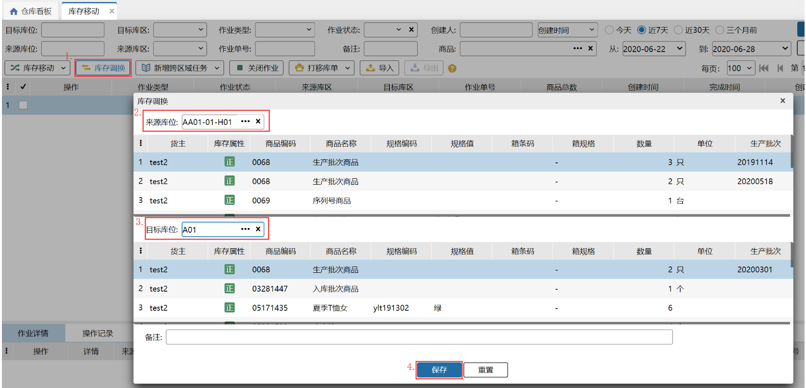
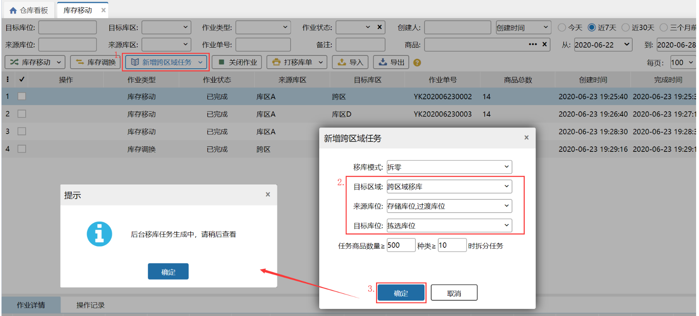
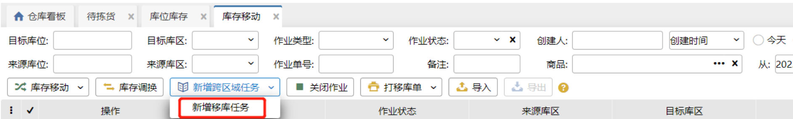
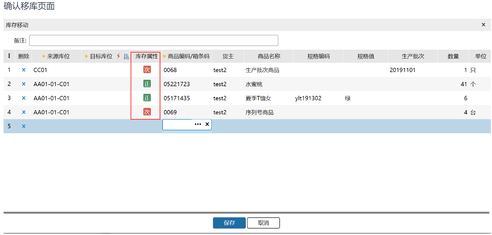
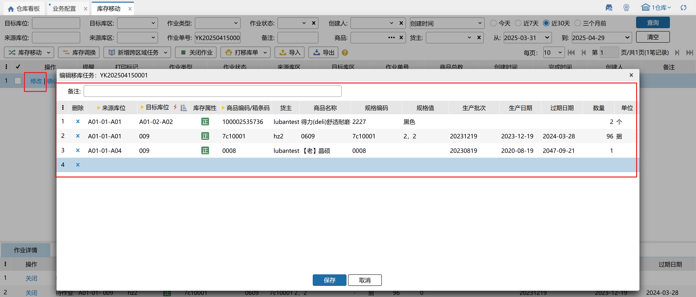
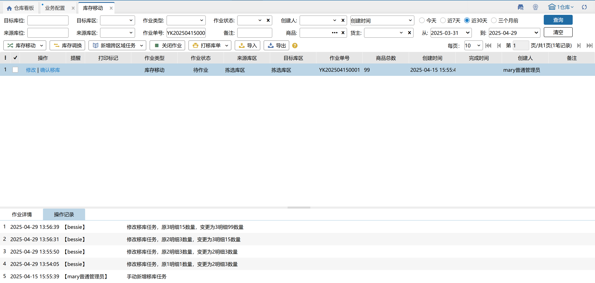

# 库存移动

一个仓库的库位之间会出现有些库位库存差异过大，且不方便实际操作时，则可以考虑进行库存的移动或库存调换的操作；

具体进行库存移动或库存调换后可在【库存】-【库位库存】页面查看对应的库存状况。

### 1. 库存移动
当某个库位上库存不足时可以从其他库位上移动一些sku到该库位上，这个就是库存移动，具体操作如下：

提示

1.库存移动只能移动来源库位的可用库存或冻结库存，且移动数量必须大于0；

2.同一个sku，若目标库位有冻结库存，只能移动冻结的库存到该目标库位；

3.同一个sku，若目标库位没有冻结库存但有可用或锁定的，只能移动可用库存到该目标库位；

4.同一个sku，若目标库位没有任何库存，则不能同时将可用的和冻结的库存都移到该目标库位；

5.库存移动的数量必须小于来源库位的可用库存或小于来源库位的冻结库存；

6.库存移动后可以在库位库存页面查看最新库存状况；

7.来源库位和目标库位的库位类型都没有限制。

### 2. 库存调换
库存调换就是快速的库存移动，表示将两个库位的商品进行调换，具体操作如下：

提示

1.来源库位或目标库位若有锁定库存，则库存调换点击保存报错：来源库位或目标库位有锁定库存，无法保存；

2.库存调换后可以在库位库存页面查看最新库存状况；

3.来源库位和目标库位的库位类型都没有限制。

### 3. 新增跨区任务                    
新增跨区任务为系统自动生成跨区移库作业任务，任务来源依据[区域预警]对区域商品设置的上下限而生成。

### 4. 新增移库任务
 用户需要每天给库管人员下发移库任务，有时候涉及到存储库位移动至预配库位等目前补货任务限制的地方，可 以通过移库任务完成对过渡库位、预配库位、箱拣库位上库存的补充。支持PDA在移库任务菜单里领取。

1、按钮位置

2、操作页面和库存移动类似，选择来源库位、要移动的商品和要移到的库位。

3、任务创建完成后，PC和PDA上都支持移库任务的完成。

### 5. 关闭作业                   
勾选订单状态为待作业单据，点击关闭作业，订单状态转为已关闭。

### 6. 支持残次品移库
仓内作业时，需要将库位上的商品进行移动或上架操作，移动时需要给到操作员提示对应商品的库存属性是正品还是次品，如图所示。

确认移库页面

选择商品页面

①.正品和次品移库、调换一定要遵守的原则

1.同一库位，同一个商品的正品库存和次品库存不能同时存在。

2.正品库存和箱库存不能放到次品库位上。

②.正品库存、次品库存指导上架逻辑调整

1.指导上架时，次品库存只能指导到有余量的次品库位，其他库位不指导，无优先库位、无历史库位。

2.指导上架时，正品库存不能指导次品库位上，之前指导逻辑不变，普通商品还是按照优先库位、余量、历史库位；批次商品按照余量、历史库位。

③.次品库存管理开关

1.开启次品库存管理开关，显示正品和次品的库存属性，不开启就不显示.

2.次品库位与开关无关，一直都显示。

### 7.打印移库单

打印移库单后，单据上显示打印标记及打印次数。

### 8.修改移库任务
待作业且没有被领取、没有下发到自动化设备的移库任务，可以进行修改。

具体操作页面如下：

1.可以将原来作业的数量、商品、库位全部进行修改

2.修改限制和新增移库任务一致

3.修改后点击保存，任务明细将变成修改后的：

### ****

> 更新: 2025-04-29 16:49:59  
> 原文: <https://hupun.yuque.com/unzko7/lsbfg0/dza5azhqribowl4k>