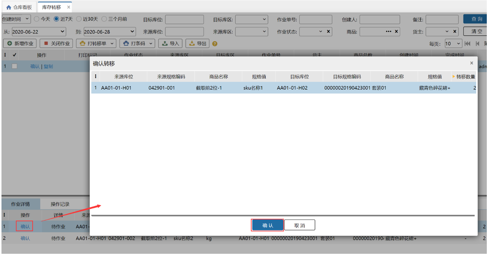

# 库存转移

名词解释

1.库存转移主要用于服装行业，可以对商品进行改款操作

2.库存转移的效果是将来源库位的来源商品的库存转移成目标库位的目标商品库存

### **1.新增转移任务**
新增转移任务首先点击库存转移页面的新增作业，之后主要有一下几种交互：

（1）先选来源库位后选来源sku

选择来源库位后，选择sku，可选的sku是来源库位中有库存的sku。

（2）先选择sku后选择来源库位

选择sku后，选择来源库位的可选范围：sku有库存的库位

### **2.完成转移任务**
完成效果：

（1）将来源库位的来源商品的库存转移成目标库位的目标商品库存。

（2）生成盘点单，将来源库位的来源sku，库位库存盘少；目标库位的目标sku库存盘多，同时盘点单据备注有转移单据的单号。

（3）生成调整单，调整单据类型为：转移调整。备注中有转移单据的单号，同时将对应库存变更通知erp。

完成操作有以下两种

①.整单完成

整个单据完成，操作记录仅显示完成整个单据。

②.单据内部分明细完成

仅完成对应明细的库存转移操作，操作记录中提示来源库位的来源sku数量n转移成目标库位的目标sku。

**提示**

1.选择库位时排除了预配库位

2.目标库位默认是和来源库位一致，可选择其他库位。

3.目前暂时不支持开启了生产批次、入库批次、序列号的商品进行转移操作

> 更新: 2023-12-21 17:41:48  
> 原文: <https://hupun.yuque.com/unzko7/lsbfg0/lryclmlbq3hsy9gl>