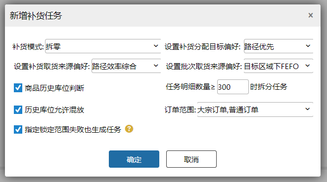
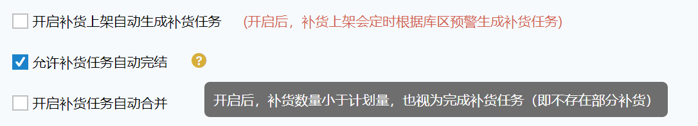
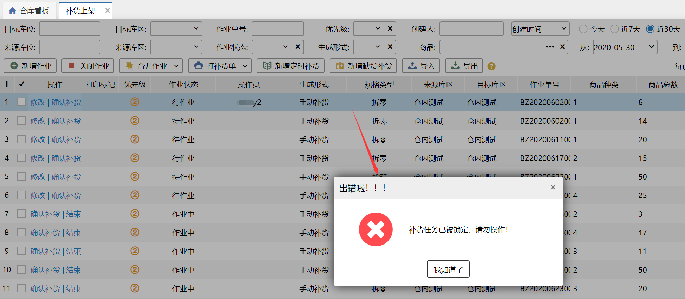
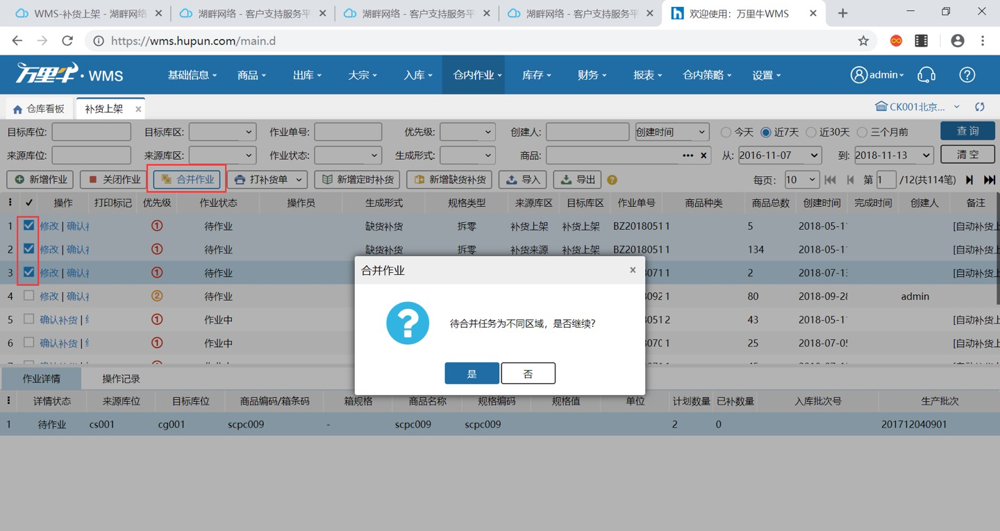
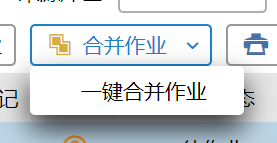
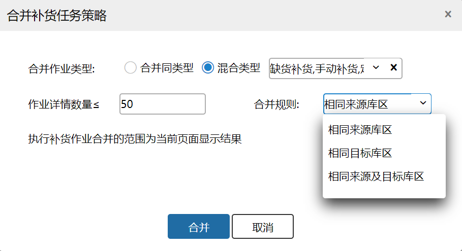

# 补货上架

当拣货库位商品库存不足时，则需要从存储库位将商品补充到该拣选库位上。

补货上架分为两种形式：自动新增补货上架单和手动新增补货上架单。

### **1. 手动补货上架**
##### **01.新增作业**
手动新增补货上架任务具体页面如下：

提示

1.来源库位只能选择存储库位，目标库位只能选择拣选库位；

2.补货的sku只能选择可用库存，冻结库存和锁定库存不能用来补货操作；

3.新增补货上架任务后该任务的状态自动变更为“待补货”，且可打印补货单；

4.同一个sku若目标库位有冻结库存，则来源库位向目标库位补货点击保存报错：目标库位有冻结库存，不能补货；

5.“待补货”状态的补货任务可以关闭作业，且相应的库位库存的锁定都会释放，但是关闭后不允许打印补货单。

##### **02.确认补货作业**
已存在补货任务，则可以进行确认补货的操作，具体操作如下：

**提示**

1.若补货任务都完成，则作业状态会变成"已完成"，且不允许打印补货单；

2.若已补货一部分但未完全补货，则作业状态会变成“补货中”，且允许打印补货单；

3.“补货中”的补货任务不允许关闭作业，只能“强制完成”；若点击“强制完成”，则状态变为"已完成"；

4.补货完成后可以在【库存】-【库位库存】页面查看最新的库存状况。

### **2. 定时补货**
自动补货上架是根据操作员在【仓库】-【库存预警】下设置库位上商品的上下限来生成的，若库位上实际库存小于预警下限则会自动生成补货上架的任务，提醒操作员进入补货操作。

自动补货上架生成要点

1.触发条件：预警下限≥库区拣选库位+待补货任务，定时生成任务。

2.来源库位必须为存储库位，本库区内的优先获取。如果本库区不够，则找编码相近的库区获取，但是只寻找本区域下的库区(跨区域的不作为来源)。

3.库区补货数量=预警上限-当前库区剩余可用-待补货任务

4.补货上架任务生成影响因素：

1）商品的总体积不能大于库位的体积；

2）商品的总重量不能大于库位的限重；

3）库位中优先补优先级高的商品（可在【基础信息】-【库位库存】中设置库位的优先商品）；

5.手动新增定时补货：仓内策略-业务配置关闭补货上架自动生成补货任务时，可以手动生成定时补货任务，且支持配置补货项，补货逻辑和自动补货一致。

### **3. 缺货补货**
**1.补多少：**锁定失败的订单中商品锁定失败数量和该商品库区预警上限对比。哪个大取哪个。若订单商品锁定失败数量大，补货数量=订单锁定失败商品数量-该商品拣选库位可用数量-该商品的补货在途数量；若预警上限大，补货数量=预警上限-该商品拣选库位可用数量-该商品的补货在途数量。

**2.什么时候补：**a.订单归属波次，波次策略跑批触发锁定，发现订单锁定失败，触发补货 b.订单归属零拣，零拣批处理跑批触发锁定，发现订单锁定失败，触发补货

**3.补到哪里（找目标库位）：**

1）先查询全仓是否有库位设置了缺货商品为优先商品，倘若有，定位该库位。倘若无，走下一步；

2）查询全仓有这个商品库存的拣选库位，倘若有，定位该存储库位所在库区下有这个商品库存的拣选库位。倘若无，走下一步；

3）查询全仓该商品历史存在过的拣选库位，倘若有，定位该存储库位所在库区下有历史存在过的拣选库位。倘若无，走下一步；

4）查询全仓存储库位有缺货商品存在的库位，定位该存储库位所在库区的空拣选库位，倘若无，无法补货。

**4.从哪里补（找来源）：**

1）从目标库位所在库区的存储库位找，找不到走下一步；

2）目标库位所在区域库区编码从小到大依次找存储库位有库存的，再找不到走下一步；

3）目标库位所在区域相邻区域的库区找存储库位有库存的，相邻的找不到再找次相邻的，直到找遍所有区域下的存储库位。

5.手动新增缺货补货：仓内策略-业务配置关闭补货上架自动生成补货任务时，可以手动生成定时补货任务，且支持配置补货项，补货逻辑和自动补货一致。

6.指定锁定范围失败也生成任务：手动截单、清仓波次、手工波次指定库区锁定失败后按照指定库区补货。

### **4. 补货配置完结**
当业务配置中开启了允许补货自动完结，补货任务部分完成后，任务状态将直接变成已完成，不能再次作业，之前未补的数量依旧视为未补。

### **5. 修改补货任务**
未作业过且没有在作业中的补货任务，可以进行修改。

具体操作页面如下：

1.可以将原来作业的数量、商品、库位全部进行修改

2.修改限制和新增补货任务一致：同一作业只能包含拆零或者按箱明细、目标库位只能为拣选库位、一个任务不能包含多个货主的sku

3.修改被操作员领取的作业会报错提示不能修改

4.已经作业过的补货任务无修改按钮

5.修改后点击保存，任务的生成形式将变为手动补货，任务明细将变成修改后的

### **6. 合并补货任务**
建议使用方式：将同来源库区的补货任务合并，这样取货时就可以一次性将同一来源的货物取完。

合并任务限制：和新增任务限制一致，只能合并同类型的任务，比如：拆零任务只能和拆零任务合并，货箱任务只能和货箱任务合并。

当合并的任务来源为不同的库区时，会有提醒。

合并后相同的明细会合并，数量累加。

### **7. 一键合并补货任务**
 

**策略解释：**

1.一键合并作业范围：取当前查询结果下所有待作业且未被操作员领取的任务明细进行合并。

2.合并作业类型：即合并补货任务的范围；

1)合并同类型：合并任务时，生成形式相同的会进行合并；例：待作业的补货任务有：任务01-缺货补货，任务02-定时补货，任务03-缺货补货、任务04-定时补货，一键合并作业类型选择合并同类型，任务01和任务03合并，任务02和任务04合并。

2）混合类型：合并任务时根据勾选的作业类型进行合并，操作如下图：

例1：合并作业类型选择混合类型，勾选了缺货补货，待作业的补货任务有：任务01-缺货补货，任务02-定时补货，任务03-缺货补货、任务04-定时补货，一键合并作业时，只取任务01、任务03进行合并；

例2：合并作业类型选择混合类型，勾选了缺货补货、定时补货，待作业的补货任务有：任务01-缺货补货，任务02-定时补货，任务03-缺货补货、任务04-定时补货，一键合并作业时，取任务01、任务02、任务03、任务04进行合并。

3.作业详情数量：合并生成新的补货任务的详情数量。

4.合并规则：合并补货任务的依据。

1）相同来源库区：来源库区相同的补货任务合并到一个任务中；例：补货任务01：商品a 来源库区A、商品b 来源库区B、商品c 来源库区C  补货任务02：商品d 来源库区A、商品e 来源库区C，一键合并作业生成3个补货任务：任务1：商品a 来源库区A、商品d 来源库区A；任务2：商品b 来源库区B；任务3：商品c 来源库区C、商品e 来源库区C.

2）相同目标库区：目标库位所在的库区相同的补货任务合并到一个任务中；

3）相同来源库区及目标库区：来源库区、目标库区相同的补货任务才会合并到一个任务中。

**注意：**

1. 同商品来源库位、目标库位相同的补货明细会合并成1条；

2.一键合并任务时，拆零的与拆零的合并，箱子与箱子的合并；

3.一键合并任务生成时，补货任务无法在pda领取。

5.生成补货任务排序：再满足设置的合并规则的情况下，根据明细的来源、目标和商品编码进行排序；

1）合并规则为相同来源库区，排序为：目标区域编码>目标库区编码>来源库位编码>目标库位编码>商品编码

2)合并规则为相同来目标库区，排序为：来源区域编码>来源库区编码>来源库位编码>目标库位编码>商品编码

3）合并规则为相同来源及目标库区，排序为：来源库位编码>目标库位编码>商品编码

### 8.导出
除“已关闭”状态的补货任务都支持导出。

> 更新: 2026-06-30 10:36:27  
> 原文: <https://hupun.yuque.com/unzko7/lsbfg0/cxslvg2t8bb5z6lc>