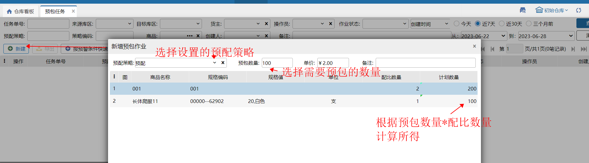
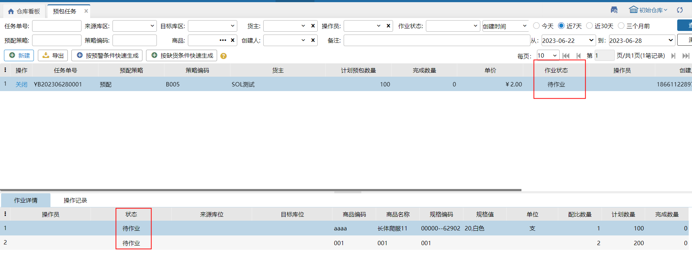
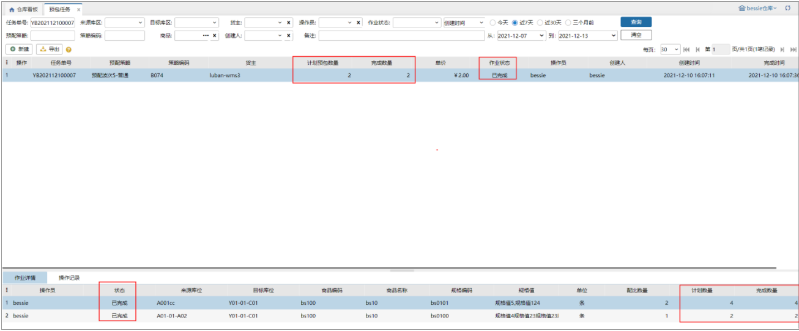
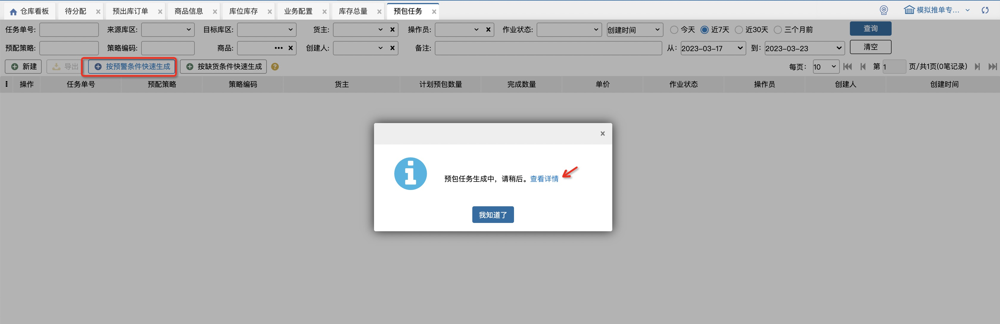

# 预包任务

预包任务适用于以预包为主的仓库，根据子商品配比数量和计划预包数量计算预打包数量，并支持单独统计预包绩效。

### 1.新建任务
先在PC上新建预包任务单，具体步骤如下：

其中：

(1)预配策略：是本仓的预配策略，包括启用和停用的，排除了包含序列号商品、生产批次商品和入库批次商品的策略

(2)预包数量：即预打包数量

(3)单价：指完成每个成品的预包费用，用于计算预包绩效，记录在波次策略上，下次新建任务时，选择同一波次策略会自动带出单价

(4)商品明细：是所选预配策略中指定的商品规格，配比数量是策略中的商品数量(不会约分)，计划数量=预包数量*配比数量

### 2.任务状态
创建任务单后，生成一个[待作业]预包任务显示如下：

预包任务的操作在PDA上进行(具体操作参考PDA-预包任务)，提交后在PC上同步更新数据。

如下图是任务[全部完成]的状态：

预包任务的操作在PDA上进行(具体操作参考PDA-预包任务)，提交后在PC上同步更新数据。

如下图是任务[全部完成]的状态：

其中：

(1)任务单据层级的完成数量≥成品数量

(2)作业详情中的完成数量=PDA上提交的数量≥计划数量

(3)来源库位=PDA上子商品的锁定库位；目标库位=成品的指定库位

(4)操作员=在PDA上提交作业的操作员

(5)按照成品数量计算预包绩效，并记录在绩效明细报表和绩效统计报表中

(6)库位流水记录预包作业发生的库存变化情况，可查看预包作业单据详情

如下图是任务[部分完成]的状态：

其中：

(1)任务单据层级的完成数量<成品数量

(2)作业详情中的完成数量<计划数量时会自动拆分成2条明细，已完成明细的完成数量=PDA上提交的数量，待作业明细的计划数量=原计划数量-已完成数量

(3)来源库位=PDA上子商品的锁定库位；目标库位=成品的指定库位

(4)作业详情上的操作员=在PDA上提交作业的操作员；任务单据层级的操作员=最后一次提交并完成任务的操作员

(5)按照成品数量计算预包绩效，并记录在绩效明细报表和绩效统计报表中

(6)库位流水记录预包作业发生的库存变化情况，可查看预包作业单据详情

### 3.关闭任务单
仅待作业的任务单允许关闭。

### 4.导出任务单
除“已关闭”状态的任务都支持导出。

### 5.按预警条件快速生成
点击后按预警上下限生成预包任务，点击可查看详情：

**生成预包任务时计划预包数量计算方式：计划预包数量=预包上限（无预包上限时取预包下限）-预计可用库存(套）-待作业预包任务计划预包数量   **

**注：上述计算方式中涉及的参数可参考**[**预包预警**](https://hupun.yuque.com/unzko7/lsbfg0/uzz9ntco9acin5i1)**页面对应的预配策略数据**

若是停用的预配策略，不生成预包任务；

若无预包上下限，不生成预包任务；

若计划预包数≤0时，不生成预包任务；

若预计可用库存(套)+待作业预包任务计划预包数量 ≥  预包下限，不生成预包任务；

若计划预包数>0且对应预配策略无待作业的预包任务，则生成新的预包任务，**计划预包数量=计算出的计划预包数**

若计划预包数>0且对应预配策略有待作业的预包任务，则选择其中1个预包任务叠加计划预包数量，**叠加数量=计算出的计划预包数**

### 6.按缺货条件快速生成
点击后按缺货数量生成预包任务，点击可查看详情：

**生成预包任务时计划预包数量计算方式：计划预包数量=缺货组合数/预包上限（取较大值）-预计可用库存(套）-待作业预包任务计划预包数量   **

**注：****上述计算方式中涉及的参数可参考**[**预包预警**](https://hupun.kf5.com/hc/kb/article/1602389/)**页面对应的预配策略数据，缺货组合数=[待分配+波次打单环节]所有预配波次订单数-对应预配策略指定库位可用库存数（若为负数则取0）** 

若计划预包数≤0时，不生成预包任务；

若计划预包数>0且对应预配策略无待作业的预包任务，则生成新的预包任务，**计划预包数量=计算出的计划预包数**

若计划预包数>0且对应预配策略有待作业的预包任务，则选择其中1个预包任务叠加计划预包数量，**叠加数量=计算出的计划预包数**

> 更新: 2025-12-12 15:52:47  
> 原文: <https://hupun.yuque.com/unzko7/lsbfg0/no31nnkdg27w3g9i>