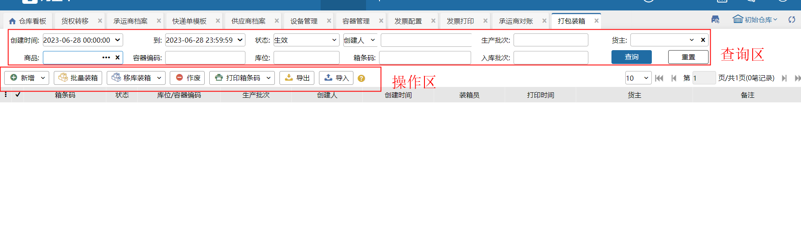
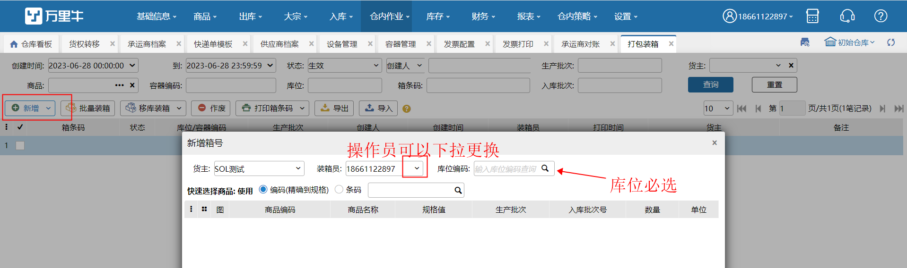
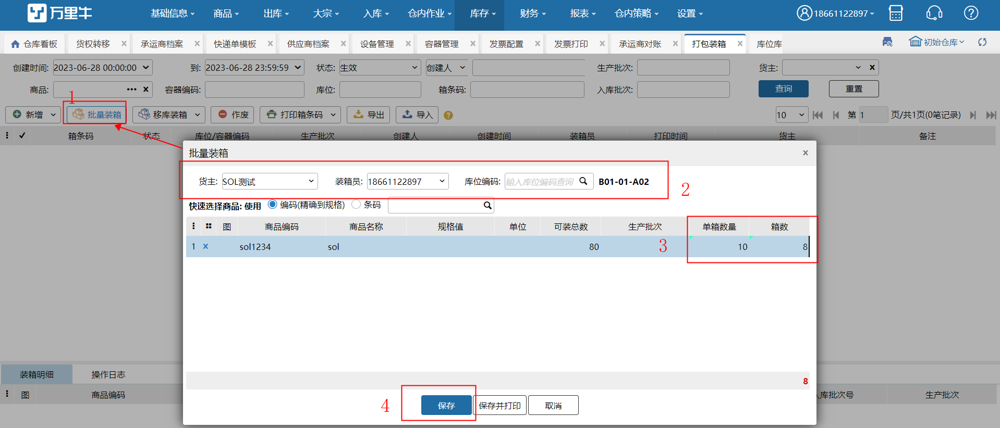
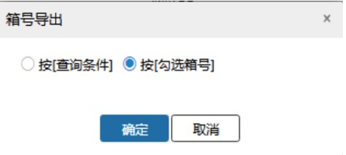

# 打包装箱

打包装箱，是指将仓库内货品进行装箱存放。

### 1.操作界面
查询区可根据不同筛选条件进行查询，创建时间默认为当日。

### 2.新增装箱
1、点击新增按钮，确认好货主、装箱作业员后选择待作业的库位。

2、输入需要装箱的商品明细

3、点击保存

**提示**

**1.装箱作业的库位不支持【拣选库位】和【预配库位】**

**2.业务配置开启生产批次标准模式，装箱商品不支持生产批次商品。**

### 3.批量装箱
批量装箱是指将相同的商品按照固定的数量进行装箱操作。

点击批量装箱选择需装箱商品，输入单箱数量后系统自动计算箱数。

**提示**

1、可装总数如不能被单箱数量整出则余数也装一箱

2、批量装箱中添加多个商品，系统不做混装操作。

### 4.作废、打印箱号
1、勾选待操作明细，可进行该箱的作废操作，箱号作废后该箱内商品数量释放可装总数增加

2、勾选指定箱可进行箱号的打印。

### 5.导出及导入
导出支持指定箱明细导出和查询结果导出，导入时按导入模板进行填写，成功后系统完成装箱操作

 

商品入库后放置一个大货拣货库位进行暂存，优先发一部分货之后进行往相应的库位之中进行上架 装箱操作因此新增移库装箱模块；

### 6.移库装箱
录入移库来源库位和装箱目标库位后，选择进行移库装箱的商品、数量后，点击保存，完成移库装箱

**提示：**

1. 移库来源库位必填且不能为次品库位

2.选择商品范围为来源库位可用库存>0的商品

3. 装箱目标库位必填且不能为拣选、预配、次品库位；

4.来源库位与目标库位不能相同；

5.移库装箱成功后库存移动页面自动新增一条移库记录；

6.移库装箱完成后，会记录来源库位、目标库位。                  

### 7.批量移库装箱
批量移库装箱是指将相同的商品按照固定的数量进行移库装箱操作。

点击批量移库装箱选择需装箱商品，输入单箱数量后系统自动计算箱数。

> 更新: 2023-12-21 17:44:35  
> 原文: <https://hupun.yuque.com/unzko7/lsbfg0/dcwwguxi6he1fnis>