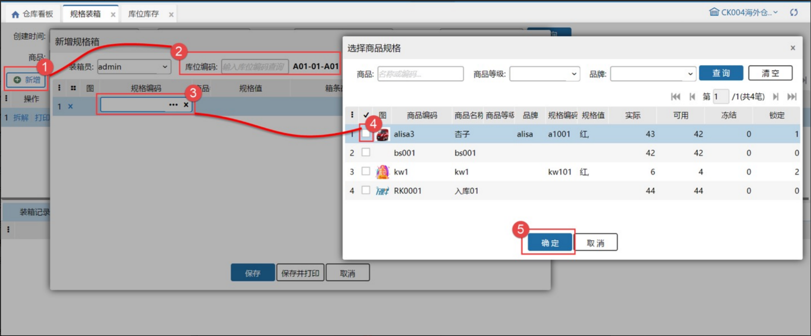
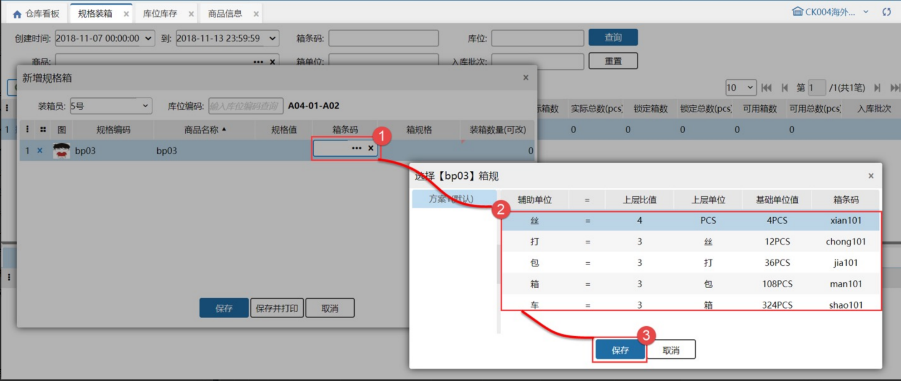
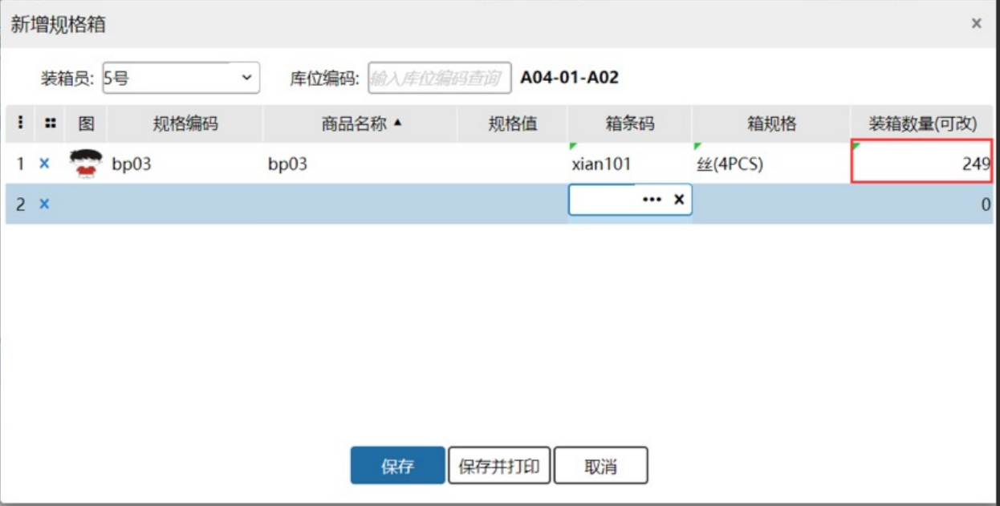
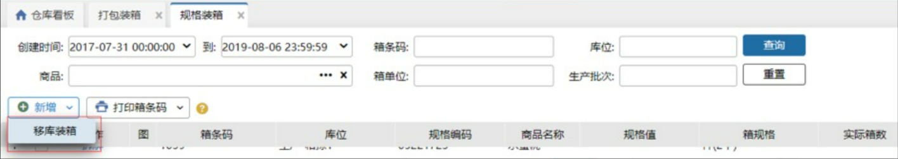
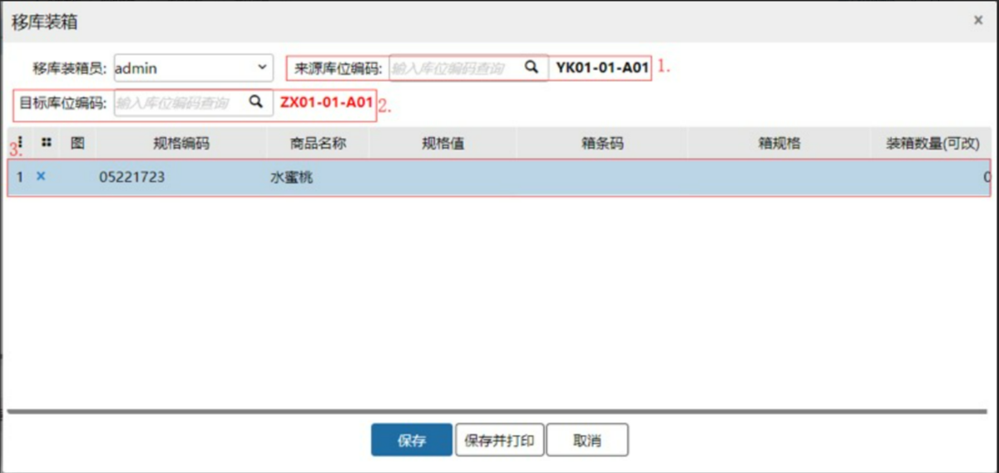
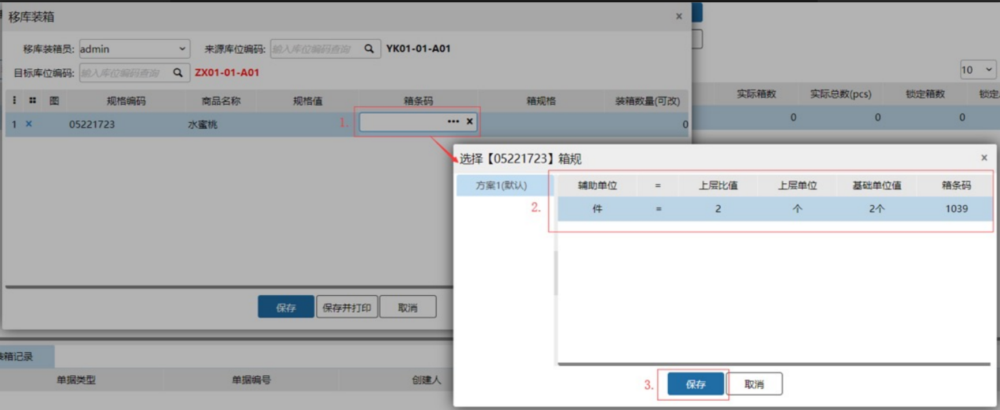
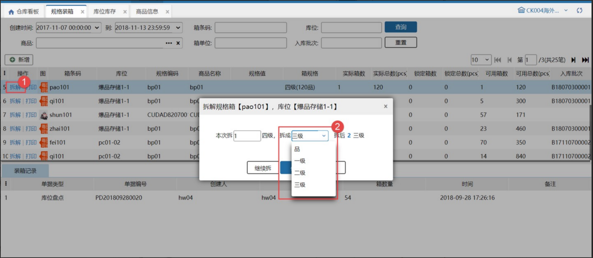
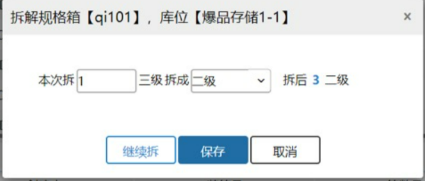

# 规格装箱

提示：该功能开启需要在业务配置-其他配置-开启商品多单位。

名词解释：这个功能是对规格箱进行装箱和拆解。规格箱即根据系统设置的箱规则装的箱子。箱规则设置见商品信息页面。

### 1.规格装箱
先点击新增，再扫描库位编码，最后选择库位下有库存的且设置了箱规则的商品。

选择商品后，选择商品的箱条码，可选对应方案的对应层级的箱条码。

选中后，系统会根据可用库存/箱条码对应的基础商品个数，计算最多可装箱子数。可以修改装箱数量，保存后，库位库存就会对应的箱子。

例如：库存可用有999个，选择规格箱的规格为：1箱4个商品，计算出来最多可装箱子数量：999/4取整数为249个箱子。

**注：生产批次商品不支持规格装箱。**

### 2.移库装箱
先点击移库装箱，再选择移库来源库位编码、装箱目标库位编码最后选择库位下有库存的且设置了箱规则的商品。

选择商品后，选择商品的箱条码，可选对应方案的对应层级的箱条码。

选中后，系统会根据可用库存/箱条码对应的基础商品个数，计算最多可装箱子数。可以修改装箱数量，保存后，库位库存就会对应的箱子。

例如：库存可用有99个，选择规格箱的规格为：1箱2个商品，计算出来最多可装箱子数量：99/2取整数为49个箱子。

**提示：**

1. 移库来源库位必填且不能为次品库位

2. 选择商品范围为来源库位可用库存>0的商品

3.装箱目标库位必填且不能为拣选、预配、次品库位；

4.来源库位与目标库位不能相同；

5.移库装箱成功后库存移动页面自动新增一条移库记录；

6.移库装箱完成后，会记录来源库位、目标库位。               

### 3.拆解箱子
这个功能可以把大箱子拆成小箱子，或者把箱子直接拆成拆零库存。

点击箱子旁边的拆解，弹出框中可填写本次拆的箱子数量，本次拆的箱子数量不能大于箱子的可用数量。也可选择将要拆成哪个层级的箱子，可跨层级拆。

选中箱子对应层级后并填写要拆的箱子数量后，系统会自动计算出拆后对应箱子数量。

继续拆的意思是拆完这个4级的箱子，可继续拆3级的箱子。

保存的意思是只拆当前的箱子，不继续拆了。

点击继续拆的效果：四级箱子拆成三级箱子后，页面显示拆分三级箱子的配置。

### 4.打印
点击打印可以打印对应规格箱的箱条码。

> 更新: 2023-12-21 17:44:58  
> 原文: <https://hupun.yuque.com/unzko7/lsbfg0/pfel68wc5e56mgnt>