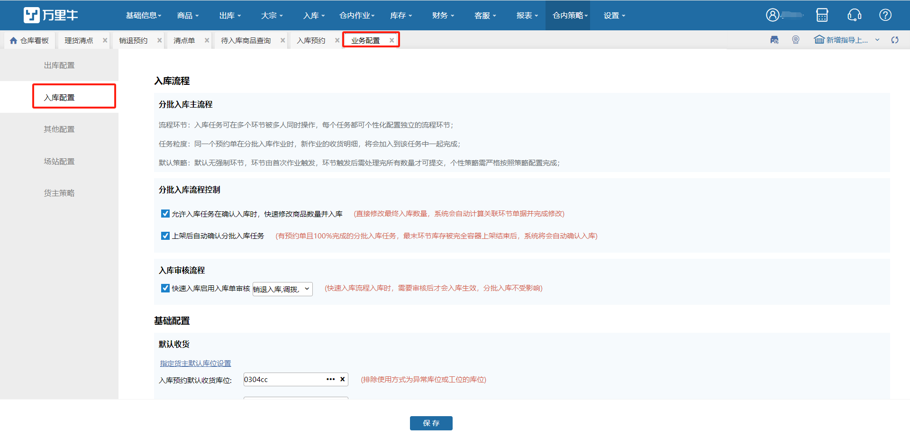
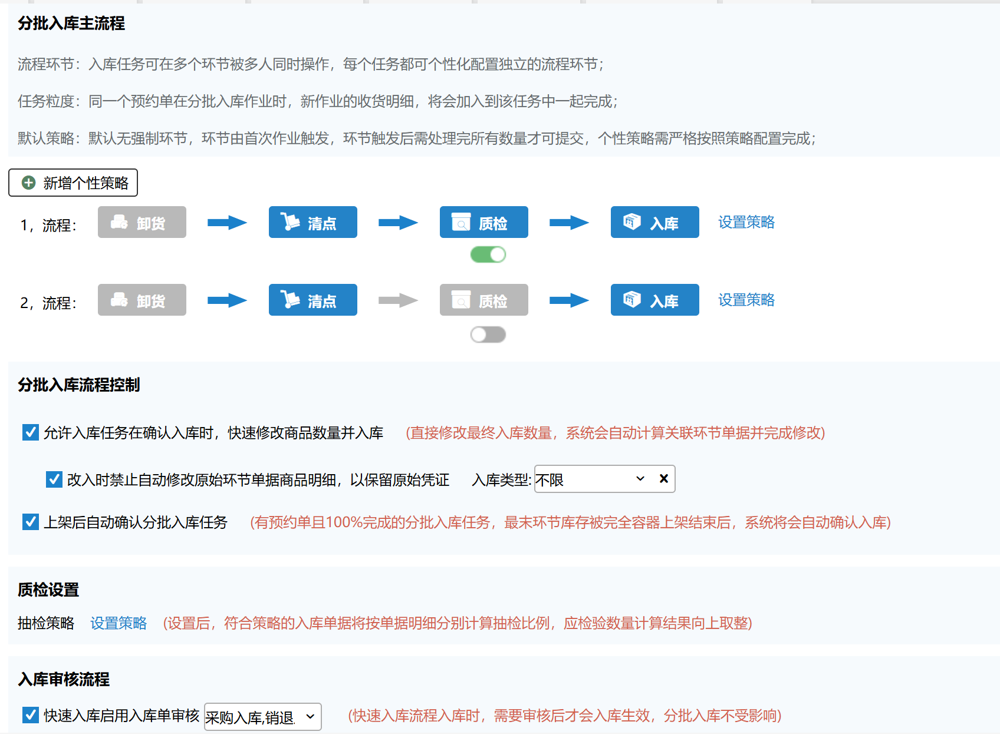
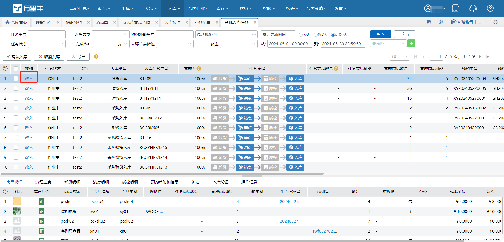
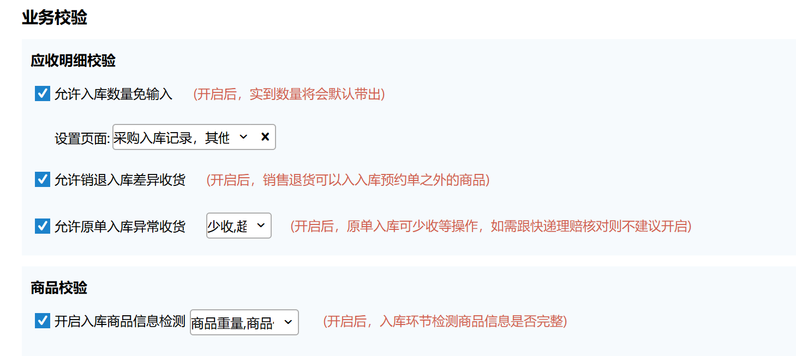
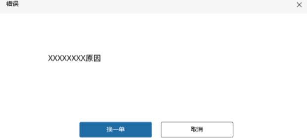

# 业务配置-入库配置

#### 1.入库流程

1.允许入库任务在确认入库时，快速修改商品数量并入库：开启则分批入库任务页面显示改入按钮，允许确认入库前操作修改单据数据。

2.改入时禁止自动修改原始环节单据商品明细，以保留原始凭证：开启后指定入库类型的分批入库任务在改入完成后，保留其关联原始单据（清点单、质检单等）的明细及数量。

3.上架后自动确认分批入库任务：开启后，已100%进度的预约单分批入库任务，最末尾环节全部操作完容器上架后，单据将自动提交入库。（菜单：PDA-容器上架）

4.快速入库启用入库单审核：开启后，在采购、其他、销退入库单页面操作提交单据后，生成待审核单据，需审核后方可入库。

注：开启新版审核后台开关后，此配置置灰不可编辑。

5.上传码上放心单据入库前查询外箱码自动填写关联序列号：开启后，上传码上放心入库单不强制外箱码填写序列号，填写入库后自动向码上放心平台查询补入。

显示前提：当前仓在码上放心[对接配置](https://hupun.yuque.com/unzko7/lsbfg0/gpgz776pazg6t2mx#l2ZFi)指定仓库范围内。

开启配置后，启用外箱批量录入的序列号商品，在新增入库单时支持外箱码批量录入，序列号数量与明细数量独立，无需保持一致。新增入库单后，生成对应溯源上传记录，上传外箱码到码上放心平台并将查询序列号结果回填到明细上，溯源上传记录变成【已完成】状态，在序列号外箱码维护页面页面查看对应数据记录。

提示：

①溯源上传记录未完成时，对应入库单不允许确认审核；

②确认入库时，序列号数量要求和明细数量保持一致；

③生成溯源上传记录后定时执行上传和查询，若出现失败的情况，最多自动执行5次后不再执行。

#### 2.基础配置

1.默认收货库位设置、库位指导范围：有不同货主要依照货主维度设置收货库位的，点击按钮进行配置。

不考虑货主条件可统一设置入库时收货库位。

2.指导库位范围：入库和销退支持独立配置。

全仓：全仓库下指导。

首个区域：全仓编码最小的区域内指导。

默认收货库位所在区域：

      单货主：已配置默认收货库位，在默认收货库位所在区域内指导；未配置则在首个区域内指导。

      多货主：指定货主已配置收货库位，按指定货主收货库位所在区域内指导；指定货主未配置收货库位，看兜底是否配置收货库位。配置，则在兜底收货库位所在区域内指导；未配置，则在全首个区域内指导。

指定：在所选区域/库区内指导。

3.开启入库使用容器：开启后操作入库相关业务时，可入容器。

4.开启入库单号解析：配置后，指定页面扫描单号后会根据配置的规则截取单号然后匹配订单。

解析规则：

指定字符截取：单号已指定字符截取后的结果进行匹配。

从后往前按位数截取：忽略单号从后往前X位的结果进行匹配。

从前往后按位数截取：忽略单号从前往后X位的结果进行匹配。

注：配置规则后，扫订单原运单号可正常匹配。

       若单号位数不够规则设置的截取位数，则不截取。

#### 3.业务校验

1.入库数量免输入：开启后操作入库业务时，勾选的页面支持自动带出预约数量。

2.允许销退入库差异收货：开启后，销售退货预约单可入入库预约单之外的商品。

3.允许原单入库异常收货：开启后，原单入库支持少收、超收和操作次品入库。

4.开启入库商品信息检测：开启后，入库环节提交单据时检测商品信息是否完整，不符合则报错提示且不允许提交单据。

#### 4.业务拓展

1.换单出库

a).开启开关后，指定页面显示换单发货按钮；开启按钮后，入库提交成功后触发换单发货。

注：此功能和入库入容器互斥，开启后不可入库入容器内，反之则不可开启换单发货按钮。

选择多个预约单时不支持换单发货。

b).弹窗换单发货：支持修改承运商、申请运单号。

提交发货成功则替换订单从待分配提交到待出库，入库单库存扣减。

提交发货失败则报错，点击换一单则弹窗重新查询替换订单，继续进行发货操作。

> 更新: 2025-12-12 15:56:28  
> 原文: <https://hupun.yuque.com/unzko7/lsbfg0/og8p6qb1admghbhe>