# 业务配置-其他配置

### 一、系统配置
#### 1、PDA商品信息展示样式
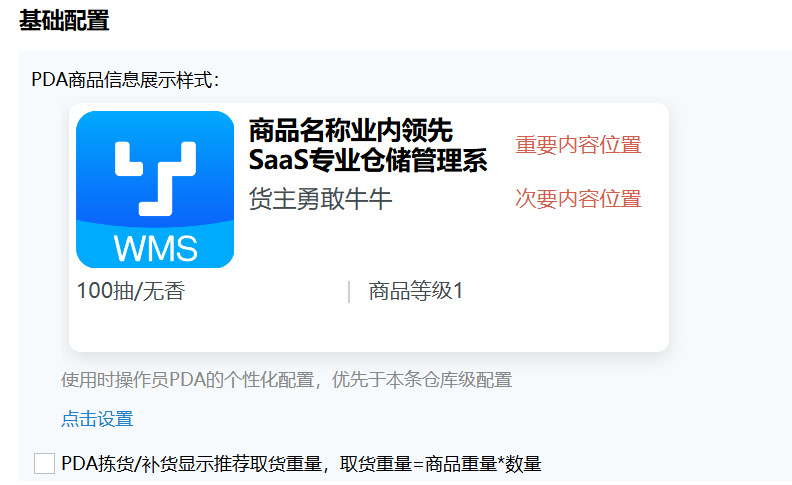

显示仓库级别的PDA商品信息样式

【点击设置】可以对商品卡片样式进行编辑

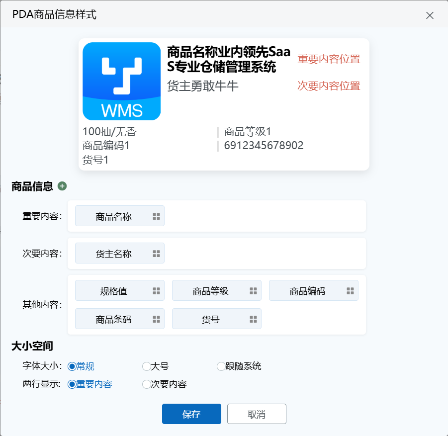

重要内容/次要内容必选一项，其他内容可为空，重要内容、次要内容、其他内容不可重复

#### 2、系统单据编号生成规则
支持自定义波次编号/入库任务单号生成规则，修改后会按照新规则生成波次号/入库任务单号。

波次生成规则组成部分含义如下：

       单据：波次；

       前缀：新增规则时默认系统波次类别(预配/普通波次--BC，清仓波次--QC，手工波次--BS)，支持自定义，支持8位数字/英文；

       业务信息：新增规则时默认无，下拉可选“波次编码”，即波次策略对应的策略编码；

       日期(YYMMDD)：新增规则时默认无，下拉可选“有”，即生成波次号包含YYMMDD格式的日期信息；

       流水号位数(超出自动升位)：新增规则时默认“3位”，下拉可选“1位/5位”，即生成波次号最后有1/3/5位流水号，每次新生成的流水号在之前基础上累加，超出位数则自动升位。（例：设置位数为3位，现有波次号...、xxx998、xxx999，则后续生成波次号xxx1000、...。）

入库任务单号生成规则组成部分含义如下：

       单据：入库任务单号；

       前缀：新增规则时默认系统任务类别；

       业务信息：新增规则时默认无，下拉可选“入库类型”；

       日期(YYMMDD)：新增规则时默认无，下拉可选“有”，即生成入库任务单号包含YYMMDD格式的日期信息；

       流水号位数(超出自动升位)：同波次规则。

注： (1)此配置关联公司级后台开关，开启后页面上显示对应配置项，未开启则不显示；

        (2)现有用户后台开关默认关闭，新注册用户默认开启；

        (3)现有客户现有仓库默认规则为空，按现有规则生成；

        (4)每个仓库只支持2条规则。

#### 3、系统单据主体自定义字段设置
开启后可针对指定单据主体设置自定义字段。

点击设置，进入自定义字段设置弹窗，填写类型有三种：文本、预设值、日期选择。

填写类型不同，预设值、默认显示值输入格式不同。填写类型为【预设值】时，必须录入预设值。

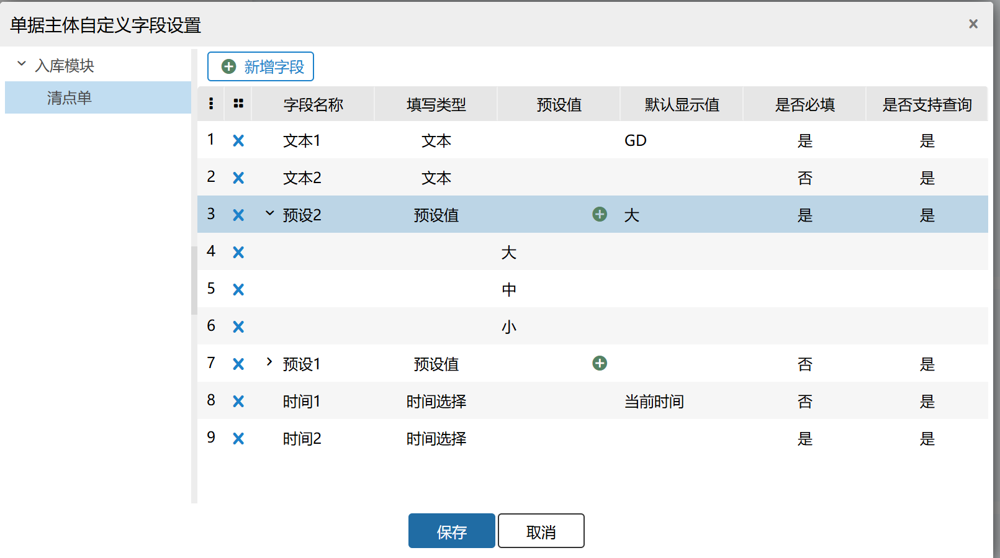

注：字段名称不允许重复，最多10个；

预设值之间不允许重复；

类型为【文本/时间选择】时，预设值为空；

类型为【预设值】时，预设值至少填一个，最多50个；

默认显示值设置后，在对应页面会默认显示该值；

设置字段【是】必填时，在对应页面有必填校验；

设置字段【是】支持查询时，在对应单据列表页面有查询项。

支持自定义字段的页面包括：清点单/收货台账、理货清点（PC）、理货清点。以PC-[理货清点](https://hupun.yuque.com/unzko7/lsbfg0/sv93htr5q3s2328n#oPVBn)为例进行说明，详见对应页面操作手册。

#### 4、系统单据明细自定义字段设置
开启后可针对指定单据明细设置自定义字段。

点击设置，进入自定义字段设置弹窗，填写类型有三种：文本、预设值、日期选择。

填写类型不同，预设值、默认显示值输入格式不同。填写类型为【预设值】时，必须录入预设值。

注：字段名称不允许重复，最多10个；

预设值之间不允许重复；

类型为【文本/时间选择】时，预设值为空；

类型为【预设值】时，预设值至少填一个，最多50个；

默认显示值设置后，在对应页面会默认显示该值；

设置字段【是】必填时，在对应页面有必填校验。

支持自定义字段的页面包括：清点单/收货台账、理货清点（PC）、理货清点。以PC-理货清点-无预约清点为例进行说明，详见对应页面操作手册。

#### 5、开启集合码便捷录入
开启后可扫描集合码，识别商品、批次等多个信息，用一次以完成验货核对、信息录入等多步骤操作。

开启此开关后，需要先按需求设置好解析规则并保存，在操作过程中，扫描集合码会按照规则解析出商品条码、批次信息等并进行匹配。当前支持扫集合码便捷录入的页面包括PC条码验货、PDA快速上架、PDA条码验货、PDA盘点任务、PC大宗装箱、PC分拣验货。

解析规则有两种：自定义规则、UDI预设规则，具体设置方法如下。

**①自定义规则**

以商品条码+生产批次号解析为例。点击设置解析规则，点击新增按钮-选择自定义规则，在弹窗中按需求填写数据：

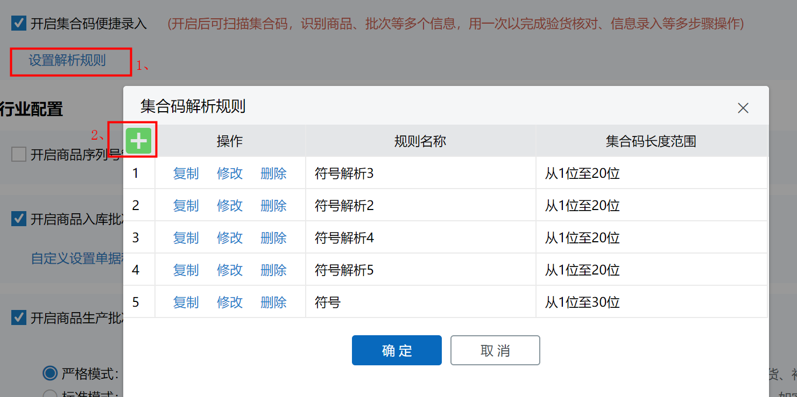

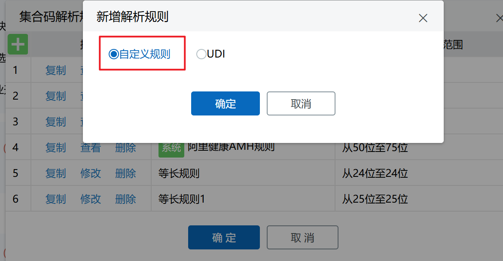

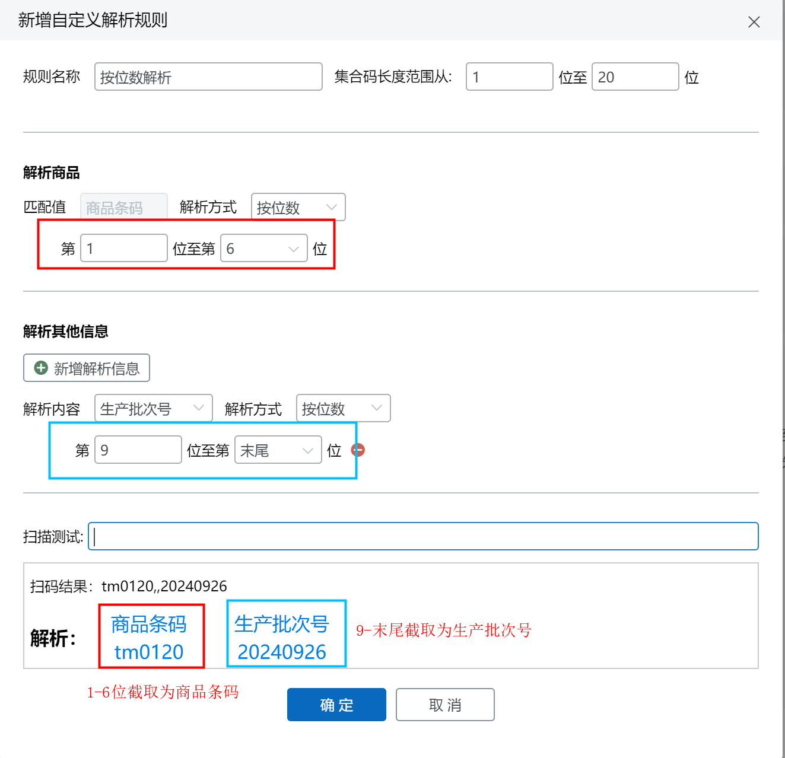

(1) 规则名称：不允许重复，必填，最多8个字；

(2) 集合码长度范围：用来匹配集合码长度，在设置范围内的集合码可以匹配到当前规则，不符合的则无法匹配，可以用长度来区分规则。下限1，上限128，必填；

(3) 解析商品：默认解析目标为商品条码，解析方式有按位数、按符号两种，必填。

按位数解析：按照设置的长度范围截取出对应位数的条码，作为商品条码进行匹配。如上图举例中，第1-6位条码被解析为商品条码；

按符号解析：按照设置的匹配规则截取出对应间隔符之间的信息，作为商品条码进行匹配

(4) 解析其他商品：目前仅支持匹配生产批次号，关联当前仓生产批次管理开关。若当前仓未开启生产批次管理开关，则下拉项无数据。解析方式分按位数、按符号两种，必填。

按位数解析：按照设置的长度范围截取出对应位数的条码，作为生产批次号进行匹配。如上图举例中，第9-末尾位条码被解析为生产批次号；

按符号解析：按照设置的匹配规则截取出对应间隔符之间的信息，作为生产批次号进行匹配

(5) 扫码测试：设置规则后，通过扫码测试工具来辅助判断当前规则是否符合需求。

**②UDI规则**

:::color3
应用场景：医疗器械行业要求对产品实行UDI（唯一器械标识）管理，不同生产企业使用不同的编码规则（如GS1带括号/不带括号、中关村MA、阿里健康AHM）。此前系统仅支持自定义集合码规则，配置复杂且难以覆盖多种标准。本功能在集合码规则中增加系统预设的UDI解码方案，支持GS1、MA、AHM等标准，可直接选用，无需手动配置。

:::

新增规则时选择UDI后，下拉选项包括：GS1规则扫码无括号、GS1规则扫码有括号、中关村MA规则、阿里健康AHM规则，至少选择1项，系统自动生成对应的解码规则（长度、截取方式等预设），高亮显示。

预设规则为系统级，不支持修改，但可点击查看详情和扫码测试。

保存后，在条码验货、大宗装箱等页面扫描UDI码时，系统按预设规则自动解析出商品条码、生产批次等信息。

注：

a.“开启集合码便捷录入”关联鲁班增值模块【集合码】，需开启增值模块后才会显示此开关；

b.“开启集合码便捷录入”与同批次多日期（后台开关）互斥，不允许同时开启；

c. 若集合码位数未匹配到任何一条规则，则最终无解析结果；若集合码位数匹配到其中一条规则，但解析不出商品条码、生产批次号等信息，则不会再去匹配其他规则，无解析结果。

d.在一个解析规则中，解析其他信息最多可以设置生产批次号、序列号两条规则，用于解析同时开启生产批次和序列号管理开关的商品信息。

### 二、行业配置
#### 1、开启商品序列号管理
开启后商品可以进行序列号管理，即商品出入库需要录入商品序列号。

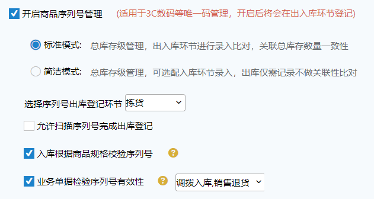

(1).标准模式：库存总量级管理，出入库必须登记序列号，且出库登记的序列号必须是库存总量中未锁定的。

(2).简洁模式：库存总量级管理，入库选择性录入，出库仅记录不需要与库存总量中的序列号关联。

(3).入库根据商品规格校验序列号：开启后入库将根据商品信息序列号前缀进行强制验证。该功能开启后，商品信息才显示系列号前缀选项。

(4).序列号出库登记为拣货、验货时，支持扫描序列号匹配对应商品并直接录入，开启则有效，未开启扫序列号不支持匹配。支持范围为PC和PDA两端的拣货、验货支持序列号商品的菜单。

(5).简洁模式下的入库登记序列号：开启开关，根据配置的单据类型，入库需要登记序列号；未开启开关或者未配置的单据类型，入库时无需登记序列号。

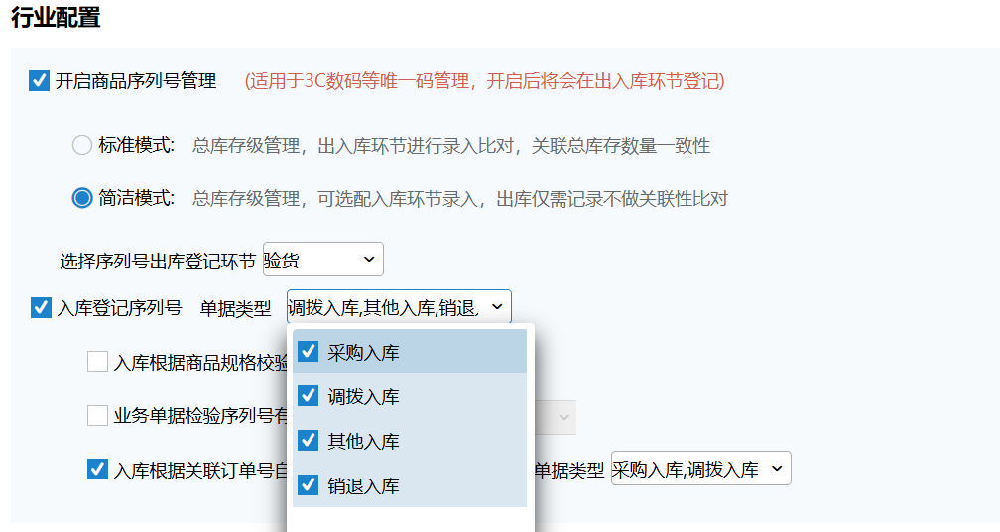

(6).业务单据检验序列号有效性：开启后销退入库、调拨入库、原单退回或采购退货入库根据原始单据检验序列号。（关联入库登记序列号-单据类型）

重要：仓库存在序列号商品库存时，开启关闭商品序列号管理，会进行风险验证，向仓库管理员发送验证码，验证通过后，清空仓内序列号商品的库存总量。

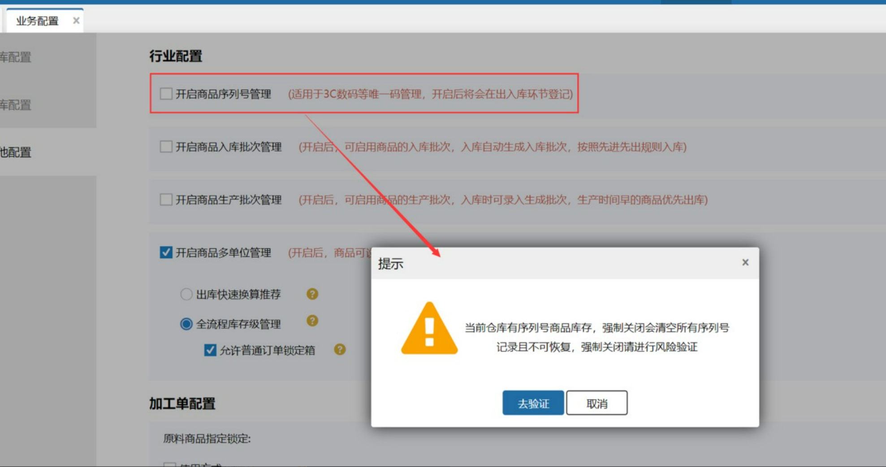

(7).模式互相切换

a.标准模式切换到简洁模式，若序列号商品有未关闭的单据，切换报错；若序列号商品都无单据，正常切换。

b.简洁模式切换到标准模式，若序列号商品有未关闭的单据，切换报错；若序列号商品都无单据，会进行风险验证，向仓库管理员发送验证码，验证通过后，清空仓内序列号商品的库存总量。

(8).入库根据关联订单号自动带出商品序列号

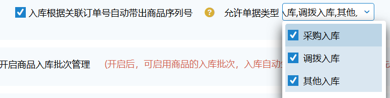

前置条件：公司开启医药增值模块

功能介绍：通过预约单中关联订单编号/原出库单号来匹配当前公司下的单据匹配成功后，则带出单据中序列号自动填充。

开启开关后，允许的单据类型会将匹配的出库单中的序列号信息自动带入到当前入库单明细对应的序列号商品内。

匹配并带入的条件：关联单据只匹配到一笔出库单，且出库单内的序列号商品和入库单中对应的序列号商品数量一致。

case1：入库预约单A，关联单据：XD202604130001，包含序列号商品A*4

出库单a：线上单号：XD202604130001，包含序列号商品A*4

出库单b：线上单号：XD202604130001，包含序列号商品A*5

结果：未匹配到出库单（匹配到多笔），序列号不自动带入

case2：入库预约单A，关联单据：XD202604130001，包含序列号商品A*4

出库单a：线上单号：XD202604130001，包含序列号商品A*5

结果：未匹配到出库单（序列号商品不一致），序列号不自动带入

case3：入库预约单A，关联单据：XD202604130001，包含序列号商品A*4

出库单a：线上单号：XD202604130001，包含序列号商品A*4（sn01、sn02、sn03、sn04）

结果：匹配到出库单a，选择入库预约单A进行入库时，序列号商品A自动带入序列号sn01、sn02、sn03、sn04

#### 2、开启商品入库批次管理
开启后启用商品批次号管理，入库则自动生成批次号，按照先进先出规则出库。

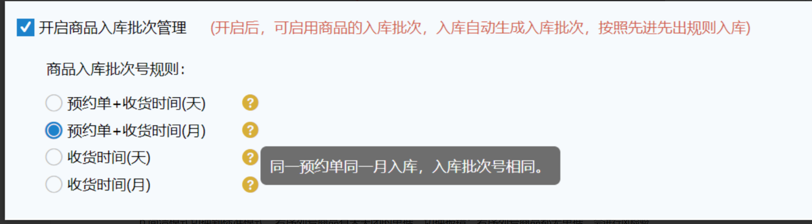

开启后需设置商品批次号生成规则，

预约单+收货时间（天）：同一预约单，同一天入库，入库批次号相同

预约单+收货时间（月）：同一预约单，同一自然月入库，入库批次号相同

收货时间（天）：同一天入库，入库批次号相同

收货时间（月）：同一自然月入库，入库批次号相同

#### 3、开启商品生产批次管理
开启后可启用商品的生成批次，入库时可录入生产批次，生产时间早的优先出库。

##### 3.1 严格模式
库位库存级别管理，出入库、仓内移动、补货等操作都需要记录批次，系统指示取具体某个批次，能自动实现拣货、补货等先到期先出。

①. 开启后可选择拣货库位(拣选库位/箱拣选库位)是否允许同一商品的不同生产批次混放。

②.开启后可选择相应验货环节核对生产批次号，包括PC端和PDA端的条码验货、分拣验货、播种验货/独立播种、抽检验货，有两种核对模式：

    手动选择核对：验货商品存在多个批次时需手动选择对应批次完成核对，仅一个批次时无需选择

    扫描批次号核对：验货商品每个批次都需扫描批次号进行核对

        例：波次中有2个订单，订单1 明细a 锁定批次01 数量2、批次02 数量2，明细b 锁定批次03 数量2；订单2 明细a 锁定批次02 数量4，明细b 锁定批次03 数量2

        手动选择核对模式：验货页面扫描订单1明细a后，会弹出生产批次选择框，支持录入数量，扫描订单1明细b、订单2明细a、明细b时不会弹出生产批次选择框

        扫描批次号核对模式：验货页面扫描订单每个明细都会弹出生产批次选择框，不支持录入数量，支持回车或双击选中批次号

③.批次收发策略，点击设置，可分别设置禁收规则和禁售规则 

**禁收规则**

可设置指定货主+单据类型在针对生产批次商品入库时，按照指定的时间范围进行禁收校验。

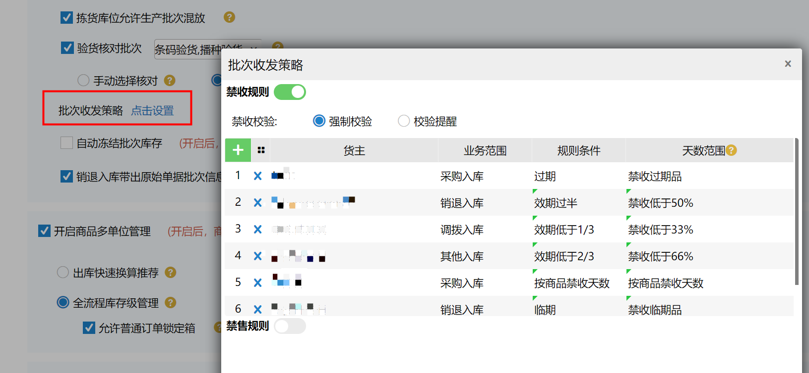

禁收校验包含两种：强制校验、校验提醒。

其中，强制校验不允许有禁收范围内的批次商品提交入库，在录入或提交时会进行强制校验；校验提醒允许有禁收范围内的批次商品提交入库，在录入或提交时有弱提醒。

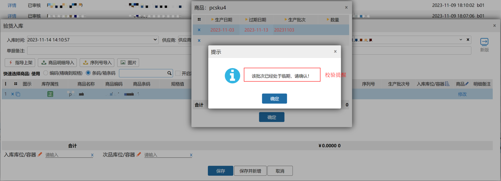

在规则设置中，货主为授权本仓且启用中的，若所有货主要设置相同规则，则可选择所有货主； 

业务范围共采购入库、销退入库、调拨入库、其他入库四种，用户可按需选择对应单据类型；

规则条件共效期过半、效期低于1/3、效期低于2/3、临期、过期、按商品禁收天数、自定义共七种，自定义可按百分比或天数设置。

注：

既有指定货主、又选择了所有货主时，优先按照指定货主规则进行校验。

相同货主+相同业务范围不允许重复。

例：指定货主a-采购入库-效期过半-禁收低于50%：假如商品保质期为100天，效期过半禁收50%表示该商品剩余有效期低于50天时为禁收。

货主a采购入库单包含生产批次商品，在入库时录入或提交时剩余有效期过半的批次号，在保存时会弹窗提示有异常批次，请确认后再进行后续操作。

指定货主b-销退入库-效期低于1/3-禁收低于33%：货主b销退入库单包含生产批次商品，在入库时录入或提交时剩余有效期低于33%的批次号，在保存时会弹窗提示有异常批次。

指定货主c-调拨入库-效期低于2/3-禁收低于66%：货主c调拨入库单包含生产批次商品，在入库时录入或提交时剩余有效期低于66%的批次号，在保存时会弹窗提示有异常批次。

指定货主d-其他入库-临期-禁收临期品：货主d其他入库单包含生产批次商品，在入库时录入或提交时临期的批次号，在保存时会弹窗提示有异常批次。

指定货主e-采购入库、调拨入库-过期-禁收过期品：货主e采购入库/调拨入库单包含生产批次商品，在入库时录入或提交时过期的批次号，在保存时会弹窗提示有异常批次。

指定货主f-其他入库-按商品禁收天数：商品上有设置禁收天数的，在货主 f 其他入库单包含对应生产批次商品时，在入库时录入或提交时过期的批次号，在保存时会弹窗提示有异常批次；未设置禁收天数的，则无禁收校验。

指定货主g-其他入库-自定义：可按百分比或者天数设置自定义规则，货主g其他入库单包含生产批次商品，在入库时录入或提交时批次号按照指定规则进行校验，若有异常批次则在保存时会弹窗提示。

非指定货主、非指定业务范围的入库单包含生产批次商品，无禁收校验。

**禁售规则**

开启后可指定店铺设置生产批次禁售规则，未设置禁售规则将按照先进先出原则锁定批次。

在规则设置中，店铺不允许重复设置； 规则条件共效期过半、效期超出1/3、效期超出2/3、临期、过期、按商品禁售天数、自定义共七种，自定义可按百分比或天数设置。

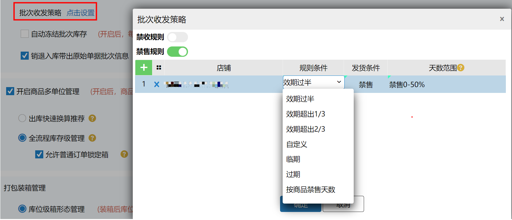

**包含批次商品订单锁定批次的顺序：指定批次>生产批次禁售规则>到期先出**

例：

指定店铺a-效期过半-禁售0-50%：假如商品保质期为100天，效期过半禁售0-50%表示该商品有效期低于50天时为禁售。

+ 店铺a订单包含生产批次商品指定批次，订单锁库时会优先锁定指定批次库存，若指定批次库存不足则锁库失败，

店铺a订单包含生产批次商品，订单锁库时会排除效期过半的批次库存，在剩余批次库存中按到期先出的规则锁库，若库存不足则锁定失败。

+ 指定店铺b-效期超出1/3-禁售0-33%：店铺b订单包含生产批次商品，订单锁库时会排除效期超过1/3的批次库存，在剩余批次库存中按到期先出的规则锁库，若库存不足则锁定失败。

指定店铺c-效期超出2/3-禁售0-66%：店铺c订单包含生产批次商品，订单锁库时会排除效期超过2/3的批次库存，在剩余批次库存中按到期先出的规则锁库，若库存不足则锁定失败。

指定店铺d-临期-禁售临期品：店铺d订单包含生产批次商品，订单锁库时会排除临期的批次库存，在剩余批次库存中按到期先出的规则锁库，若库存不足则锁定失败。

指定店铺e-过期-禁售过期品：店铺e订单包含生产批次商品，订单锁库时会排除过期的批次库存，在剩余批次库存中按到期先出的规则锁库，若库存不足则锁定失败。

指定店铺f-按商品禁售天数：商品上有设置禁售天数的，店铺f订单包含生产批次商品，则订单锁库时排除商品禁售天数内的批次库存，在剩余批次库存中按到期先出的规则锁库，若库存不足则锁定失败。

指定店铺g-自定义：可按百分比或者天数设置自定义规则，若设置禁售，则排除禁售期内的批次库存，在剩余批次库存中按到期先出的规则锁库，若库存不足则锁定失败；若设置可售，则锁定在可售期内的批次库存，若库存不足则锁定失败。

非指定店铺订单、或包含未设置禁售天数的生产批次商品的订单，则按先进先出的原则优先锁定到期时间最早的库批次库存。

**大宗订单分配限制条件**

开启后可指定店铺和单据类型设置**大宗订单**中生产批次商品允许锁定的批次种类数。

在规则设置中，店铺+单据类型不允许重复设置； 规则条件默认为每单商品最多锁定批次种类数，范围支持下拉选择，代表批次种类数。

设置批次限制条件后，大宗订单在原先大宗策略设置的基础上，结合限制条件进行锁库。

例：设置大宗策略如下

设置批次限制条件如下：

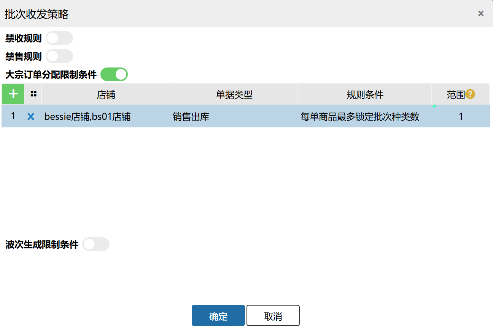

订单1 普通商品明细01 5个，生产批次商品明细02 5个，按照大宗策略和批次限制条件，普通商品明细会优先锁库箱拣选库位上的货箱库存，生产批次商品不锁货箱，只锁拆零库存，按批次先进先出原则锁定，若可用批次库存5个、批次种类数超过2种，则锁库失败，否则锁库成功。

注：指定批次大宗订单仍按照指定批次锁库，不会走限制条件。

**波次生成限制条件**

开启后可指定波次策略设置**同一个波次**中生产批次商品允许锁定的批次种类数。

在规则设置中，波次策略不允许重复设置； 规则条件默认为每波次中商品最多锁定批次种类数，范围支持下拉选择，代表批次种类数。

若指定波次锁定批次种类数超出限制范围，则生成失败。

##### 3.2 标准模式
总库存级校验管理，出入库必须登记生产批次信息，会校验批次库存是否足够。系统按照默认库位分配逻辑作业，如实现到期先出需依赖人为库位摆放顺序。

##### 3.3 开启同批次多日期管理
开启后，严格模式和标准模式都支持录入相同批次号、不同日期的批次信息，具体包括入库、仓内作业等模块下生产批次商品录入批次信息，库存模块查看批次信息等。

注：此开关开启后不支持关闭

例：以验货入库为例，录入生产批次时，允许录入相同生产批次、不同日期的批次信息，若有两条数据的生产批次、生产日期、过期日期完全一致，则不允许录入：

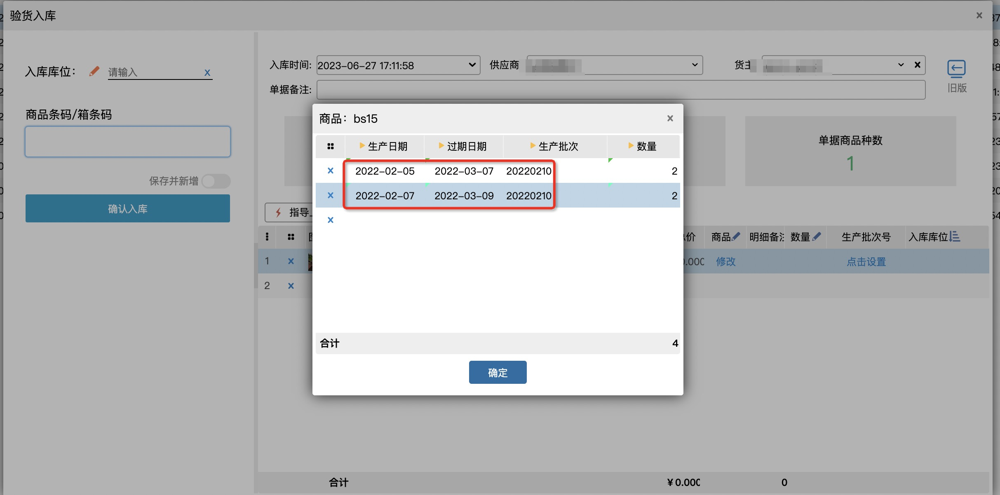

##### 3.4 指定批次更新
在生产批次商品在WMS系统中已经存在批次信息的情况下，上游系统推送了包含新批次信息的采购订单到WMS系统中，会根据现有批次商品的库存状况来判断是覆盖现有批次信息还是拒收新的采购订单。

库存状况主要包括三种情况：待审核/待确认的入库单中包含批次信息；作业中的分批入库任务中包含批次信息；对应批次信息的生产批次商品存在可用库存。

举例说明：

（1）WMS系统中存在批次商品 pc01，批次信息001，生产日期2024-09-10，过期日期2024-10-10，无批次扩展属性，可用库存0，在途库存10个，不存在待审核/待确认入库单，不存在作业中的分批入库任务。

①未开启同批次多日期管理开关 

上游推送采购订单1：批次商品pc01，批次信息001，生产日期2024-09-10，过期日期2024-10-11，有批次扩展属性（a,b,c），数量10个。

结果：采购订单接收成功，覆盖批次信息001，生产日期2024-09-10，过期日期2024-10-11，有批次扩展属性（a,b,c）。

上游推送采购订单2：批次商品pc01，批次信息002，生产日期2024-09-10，过期日期2024-10-11，有批次扩展属性（a,b,c,d），数量10个。

结果：采购订单接收成功，新增批次信息002，生产日期2024-09-10，过期日期2024-10-11，有批次扩展属性（a,b,c,d）。

②开启同批次多日期管理开关

上游推送采购订单1：批次商品pc01，批次信息001，生产日期2024-09-10，过期日期2024-10-12，有批次扩展属性（a,b,c），数量10个。

结果：采购订单接收成功，新增批次信息001，生产日期2024-09-10，过期日期2024-10-12，有批次扩展属性（a,b,c）。

（2）WMS系统中存在批次商品 pc01，批次信息001，生产日期2024-09-10，过期日期2024-10-10，无批次扩展属性，可用库存0，在途库存10个，存在待审核/待确认入库单/作业中的分批入库任务。

①未开启同批次多日期管理开关 

上游推送采购订单1：批次商品pc01，批次信息001，生产日期2024-09-10，过期日期2024-10-11，有批次扩展属性（a,b,c），数量10个。

结果：采购订单接收失败。

上游推送采购订单2：批次商品pc01，批次信息002，生产日期2024-09-10，过期日期2024-10-11，有批次扩展属性（a,b,c,d），数量10个。

结果：采购订单接收成功，新增批次信息002，生产日期2024-09-10，过期日期2024-10-11，有批次扩展属性（a,b,c,d）。

②开启同批次多日期管理开关

上游推送采购订单1：批次商品pc01，批次信息001，生产日期2024-09-10，过期日期2024-10-10，有批次扩展属性（a,b,c），数量10个。

结果：采购订单接收失败。

上游推送采购订单1：批次商品pc01，批次信息002，生产日期2024-09-12，过期日期2024-10-12，有批次扩展属性（a,b,c），数量10个。

结果：采购订单接收成功，新增批次信息002，生产日期2024-09-12，过期日期2024-10-12，有批次扩展属性（a,b,c,d）。

##### 3.5 限制修改批次扩展属性
1.未开启：入库、仓内等入口，批次扩展属性允许正常修改更新。

2.开启：入库、仓内等入口，批次扩展属性不允许编辑修改。

##### 3.6 业务单据检验生产批次有效性
开启后，指定类型单据在销退入库时会根据原始单据校验生产批次，未通过校验时报错提示。

##### 3.7 指定批次库存预留规则
:::color3
应用场景：本功能为WMS系统提供指定批次订单的库存预留机制，确保指定批次订单能够优先锁定指定批次的库存，避免被非指定批次订单占用，保障特殊业务需求（如质量追溯、保质期管理、客户指定等）的库存分配优先级。

:::

默认模式：先预留再分配

工作原理：

+ 指定批次订单直接按指定批次号预留对应库位库存数量，不参与FIFO排序
+ 非指定批次订单从剩余库存中按混合FIFO规则扣减
+ 预留优先级高于所有分配规则

示例：

:::tips
批次A：100件（被指定，入库1月1日）  
批次B：80件（入库1月2日）

指定批次订单O1：指定批次A，需求60件  
非指定订单O2：需求80件

执行结果：

+ O1直接锁定批次A 60件，A剩40件
+ O2从A剩40件 + B 40件按FIFO扣减，共80件

:::

上述模式生效范围包括：

零拣打单：待分配订单提交到零拣打单时锁库

波次作业：手动截单生成波次、生成预配波次、生成清仓波次、同品波次锁存储规则

大宗出库：大宗出库任务自动锁库

智能锁库：智能锁库+库位分配偏好场景

锁规格箱：普通订单优先锁箱规则

注：

此规则在页面上无配置，为后台默认逻辑；

指定批次库存无法完全满足指定批次订单需求时，仍将这部分库存预留给指定批次订单，不会分配给其他非指定批次订单。

##### 3.8 生产批次号自动生成规则
可自定义配置不同业务类型，自动生成的批次号格式，未配置的按照默认格式(YYYYMMDD)生成

case：仓内加工：YYYY-MM-DD；调拨入库：YY/MM/DD；其他入库未配置

仓内加工，批次商品填写生产日期为2026年3月15日，自动生成的批次号为：2026-03-15

调拨入库，批次商品填写生产日期为2026年3月15日，自动生成的批次号为：26/03/15

其他入库，批次商品填写生产日期为2026年3月15日，自动生成的批次号为：20260315

#### 4、开启多单位
开启后出库时推荐最优拣货库位。

①.出库快速换算推荐：出库时推荐最优的拣货单位，最多5级，仅推荐显示。例如，商品a001基本单位是包，设置了计量单位1打=6包、1提=12包、1箱=26包，订单中商品a001有19包，拣货时推荐拿:1提+1打+1包。

(1)推荐单位显示样式

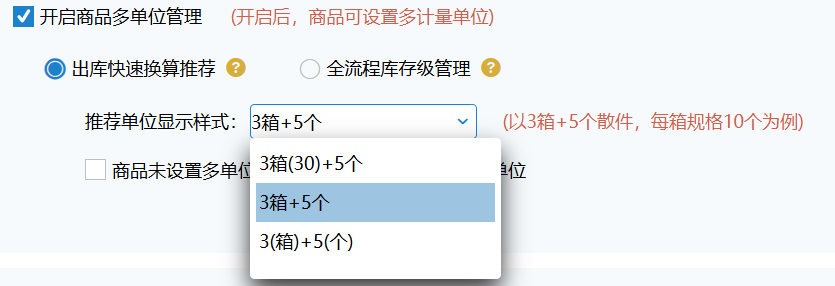

可以下拉选择，推荐单位显示的样式

(2)商品未设置多单位时，推荐单位显示该商品基础单位

勾选后，未设置多单位的商品，推荐单位也会显示该商品的基础单位，如果未配置基础单位，则不显示单位

②.全流程库存级管理：出库时根据指定的单位拣货。

(1) 允许普通订单锁定箱：先锁箱后锁零，都不锁唯一箱。

##### 普通商品锁库逻辑
a.先锁可以被整除的单箱sku数量最大且库位编码比较小的规格箱

b.若没有整除的，则锁规格箱或规格箱+拆零的组合，规格箱是按       照单箱sku数量从大到小且箱拣库位编码从小到大排序锁，拆零是     按照库位锁定偏好锁拣选库位；

c. a和b都不满足则锁库失败。

##### 入库批次商品锁库逻辑
a.锁规格箱或规格箱+拆零的组合，规格箱是按照入库批次号>库位 顺序锁规格箱，拆零是按照入库批次号>库位顺序锁拣选库位；

b. a不满足则锁库失败。

**序列号商品锁库逻辑：**按照库位锁定偏好锁拣选库位**。**

**生产批次商品锁库逻辑：**按照生产日期>生成批次号>库位。

(2) 不允许普通订单锁定箱：普通都不锁箱，锁库逻辑不变；大宗订单仍是允许锁箱，根据大宗策略锁。

注：判断可用库存

①、普通商品是判断拣选库位+箱拣库位上的规格箱可用数，若不足，报库位库存不足；若可用数充足，没有合适库存，报无合适库存。

②、生产批次商品是判断拣选库位的可用数，若不足，报库位库存不足。

③、入库批次商品是判断拣选库位+箱拣库位上的规格箱可用数，若不足，报库位库存不足；若可用数充足，没有合适库存，报无合适库存。

④、序列号商品是判断拣选库位的可用数，若不足，报库位库存不足。

#### 5、打包装箱管理

（1）库位级箱形态管理，默认模式，有货箱形态的库存，打包装箱能正常生成唯一货箱库存。

（2）仓库级箱记录管理，切换后原有货箱形态的库存全部转化成拆零库存，打包装箱生成箱条码，但是没有货箱库存，不影响现有拆零库存数量，相当于支持按箱内数量快速录入商品的功能。

（3）支持页面如下：

PC页面：分拣验货、条码验货、单种验货、自定义环节-校验条码验货、拆包补打-装箱&生成子母件、大宗装箱；

PDA页面：订单/批量/料框拣货、单批次拣货页、拣货商品确认、播种拣货、容器拣货、条码验货、抽检验货、条码验货、生产批次列表页、大宗拣货、大宗装箱、自由上架-逐件取货、快速上架-逐件取货、补货任务-拆零补货、移库任务-拆零移库、加工领料、盘点任务、单批次盘点、快速盘点、正次转换、容器移库-逐件取货。

注：

①从库位级箱形态管理切换成仓库级箱记录管理模式，会将唯一货箱库存全部转化为拆零库存，若当前仓有锁定或待生效的唯一货箱，则不支持切换；

②从仓库级箱记录管理切换成库位级箱形态管理模式，会将打包装箱页面现有箱记录全部作废，变成失效模式。

③仓库级箱记录管理模式下，PDA仓内页面支持扫混箱条码（混箱：一个唯一箱中包含多个不同sku商品），扫描后带出箱内明细及对应数量，其他页面不支持扫混箱条码，扫描后会报错提示。

④仓库级箱记录管理模式下，若业务配置开启PDA拣货校验商品条码为仅商品种类/库位、商品种类，则在PDA对应拣货页面不支持扫箱条码带出箱内明细及对应数量。

### 三、加工单配置
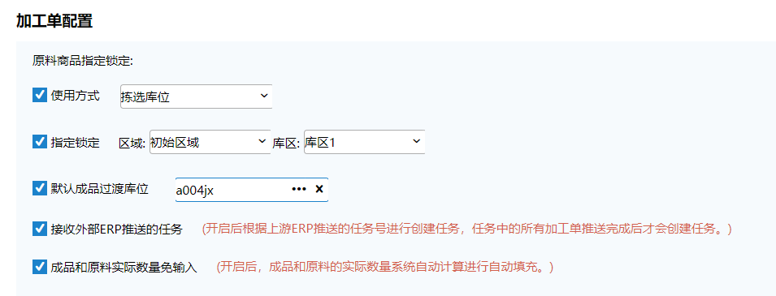

进行仓内加工作业时，需指定原料商品的锁定区域/库区以及库位的使用方式，指定后，创建仓内加工单，会自动锁定原料商品库位。

### 四、绩效配置

开启积分绩效：开启后，可根据模块分别设置出库、大宗、入库、仓内四个模块下各作业环节积分绩效计算方式。当未匹配到普通绩效规则时，以此方案兜底计算绩效，若匹配到普通绩效规则，则按照普通绩效规则计算。各模块独立设置，互不影响。

对于已经开启积分绩效的仓库，各模块默认设置：单据商品数量积分累计，未设置时按照：每个=0个积分；

对于新开启积分绩效的仓库，各模块默认设置：单据商品数量积分累计，未设置时按照：每个=1个积分。

注：各模块对应的计算基准略有不同，具体含义如下：(前提：示例中仓库未设置绩效策略或无匹配普通绩效规则）

##### 出库模块
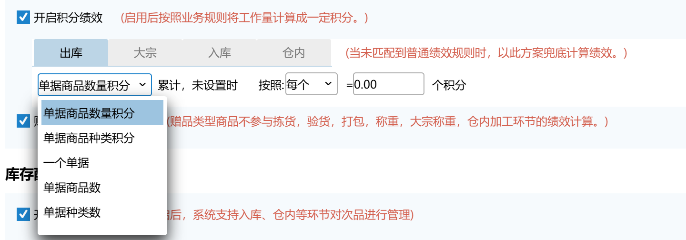

(1)单据商品数量积分累计，未设置时按照：每个=[n]个积分

含义：根据单据中sku在商品绩效积分对应环节设置的积分值计算并累加，作为本单据的积分值。若对应环节未设置积分，则用n进行计算。

例1：仓库1开启积分绩效，设置出库模块——单据商品数量积分累计，未设置时按照：每个=[3]个积分。

         仓库1下有普通单据1，包括明细sku1 2个，sku2 3个，其中sku1 打单环节积分为2，sku2 打单环节积分为空，将单据1提交打单。

         打单环节计算积分结果：2*2+3*3=13    [即：sku1数量*sku1打单环节积分+sku2数量*默认积分]

(2)单据商品种类积分累计，未设置时按照：每种=[n]个积分

含义：根据单据中单种sku在商品绩效积分对应环节设置的积分值计算并累加，作为本单据的积分值。若对应环节未设置积分，则用n进行计算。

例1：仓库1开启积分绩效，设置出库模块——单据商品种类积分累计，未设置时按照：每个=[3]个积分。

         仓库1下有普通单据1，包括明细sku1 2个，sku2 3个，其中sku1 打单环节积分为2，sku2 打单环节积分为空，将单据1提交打单。

         打单环节计算积分结果：2+3=5    [即：sku1打单环节积分+默认积分]

(3)一个单据按照：每个=[n]个积分

含义：根据单据数量计算积分，积分值=单据数量*n。若部分作业时单据数为0，则积分=0。

例2：仓库1开启积分绩效，设置出库模块——一个单据按照：每个=[3]个积分。

         仓库1下有普通单据1，包括明细sku1 2个，sku2 3个，将单据1提交打单。

         打单环节计算积分结果：1*3=3    [即：单据数量*默认积分]

(4)单据商品数按照：每个=[n]个积分/阶梯

含义：根据单据商品数计算积分，有按每个/按阶梯两种算法。

例3：仓库1开启积分绩效，设置出库模块——单据商品数按照：每个=[2]个积分。

         仓库1下有普通单据1，包括明细sku1 2个，sku2 3个，将单据1提交打单。

         打单环节计算积分结果：(2+3)*2=10    [即：(sku1数量+sku2数量)*默认积分]

例4：仓库1开启积分绩效，设置出库模块——单据商品数按照： 阶梯

         数量区间：0个-3个，首数量：2个，积分：2个，续数量：1个，续积分：2个；

         数量区间：3个-无穷多个，首数量：4个，积分：4个，续数量：1个，续积分：2个；

         仓库1下有普通单据1，包括明细sku1 2个，sku2 3个，将单据1提交打单。

         打单环节计算积分结果：4+2=6  [即：单据1商品数5个，落到第二区间，首数量4个，积分4个，续数量1个，续积分2个]

(5)单据种类数按照：每个=[n]个积分/阶梯

含义：根据单据种类数计算积分，有按每个/按阶梯两种算法。

例5：仓库1开启积分绩效，设置出库模块——单据种类数按照：每个=[2]个积分。

         仓库1下有普通单据1，包括明细sku1 2个，sku2 3个，将单据1提交打单。

         打单环节计算积分结果：2*2=4    [即：单据种类数*默认积分]

例6：仓库1开启积分绩效，设置出库模块——单据商品数按照： 阶梯

         种类区间：0种-2种，首种类：1种，积分：2个，续种类：1个，续积分：1个；

         种类区间：2种-无穷多种，首种类：3种，积分：3个，续种类：1种，续积分：2个；

         仓库1下有单据1，包括明细sku1 2个，sku2 3个，将单据1提交打单。

         打单环节计算积分结果：2+1=3   [即：单据1种类数2种，落到第一区间，首种类1个，积分2个，续种类1种，续积分1个]

##### 大宗模块
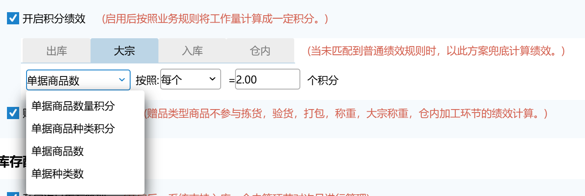

(1)单据商品数量积分累计，未设置时按照：每个=[n]个积分

含义：根据单据中sku在商品绩效积分对应环节设置的积分值计算并累加，作为本单据的积分值。若对应环节未设置积分，则用n进行计算。

例1：仓库1开启积分绩效，设置大宗模块——单据商品数量积分累计，未设置时按照：每个=[3]个积分。

         仓库1下有大宗单据1，包括明细sku1 2个，sku2 3个，其中sku1 大宗出库环节积分为2，sku2 大宗出库环节积分为空，将单据1提交出库。

         大宗出库环节计算积分结果：2*2+3*3=13    [即：sku1数量*sku1大宗出库环节积分+sku2数量*默认积分]

(2)单据商品种类积分累计，未设置时按照：每种=[n]个积分

含义：根据单据中单种sku在商品绩效积分对应环节设置的积分值计算并累加，作为本单据的积分值。若对应环节未设置积分，则用n进行计算。

例1：仓库1开启积分绩效，设置大宗模块——单据商品种类积分累计，未设置时按照：每个=[3]个积分。

         仓库1下有大宗单据1，包括明细sku1 2个，sku2 3个，其中sku1 大宗出库环节积分为2，sku2 大宗出库环节积分为空，将单据1提交出库。

        大宗出库环节计算积分结果：2+3=5    [即：sku1大宗出库环节积分+默认积分]

(3)单据商品数按照：每个=[n]个积分/阶梯

含义：根据单据商品数计算积分，有按每个/按阶梯两种算法。

例2：仓库1开启积分绩效，设置大宗模块——单据商品数按照：每个=[2]个积分。

         仓库1下有大宗单据1，包括明细sku1 2个，sku2 3个，将单据1提交出库。

         大宗出库环节计算积分结果：(2+3)*2=10    [即：(sku1数量+sku2数量)*默认积分]

例3：仓库1开启积分绩效，设置大宗模块——单据商品数按照： 阶梯

         数量区间：0个-3个，首数量：2个，积分：2个，续数量：1个，续积分：2个；

         数量区间：3个-无穷多个，首数量：4个，积分：4个，续数量：1个，续积分：2个；

         仓库1下有大宗单据1，包括明细sku1 2个，sku2 3个，将单据1提交出库。

         大宗出库环节计算积分结果：4+2=6  [即：单据1商品数5个，落到第二区间，首数量4个，积分4个，续数量1个，续积分2个]

(4)单据种类数按照：每个=[n]个积分/阶梯

含义：根据单据种类数计算积分，有按每个/按阶梯两种算法。

例4：仓库1开启积分绩效，设置大宗模块——单据种类数按照：每个=[2]个积分。

         仓库1下有大宗单据1，包括明细sku1 2个，sku2 3个，将单据1提交出库。

         大宗出库环节计算积分结果：2*2=4    [即：单据种类数*默认积分]

例5：仓库1开启积分绩效，设置大宗模块——单据种类数按照： 阶梯

         种类区间：0种-2种，首种类：1种，积分：2个，续种类：1个，续积分：1个；

         种类区间：2种-无穷多种，首种类：3种，积分：3个，续种类：1种，续积分：2个；

         仓库1下有大宗单据1，包括明细sku1 2个，sku2 3个，将单据1提交出库。

         大宗出库环节计算积分结果：2+1=3   [即：单据1种类数2种，落到第一区间，首种类1个，积分2个，续种类1种，续积分1个]

##### 入库模块

(1)单据商品积分累计，未设置时按照：每个=[n]个积分

含义：根据单据中sku在商品绩效积分对应环节设置的积分值计算并累加，作为本单据的积分值。若对应环节未设置积分，则用n进行计算。

例1：仓库1开启积分绩效，设置入库模块——单据商品积分累计，未设置时按照：每个=[3]个积分。

         仓库1下有待入库单据1，包括明细sku1 2个，sku2 3个，其中sku1 入库环节积分为2，sku2 入库环节积分为空，将单据1确认入库。

         入库环节计算积分结果：2*2+3*3=13    [即：sku1数量*sku1入库环节积分+sku2数量*默认积分]

(2)单据商品种类积分累计，未设置时按照：每种=[n]个积分

含义：根据单据中单种sku在商品绩效积分对应环节设置的积分值计算并累加，作为本单据的积分值。若对应环节未设置积分，则用n进行计算。

例1：仓库1开启积分绩效，设置入库模块——单据商品种类积分累计，未设置时按照：每个=[3]个积分。

         仓库1下有待入库单据1，包括明细sku1 2个，sku2 3个，其中sku1 入库环节积分为2，sku2 入库环节积分为空，将单据1确认入库。

         入库环节计算积分结果：2+3=5    [即：sku1入库环节积分+默认积分]

(3)一个单据按照：每个=[n]个积分

含义：根据单据数量计算积分，积分值=单据数量*n。

例2：仓库1开启积分绩效，设置入库模块——一个单据按照：每个=[3]个积分。

         仓库1下有待入库单据1，包括明细sku1 2个，sku2 3个，将单据1确认入库。

         入库环节计算积分结果：1*3=3    [即：单据数量*默认积分]

(4)作业商品数按照：每个=[n]个积分/阶梯

含义：根据实际作业商品数计算积分，有按每个/按阶梯两种算法。

例3：仓库1开启积分绩效，设置入库模块——作业商品数按照：每个=[2]个积分。

         仓库1下有入库预约单1，包括明细sku1 10个，sku2 10个，部分入库生成待入库单据1，包括明细sku1 2个，sku2 3个，将单据1确认入库。

         入库环节计算积分结果：(2+3)*2=10    [即：(sku1数量+sku2数量)*默认积分]

例4：仓库1开启积分绩效，设置入库模块——作业商品数按照： 阶梯

         数量区间：0个-3个，首数量：2个，积分：2个，续数量：1个，续积分：2个；

         数量区间：3个-无穷多个，首数量：4个，积分：4个，续数量：1个，续积分：2个； 

         仓库1下有入库预约单1，包括明细sku1 10个，sku2 10个，部分入库生成待入库单据1，包括明细sku1 2个，sku2 3个，将单据1确认入库。

         入库环节计算积分结果：4+2=6  [即：单据1商品数5个，落到第二区间，首数量4个，积分4个，续数量1个，续积分2个]

(5)作业种类数按照：每个=[n]个积分/阶梯

含义：根据实际作业种类数计算积分，有按每个/按阶梯两种算法。

例4：仓库1开启积分绩效，设置入库模块——作业种类数按照：每个=[2]个积分。

         仓库1下有入库预约单1，包括明细sku1 10个，sku2 10个，部分入库生成待入库单据1，包括明细sku1 2个，sku2 3个，将单据1确认入库。

         入库环节计算积分结果：2*2=4    [即：作业种类数*默认积分]

例5：仓库1开启积分绩效，设置入库模块——作业种类数按照： 阶梯

         种类区间：0种-2种，首种类：1种，积分：2个，续种类：1个，续积分：1个；

         种类区间：2种-无穷多种，首种类：3种，积分：3个，续种类：1种，续积分：2个；

         仓库1下有入库预约单1，包括明细sku1 10个，sku2 10个，部分入库生成待入库单据1，包括明细sku1 2个，sku2 3个，将单据1确认入库。

         入库环节计算积分结果：2+1=3   [即：单据1种类数2种，落到第一区间，首种类1个，积分2个，续种类1种，续积分1个]

##### 仓内模块
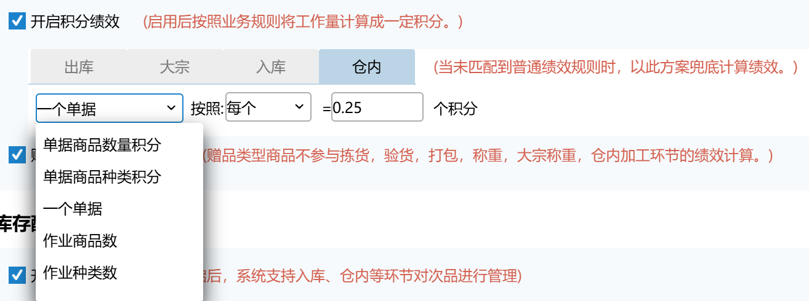

(1)单据商品积分累计，未设置时按照：每个=[n]个积分

含义：根据单据中sku在商品绩效积分对应环节设置的积分值计算并累加，作为本单据的积分值。若对应环节未设置积分，则用n进行计算。

例1：仓库1开启积分绩效，设置仓内模块——单据商品积分累计，未设置时按照：每个=[3]个积分。

         仓库1下有待作业库存转移作业单1，包括明细来源库位1 sku1 目标库位2 sku2  计划数量3个，其中sku1 转移环节积分为2，sku2 转移环节积分为空，将作业单1确认完成。

         转移环节计算积分结果：2*2=4    [即：来源库位sku完成数量*来源库位sku转移环节积分]

(2)单据商品种类积分累计，未设置时按照：每种=[n]个积分

含义：根据单据中单种sku在商品绩效积分对应环节设置的积分值计算并累加，作为本单据的积分值。若对应环节未设置积分，则用n进行计算。

例1：仓库1开启积分绩效，设置仓内模块——单据商品种类积分累计，未设置时按照：每个=[3]个积分。

        仓库1下有待作业库存转移作业单1，包括明细来源库位1 sku1 目标库位2 sku2  计划数量3个，其中sku1 转移环节积分为2，sku2 转移环节积分为空，将作业单1确认完成。

         转移环节计算积分结果：3    [即：默认积分]

(3)一个单据按照：每个=[n]个积分。若部分作业时单据数为0，则积分=0。

含义：根据单据数量计算积分，积分值=单据数量*n。

例2：仓库1开启积分绩效，设置仓内模块——一个单据按照：每个=[3]个积分。

         仓库1下有待作业库存转移作业单1，包括明细来源库位1 sku1 目标库位2 sku2  计划数量3个，将作业单1确认完成。

         转移环节计算积分结果：1*3=3    [即：单据数量*默认积分]

(4)作业商品数按照：每个=[n]个积分/阶梯

含义：根据实际作业商品数计算积分，有按每个/按阶梯两种算法。

例3：仓库1开启积分绩效，设置仓内模块——作业商品数按照：每个=[2]个积分。

         仓库1下有待作业库存转移作业单1，包括明细来源库位1 sku1 目标库位2 sku2  计划数量3个，完成数量2个。

         转移环节计算积分结果：2*2=4   [即：来源库位sku完成数量*默认积分]

例4：仓库1开启积分绩效，设置仓内模块——作业商品数按照： 阶梯

         数量区间：0个-3个，首数量：2个，积分：2个，续数量：1个，续积分：2个；

         数量区间：3个-无穷多个，首数量：4个，积分：4个，续数量：1个，续积分：2个；

         仓库1下有待作业库存转移作业单1，包括明细来源库位1 sku1 目标库位2 sku2  计划数量3个，完成数量2个。

         转移环节计算积分结果：2  [即：作业单1完成商品数2个，落到第一区间，首数量2个，积分2个]

(5)作业种类数按照：每个=[n]个积分/阶梯

含义：根据实际作业种类数计算积分，有按每个/按阶梯两种算法。

例4：仓库1开启积分绩效，设置仓内模块——作业种类数按照：每个=[2]个积分。

         仓库1下有待作业库存转移作业单1，包括明细来源库位1 sku1 目标库位2 sku2  计划数量3个，完成数量2个。

         转移环节计算积分结果：1*2=2    [即：作业单1完成商品作业种类数*默认积分]

例5：仓库1开启积分绩效，设置仓内模块——作业种类数按照： 阶梯

         种类区间：0种-2种，首种类：1种，积分：2个，续种类：1个，续积分：1个；

         种类区间：2种-无穷多种，首种类：3种，积分：3个，续种类：1种，续积分：2个；

         仓库1下有待作业库存转移作业单1，包括明细来源库位1 sku1 目标库位2 sku2  计划数量3个，完成数量2个。

         转移环节计算积分结果：2   [即：作业单1完成商品作业种类数1种，落到第一区间，首种类1个，积分2个]

注：赠品类型商品不计绩效：开启后赠品属性的商品不参与拣货、验货、称重、打包环节的绩效统计。

### 五、库存配置
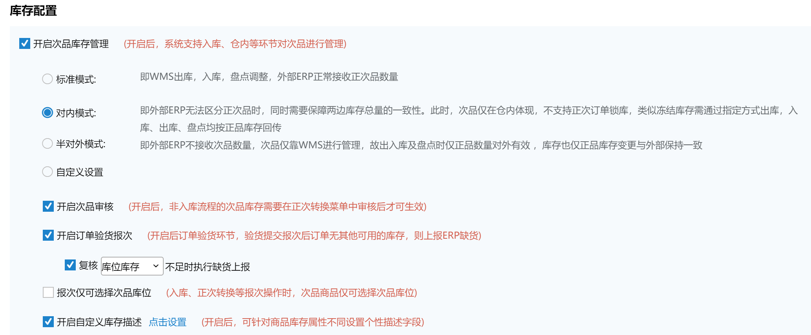

##### 5.1开启次品库存管理
开启后，系统支持对入库、仓内等环节对次品进行管理。

模式解释：

1.标准模式：WMS出库、入库、盘点调整，外部ERP能正常接收正次品数量。例：商品A入库，正品100个，次品10个，确认入库后，回传ERP **商品A入库100个正品，10个次品。**

2.对内模式：外部ERP无法区分正次品时，同时需要保障两边库存总量的一致性。此时，次品仅在仓内体现，不支持正次订单锁库，类似冻结库存需通过指定方式出库，入库、出库、盘点均按正品库存回传。例：商品A入库，正品100个，次品10个，确认入库后，回传ERP **商品A入库110个。**

3.半对外模式：外部ERP不接收次品数量，次品仅靠WMS进行管理，故出入库及盘点时仅正品数量对外有效 ，库存也仅正品库存变更与外部保持一致。例：商品A入库，正品100个，次品10个，确认入库后，回传ERP **商品A入库100个**。

4.自定义设置：开启3pl的公司支持自定义设置不同货主的次品库存管理模式。

5.开启开关后，仓内作业新增正次转换页面，支持对正品批量转次、残次品批量转正；库存查询页面、入库、仓内作业等操作新增库存属性，展示商品的正、次库存属性。

##### 5.2 开启自定义库存描述
开启后可针对商品库存属性不同设置个性描述字段

点击设置，进入自定义属性设置弹窗，属性值类型有三种：文本、预设值、固定属性值。

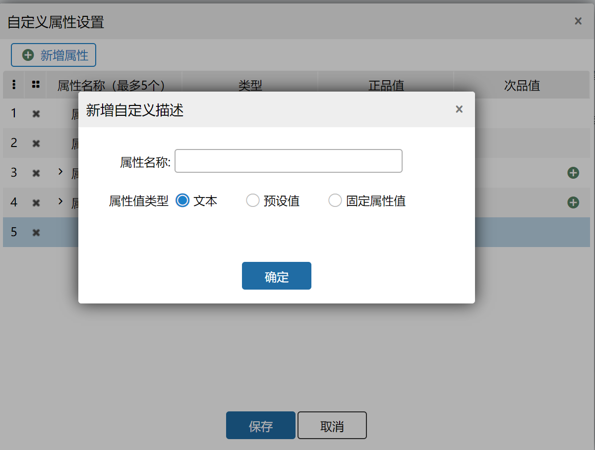

属性值类型不同，正品值、次品值输入格式不同。

注：属性名称不允许重复，最多5个；

正品值之间不允许重复、次品值之间不允许重复；

属性值类型为固定值时，正品值、次品值非必填；

属性值类型为预设值时，正品值、次品值至少各填一个，最多各10个。

支持录入库存自定义描述的页面包括：清点单/收货台账、理货清点（包括PC/PDA）、进货查验记录、正次转换、理货清点。以PC-理货清点-快速清点为例进行说明，详见对应页面[操作手册](https://hupun.yuque.com/unzko7/lsbfg0/cogi67y2zn60c0q3#V9Nhe)。

##### 5.3 开启次品审核
开启后，正次转换或验货报次后生成正次转换类型的单据状态为待审核。（包括PC端、PDA端）

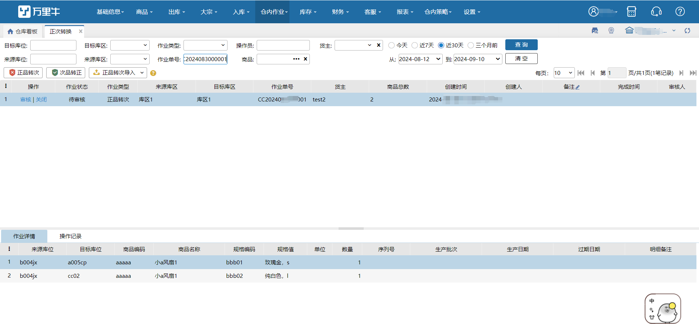

操作员有审核权限时即可操作审核单据，审核成功后单据为已完成。

角色管理->操作权限

若操作已关闭，则单据关闭。

注：

①开启次品审核且单据状态待审核时，备注允许编辑；

②开启新版审核后台开关后，此配置置灰不可编辑。

##### 5.4 报次仅可选择次品库位
开启后，入库和正品转次时次品明细库位仅允许选择库位类型为次品的库位。

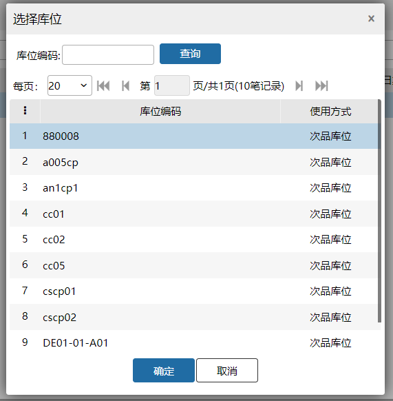

##### 5.5 开启指导上架按库位容量/承重推荐库位
开启后，指导库位时计算当前商品的总体积/重量和推荐库位的容量，超出则自动拆分明细指导多个库位。当前仅支持PC：采购入库单、其他入库单、销退入库单；PDA：指导上架。

例：商品b01，商品重量1kg，商品体积1m³；库位A01，库位容积20m³，已用容积8m³，库位承重50kg，已用承重30kg，设置优先商品b01；库位A02，库位容积20m³，已用容积5m³，库位承重50kg，已用承重40kg，设置优先商品b01。

计算可容数量：库位A01剩余容积12m³，剩余承重20kg，取较小值12；库位A02剩余容积15m³，剩余承重10kg，取较小值10。按商品b01的重量、体积计算，库位A01可容数量12个，库位A02可容数量10个。

验货入库扫描商品b01，数量20，点击指导上架，系统自动指导库位，将b01拆成2个明细，其中库位A01上12个，库位A02上8个。

注：①一个明细最多指导10个库位，还有未分配的数量单独拆出，指导库位为空；

②此开关与序列号商品管理开关不能同时开启。

### 六、仓内配置

开启后，对于指导上架，新品入库上架，容器上架、补货上架指导无结果的情况进行补充，指导出空货位进行上架。

1.匹配范围，同时满足以下2点才能匹配规则

①.商品的品牌/分类/等级在设置的商品品牌/商品分类/商品等级范围里；

②.选择的指导方式在设置的使用方式范围内。

2.仅查找空库位

①.未勾选，在选择的区域里按照商品数量从少到多的指导库位，空库位优先。

②.勾选仅查找空库位+路径优先，在选择的区域里找库位编码最小的空库位。

③.勾选仅查找空库位+同款优先，在选择的区域里找库位编码距离同款库位编码最近且库位编码最小的空库位。

若之前的指导无结果，则按照指导补充规则设置的商品品牌/商品等级/商品分类+指导库区+库位使用方式+是否找空库位去指导。

示例：

sku1-品牌A、sku2-品牌B、sku3-品牌A、sku401-品牌A，sku501-品牌B

sku1-在库区02设置了优先库位kw01-拣选库位

sku2-在库区03下库位kw02有余量-拣选库位

sku3-在库区04下有历史库位kw03-拣选库位

库区01下有空库位kw04-存储、kw05-拣选

库区02下有空库位kw06-拣选，kw07有sku502的库存（sku501的同款）kw08-存储、kw09-存储

规则01，设置了商品品牌A+指导库区01+库位使用方式拣选+路径优先

规则02，设置了商品品牌B+指导库区02+库位使用方式存储+同款优先

现在容器RQ0026里有商品sku1、sku2、sku3、sku401、sku501库存去上架到库位

a.pda上指导时选择不限

sku1指导出库位kw01

sku2指导出库位kw02

sku3指导出库位kw03

sku401指导出库位kw05

sku501指导出库位kw08

b.pda上指导时选择拣选库位

sku1指导出库位kw01

sku2指导出库位kw02

sku3指导出库位kw03

sku401指导出库位kw05

sku501无指导结果

c.pda上指导时选择存储库位

sku1无指导结果

sku2无指导结果

sku3无指导结果

sku401无指导结果

sku501指导出kw08

### 七、补货配置
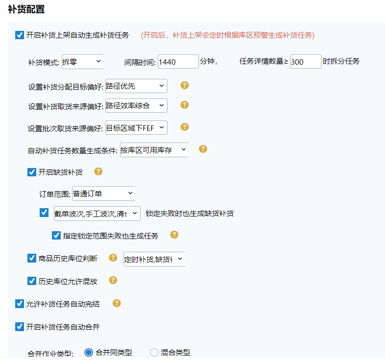

9、开启补货上架自动生成补货任务：开启后系统定时根据库区预警生成补货任务

9.1 补货模式分为按箱补货和拆零补货，系统会根据设置的间隔时间和任务详情数量进行任务拆分和生成，补货分配偏好分为效率优先和路径优先

a.路径优先：【走路最少】根据存储库位编码从小到大分配给商品。若该商品有存储库位库存满足需求量，则直接分配编码最小的存储库位；若商品没有满足需求量的存储库位库存，则直接分配最小的库位库存，锁定库存为负数；若商品的各个存储库位库存不满足需求量但所有存储库位库存满足需求量，则按照存储库存编码从小到大分配，直至足够。

b.效率优先：【拿的次数最少】根据商品的存储库位库存最接近商品所需量进行分配库位。若该商品有存储库位库存满足需求量，则直接分配满足需求量且库位编码的存储库位；若商品没有满足需求量的存储库位库存，则直接分配库存数量最大的存储库位，锁定库存为负数；若商品的各个存储库位库存不满足需求量但所有存储库位库存满足需求量，则按照存储库存数量从大到小分配，直至足够。

9.2 开启缺货补货：开启后订单缺货即会生成补货任务，已经生成定时补货任务的系统将自动提高该任务优先级。

a.订单范围：支持普通订单和大宗订单锁定失败触发自动缺货补货。

b.锁定失败也生成缺货补货：决定手动截单、清仓波次、手工波次锁定失败时是否触发自动缺货补货。

c.指定锁定范围失败也生成任务：已开启则按照指定的锁库范围去补货；否则按全仓去补。

9.3 商品历史库位判断：开启后当目标库区没有商品库存时，补货到该商品最后存放的库位。

9.4 历史库位允许混放：开启后历史库位如有其它商品则支持混放，否则将不匹配历史库位。

10、允许补货任务自动完结：开启后，实际补货数量<计划补货数量，也视为完成补货任务（即不存在部分补货）

11、开启补货任务自动合并：开启后系统定时合并未作业的补货任务。

策略解释：

1.一键合并作业范围：取补货上架页面所有待作业且未被操作员领取的任务明细进行合并。

2.合并作业类型：即合并补货任务的范围；

1)合并同类型：合并任务时，生成形式相同的会进行合并；例：待作业的补货任务有：任务01-缺货补货，任务02-定时补货，任务03-缺货补货、任务04-定时补货，一键合并作业类型选择合并同类型，任务01和任务03合并，任务02和任务04合并。

2）混合类型：合并任务时根据勾选的作业类型进行合并，操作如下图：

例1：合并作业类型选择混合类型，勾选了缺货补货，待作业的补货任务有：任务01-缺货补货，任务02-定时补货，任务03-缺货补货、任务04-定时补货，一键合并作业时，只取任务01、任务03进行合并；

例2：合并作业类型选择混合类型，勾选了缺货补货、定时补货，待作业的补货任务有：任务01-缺货补货，任务02-定时补货，任务03-缺货补货、任务04-定时补货，一键合并作业时，取任务01、任务02、任务03、任务04进行合并。

3.作业详情数量：合并生成新的补货任务的详情数量。

4.合并规则：合并补货任务的依据。

1）相同来源库区：来源库区相同的补货任务合并到一个任务中；例：补货任务01：商品a 来源库区A、商品b 来源库区B、商品c 来源库区C  补货任务02：商品d 来源库区A、商品e 来源库区C，一键合并作业生成3个补货任务：任务1：商品a 来源库区A、商品d 来源库区A；任务2：商品b 来源库区B；任务3：商品c 来源库区C、商品e 来源库区C.

2）相同目标库区：目标库位相同的补货任务合并到一个任务中；

3）相同来源库区及目标库区：来源库区、目标库区相同的补货任务才会合并到一个任务中。

注意：

1. 同商品来源库位、目标库位相同的补货明细会合并成1条；

2.一键合并任务时，拆零的与拆零的合并，箱子与箱子的合并；

3.一键合并任务生成时，补货任务无法在pda领取。

4.生成补货任务排序：再满足设置的合并规则的情况下，根据明细的来源、目标和商品编码进行排序；

1）合并规则为相同来源库区，排序为：目标区域编码>目标库区编码>来源库位编码>目标库位编码>商品编码

2)合并规则为相同来目标库区，排序为：来源区域编码>来源库区编码>来源库位编码>目标库位编码>商品编码

3）合并规则为相同来源及目标库区，排序为：来源库位编码>目标库位编码>商品编码

12.开启补货中转：开启后可进行分段补货 

12.1 设置中转库位

在补货作业中，若选择的目标库位和中转库位一致，则完成该补货作业后，系统会自动创建一个待作业的补货任务，明细的来源库位为中转库位，目标库位为原补货任务的目标库位。

12.2 允许使用容器进行中转作业

在补货作业中，目标库位允许选择容器，完成该补货作业后，系统会自动创建一个待作业的补货任务，明细的来源库位为中转容器，目标库位为原补货任务的目标库位。

### 八、预包配置
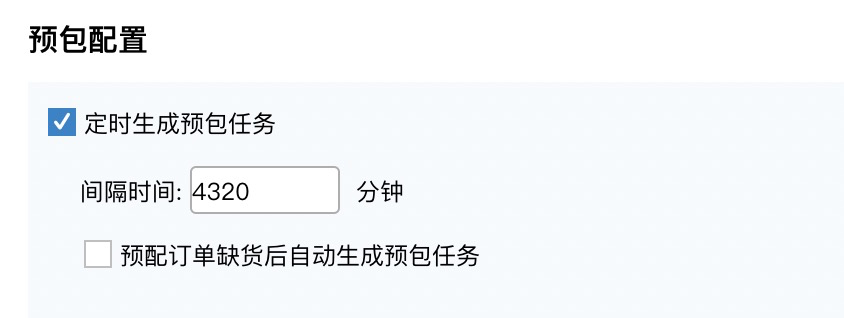

1.开启定时生成预包任务并设置间隔时间后，系统会根据预包预警上下限+间隔时间定时生成预包任务；未开启或未到间隔时间则不会自动生成。

2.开启预配订单缺货后自动生成预包任务，预配订单生成时，若库位库存不足，会自动生成预包任务；未开启则不会自动生成。具体计算方式请参考[预包任务](https://hupun.kf5.com/hc/kb/article/1553778/)05、06节内容。

### 九、上架管理

##### 9.1开启指导上架补充规则

指导上架固定规则没有匹配到库位时，会根据配置的自定义补充规则去匹配库位，根据不同的计算偏好去寻找库位作为指导上架的结果库位。指导时会按照所有配置的自定义补充规则都去匹配库位，最后将所有库位排序后得出最优库位作为指导库位。

> 更新: 2026-07-08 16:08:27  
> 原文: <https://hupun.yuque.com/unzko7/lsbfg0/caki7lz4105n2vpg>