# 业务配置-出库配置

业务配置主要是针对当前登录仓库设置流程配置。

出库配置

流程图：详见上图，表示订单的操作流程。用户可根据当前仓库的情况选择开启或关闭拣货、验货、打包、称重环节。当订单被提交至待出库环节时均会触发自动发货，即通知对接平台（例erp）订单发货。

### **基础出库业务：**
#### **1、快速出库**
**1、开启出库自定义环节**：开启后，可对指定订单出库流程进行自定义作业。

**2、开启前置发货**：开启后，选择前置发货的环节，当订单在此环节确认后则会通知erp发货（直接确认订单），快速提交的跨节点订单也符合可以前置发货。如果为万里牛ERP，可配合ERP的通知线上发货时机提前功能，实现线上平台发货。

①、前置发货为自动获取单号后，获取单号后自动计算运费成本然后通知ERP发货。

②、前置发货为自动获取单号后，自动获取单号环节是打单，则订单生成波次或打到零拣时不计算运费成本，获取单号后计算运费然后通知ERP发货。

前置发货为打单环节，订单生成波次或打到零拣时计算运费成本，确认打单后通知ERP发货。

**3、标记订单辅助优先处理**：开启后，含有指定标记的订单将优先进入出库流程

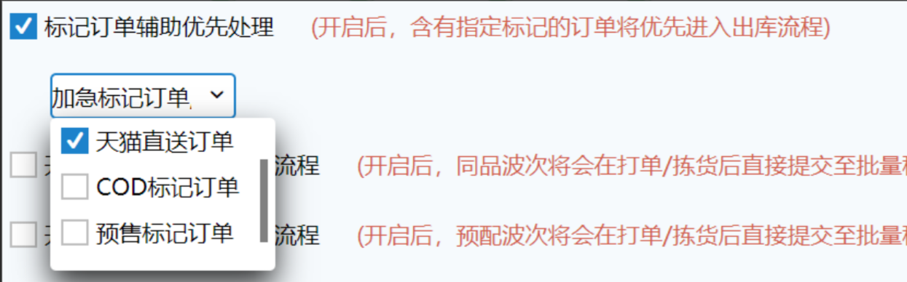

开启开关，例如选择加急标记订单  

①、锁库：带有加急订单的优先锁库

②、波次生成：波次策略开启禁止降级，由于未达到波次容量下限或已达到最大波次数，加急订单所属波次会降级，其他标记订单和普通不会降级；

③、波次中订单排序：在现有逻辑的接单时间前加了标记，货主>相同库区>同品>承运商>品牌>发票>库位>混品>标记>接单时间

④、领单：含有加急订单的波次会有“优”标记，领单时会优先被领取到

关闭开关，标记订单无特殊逻辑，与普通订单一样。

**4、开启同品波次快速出库流程**：开启后，同品波次将会在确认打单/拣货后直接提交至验货/打包/批量称重/待出库环节。方便用户对于同品波次的快速处理。

**5、开启预配波次快速出库流程**：开启后，预配波次将会在确认打单/拣货后直接提交至验货/打包/批量称重/待出库环节。方便用户对于预配波次的快速处理。

**6、开启指定策略快速出库流程**：开启后，指定的波次将会在打单/拣货后直接提交至批量称重/出库环节，此项优先级最高。方便用户对于指定波次订单的快速处理。

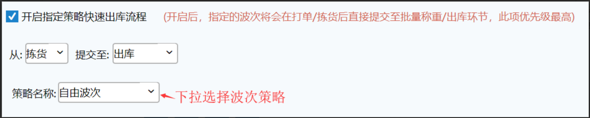

注意：开启指定策略快速出库流程的环节跳转与同品波次/预配波次的快速出库流程有冲突时，以指定策略的快速出库流程为准。

**7、开启快速验货后提交至待出库**：开启后，使用快速验货提交的订单将直接提交至称重/出库环节，包括PC、PDA。

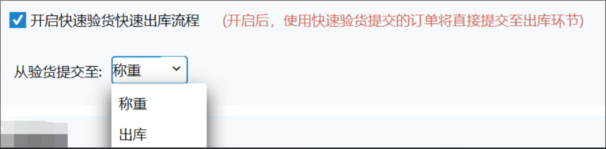

#### **2、流程管理**
**1、无匹配波次订单自动进入零拣打单**

开启后，在待分配页面匹配不到波次策略的订单，会自动打到零拣；未开启则不会自动打到零拣，可以手动打到零拣。

**2、开启商品条码截取**：开启后，扫描入库、出库验货环节中将商品条码同系统内截取后结果进行比对校验。

①.特殊信息截取：扫描输入商品条码，截取系统第一个++符号前的条码内容进行比对校验。

②.条码位数截取：扫描输入商品条码，截取输入条码的前若干位，与商品信息的条码进行比对校验。

③.自定义解析：扫描输入商品条码，忽略X位后与商品信息的条码进行比对校验。

**3、开启扫描条码强制提交**：开启后，扫描此条码可替代点击提交的动作，当验货或者其他环节因业务需要无法开启自动提交时，扫码后即相当于点击了提交按钮。

**注意：**

a.系统中有商品条码/辅助条码/箱条码是wanliniu666的，开启此开关需要先将商品条码/辅助条码/箱条码清除。

b.此开关开启后，不允许新增商品条码/辅助条码/箱条码是wanliniu666、

c.所支持的环节：分拣验货(单笔匹配模式)/条码验货/自定义环节条码验货/订单打包/收货入库/销退扫描入库/拆包补打/大宗装箱。

d.大宗装箱扫描此条码可将剩余未装箱商品全部装为一箱并自动提交装箱（序列号商品需手动操作录入）。

**4、出库作业扫描订单匹配波次**：开启后，设置页面按波次作业环节可通过扫描其中一单匹配波次，未设置页面不支持扫描其中一单匹配波次。

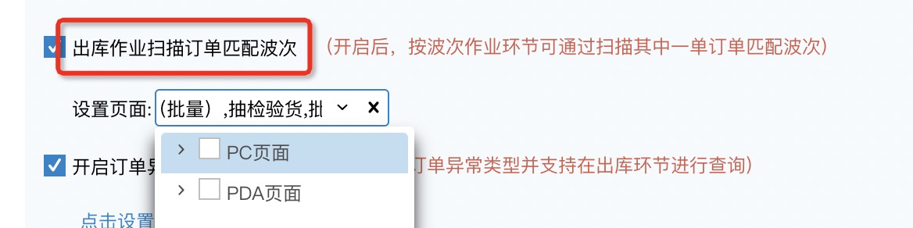

**注：此配置关联公司级后台开关(同单据自定义规则)，开启后才显示此配置项，未开启则不显示，原有支持扫订单带波次的页面仍支持带出。**

****

**5、出库作业扫描商品异常提醒**：开启后，扫描错误会有提醒弹窗需手工关闭。目前支持PC条码验货、大宗装箱两个页面。

勾选效果：扫描错误条码时弹窗提示报错，可点击回车键关闭

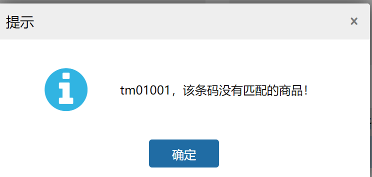

未勾选效果：无弹窗提醒

**6、限制批量环节指定波次提交**：开启后，批量验货/打包等环节会限制提交指定波次类型，逐单提交不受限制。

例：设置页面为PC-快速验货，限制波次类型为[清仓]，则在PC快速验货页面扫描清仓波次配货单号时，系统会提示该波次类型不支持批量匹配，支持通过扫描该波次下单笔订单号匹配单据。

**7、开启订单异常分类**：开启后可自定义订单异常类型，根据生成单号时的异常原因关键字解析，解析到指定关键字后订单打上该分类标记，并支持通过查询项“订单异常分类”查询到对应订单。

其中：

1、“匹配超区规则”是系统默认分类，开启开关就会显示，订单生成单号时提示超区替换的都会自动打上该分类标记

2、支持手动添加5个分类，异常类型固定为“获取电子面单失败”

3、分类名称限6个字，异常关键字解析最多20条，字数合计最多50字，在同一个仓库下不允许重复

4、添加分类后，“订单异常分类”查询下拉项会自动显示该分类

**8、开启缺货订单处理**：拣货或验货时，允许对订单进行缺货标记并单独处理异常。

:::color3
场景：适用于仓储出库环节的异常处理场景，当出现系统库存与实物库存不一致（如拣货时货位实物不足）、商品错发漏装等情况时，可通过该配置实现订单缺货标记、异常单独处理，避免异常订单影响正常出库流程，同时联动ERP系统同步缺货信息，保障库存数据准确性和订单交付效率。

:::

①. 选择允许报缺的环节

功能说明‌：设置可触发报缺操作的业务环节，当前配置为“拣货、验货”，即仅在这两个环节可标记订单缺货。

②拣货报缺时尝试自动锁定其他库位

功能说明‌：拣货环节标记缺货时，系统自动锁定指定范围内的其他库位，防止这些库位的库存被分配给其他订单，避免库存资源浪费和后续订单报错。（注：此项配置关联允许报缺环节，勾选“拣货”才显示此配置。）

操作步骤‌：

勾选“允许锁定库位”选项，启用自动锁定功能；

在“范围”列表中，勾选需要锁定的库位类型，当前配置已勾选“拣选库位”“存储库位”“箱拣选库位”，系统将仅对这三类库位执行锁定操作，拖动顺序可调整锁定优先级。

系统订单报缺重锁库存逻辑可按以下层级整理：

第一层：库存形态优先级锁定‌

若仓库开启了优先锁箱配置，则优先锁定货箱库存，仅当货箱库存不足时，再锁定拆零库存。确定锁定库存形态后，再走第二层逻辑。

第二层：库区与区域范围锁定‌

同库区优先：优先在报缺库位的同库区范围内查找可锁定库存。

邻近库区查找：同库区无库存时，在报缺库位左右30个库位的邻近库区搜索，超出30个库位范围则停止搜索。

同区域查找：邻近库区无库存时，在报缺库位所属的同区域范围内查找。

邻近区域查找：同区域无库存时，在报缺库位左右30个区域的邻近区域搜索，超出30个区域范围则停止搜索。

全仓范围锁定：上述范围均无库存时，扩展至全仓范围锁定库存。确定锁定库区/区域后，再走第三层逻辑。

第三层：指定库位范围+优先级锁定‌

在特定配置的库位范围内，按照预设的优先级规则锁定库存。确定锁定库位类型后，再走第四层逻辑。

第四层：库位分配偏好锁定‌

根据预设的[分配偏好](#iGMTY)执行锁定，偏好有四种：路径优先、效率优先、清仓优先、路径效率综合。

通过四层定位后，最终锁到符合的库位上，若四层定位后未找到符合库位，则提示提交缺货。

③. 选择订单已拣货的库位库存还回节点

功能说明‌：设置已拣货订单的库存还回时机，当前配置为“提交缺货”，即在提交缺货标记时，已拣货的库位库存将自动还回系统库存池，可供其他订单分配。

④. 拣货报缺时，缺货数量分配规则

功能说明‌：当系统库存不足需分配缺货数量时，按照设定规则进行分配。

+ 影响订单数最少：优先找未拣数量大于等于报缺数的订单，再找低于报缺数量订单由大到小排列依次报缺，最后若未拣数量一样再按照接单时间从晚到早依次报缺。
+ 付款时间最晚：涉及缺货的商品订单按付款时间从晚到早依次报缺，若付款时间一样再按照接单时间从晚到早依次报缺。
+ 订单总价（即订单实付）最低：涉及缺货的商品订单总价由低到高依次报缺，若订单总价一样再按照接单时间从晚到早依次报缺。
+ 商品数量最少：涉及缺货的商品订单商品总数量从低到高依次报缺，若订单商品数量一样再按照接单时间从晚到早依次报缺。

⑤. 拣货报缺时自动盘点库位库存

功能说明‌：拣货环节标记缺货时，系统自动触发对应库位的盘点任务，快速核对实物库存与系统库存的差异，修正库存数据偏差。

⑥. 报缺同时判断库位库存/库存总量是否足够，不足时通知ERP缺货，实现仓储与财务、销售系统的数据联动，及时同步缺货信息，便于后续补货、订单调整等操作。

功能说明‌：库存总量不足，报缺通知erp：报缺时对比每笔订单的缺货数量是否小于等于该商品库存总量的可用，是的话报缺不通知erp。否则通知erp。

库位库存不足，报缺通知erp：报缺时对比每笔订单的缺货数量是否小于等于该商品全仓的库位库存可用包含（报缺时还回的），是的话报缺不通知erp。否则通知erp。

**9、指定拦截替换环节**，订单可在已拣过货的前提下做替换动作

①指定拦截环节：可多选，开启后只有到指定拦截环节才弹拦截确认，前面环节可以正常提交。

②指定换单环节：单选，选择范围为指定拦截环节所选择的内容，如图选择验货后将在验货环节进行拦截替换，替换订单为待分配、预出库订单，优先捞取加急订单，再按接单时间顺序捞取，捞取订单将被锁定，不能自动/截单生成波次等操作，另订单在打包、待出库环节只是拦截，不替换。

③拦截订单可换条件/替换订单查找条件：选择后只有符合的订单才能进行拦截替换，有一个不符合就不能替换。

注：拦截环节对PDA也生效，但是PDA只进行拦截不会进行替换，在PDA操作后替换订单将解锁。

**10、开启耗材管理**：设置耗材登记环节后，订单在对应登记环节操作时会根据耗材设置规则，显示推荐耗材

各环节目前支持的页面如下：

验货环节：PC-条码验货、分拣验货

打包环节：PC-订单打包、批量打包，PDA-订单打包、批量打包

称重环节：PC-称重复核、批量称重，PDA-称重复核

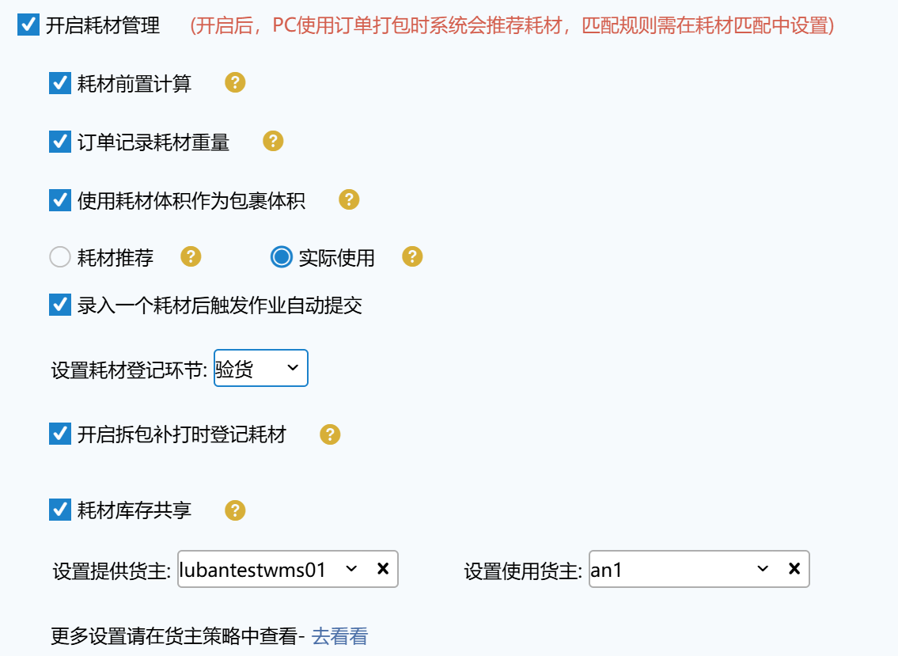

**1、耗材前置计算**

:::color3
场景：适用于没有开启打包环节但需要记录耗材使用的情况。

:::

开启后订单推送到系统中，直接根据耗材匹配设置的规则，提前记录订单推荐使用的打包耗材，在打单、拣货、验货等环节打出快递单、发货单后，根据耗材规则取耗材打包商品。最多匹配25种耗材。

**2、订单记录耗材重量**

:::color3
场景：可以解决耗材匹配使用了一个包装箱，箱体比商品重，使得称重时差异过大而报错这个问题。

:::

设置耗材登记环节可以选择打包/称重。选择打包时，耗材推荐/耗材推荐+实际记录显示在订单打包、批量打包页面；选择称重时，耗材推荐/耗材推荐+实际记录显示在称重复核、批量称重页面。

开启后使用的耗材商品重量会加到订单上，打包后订单上的重量和快递成本会重新计算。耗材推荐是根据推荐的耗材商品重量计算；实际使用是根据实际扫描的耗材商品重量计算。（设置耗材登记环节是称重时，订单称重后不会将耗材重量加到订单上）

不开启使用的耗材商品重量不会加到订单上，打包后订单上的重量和快递成本不会重新计算。

**3、使用耗材体积作为包裹体积**：单个订单视作一个包裹，每个包裹上取最大且大于包裹本身体积的耗材作为包裹体积。

开启后当包裹匹配到的耗材体积>包裹体积时，会将耗材体积更新到包裹上，若耗材体积<包裹体积，则不更新包裹体积。

若称重环节称重模式开启按包裹称重，当为多包裹订单时，则将耗材体积与每个子包裹进行对比。

例1：订单1无子包裹，订单体积为0.45m³，订单在耗材前置计算、打包/称重环节匹配到推荐耗材或录入实际使用耗材：耗材1*2个，单个耗材体积0.5m³，耗材2*3个，单个耗材体积0.25m³，由于耗材1单个耗材体积>订单体积，所以最终更新到包裹上的体积：0.5m³。

例2：订单2无子包裹，订单体积为0.45m³，订单在耗材前置计算、打包/称重环节匹配到推荐耗材或录入实际使用耗材：耗材1*2个，单个耗材体积0.3m³，耗材2*3个，单个耗材体积0.25m³，由于耗材1单个耗材体积<订单体积，不更新包裹体积。

例3：订单3有3个子包裹，体积分别为0.1m³、0.2m³、0.3m³，按子包裹称重时匹配到推荐耗材或录入实际使用耗材：耗材1*2个，单个耗材体积0.1m³，耗材2*3个，单个耗材体积0.25m³，则将子包裹1、子包裹2的体积更新为0.25m³，子包裹3体积不变，订单体积根据子包裹体积合计：0.8m³。

**4、耗材推荐**

订单耗材使用会根据设置的耗材匹配规则记录，不同类别的耗材会累加。

**5、实际使用**

订单耗材使用会根据实际扫描的耗材记录。

5.1 实际使用未录入时自动使用推荐耗材

:::color3
场景：仓库按推荐耗材进行包装时，不想再录入实际耗材的，可开启自动使用推荐耗材开关，免除录入操作。

:::

开启后，在对应操作页面验货/打包/称重，未登记实际使用耗材时，自动按推荐耗材填充耗材记录；未开启则不会按推荐耗材填充耗材记录，实际耗材记录为空。

5.2 强制录入耗材

:::color3
场景：为避免操作员有时会漏扫耗材，导致结算的时候库存对不上，造成费用损失，增加强制录入耗材限制。

:::

开启后，在对应操作页面验货/打包/称重，未登记实际使用耗材时，不允许提交订单；未开启则无此限制。

注：5.1和5.2开关不支持同时开启。

**6、录入一个耗材后触发作业自动提交**

勾选【录入一个耗材后触发作业自动提交】，且操作页面开启自动提交，则实际录入1个耗材后，订单自动提交；若未勾选，则需要手动提交。

a.勾选录入一个耗材后触发作业自动提交+登记环节：打包（PC和PDA打包）

开启自动提交，扫描一个耗材后订单自动提交到下一环节。

未开启自动提交，扫描一个耗材后需手动提交，也支持扫描多个耗材。

b.勾选录入一个耗材后触发作业自动提交+登记环节：称重（PC和PDA称重）

开启自动提交，耗材扫描框在最后一个，扫描一个耗材后订单自动提交到下一环节。

未开启自动提交，扫描一个耗材后需手动提交，也支持扫描多个耗材。

PDA称重复核需要连接蓝牙电子秤+开启称重复核自动提交时耗材扫描框在最后一个，扫描一个耗材后订单才会自动提交到下一环节。

耗材扫描框未在最后一个，PC和PDA称重扫描一个耗材后，会自动换行到下一个选项。

注：勾选录入一个耗材后触发作业自动提交，之前未开自动提交，扫了多个耗材后，再开启自动提交，再扫一个耗材，系统才会自动提交。

c.未勾选录入一个耗材后触发作业自动提交+登记环节：打包（PC和PDA打包）

开启自动提交，扫描一个耗材后订单不会自动提交到下一环节，需手动提交订单。

未开启自动提交，也需手动提交订单。

d.未勾选录入一个耗材后触发作业自动提交+登记环节：称重（PC和PDA称重）

未开启/开启自动提交，耗材扫描框在最后一个，扫描耗材后需手动提交。

耗材扫描框未在最后一个，PC和PDA称重扫描耗材后，开启万能条码，扫wanliniu666才会自动换行到下一个选项。

**7、设置耗材登记环节**

可选环节包括验货、打包、称重，设置后重新登录系统，可在指定环节操作页面登记耗材。

**8、开启拆包补打时登记耗材**：开启后拆包补打的拆单、拆包装箱模式支持登记耗材。

允许在拆包补打登记耗材需要同时满足以下条件：

+ 选择耗材按实际使用，勾选开启拆包补打时登记耗材
+ 订单当前环节为耗材录入的环节或已经过录入环节，如耗材登记环节为打包，则待打包之前环节的订单在拆包补打页面不允许录入耗材，待打包及之后状态的订单允许在拆包补打页面录入耗材。

在【拆包补打】模式登记耗材后，拆出的新订单会显示拆单时录入的耗材，原订单上的耗材信息（若有）会自动清除。

在【拆包装箱】模式登记耗材后，各包裹上的耗材会显示装箱时录入的耗材，订单上的耗材为各包裹上耗材的汇总信息。包裹上的耗材信息可以通过点击图标查看，如下图：

**9、开启耗材出库扣减**后，订单出库后，耗材库位库存、库存总量会扣减，并回传耗材信息给上游；未开启则不会扣减耗材库存，也不会回传。

注：单货主公司在此页面配置，多货主公司在货主策略tab配置

**10、耗材库存共享**

a.开启后，出库订单将统一扣减提供方货主库存，每天汇总扣减一次。配置成功后耗材统计自次日开始，第三日进行扣减。

b.提供货主：仅显示公司下启用中+授权本仓库+对接万里牛直连的货主。支持单选。

   使用货主：仅显示公司下启用中+授权本仓库+未开启货主级耗材出库扣减的货主。支持多选。

c.已设置提供货主，使用货主有耗材库存也不扣减。

注：生成出库单（其他出库类型）+扣减库位库存、库存总量。若生成单据失败则不锁定库存，支持单据重试，重试成功后直接扣减库存。

d.关闭耗材共享或耗材管理开关，立即生效，已操作的耗材后续不再进行统计和扣减。

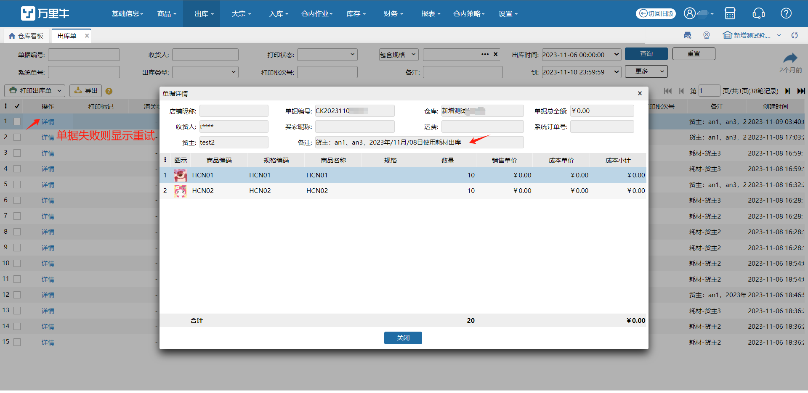

**11、开启销退入库回收耗材**

设置后指定入库页面支持耗材入库。

a).开启销退回收耗材+耗材库存共享显示耗材回收库位，必填项。

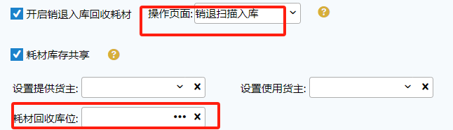

b).指定入库页面：开启销退入库回收耗材+指定页面+出库扣减耗材（有一个货主开启即显示），匹配单据成功且仅选择1个单据作业时显示耗材回收库位；

开启销退入库回收耗材+指定页面，匹配单据成功且仅选择1个单据作业时显示耗材条码框（疑难件直接显示）；

开启销退入库回收耗材+指定页面，匹配单据成功且仅选择1个单据作业时显示回收耗材信息tab；

c).原单据上有耗材则扫描后带出显示。

耗材出库扣减：未开启时入库后仅单据显示耗材数据，实际无库存入库；若开启则有实际耗材库存入库。

耗材共享扣减：例-A货主订单1录入耗材，出库扣减B货主库存；

扫描A货主订单入库，会自动带出耗材显示，入库后实际无耗材库存增加；

系统会自动跑批生成验货入库单据，统计B货主当日耗材回收记录（1张单据），耗材库存入库变化；失败时支持在系统任务重试。

**12、开启接力拣货**：开启后，PDA拣货支持接力拣货。

①.按区域接力拣货

PDA上拣货页面明细排序显示：按区域>按库区>按库位>按商品编码。

PDA上锁定在某个区域下明细都拣货完成后，自动提示是否提交接力拣货。

②.按库区接力拣货

PDA上拣货页面明细排序显示：按库区>按库位>按商品编码。

PDA上锁定在某个库区下明细都拣货完成后，自动提示是否提交接力拣货。

**13、开启大宗订单部分出库**：开启后，pda大宗拣货允许部分拣货后提交；若操作员有允许部分出库的操作权限，支持大宗部分出库。

**a.出库方式**

①多次拆单发货

开启后，大宗订单部分拣货后显示“部分发货”按钮，点击支持拣货完成部分拆单出库，剩余部分拆分到另一个订单中，可多次发货。

②单次发货完结

开启后，大宗订单部分拣货后显示“完结”按钮，点击支持拣货完成部分拆单出库，剩余部分拆分到另一个订单中并自动关闭。

**b.大宗装箱扫箱号添加装箱明细**

①历史关闭的大宗装箱箱号

开启后，可以在大宗装箱时扫描历史已关闭箱号以达到快速添加箱明细的效果。

具体匹配效果参考[大宗装箱](https://hupun.yuque.com/unzko7/lsbfg0/kuechc10g0uxd9ch#mBcbU)。

②打包装箱箱条码

关联仓库级箱记录管理开关，若当前仓开启该开关，则显示此配置且默认置灰勾选状态，否则不显示。

**14、开启拣货任务集合**：开启后，拣货完成系统会推荐配置的交接点，针对用户对于同一类商品拣货完成想统一放在一个地方，可以按照指定波次+拣货方式进行配置，集合方式分为拣货提交集合和拣货后独立集合，区别在于是否完成后需单独再拣货集合页面进行集合。最大等待波次数为当前集合库位可集合的最大数量，超过后会显示下个集合点，没有的话就会进行报错。

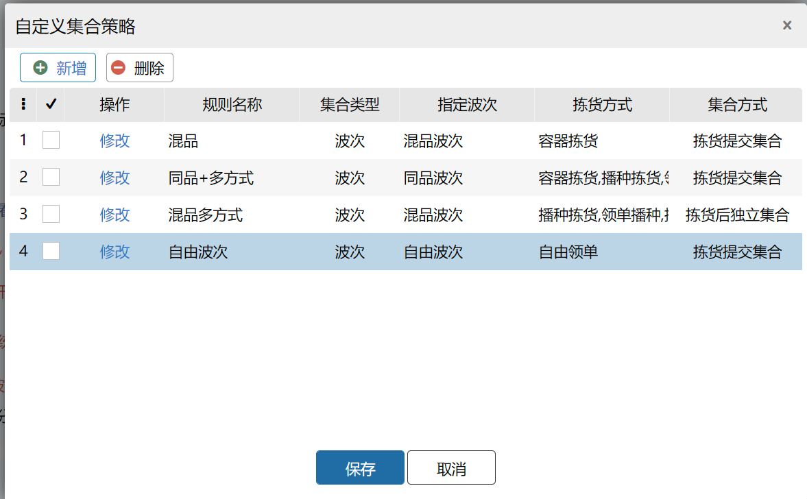

**15、开启大宗订单自动出库：**开启后，大宗订单，会在选择的节点完成后，触发自动发货，将订单系统状态变更为已完成。拣货：大宗订单在拣货完成后会触发自动出库；装箱：大宗订单在装箱完成后会触发自动出库，装箱中不会触发。

### 策略配置
**1、开启波次最大数限制**：开启后可选择不同类型波次最大生成数量，当波次生成达到设置数量时则暂不生成，订单保留在待分配界面

### 打印设置
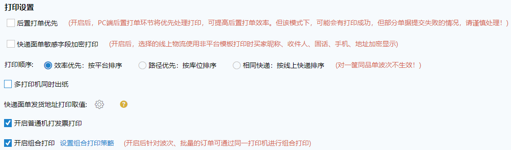**1、后置打单优先**

正常情况下后置打印单据前会检测该订单线上状态是否正常然后打印单据，开启后优先打印单据提高响应时间，但该模式下有打印成功订单提交失败的情况，请谨慎处理。

打印顺序：生成波次后波次下订单排序按此处设置排列

效率优先：相同打印控件的订单排列在一起，拼多多>菜鸟>京东>抖音>快手>唯品会MP

路径优先：按订单锁定库位编码从小到大排列

相同快递：订单承运商的线上物流公司相同的排列在一起

数量优先：按波次中订单商品数量从少到多/从多到少排序，关联赠品免计算开关（若开启则排除赠品明细数量）。

注：数量优先仅限对接自动播种机的用户使用

**2、快递面单敏感字段加密打印**

收件人脱敏：

a.去掉直连快递单模板处-收货人-敏感字段加密打印配置。

b.此处配置线上物流，该线上物流的承运商电子面单选择的直连模板，打印后收件人信息加密。

c.新增手机号脱敏格式：188******88和1******8888两种格式可选

注：顺丰丰密模板一直加密打印；平台类模板对于此配置不生效。

寄件人脱敏：

此处配置线上物流，该线上物流的承运商电子面单选择的直连/云打印/平台模板，打印后寄件人信息加密。

**3、多打印机同时出纸**

a).按承运商出纸：不同快递支持设置多台打印机，同时进行打印出纸。

波次策略承运商分组可选择不限，支持不同模板尺寸的快递订单生成到同一波次内。

b).按波次分流出纸：1个快递支持设置多台打印机，多波次操作打印时，多台机器同时打印出纸+一直衔接打印出纸。

与组合打印开关互斥，不支持同时开启。

**4、快递面单发货地址打印取值**

未设置：取快递单模板上设置的发货地址；若快递单模板上发货地址，手机号/固定电话、联系人、联系地址有一个为空时则打印正常为空。

已设置：取快递单模板上设置的发货地址；若快递单模板上发货地址，手机号/固定电话、联系人、联系地址有一个为空时就按照此处设置的顺序取发货地址，一直不满足则一直取，直至取至最后一项。

直连类模板不支持此配置，仅取打印模板上的。

**5、开启普通机打发票打印**

控制仓库是否显示发票相关数据功能的开关。

**6、开启组合打印**

与多打印机出纸开关互斥，不支持同时开启。

a).设置打印方案后，零拣打单、波次打单、大宗出库页面可操作组合打印；pda扫描工作台也支持组合打印。

b).打印方案：同一方案内每种单据类型仅支持配置一次；至少配置2种单据类型；配货单仅支持在最前或最后打印（若为波次，则跟随波次打印）。

c).打印机设置：指定打印机-按设置的固定打印机出纸；

                  按首个快递打印机-打印的这波订单中按首个承运商所设置的打印机出纸。

PC端支持多份数打印。

### 库位分配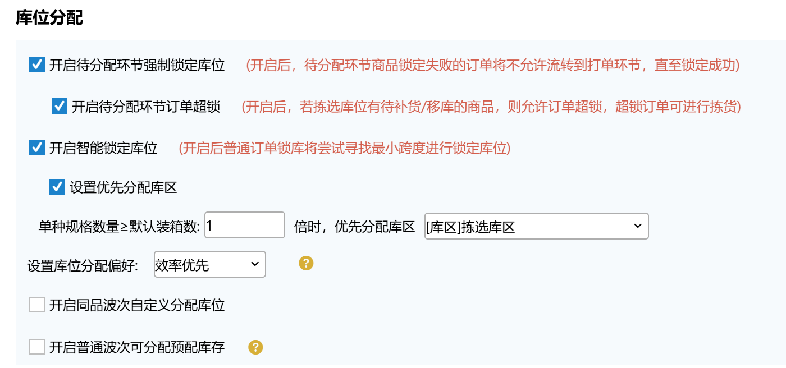
**1、待分配环节强制锁定库位**：开启后，待分配环节商品锁定失败的订单将不允许流转到打单环节，直至锁定成功。

**1.1 开启待分配环节订单超锁：**开启后，若拣选库位有待补货/移库的商品，则允许订单超锁，超锁订单可进行拣货。

:::color3
场景：订单商品在拣选库位库存不足，但系统支持补货。此时启用超锁，可强制分配库位并生成波次。允许缺货订单参与波次计算，使波次生成结果更优（订单聚合更集中、路径更短），避免因个别缺货导致波次延迟或分散，最终实现拣货效率的整体提升。

:::

订单进入待分配环节，系统根据锁库相关配置尝试锁定目标库位，商品拣选库位可用库存不足时，若开启超锁功能，订单明细有待补货/移库任务，且任务目标库位符合订单锁库配置，系统自动执行超锁：可锁定数量 = 目标库位可用库存 + 补货 / 移库在途库存； 超锁后订单可正常进行组波、拣货作业，拣货时若库位实际库存不足，扣减库存时允许扣成负数。

例：商品A 拣选库位jx01、jx02 无可用库存，存储库位cc01 有可用库存10个，待移库任务yk01 商品A 来源库位cc01 目标库位jx01 数量5个，待补货任务bz01 商品A 来源库位cc01 目标库位jx02 数量5个。订单1有商品明细A 数量10个。未开启超锁时，手动截单生成波次失败，原因库位库存不足；

开启超锁时，手动截单生成波次成功，明细有两条锁库记录：jx01 可用数量-5，jx02 可用数量-5。波次能正常拣货下架出库。

注： ①需先开启 “待分配环节强制锁定库位”，超锁功能才会生效；

 ②超锁只在手动截单/自动截单生成波次时生效，全仓清单、手工波次、打到零拣等不生效。

**2、开启智能锁库**：开启后锁库的顺序是标记的普通订单优先锁库，非标记的普通订单会先锁库同库区再锁跨库区最后锁跨区域，锁同库区或跨库区，库区编码小的优先锁；锁跨区域的逻辑不变按库位分配偏好和优先级。例如

库区kw1有A、B、C-库位s2-优先级2

库区kw2有A、B、D-库位s3-优先级1

库区kw3有A、C、D-库位s1-优先级2

1类订单：订单有A+C -100笔-普通订单

2类订单：订单A+D-300笔-普通订单

3类订单：订单A+C+D-200笔-普通订单

4类订单：订单A+B+C-200笔-普通订单

①.开启智能锁库：1类订单锁库区kw1；2类订单锁库区kw2；3类订单锁库区kw3；4类订单锁库区kw1。

②.未开启智能锁库：1类订单锁跨库取kw2和kw3；2类订单锁库区kw2；3类订单锁跨库区kw2和kw3；4类订单锁跨库区kw2和kw3

**注：**

①.智能锁库和普通订单锁定规格箱的开关不能同时开。

②.订单类型是单种的一件或多件，按照同库区的优先锁。

③.订单中只要含有生产批次商品或入库批次商品，订单锁库都是按照之前的逻辑，不按照同库区的优先锁。

④.订单中只要有明细锁库失败，未锁库失败的明细按照之前的逻辑，不按照同库区的优先锁。

**3、设置库位分配偏好**：当订单从待分配提交至打单环节时，系统会根据用户选择的偏好自动为订单所有商品锁定拣选库位库存。方便用户高效找到库位并拣货。

**提示**

若当前仓库无拣选库位，则订单到打单环节时操作记录显示分配失败。

①【路径优先】：走路最少,适用于面积较大/路径较长仓库

根据拣选库位编码从小到大分配给商品。若该商品有拣选库位库存满足需求量，则直接分配编码最小的拣选库位；若商品没有满足需求量的拣选库位库存，则直接分配最小的库位库存，锁定库存为负数；若商品的各个拣选库位库存不满足需求量但所有拣选库位库存满足需求量，则按照拣选库存编码从小到大分配，直至足够。

②【效率优先】：拿的次数最少,适用于产品较重/较大或者拆包麻烦的仓库

根据商品的拣选库位库存最接近商品所需量进行分配库位。若该商品有拣选库位库存满足需求量，则直接分配满足需求量且库位编码的拣选库位；若商品没有满足需求量的拣选库位库存，则直接分配库存数量最大的拣选库位，锁定库存为负数；若商品的各个拣选库位库存不满足需求量但所有拣选库位库存满足需求量，则按照拣选库存数量从大到小分配，直至足够。

③【清库优先】：按库位库存从少到多的去拿，主要用于出库时尽可能把边边角角的商品出库掉，腾出库位空间做存放其他商品。

根据商品的拣选库位库存从少到多的进行分配库位，若库位库存数量相同按照库位设置优先级从高到低去分配，若库位设置的优先级也相同，最后按照库位编码从小到大进行分配。

④【路径效率综合】：能一次拿完直接拿,不然按走路最少的拿

优先根据商品拣选库位最接近商品所需数量进行分配。若该商品有拣选库位库存满足需求量，则按照效率优先执行，若商品没有满足需求量的拣选库位库存则按照路径优先规则进行分配。

**4、开启普通波次可分配预配库存**：开启后，允许锁定的波次类型可按指定预配策略锁定预配库位。

其中锁定预配库位需满足以下两个条件：

①单个预配库位可用库存需至少满足一份预配数量。

例：预配策略YP01，指定规格a01 数量2，指定预配库位Y01 a01库位库存可用数量1，则不满足一份预配数量要求；指定预配库位Y02 a01库位库存可用数量2（或≥2时），则满足一份预配数量要求。

②预配策略为单种商品。预配策略中指定2种及以上规格的不符合要求。

例：预配策略YP01，指定规格a01 数量2，则符合单种商品要求；预配策略YP02，指定规格a01 数量2、a02 数量3，则不符合单种商品要求。

若指定波次类型无可被使用的预配策略，则按拣选库位+库位分配偏好锁库；

若指定波次订单有多规格明细，可按sku匹配多个预配策略；

若指定预配库位库存不足，则优先锁预配库存，剩余部分锁拣选库存。

注：此配置与智能锁库互斥，不允许同时开启；

若开启允许普通订单锁箱，此配置不生效。

### 风险预警
#### 1.仓储环节
1、店铺订单个性化加急标记：仓库级配置，开启后设置店铺和预警时间，超出预警时间订单打上标记需优先出库。

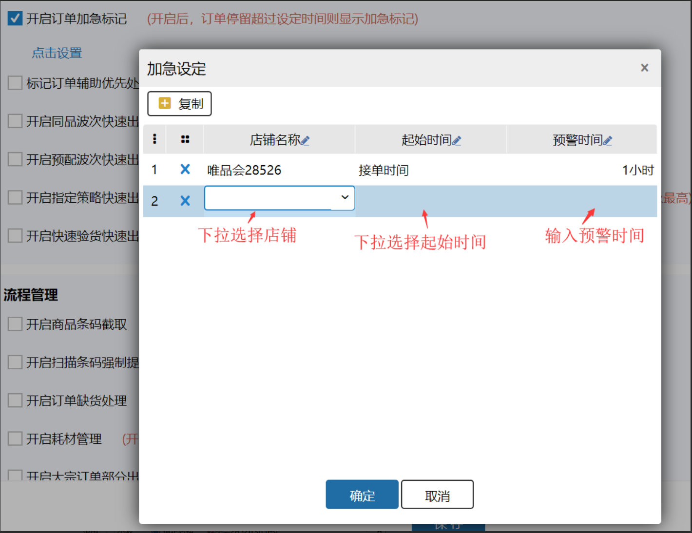

2、仓储操作-环节超时预警：各环节配置预警时间，超时则标记为异常预警订单，后续去异常订单处理。仓库无XX出库流程环节则不显示对应环节配置。

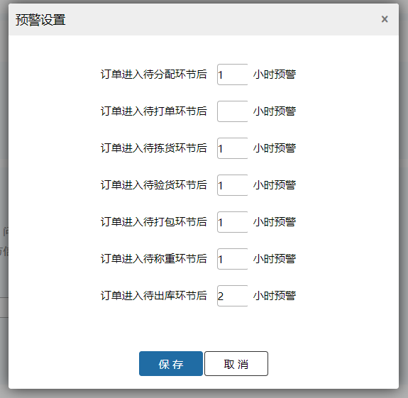

3、订单多发货预警：开启此开关后，订单取号后自动订阅物流轨迹，有轨迹信息则疑似重复发货，订单异常类型显示【疑似重复发货】，可在异常订单中处理。订单出库后不再重复订阅物流轨迹。

单号来源：历史记录——回收的电子面单对应的记录；出库订单——出库的电子面单对应的记录。

注：需要启用物流运输轨迹订阅后生效，监控范围为订阅配置的承运商，一个订单多次取号都会进行监控。

3.1有预警的订单出库后自动取消预警	：开启此开关后，有预警的订单，订单状态变已出库了，取消多发货预警。适用于仓库在出库前已经提前揽收场景，可避免误报干扰。但取消后会缺失重复打单预警能力

#### 2.物流运输

1、设置订阅物流轨迹的线上物流，韵达快递需在授权配置内填写数据；顺丰速运订阅后不扣减余额也需在授权配置内填写数据。

2、待揽收、运输中、已揽收物流状态的订单根据设置预警时间，订单自动预警并打上超时标识（关闭配置后已落地数据不去除标识）。

3、点击余额详情支持跳转到物流跟踪详情查看每日余额明细。

### 自动策略
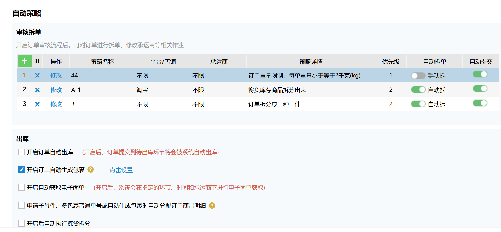

**1、拆单审核：**开启订单审核流程后，可在此处配置不同拆单规则。

:::color3
场景：针对库区分散、商品体积大导致的多件订单拣货效率低、无法与单件订单混合组波次的问题，系统在订单审核环节自动将多件订单按商品明细拆分为多个单件子订单，每个子订单对应一个包裹并使用子母件电子面单。通过这种方式，所有订单统一按单件原则组波次，拣货员每次只需拣一件商品即可完成任务，无需区分订单类型或进行多人接力，既提升了拣货效率和路径优化，又降低了物流成本和操作异常率，实现库内作业与物流包裹的精准对应。

:::

本策略应用于订单审核批量拆单功能。前提条件：开启接单审核。

订单进入订单审核页面后，若订单上的平台/店铺+承运商能匹配到拆单策略，且该策略拆单模式【自动拆】，则按照拆分条件拆出主子单；若拆单模式为【手动拆】，则按顺序往下匹配其他策略。若当前策略开启自动提交，则拆出订单自动提交到下一环节；否则不提交。

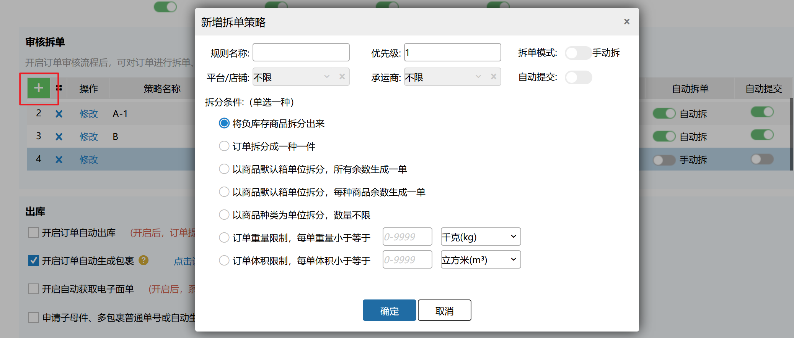

拆分条件用法如下：

（1）将负库存商品拆分出来：将订单中缺货的明细拆出新订单；

（2）订单拆分成一种一件：将订单拆分成一单一件，每个订单1个明细；

（3）以商品默认箱单位拆分，所有余数生成一单：“默认箱”即商品信息-装箱规格-默认箱设置，此项可以按照默认箱为单位将订单拆分为多个订单，不够拆分成默认箱的剩余明细会生成到一个订单中；

举例：商品sku1 默认箱1:2，商品sku2默认箱1:4，商品sku3无默认箱设置，订单1中有明细sku1 4个，sku2 5个，sku3 2个。

按此项拆分后有4个订单：订单1：sku1 2个，订单2：sku1 2个，订单3：sku2 4个，订单4：sku2 1个，sku3 2个。

（4）以商品默认箱单位拆分，每种商品余数生成一单：按照默认箱为单位将订单拆分为多个订单，不够拆分成默认箱的剩余明细按sku生成多个订单；

举例：商品sku1 默认箱1:2，商品sku2默认箱1:4，商品sku3无默认箱设置，订单1中有明细sku1 4个，sku2 5个，sku3 2个。

按此项拆分后有5个订单：订单1：sku1 2个，订单2：sku1 2个，订单3：sku2 4个，订单4：sku2 1个，订单5：sku3 2个。

（5）以商品种类为单位拆分，数量不限：将订单拆分成一种一件，每个订单1种sku；

（6）订单重量限制，每单重量小于等于[]千克：将订单拆分到指定重量范围内，若被拆分订单1已小于设定值，则不做拆分，若订单中的单个商品已超过设定值也不做拆分；

（7）订单体积限制，每单重量小于等于[]千克：将订单拆分到指定体积范围内，若被拆分订单1已小于设定值，则不做拆分，若订单中的单个商品已超过设定值也不做拆分。

拆成主子单效果如下图：

注：

①单仓下规则名称不允许重复，最多10个字符；

②每个仓库最多20条规则；

③将负库存商品拆分出来+自动拆单+自动提交，拆单后自动提交到预出库订单，缺货部分会保留在预出库订单等待补货，有货部分在批处理执行后进入待分配；

④平台/店铺、承运商设为不限时，包含订单平台/店铺、承运商为空的情况；

⑤一般按照优先级+页面排序匹配拆单策略，缺货订单优先匹配“将负库存商品拆分出来”策略（若有）。

****

**2、开启订单自动出库**：开启后，提交到待出库环节的订单会被系统自动出库。

**3、开启订单自动生成包裹：**开启后，订单将在接单后按规则自动生成包裹。

:::color3
场景：对于需要根据订单中商品数量自动生成子母件/多包裹普通快递单，以提升打单效率的仓库，可开启此配置，再配合自动生成/子母件/多包裹单号开关，在接单时按规则配置自动生成包裹及快递单号。

:::

开启后可按需设置包裹生成规则，符合指定平台/店铺+承运商的订单，接单后会根据不同生成规则生成对应子包裹。

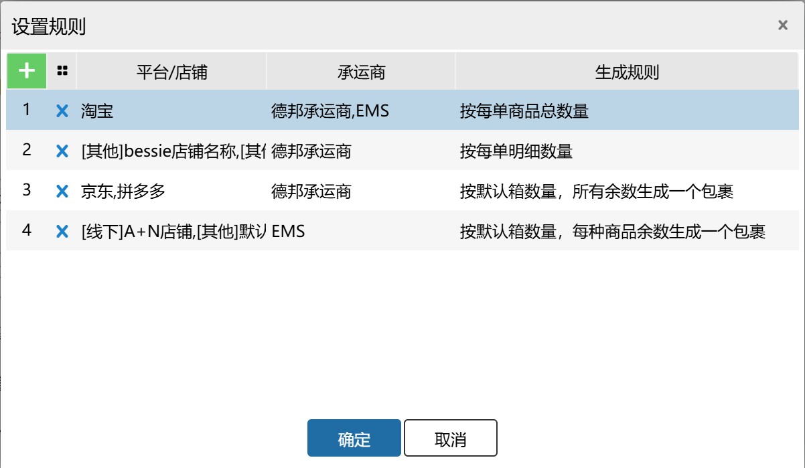

注：①仓库接单后，订单审核、预出库、待分配环节订单执行订单自动生成包裹逻辑，大宗出库环节不会执行订单自动生成包裹逻辑；

②相同的平台/店铺+承运商只能设置一条规则，不能重复设置多条；

③店铺不同、店铺所属平台相同的，也视为重复（比如第1个规则设置【淘宝+德邦承运商+按每单商品总数量】，第2个规则设置【[淘宝]淘宝店铺+德邦承运商+按每单明细数量】，则两个规则视为重复数据）；

④默认箱按商品信息装箱规格或多单位默认箱计算，若无默认箱则视为0箱。

**4、开启自动获取电子面单**：开启后，订单需同时符合指定环节、指定时间、且在排除承运商范围外的，系统会自动获取电子面单。若指定平台/店铺+承运商设置了自动生成子母件/多包裹单号生成规则，则符合规则的订单自动获取子母件/多包裹单号。

指定环节可以选择三种：

①.指定环节选择“预出库/待分配/大宗/待打单”，订单落单后会进行获取电子面单，只含预出库、待分配、待打单、大宗出库的订单。

②.指定环节选择“待分配/大宗/待打单”，订单落单后会进行获取电子面单，只含待分配、待打单、大宗出库的订单。

③.指定环节选择“待打单”，订单从待分配到待打单订单都会生成电子面单。例如手动打到零拣、自动打到零拣、自动生成波次、手动截单波次、清仓波次、手工波次、缺货订单手动提交到零拣或手工波次，订单都会生成电子面单。

指定时间：落单时间在指定时间范围内的订单会进行获取电子面单。

排除承运商：承运商不在排除承运商范围内的订单会进行获取电子面单。

自动生成子母件/多包裹单号：开启后可按需设置单号生成规则，符合指定平台/店铺+承运商的订单，接单后会根据不同生成规则生成对应子母件/多包裹单号。

注：①必须先开启自动生成包裹开关，才允许开启和配置自动生成子母件/多包裹单号；

②未生成子包裹的订单，即使符合自动生成子母件/多包裹单号规则，也不会生成子母件/多包裹单号；

③只能生成1个子包裹的订单，默认不生成子包裹。

**5、申请子母件、多包裹普通单号或自动生成包裹时自动分配订单商品明细：**开启后，执行生成子母件、生成包裹分别申请普通单号或自动生成包裹等操作时，将按规则将指定货主的订单商品明细拆分到包裹里。

例：开启订单自动生成包裹开关+自动生成子母件/多包裹单号+开启申请子母件、多包裹普通单号或自动生成包裹时自动分配订单商品明细-指定货主A。假设下列订单都符合规则配置，则：

订单1：淘宝平台，淘宝测试店铺，德邦承运商，商品明细a*2、b*2，则接单后按每单商品总数量4个计算，订单自动生成4个子包裹及子母件单号，各子包裹中商品明细：a*1、a*1、b*1、b*1；

订单2：其他平台，线下测试店铺，德邦承运商，商品明细a*2、b*2、a*1，则接单后按每单明细数量2种计算（相同sku合并为1种），订单自动生成2个子包裹及多包裹单号，各子包裹中商品明细：a*3、b*2；

订单3：京东平台，京东测试店铺，德邦承运商，商品明细a*10（默认箱1:3）、b*10（默认箱1:4），则接单后按商品默认箱数量算出5个箱，每个箱为1个包裹，再将所有余数生成1个包裹，共生成6个子包裹及子母件单号，各子包裹中商品明细：a*3、a*3、a*3、b*4、b*4、a*1+b*2；

订单4：线下平台，A+N店铺，EMS承运商，商品明细a*10（默认箱1:3）、b*10（默认箱1:4），则接单后按商品默认箱数量算出5个箱，每个箱为1个包裹，再将每种余数生成1个包裹，共生成7个子包裹及多包裹单号，各子包裹中商品明细：a*3、a*3、a*3、b*4、b*4、a*1、b*2。

**6、****开启后自动执行拣货拆分：**开启后可指定波次按拣选范围/按商品种数上限/按商品数量上限自动拆分拣货任务。

### 校验

**1、开启打单校验**

①.强制校验：开启后，在”零拣打单”或“波次打单”环节如果没有打印选择的单据则不允许“确认打单”，提交至下一环节。

②.提醒校验：开启后，在”零拣打单”或“波次打单”环节如果没有打印选择的单据则提醒有订单未打快递单，是否确认提交？点击是，确定打单提交到下一环节，点击否不确定打单，不提交下一环节。

**2、开启重复打单校验**	

开启后，重复打单时需输入随机验证码

开启开关且操作员有“允许补打单据”操作权限时，重复打印快递单、发货单、配货单时会弹窗提示，需要输入随机验证码，正确后才能重复打印。

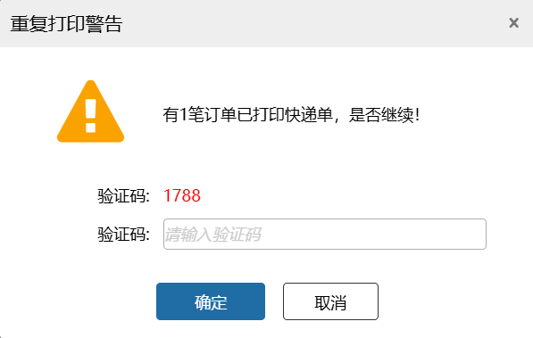

**3、开启称重复核校验**：开启后，称重环节将会根据订单商品总重量和输入的重量计算是否在误差内，若超过误差范围则提醒。误差范围=[订单商品总重量-x，订单商品总重量+x]，x=百分比*订单商品总重量或者x=固定值。

**4、开启PDA拣货检验商品条码**：开启后共4中检验方式可供选择，不开启则默认仅扫描库位编码

仅商品种类：仅扫描商品条码，每种SKU扫描一次

仅商品数量：仅扫描商品条码，按商品数量扫描

库位、商品种类：先扫描库位编码再扫描商品条码，每种SKU扫描一次

库位、商品数量：先扫描库位编码再扫描商品条码，按商品数量扫描（逐渐扫描）

**5、开启验货环节独立播种**：开启后，验货环节的订单支持独立播种，可再进行条码验货操作

**快速流程：（PS：生产批次标准模式下，快速出库流程结束环节不能跳过验货环节。）**

同时启用播种验货可以直接提交：开启后，播种验货页面和独立播种页面同时显示，可以选择所需菜单进行作业。

**6、选择PDA拣货粒度**：根据所选的批次粒度，显示拣货任务

目前支持PDA批量拣货

库位+商品：同一库位，跨订单合并同款商品总量拣取

库位+订单+商品：同一库位，按单个订单汇总同款商品拣取

库位+订单明细：同一库位，按订单每行明细单独拆分拣货

case

一个波次包含3笔订单：

订单01商品A（SKU 1001-10）两条明细数量分别3和4，分配相同库位 A01-01-A01 共7件；

订单02商品A分配库位 A01-01-A01 7件，库位 A01-01-A02 3件；

订单03商品A分配库位 A01-01-A01 8件，库位 A01-01-A02 5件；

批次粒度配置

1.库位+商品（默认）：生成2条拣货任务

任务1：库位 A01-01-A01，商品A，待拣数量22件（7+7+8汇总）

任务2：库位 A01-01-A02，商品A，待拣数量8件（3+5汇总）

2.库位+订单+商品：生成5条拣货任务

任务1：库位 A01-01-A01，商品A，订单01，待拣7件；

任务2：库位 A01-01-A01，商品A，订单02，待拣7件；

任务3：库位 A01-01-A01，商品A，订单03，待拣8件；

任务3：库位 A01-01-A02，商品A，订单02，待拣3件；

任务3：库位 A01-01-A02，商品A，订单03，待拣5件；

3.库位+订单明细：生成6条拣货任务

任务1：库位 A01-01-A01，商品A，订单01，待拣3件；

任务2：库位 A01-01-A01，商品A，订单01，待拣4件；

任务3：库位 A01-01-A01，商品A，订单02，待拣7件；

任务4：库位 A01-01-A01，商品A，订单03，待拣8件；

任务5：库位 A01-01-A02，商品A，订单02，待拣3件；

任务6：库位 A01-01-A02，商品A，订单03，待拣5件；

### **赠品管理**

**1、开启赠品商品免验货**：开启后商品属性为赠品的且无序列号的，在条码验货、播种环节可免验商品

**2、开启赠品商品免拣货**：开启后订单拣货、批量拣货、播种拣货、料框拣货、大宗拣货中赠品商品数量直接显示已拣

**3、开启赠品类型商品免计算**：开启后，波次判断生效订单的商品种类和商品数量时，不计算赠品的数量,波次生成时，不统计赠品锁定的库区。

> 更新: 2026-08-17 13:55:39  
> 原文: <https://hupun.yuque.com/unzko7/lsbfg0/koouhyfe442qcd1h>