# 业务配置-货主策略

货主策略将部分配置下放到货主级别，适用开启3PL的公司根据货主分别设置规则。

### 01.开启地区禁发拒绝接单
开启后，订单收件人地址在指定地区范围内或包含地址关键字的，直接拒单，在erp操作记录中可以看到拒单原因

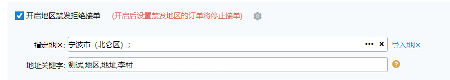

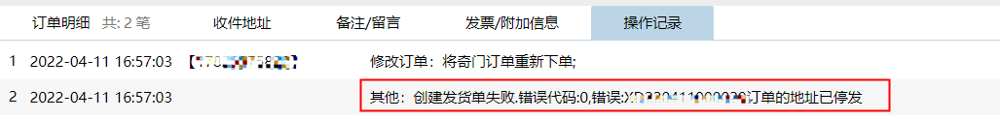

**注：**

①.开启后，指定地区和地址关键字至少设置一个

②.指定地区支持手动选择或批量导入

③.地址关键字支持用顿号、逗号(不区分中英文)、空格分隔

④.禁发设置支持批量应用到其他货主上，具体操作如下：

### 02.允许缺货接单
开启后允许缺货接单，接单后缺货订单进入预出库页面排队，库存补足后自动流转进入出库流程。

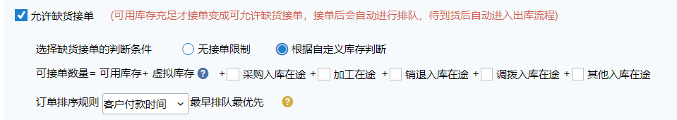

1.无接单限制：可接单数量无限制

2.根据自定义库存判断：可接单数量可配置，默认可接单数量=可用库存+虚拟库存，虚拟库存可以手动修改，可用手动勾选加上其他在途库存。可接单库存充足时允许接单，不足时拒单。

3.订单排序规则默认根据客户付款时间从早到晚排序，当缺货订单全部清除后允许修改排序规则

其中：

①.开启缺货接单后，出库模块下显示“预出库订单”页面

②.开启根据自定义库存判断，库存模块下显示“可接单库存”页面

### 03.开启接单审核（限3PL版本）
开启后，出库模块显示“订单审核“菜单，对应货主的订单落单后优先进入订单审核页面，未开启的货主订单落单后进入待分配、预出库或大宗出库。

### 04.商品条码截取
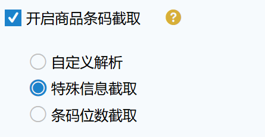

1.开启商品条码截取：开启后，扫描入库、出库验货环节中将商品条码同系统内截取后结果进行比对校验。

1.1特殊信息截取：扫描输入商品条码，截取系统第一个++符号前的条码内容进行比对校验。

1.2条码位数截取：扫描输入商品条码，截取输入条码的前若干位，与商品信息的条码进行比对校验。

1.3自定义解析：对扫描读取到的条码值进行位数删减，支持多种策略

特殊字符截取示例：

商品a系统中的条码1422++001

实际扫描条码：1422、1422++001都可以匹配到商品a

条码位数截取示例：截取前6位

商品a系统中的条码05121422；商品b系统中的条码2020

实际扫描条码2020，匹配到商品b；实际扫描051214匹配到商品a

自定义解析示例：

解析规则：从后往前忽略3位，全部品牌    

商品a系统中条码：05121422

实际扫描条码：05121422ASD，忽略后3位匹配到商品a

1.4自定义解析+开启保留区间截取：后台开关需要技术开启，开启后支持从X位到XX位截取匹配。

（PDA同样支持）

自定义解析+开启保留区间截取示例：

解析规则：保留区间截取，品牌：新增的品牌，保留区间截取第6到18位，条码长度范围为从0-21

商品A系统中商品条码69200811001-新增的品牌

商品B系统中商品条码69200811002-新增的品牌

扫描条码1234569200811001001，保留区间截取第6到18位匹配到了商品A。

扫描条码01234569200811002001，条码不在长度范围0-21内匹配不到商品B。

### 05.开启前置发货
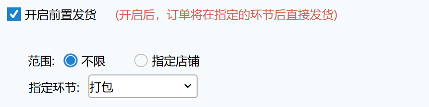

开启后，选择前置发货的环节，当订单在此环节确认后则会通知erp发货（直接确认订单），快速提交的跨节点订单也符合可以前置发货。如果为万里牛ERP，可配合ERP的通知线上发货时机提前功能，实现线上平台发货。

①、前置发货为获取单号后，则手动或自动获取单号后，系统计算运费成本然后通知ERP发货。

其中：

手动获取单号包括手动申请电子面单、普通面单、手动输入单号、导入运单号等操作，具体页面有预出库订单、待分配、零拣打单、波次打单、拆包补打拆出新订单等；

自动获取单号关联出库配置-自动策略-开启自动获取电子面单，开启后则生成单号后通知前置发货；

若订单清关时获取到单号的，也会触发前置发货；

若订单已经有单号了，或者从上游带了单号过来的，手动修改单号不会触发前置发货。

②、前置发货为打单环节，订单生成波次或打到零拣时计算运费成本，确认打单后通知ERP发货。

③、前置发货为拣货环节，订单提交到拣货环节时计算运费成本，确认拣货后通知ERP发货。

④、前置发货为验货环节，订单提交到验货环节时计算运费成本，确认验货后通知ERP发货。

⑤、前置发货为打包环节，订单提交到打包环节时计算运费成本，确认打包后通知ERP发货。

⑥、前置发货支持指定店铺，选择店铺后，属于指定店铺的订单才会在环节后通知erp发货

### 06.允许同步视频记录至ERP系统

开启后，在WMS相关操作页面（目前仅支持PC条码验货页面）录制的视频记录会同步到ERP系统（仅支持万里牛ERP）。

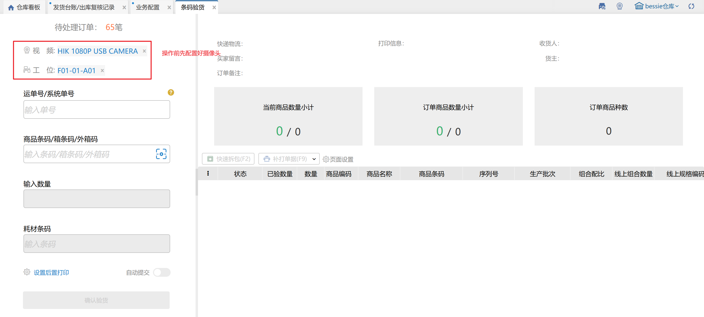

ERP订单查询页面，对应订单接收到视频记录后会显示图标（前提：ERP系统开启出入库视频监控溯源），点击可查看视频内容。

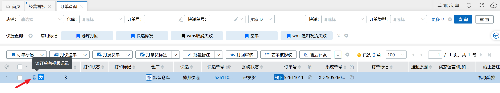

注：外网模式下查看视频产生的流量会计入当前仓。

### 07.开启指导规则补充
开启后，对于指导上架，新品入库上架，容器上架、补货上架指导无结果的情况进行补充，指导出空货位进行上架。

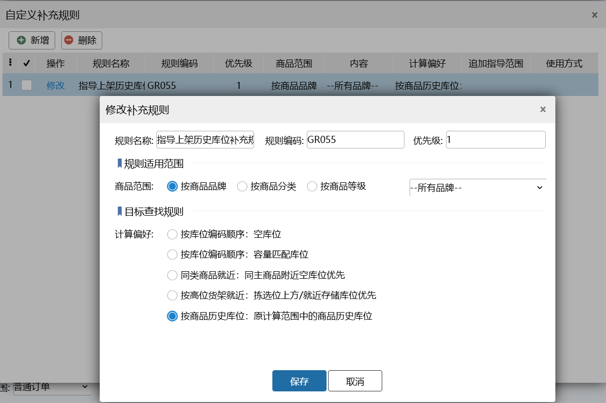

1.匹配范围，同时满足以下2点才能匹配规则

①.商品的品牌/分类/等级在设置的商品品牌/商品分类/商品等级范围里；

②.选择的指导方式在设置的使用方式范围内。

2.计算偏好

①.【按库位编码顺序：容量匹配库位】：在选择的区域里按照商品数量从少到多的指导库位，空库位优先。

②.【按库位编码顺序：空库位】：在选择的区域里找库位编码最小的空库位。

③.【同类商品就近：同主商品附近空库位优先】：在选择的区域里找库位编码距离同款库位编码最近且库位编码最小的空库位。

④.【高位货架就近：拣选位上方/就近存储库位优先】：寻找一个有库位的拣选库位作为锚点库位，在该库位上方/附近寻找存储库位。

锚点库位：在库区范围内寻找一个有该商品库存且是托盘类型的拣选库位作为锚点库位

指导高位货架优先级

1.同库区同巷道同货架同货位，锚点库位的层数向上搜索20层，有符合要求的托盘类型空库位则作为指导结果之一，没有则走下一条指导逻辑；

2.同库区同巷道同货架相邻货位，以锚点库位为基础，货位向左搜索2个货位, 按货位号从大到小顺序；货位向右搜索2个货位, 按货位号从小到大顺序；单个货位按锚点库位层索引向上搜索20层，有符合要求的托盘类型空库位则作为指导结果之一，没有则走下一条指导逻辑；

3.同库区同巷道相邻货架, 以锚点库位的货架为基础，货架向左搜索60个货架, 按货架号从大到小顺序；货架向右搜索60个货架, 按货架号从小到大顺序；单个货架, 按货位距离(左侧货架货位号从大到小, 右侧货架货位号从小到大), 货位数量取5个；按锚点库位层索引向上搜索20层，有符合要求的托盘类型空库位则作为指导结果之一，没有则走下一条指导逻辑；

4.同库区相邻巷道，以锚点库位的巷道为基础，巷道向前、向后搜索2个巷道，按从前到后顺序；单个巷道货架按从前到后，单侧#60个货架；单个货架, 按货位距离从小到大(头部货架货位号从小到大, 尾部货架货位号从大到小), 货位数量取5个；按锚点库位层索引向上搜索20层，有符合要求的托盘类型空库位则作为指导结果之一，没有则走下一条指导逻辑；

5.寻找范围内符合条件的拣选库位空库位；

⑤.【按商品历史库位：原计算范围中的商品历史库位】：寻找有存放过该商品的历史库位

若之前的指导无结果，则按照指导补充规则设置的商品品牌/商品等级/商品分类+指导库区+库位使用方式+是否找空库位去指导。

示例：

sku1-品牌A、sku2-品牌B、sku3-品牌A、sku401-品牌A，sku501-品牌B

sku1-在库区02设置了优先库位kw01-拣选库位

sku2-在库区03下库位kw02有余量-拣选库位

sku3-在库区04下有历史库位kw03-拣选库位

库区01下有空库位kw04-存储、kw05-拣选

库区02下有空库位kw06-拣选，kw07有sku502的库存（sku501的同款）kw08-存储、kw09-存储

规则01，设置了商品品牌A+指导库区01+库位使用方式拣选+路径优先

规则02，设置了商品品牌B+指导库区02+库位使用方式存储+同款优先

现在容器RQ0026里有商品sku1、sku2、sku3、sku401、sku501库存去上架到库位

a.pda上指导时选择不限

sku1指导出库位kw01

sku2指导出库位kw02

sku3指导出库位kw03

sku401指导出库位kw05

sku501指导出库位kw08

b.pda上指导时选择拣选库位

sku1指导出库位kw01

sku2指导出库位kw02

sku3指导出库位kw03

sku401指导出库位kw05

sku501无指导结果

c.pda上指导时选择存储库位

sku1无指导结果

sku2无指导结果

sku3无指导结果

sku401无指导结果

sku501指导出kw08

### 08.开启快递匹配
开启后，在货主策略里设置货主的快递匹配规则，系统通过货主设置的快递匹配规则自动的去匹配快递进行发货。

优先级：指定快递>最低快递成本优先原则>自定义规则匹配>默认快递。

1.默认快递：当没有更优的快递可以选择时，默认快递就是最好的选择，也可以理解为备用快递。

2.快递成本最低原则：此原则下，系统会自动根据订单的重量或体积去匹配运费最低的快递公司（计算的规则来自与快递公司的运费规则设置）。

注：当选用此原则时，此原则最优先，系统中其他的规则不可同时使用。

3.自定义规则

1）规则名称：可以增加多个自定义规则，规则名称不可重复。

2）快递公司：可多选，当选择多个快递公司时，意味着满足当前规则的订单可以使用多个快递公司，系统支持设置每个快递公司的匹配概率，概率高的匹配到的订单多，默认多个公司概率平均。

3）指定店铺、地区、商品可多选，多个规则之间可重复。

4）最长单边、重量、体积、下限不填表示0，上限不填表示正无穷。

5）规格数量、规格种类用于限制指定区数量间范围内的订单才能匹配到该规则。

例如：规则1：规格数量1~5，规格种类2-2

   规则2：规格数量2-4，规格种类3-5

规则1优先级高于规则2，订单明细a*2，b*1，c*1，则匹配到规则2。

6）同一个规则内，多个条件间是“and”的关系，即全部满足条件后才会匹配到所设置的快递公司。

7）不同自定义规则之间，根据优先级匹配快递，从上往依次执行，系统一旦匹配到快递，不再执行后面的规则。

例如：规则1：黑龙江发百世快递

          规则2：东三省发韵达快递

规则1优先级高于规则2，订单收货地址是黑龙江时，发百世快递

8）鼠标拖动规则可以调整优先级。

注：大宗订单不走快递匹配逻辑；

规格数量、规格种类计算时包括赠品。

### 09.允许入库超收
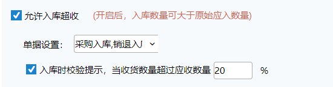

1）.开启后入库数量可大于预约数量，允许超收单据可自定义

2）.入库时校验提示，当收货数量超过应收数量指定比例时，会显示弹窗确认提示

### 10.子母件申请时包裹自动分配订单商品明细
开启后，生成子母件时，各包裹平摊订单商品明细。如原订单有8个商品明细数量，生成3个子母件，每个子母件包裹内明细数量分别为：2、3、3

### 11.称重环节称重模式

①.按订单称重：开启后，生成多包裹的订单，不支持对单个包裹称重，需要对整个订单称重，重量更新到订单上

②.按包裹称重：开启后，生成多包裹的订单，不支持对整个订单称重，需要扫包裹运单号称重，重量更新到包裹上，所有包裹称重完成后订单再提交到下一环节

### 12.耗材设置
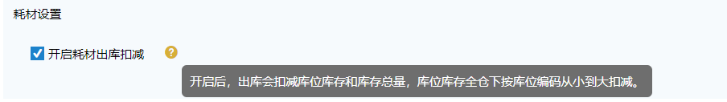

开启耗材出库扣减后，对应货主订单出库后，耗材库位库存、库存总量会扣减，并回传耗材信息给上游；

未开启则对应货主不会扣减耗材库存，也不会回传。

**注：此配置关联业务配置-耗材管理开关，若开启则显示此项，否则不显示。**

### 13.称重复核校验
1.原业务配置->出库配置->校验：开启称重复核校验配置挪至此处。

2.校验规则如下，最多支持10个区间：

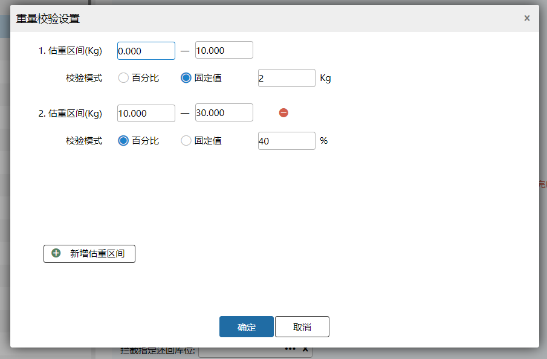

例如：称重校验规则配置如上；订单1估重6；

则称重时订单重量11提示-称重重量与订单估重不符，超出允许范围+3kg；订单重量4，无报错提示，直接提交称重成功。

注：若订单重量不在估重区间内则不计算校验重量，直接提交称重成功。

3.订单估重为0校验配置

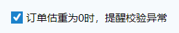

a.未开启，订单估重为0，无弹窗提示，正常提交称重。

b.已开启，订单估重为0，待称重修改重量/称重复核、批量称重重量回车、快递成本回车、确认称重时弹窗提示，能否继续操作提交称重关联有无强制提交称重权限。

### 14.预约单超时自动关闭
根据自定义配置，超过规定时限未完成的预约单会自动关闭。

> 更新: 2026-08-07 17:22:09  
> 原文: <https://hupun.yuque.com/unzko7/lsbfg0/fay7zts5tamdictu>