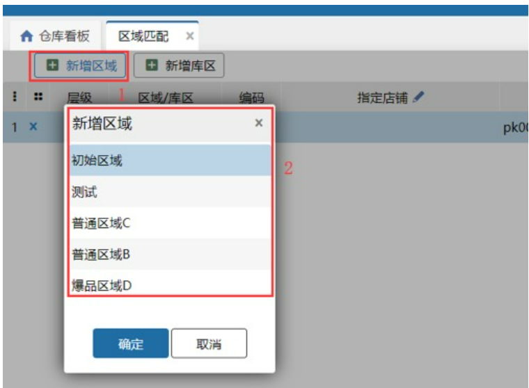
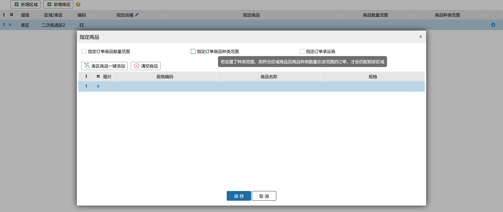
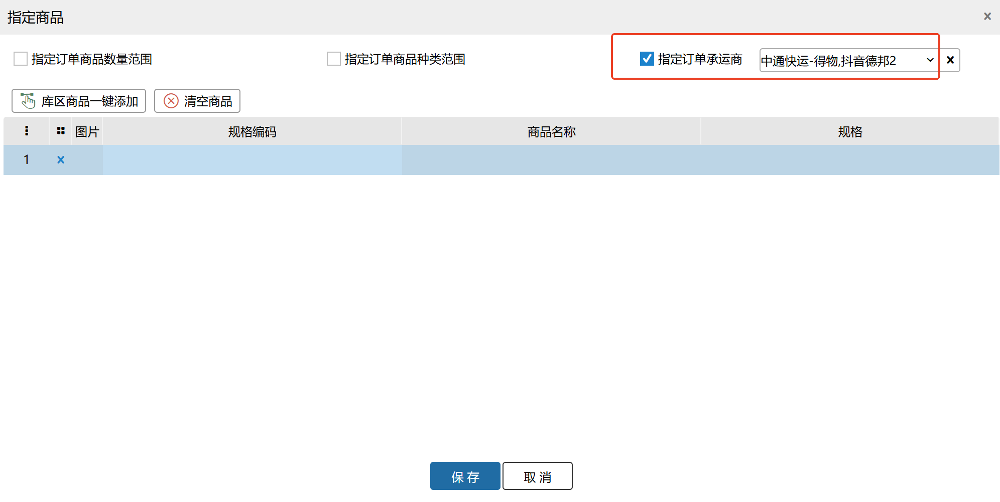
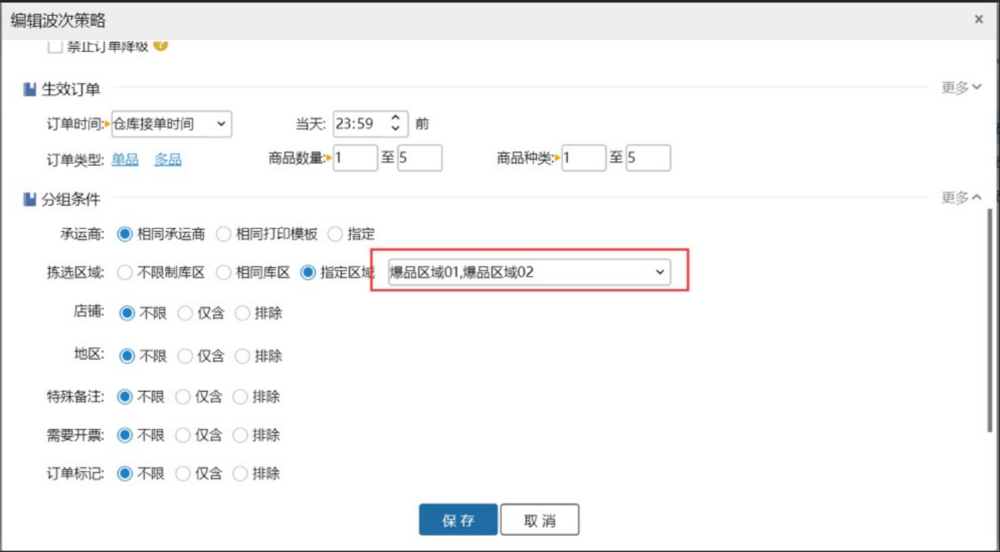

# 区域匹配

业务场景：某些店铺或者某些商品指定区域或库区发货，因此设置了区域匹配规则后，仅包含指定店铺和指定商品的订单将会在设置的区域或库区内锁库。

名词解释：爆品区：设置了指定商品/指定店铺+商品的区域或库区。

### 01.新增区域
设置指定的区域，新增时至少保留一个非指定的区域，若区域已设置指定库区就不允许设置指定区域了。

### 02.新增库区
设置指定的库区，新增时至少保留一个非指定的库区，若库区所在的区域已设置指定区域就不允许设置指定库区了。

### 03.添加商品
添加商品时，如果指定了订单商品数量的范围，那么商品在指定区域锁库的条件又加上了订单中商品的数量范围必须在指定范围内。

添加商品时，如果指定了订单商品种类的范围，那么商品在指定区域锁库的条件又加上了订单中商品种类的范围必须在指定范围内。

###  04.指定店铺
区域可以设置指定的店铺，设置后，订单需要是指定店铺的订单，才会锁定在设置的区域。

### 05.指定承运商
添加商品时，如果指定了承运商的范围，那么商品在指定区域锁库的条件又加上了订单承运商必须在指定范围内。

### 06.波次降级
指定区域和指定库区逻辑类似，只是范围不一样，以指定区域为例。

1.  落单降级：若波次的分组设置了指定区域，指定区域为爆品区，且该波次优先级最高。订单匹配的指定区域为非爆品区，该订单落单降级。反之亦然。

2.锁库降级：若波次的分组设置了指定区域，且该波次优先级最高。订单落单时无法判断是否将会锁定到该区域，锁定库位后若发现未锁定到波次指定区域，订单将会降级。                   

**注意**

1）指定区域设置了指定商品后，订单若包含非指定商品，不会在指定区域锁库。

2）指定区域设置了指定商品后，订单包含指定商品和非指定商品，不会在指定区域锁库。

3）指定区域a设置了指定商品sp01，指定区域b设置了指定商品sp01和sp02，订单包含商品sp01和sp02，只会在指定区域b锁定库位，不会在指定区域a和b锁定库位。

4）商品和订单数量、商品种类都满足区域匹配的条件时，订单才会在指定区域锁定库位。

> 更新: 2025-03-24 10:02:12  
> 原文: <https://hupun.yuque.com/unzko7/lsbfg0/tmvqgpmcoso9v63a>