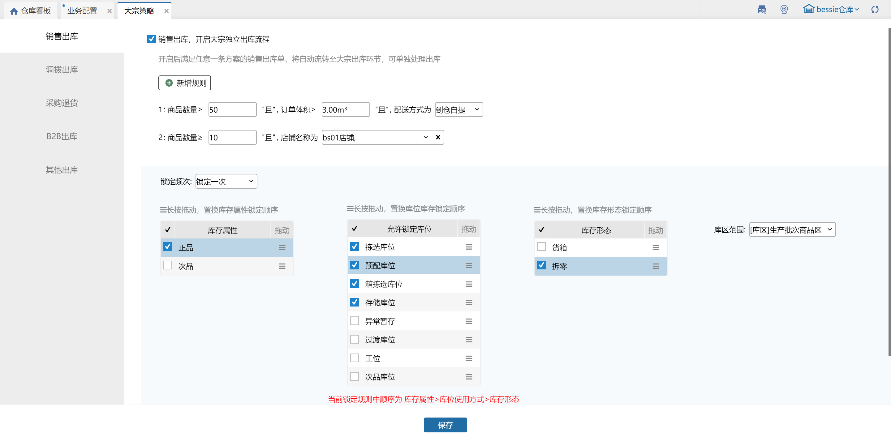

# 大宗策略

大宗策略是系统为了自动区分大宗订单而配置。符合大宗订单配置的订单将不经过待分配环节，直接在大宗出库界面显示。

大宗策略根据订单来源情况的不同分为5种出库方式。

### 01、销售出库
销售库位可配置商品数量、体积大小、配送方式、订单标记为综合判断依据。

每一行都是且的关系，行与行之间是或的关系。

1.第一行设置规则商品数量≥50且订单体积≥3m³且配送方式为自提；第二行设置规则商品数量≥10且店铺为bs01店铺。

则表示订单状态满足第一行设置的规则或第二行设置的规则才能被判断为大宗订单。

2.锁定频次有三种类型：不锁定、锁定一次、持续尝试锁定

+ 不锁定：订单进入大宗出库页面后，不会执行自动锁库
+ 锁定一次：订单进入大宗出库页面后，会按照大宗策略设置范围尝试锁库，若锁定失败，不会重新尝试锁库
+ 持续尝试锁定：订单进入大宗出库页面后，会按照大宗策略设置范围尝试锁库，若锁定失败，会重新尝试锁库

3.推送订单标记符合已设置的标记策略，且其他条件也符合时，订单自动进入大宗。（若策略设置多个标记时，订单有1个标记就算符合策略）

勾选库存属性会在勾选的库存属性范围内锁库，拖动箭头指向滑块可改变选定属性库位的排序顺序，系统锁定顺序也跟着改变。

勾选库位类型会在勾选的库位类型范围内锁库，拖动箭头指向滑块可改变选定属性库位的排序顺序，系统锁定顺序也跟着改变。

勾选库存形态锁库时按照勾选的库位形态锁库，拖动箭头指向滑块可改变选定库存形态的排序顺序，系统锁定顺序也跟着改变。

指定库区范围会在勾选的库区范围内锁库，若库存不足则锁库失败。

### 02、调拨出库、采购退货、B2B出库、其他出库
这几类出库类型的策略配置均不含配送方式匹配。其余设置方式与销售出库一致。

### 03、指定分配
大宗策略各业务出库类型新增指定分配规则。

a.默认箱单位配置关联开启商品多单位开关显示。

b.设置指定分配规则后，订单内单种sku数量总计满足指定数量时，**明细**按照指定分配规则锁库。

注：若明细满足指定分配规则但锁库失败，则明细锁库失败，即不会在非指定策略内锁库。

例如：

规则：单种规格数量>=5时指定分配；

订单：sku1:2个  sku3:3个  sku2:3个；即锁库时sku2走指定规则，sku3走非指定规则

> 更新: 2025-04-11 16:27:38  
> 原文: <https://hupun.yuque.com/unzko7/lsbfg0/kgw7gm8c9vy8gkal>