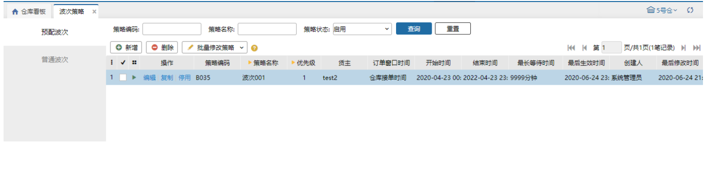

# 波次策略

波次策略是用户可以根据自己的需求来设定规则，快速分类一大堆订单。根据设置的策略生成的波次，快速处理订单。

波次策略分类两类：预配波次和普通波次。

具体页面如下：

 

**提示**

1.预配波次的优先级高于普通波次，若订单同时满足预配波次策略和普通波次策略，则订单会生成预配波次；

2.在普通波次中，订单会有波次降级考虑：每个订单的波次执行次数≥2时，允许降级（波次优先级）寻找下个符合的策略；

3.开启跨境模块，波次策略“地区”增加显示其他国家，中国地区、其他国家下的数据可以同时选择，只保存当前页的数据，能根据选择地区生成对应的波次

详情的波次策略介绍，请看【[预配波次](https://hupun.yuque.com/unzko7/lsbfg0/gvrqcq1kd89vzzwd)】及【[普通波次](https://hupun.yuque.com/unzko7/lsbfg0/ovb4zd1mh7lfhbeu)】

> 更新: 2023-12-18 16:45:43  
> 原文: <https://hupun.yuque.com/unzko7/lsbfg0/ok8h5w5e8g7guzkw>