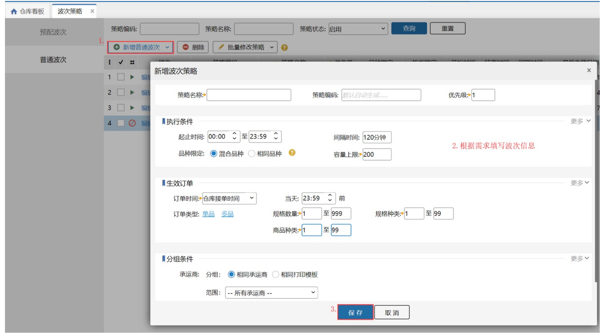
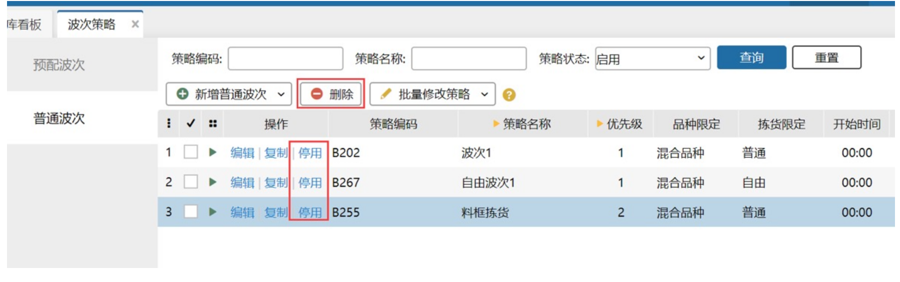
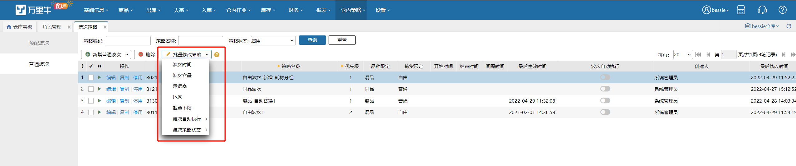

# 普通波次

波次配货是提高拣货作业效率的一种方法，它将不同的订单按照某种规则（相同仓库相同快递相同店铺相同商品，付款时间先后）合并为一个波次。

更通俗的讲，**波次计划就是对订单进行分类，然后快速拣货。**

普通波次与预配波次的区别在与普通波次是等订单到wms系统后再进行分类，生成某个或某些特征相同的一波再去统一配货打单等，而预配波次是订单在未推送到wms单商品就已经拣货打包好了，且每个包裹的商品都是相同的。

### **01.新增普通波次策略**
具体新增波次策略的步骤如下：

### **02. 波次策略复制**
若要建一个和已存在的策略类似的波次策略，则可以使用复制功能，具体如下图所示：

### **03.策略停用、启用、删除**
波次策略有停用和启用，这个可以根据用户的需求进行操作：

1）停用的策略可以开启；

2）删除策略需要先勾选策略，策略删除后就不能恢复，需要重新新建。

具体操作步骤如下图：

### **04.批量修改策略**
勾选多个波次可以进行批量修改，修改内容包括波次时间、波次容量、承运商、地区、截单下限，是否开启波次自动执行，波次策略状态。

1）地区可进行批量添加或覆盖，对地区不限无效

2）修改截单下限数量需开启截单下限开关，截单时间不为空

3）波次自动执行开启对A+N和一筐同品不支持，会忽略

### **05.普通波次项目了解**
波次分为下面四个大块：策略概要、执行条件、生效订单、分组条件。

#### **（1）策略概要**

策略概要主要包括下面三点：

**1.策略名称：**表示波次策略的名称,必填；

**2.策略编码：**是该策略的身份标识,可以自己输入，也可自动生成，且在一个仓库内是唯一的；

**3.优先级：**表示该波次策略的优先级，只能为正数，且数字越大优先级越低，优先级可以重复；符合波次生效条件以及部分分组条件的订单会根据优先级从高到低匹配。

#### **（2）执行条件**
执行条件表示是否要执行生成波次这个动作的条件，只有在满足下面设置的条件的下，才会去触发生成波次的动作。

具体的内容主要包括以下几点：

**1.起止时间：**

表示只有在这个时间段内才会有可能去触发波次的生成，订单进来后不在这个时间段内波次是不会执行的

1）若订单到了最长等待时间还没有在这个时间段内则会打到零拣；

2）若订单到了最长等待时间且已经在这个时间段内则会生成波次；

**2.间隔时间：**

表示波次每次波次生成的时间间隔，且目前设定每10分钟会跑一次波次，就一个波次策略来说连续两次跑波次的时间必须大于等于这里的间隔时间，时间间隔的时间必须为10的倍数；

如：若间隔时间设置20分钟，若该策略第一次生成波次的时间是06:10，那么下一次生成波次的时间就是06:30分（因为在06:20的时候距离第一次生成的时间06:10只有10分钟，间隔还没有20分钟，所以不生成，但是当06:30的时间距离前一次生成06:10已经大于等于20分钟,所以会生成）；

**3.最长等待时间：**

因该波次策略进入待分配的订单，如超过最长时间，若该订单还是有符合的波次策略则会强制生成波次；若该订单无符合的波次策略了则自动打到零拣；

如：该策略第一次生成波次的时间是06:10，波次最长时间为35分钟，订单A是06:08进入wms且满足该波次，则若到06:43分该订单因为其他原因还没有生成波次，①.订单A还是符合这个波次策略或者有其他的波次策略则在06:50分的时候该订单将强制被生成波次。②.订单A无符合的波次策略了则自动打到到零拣。

**4.品种限定：**表示该波次的种类；

1）混合品种：生成的波次中，一个波次中的每个订单的商品是可以不同的，即A订单有是商品a，B订单是商品b，若它们满足一个波次策略，则它们可以存在于一个波次中；

2）相同品种：生成的波次中，一个波次中的每个订单的商品必须是完全相同的，即A订单有是商品a，B订单是商品b，若它们满足一个波次策略，则它们不可能存在于一个波次中，将会生成两个波次，一个波次中的每个订单的商品全部都是a，另一个波次中的每个订单的商品将都是b；

**5.容量上限：**表示一个波次最多有几个订单，必填；在没有开启截单下限时，若订单数量没到容量上线则订单不生成波次；

**6.容量下限：**开启容量下限后，波次每次执行生成时，订单容量将会以此下限判断，但最高不高于容量上限。设置了总量限定/重量限定/体积限定的时候，必须设置容量下限。

:::color3
场景：由于仓库播种车等拣货设备限制，可视情况设置总数限定、重量限定、体积限定（7.1、7.2、7.3），避免拣货员负重过载或任务不饱和。另可限制单波次涉及的SKU种类数，如不超过10种（7.3），可降低拣货路径复杂度，减少跨区行走，尤其适合边拣边分模式。

:::

**7.1总数限定：**限定一个波次中需要拣货的商品总数量，即所有订单商品总数之和。

设置了总数限定，既要满足最终生成的一个波次内订单的商品总数之和不会超过总数限定，又要确保波次内订单数量符合波次容量下限数量。

如：波次A容量上限：40，容量下限：5，总数限定：100。待分配有100个订单归属波次A，每个订单中商品数量3。最终生成的波次：33个订单一个波次，最后剩下的1个订单等降级。

波次B容量上限：100，容量下限：40，总数限定：100。待分配有100个订单归属波次B，每个订单中商品数量3。最终生成的波次：40个订单一个波次，最后剩下的20个订单等降级。（当订单个数满足容量下限，但是超过总数限定时，一个波次订单个数为容量下限个数。）

**7.2规格种类限定：**同理，限制了一个波次中所有商品种类总数量的最大值。

**7.3重量限定：**同理，限制了一个波次中所有订单重量总和的最大值。

**7.4体积限定：**同理，限制了一个波次中所有订单体积总和的最大值。

**8.截单下限：**开启后需要设置截单下限，且要设置截单时间，时间最多只能设置4个，则当到达这个时间后会执行生成波次的动作，且生成波次的下限就是此处的截单下限，但若是满足波次的订单没有达到截单下限，则订单仍然不会生成波次

****

**9.允许PDA领单**

开启开关

①、选择扫描打单，波次其他条件符合的情况下，待打单的波次可以通过扫描打单领取到

②、选择料筐拣货，波次其他条件符合的情况下，待打单的波次可以通过料筐拣货领取到

关闭开关，不会被扫描打单/料筐拣货领取到

****

**10.仅起止时间内匹配订单：**

开启后，起止时间外，订单将不会匹配到该波次策略，并且该策略中超过截止时间还未生产波次的订单将会被降级。

:::color3
场景：一般用于仓库下班时间设置的波次，由于下班时间不作业，波次池中累计推送的订单较多。次日早上上班的时候可生成此类容量大，凝练度更高的波次。此方式同样适用于春节长假，法定节假日休息之类场景。

:::

例如18:00下班，早上9:00上班，波次设置的起止时间是18:00-9:30，优先级为1（一般都设为最高一档）

①、上班期间17:59和9:31推过来的订单不会匹配到该波次，等于本波次策略不生效

②、下班期间18:00-9:30推过来的订单可以匹配到该波次，如晚上不打算生成波次，可以把间隔时间调整到希望的时间。或者干脆添加截单时间是早上上班前开始，如8.50之类。

③、上班9:00时，已有大批量准备好的波次可进行处理。9:00-9:30推送的订单，因为还在打单，依然还可以生成。

④、9:30后第一波工作处理结束，希望低优先级的波次生效，如归属在本波次的订单，会降级重新匹配到其他波次，完成低容量下限的波次执行，至此本波次策略的职能已结束

特殊情况：若波次设置了截单时间9:32，订单是9:29推过来的，若下次跑的时间是9:31,则该订单降级后再生成接单波次，若下次跑的时间是9:33，则订单不会降级，生成截单波次。请设置截单时间为10分钟的整数倍最佳

****

**12.禁止订单降级：**

勾选了禁止订单降级，符合该波次的订单在波次执行了两次之后且依旧不满足容量下限这个生成条件时，不会降级，依旧根据这个波次的执行条件和时间生成。

****

**13.排除同品订单数量：**

开启后超过指定数量的同品订单不会被生成此波次，例：设置排除同品订单数量为10，待分配有12个订单同时符合该混品波次和同品波次，另有10个订单只符合该混品波次，截单生成波次后，只有符合该混品波次的10个订单生成到混品波次中，另12个订单不生成波次，也不会去锁库；若设置设置排除同品订单数量为13，则待分配22个订单都会生成到该混品波次中。（注：仅混品、自由波次显示此项，预配、一筐同品、A+N波次不显示此项）

#### （3）生效订单

生效订单是以订单的角度去判断是否符合波次策略。

主要包括记以下几点：

**1. 订单时间：**时间类型包括仓库接单时间、客户下单时间、客户付款时间、订单审核时间、剩余发货时间；

1）若订单是符合这个时间段的，则会去查看是否能生成波次；

2）若订单不符合这个时间段，则订单会到零拣，不会生成波次；

**2.订单类型：**只用于快速生成商品数量和商品种类的值；

1）单品：规格数量为1至1个，规格种类为1至1个，商品种类为1至1个；

2）多品：规格数量为2至999个，规格种类为1至99个，商品种类为1至99个；

****

**3.规格数量：**表示一个订单中的sku的数量，只有满足这里设定的数量值的订单才会满足该波次策略且之后可以生成波次；

**4.规格种类：**表示一个订单中的sku的种类，只有满足这里设定的种类数的订单才会满足该波次策略且之后可以生成波次；

**5.商品种类：**表示一个订单中的SPU的数量，只有满足这里设定的数量值的订单才会满足该波次策略且之后可以生成波次；

**6.包含规格：**只有订单包含这里设置的规格才会生成波次，包含规格这里包括两种形式：

1）且：只有订单包含这里选择的所有规格商品就能生成波次；

2）或：只要订单中的规格商品包含这里选择的商品的某一个或某几个就能生成波次；

**7.排除规格：**只要订单包含这里设置的规格就不会生成波次，排除规格这里包含两种形式：

1）且：只有订单包含这里选择的所有规格商品就不会匹配到该波次且也不会生成波次；

2）或：只要订单中的商品包含这里选择的规格商品的某一个或某几个就不会匹配到该波次且也不会生成波次；

**8.是否包含生产批次：**限制订单是否包含生产批次商品；（**PS：生产批次标准模式下生效订单无此限制**）

①、不限：订单包含生产批次商品和普通商品都能正常匹配波次；

②、包含生产批次：只有订单包含生产批次商品才会满足该波次策略；

③、不含生产批次：只有订单不包含生产批次商品才会满足该波次策略。

**9.包含备注：**订单只有包含所设定的备注要求的才能生成波次，备注包含买家留言、线上备注和系统备注，最多可以设置20个，字数总数不能超过200字。包含备注这里包括两种形式：

1）或：or或者关系，订单填写的备注有这里添加的备注就能生成波次；例如： 订单的其他条件都满足波次时，设置备注A,B，则只要订单含备注A**或**含备注B就能生成波次

2）且：And关系，只要后面填写的备注都满足才能生成波次；例如：订单的其他条件都满足波次时，设置备注A,B，则只有含备注A**且**含备注B的订单，**才会生成波次**；

**10.排除备注：**订单只有不含所设定的备注要求的才能生成波次，备注包含买家留言、线上备注和系统备注，最多可以设置20个，字数总数不能超过200字。包含备注这里包括两种形式：

1）或：or或者关系，订单填写的备注有这里添加的备注就**不会生成波次**；例如： 订单的其他条件都满足波次时，设置备注A,B，则只要订单含备注A**或**含备注B就**不能生成波次**

2）且：And关系，只有订单填写的备注都不包含这里添加的备注才能生成波次；例如：订单的其他条件都满足波次时，设置备注A,B，则只有含备注A**且**含备注B的订单，**不会生成波次**；

**11.最长单边：**

即是长宽高里最长的一边，订单中边长最长的商品只有满足设定的最长单边才会生成波次，否则自动打到零拣

①、普通限制：一个订单中边长最长的商品小于等于设置的值才会满足该波次策略；

②、区间限制：一个订单中边长最长的商品大于设置的最长单边值下限且小于等于设置的最长单边值上限才会满足该波次策略；区间是左开右闭的；上限可不填写，不填为无限大

例如设置了区间0.1-0.5dm，0.4-0.8dm，2-3dm，页面显示合并后的区间0.1-0.8dm和2-3dm；订单有a、b、c三个商品最长单边分别是20.01cm、2.1dm、0.31m，由于最长单边是0.31m=3.1dm不满足该波次策略；订单有a、b、c三个商品最长单边分别是20.01cm、2.1dm、0.9dm，由于最长单边是2.1dm满足该波次策略；

**12.体积限制：**订单只有满足设定的体积才会生成波次，否则自动打到零拣

①、普通限制：一个订单的所有商品体积相加小于等于设置的体积値才会满足该波次策略；

②、区间限制：一个订单的所有商品体积相加大于设置的体积下限且小于等于设置的体积上限才会满足该波次策略；区间是左开右闭的；上限可不填写，不填为无限大

例如设置了区间1-10m³,10-20m³，页面显示合并后的区间1-20m³；订单的体积是1m³，不满足该波次策略；订单的体积是10m³，满足该波次策略；订单的体积是20m³，满足该波次策略；订单的体积是21m³，不满足该波次策略

**13.重量限制：**订单只有满足设定的重量才会生成波次，否则自动打到零拣

①、普通限制：一个订单的重量小于等于此处设置的重量值才会满足该波次策略

②、区间限制：一个订单的所有商品重量相加大于设置的重量下限且小于等于设置的重量上限才会满足该波次策略，区间是左开右闭的；上限可不填写，不填为无限大

例如设置了区间1-10kg,10-20kg，页面显示合并后的区间1-20kg；订单的重量是1kg，不满足该波次策略；订单的重量是10kg，满足该波次策略；订单的重量是20kg，满足该波次策略；订单的重量是21kg，不满足该波次策略 

   

**14.仅生成整箱的订单：**此项与业务配置-其他配置-商品多单位管理开关关联，若开启商品多单位管理，则显示此配置，否则不显示。勾选此配置项，当订单锁定库存是整货箱无拆零或者换算成推荐单位无拆零时，才能生成该波次，否则无法生成该波次。                

#### **（4）分组条件**

分组条件主要包括以下几点：

**1. 承运商：**订单只有满足所设置的承运商才会生成波次，否则会自动到零拣打单；

1）相同承运商：生成波次时，订单的承运商相同会生成同一个波次。例如：订单的其他条件都满足波次时，有5个订单的承运商为A，5个订单的承运商为B，则最后会生成两个波次，一个波次的承运商都为A，一个波次的承运商都为B；

2）相同打印模板：生成波次时，订单的承运商的打印模板是相同的会生成同一个波次。例如：订单的其他条件都满足波次时，有2个订单的承运商为A，3个订单的承运商为B，但它们的打印模板相同，则最后这5个订单只会生成1个波次；

3）指定承运商：生成波次时，订单的承运商要与这里指定的相同才会生成波次。例如：订单的其他条件都满足波次时且指定承运商A，有5个订单的承运商为A，5个订单的承运商为B，则最后会生成1个波次，一个波次的承运商都为A，承运商为B的订单会到零拣；ps：最新版本的波次策略是支持选择多个承运商的。

4）指定多个承运商+相同承运商：最终波次生成的时候，会根据承运商分组，一种承运商一个波次。

5）指定多个承运商+相同打印模板：最终波次生成的时候，会根据打印模板分组，一种打印模板一个波次。

****

**2.发货单模板：**生成波次时按照此配置订单分组去生成。（注：指定模板和非指定模板订单无法生成到同一波次内)

****

**3.拿货标签模板：**生成波次时按照此配置订单分组去生成。（注：指定模板和非指定模板订单无法生成到同一波次内)

****

**4.拣选区域：**订单的锁定区域只有满足所设置的拣选区域才会生成波次，否则会自动到零拣打单；

1）不限库区：生成波次时，对订单锁定范围无限制，都能正常生成波次;例如：订单的其他条件都满足波次时，订单锁定范围有跨区域拣选、库区A、库区B、跨库区A、B，这波订单都能生成同一个波次；

2）相同库区：生成波次时，订单的锁定库区是相同的会生成同一个波次。例如：订单的其他条件都满足波次时，有2个订单的锁在库区A，3个订单锁在库区B，则最后会生成2个波次，一个波次的拣选范围都是库区A、一个波次的拣选范围都是库区B；

3）指定库区：生成波次时，订单的拣选区域要与这里指定的相同才会生成波次。例如：区域A下有a1、a2两个库区，订单的其他条件都满足波次时且指定区域A，有5个订单的锁定库区为a1，5个订单的锁定库区为a2，5个订单锁定库区a1、a2，则最后会生成1个波次，波次的拣选范围为跨库区a1、a2，锁定区域B的订单会到零拣；

4）指定多个库区+不限库区：最终波次生成的时候，锁在指定库区的订单生成1个波次；

5）指定多个库区+相同库区：最终波次生成的时候，会根据库区分组，一个库区一个波次，锁定失败一个波次，跨库区一个波次；

**5.库位标签：**订单锁定的每个库位上的库位标签都与此处指定范围有交集的，才会生成到该波次中，否则不生成。

**6.货主：**在指定范围内的货主订单才能生成该波次，否则不会生成。选择“不限货主”，则所有范围内的货主订单生成同一个波次中；选择“相同货主”，则按货主分组生成不同波次，每个货主生成一个波次。（仅多货主公司有此项）

**7.平台店铺：**订单只要满足所设定的平台/店铺才会生成波次，否则会自动打到零拣，平台或店铺只能设置其中一种。

1）不限：不管订单来自哪个平台/店铺，可以生成波次；

2）仅含：只有属于这里设置平台/店铺的订单才能生成波次；

3）排除：只有不属于这里设置平台/店铺的订单才能生成波次；例如：波次策略排除店铺A，订单的其他条件都满足波次，5个来自店铺A，5个来自店铺B，只有来自店铺B的订单能生成波次，来自店铺A的订单打到零拣。

****

**8.地区：**订单只有满足所设定的地区才会生成波次，否则会自动打到零拣，这里的地区是指订单上的收货地址，支持手动勾选和导入两种方式。

1）不限：不管订单来自什么地区，可以生成波次；

2）仅含：只有属于这里设置地区的订单才能生成波次；

3）排除：只有不属于这里设置地区的订单才能生成波次；例如：波次策略排除地区新疆，订单的其他条件都满足波次，5个订单收货地址是新疆，5个订单收货地址是浙江，只有收货地址是浙江的订单能生成波次。

****

**9.需要开票**：订单只要满足所设定的开票信息才会生成波次,否则会自动打到零拣，这里的开票信息针对普通发票、增值税发票或电子发票，选择仅含或排除时可以多选这三种发票

1）不限：不管订单是否有开票信息，都可以生成波次；例如：订单的其他条件都满足波次时，有5个订单的需开普通发票，5个订单不用开票，5个订单要开电子发票，则最后这3批订单都能生成波次；

2）仅含：订单有开票信息的才会生成波次，没有的不会生成波次，例如：订单的其他条件都满足波次时，波次选择普通发票，有5个订单的需开普通发票，5个订单不用开票，5个订单要开电子发票，则最后要开普通发票的会生成1个波次，其余的都要零拣；

3）排除：订单是没有开票信息的才能生成波次，有开普通发票信息的不能生成波次；例如：订单的其他条件都满足波次时，波次选择普通发票，有5个订单的需开普通发票，5个订单不用开票，5个订单要开电子发票，则最后要开普通发票的订单到零拣，其余的都要生成波次；

****

**10.订单标记：**标记订单只有满足所设定的标记限制的才会生成波次，否则自动打到零拣

①、不限：标记订单、普通订单都可以生成波次；例如订单的其他条件都满足波次时，2个加急订单、2个天猫直送订单、2个货到付款订单、2个普通订单，这8个订单都可以生成波次

②、包含：or或者关系，订单只要含有标记都可以生成波次；例如订单的其他条件都满足波次时，设置了包含加急标记订单、天猫直送订单，则只要订单含有“急”或“直”标记，都可以生成波次

③、排除：or或者关系，订单不含有标记才会生成波次；例如订单的其他条件都满足波次时，设置了包含加急标记订单、天猫直送订单，只要订单含有“急”或“直”标记，则就不满足波次

****

**11.订单品牌：**订单的品牌只有满足所设定的品牌限制的才会生成波次，否则自动打到零拣；

1）不限制品牌：订单品牌不限制，所有订单只要满足其他条件的都能生成波次；

2）品牌完全相同：订单的品牌完全相同的会生成在同一个波次，不同品牌的订单会生成在不同的波次中；如：A/B/C/D/E/F共6个订单，它们的品牌分别为a/b/空/a/b/杂牌，那么最后生成的波次情况为：A/C在一个波次(品牌为a)，B/D在一个波次(品牌为b)，C/F在一个波次(品牌为空)；

3）指定品牌：只有订单满足指定的品牌，那么该订单才能生成波次，否则自动打到零拣，此处的品牌可以指定多个；如：策略指定品牌为a，有A/B/C共3个订单，它们的品牌分别为a/b/空，那么最后生成的波次情况为：A生成波次(品牌为a)，B/D自动到零拣打单页面；

4）品牌为空：该选项表示只要订单的品牌显示为空（空包含没有品牌和杂牌两种情况），那么这个订单就符合波次，否则不符合波次，会自动打到零拣。

**12.耗材：**订单的耗材只有满足所设定的耗材限制的才会生成波次，否则自动打到零拣；

1）不限：订单耗材不限制，所有订单只要满足其他条件的都能生成波次；

2）相同耗材：订单的耗材完全相同的会生成在同一个波次，不同耗材的订单会生成在不同的波次中；

3）包含：订单的耗材包含指定耗材就能生成波次。

**13.收货公司：**生成波次时按照此配置订单分组去生成。选择不限收货公司：收货公司有没有都可以，所有订单只要满足其他条件的都能生成波次；选择相同收货公司：订单的收货公司相同的会生成在同一个波次，不同收货公司的订单会生成在不同的波次中，没有收货公司的算作一组。

14.系统备注：生成波次时按照此配置订单分组去生成。选择不限系统备注：系统备注有没有都可以，所有订单只要满足其他条件的都能生成波次；选择相同系统备注：订单的系统备注相同的会生成在同一个波次，不同系统备注的订单会生成在不同的波次中，没有系统备注的算作一组。

> 更新: 2026-08-19 16:02:46  
> 原文: <https://hupun.yuque.com/unzko7/lsbfg0/ovb4zd1mh7lfhbeu>