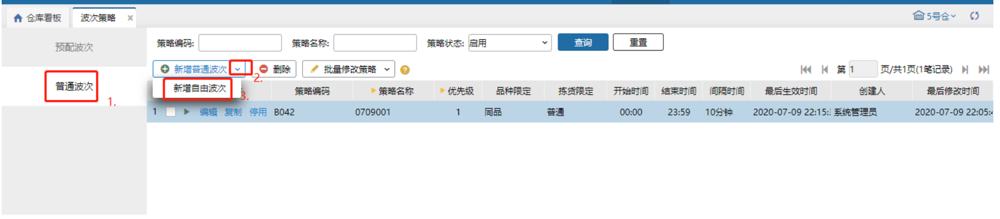
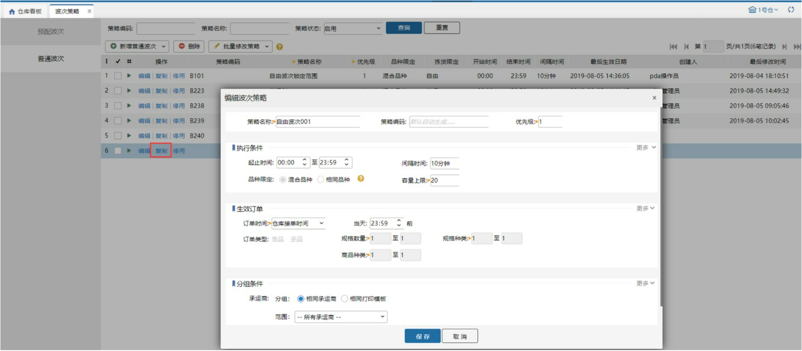
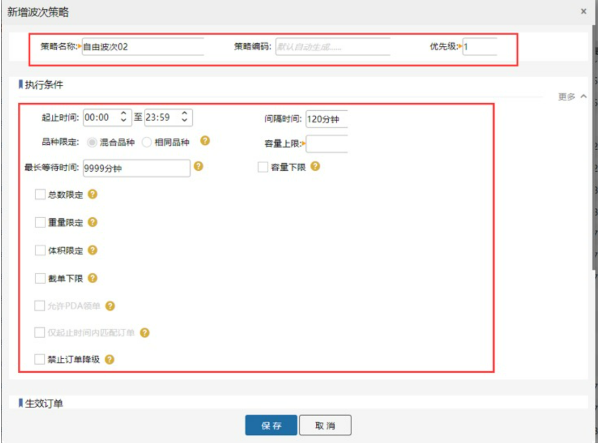
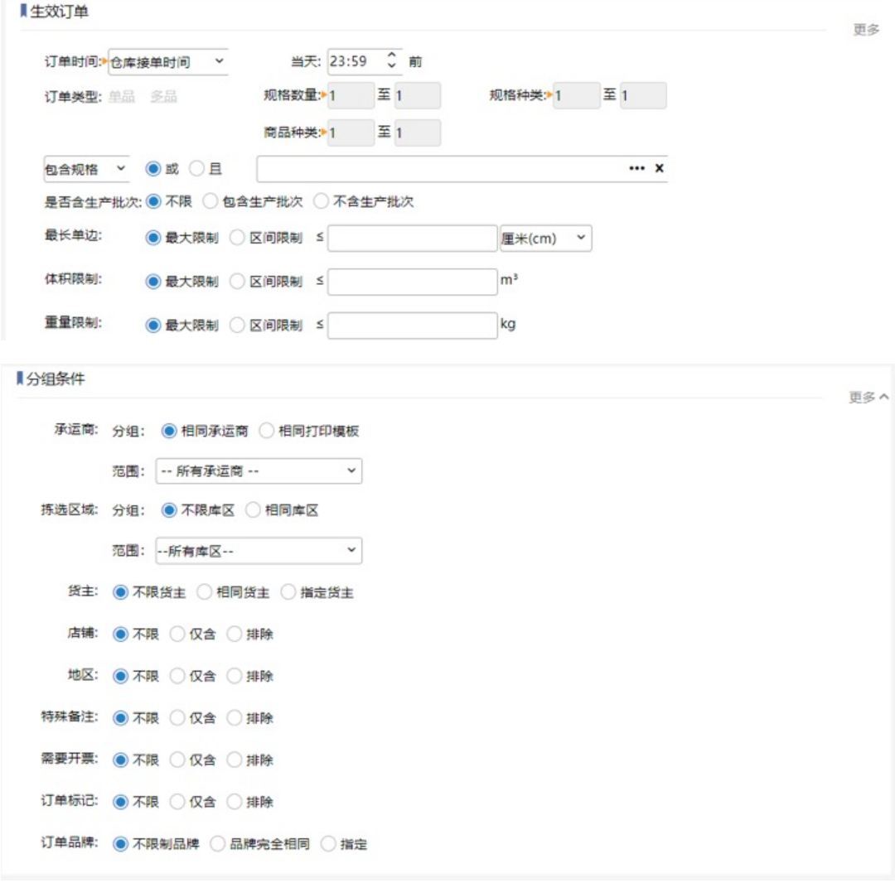

# 自由波次

场景：针对一种一件的商品，特别是服装相关行业（订单比例可大于60-70%），希望有比目前系统更加相对便捷简单的拣货、验货方式。设置自由波次策略后，一种一件的生成自由波次，可以通过pda自由领单进行拣货，通过pc自由验货并后置打印快递单。

### **01.新增自由波次策略**
具体新增波次策略如下图所示：

### **02. 波次策略复制**
若要建一个和已存在的策略类似的波次策略，则可以使用复制功能，具体如下图所示：

### **03 策略停用、启用、删除**
波次策略有停用和启用，也支持批量停用和启用，这个可以根据用户的需求进行操作：1）停用的策略可以开启；2）删除策略需要先勾选策略，策略删除后就不能恢复，需要重新新建。

具体操作控件如下图：

批量停用和启用

### **04.自由波次项目了解**

波次分为下面四个大块：策略概要、执行条件、生效订单、分组条件。

##### 一.策略概要
策略概要主要包括下面三点：

1.策略名称：表示波次策略的名称,必填；

2.策略编码：是该策略的身份标识,可以自己输入，也可自动生成，且在一个仓库内是唯一的；

3.优先级：表示该波次策略的优先级，只能为正数，且数字越大优先级越低，优先级可以重复；符合波次生效条件以及部分分组条件的订单会根据优先级从高到低匹配。

##### 二、执行条件
执行条件表示是否要执行生成波次这个动作的条件，只有在满足下面设置的条件的下，才会去触发生成波次的动作。

具体的内容主要包括以下几点：

1.起止时间：表示只有在这个时间段内才会有可能去触发波次的生成，订单进来不在这个时间段内是不会生成波次的，

1）若订单到了最长等待时间还没有在这个时间段内则会打到零拣；

2）若订单到了最长等待时间且已经在这个时间段内则会生成波次；

2.间隔时间：表示波次每次波次生成的时间间隔，且目前设定每10分钟会跑一次波次，就一个波次策略来说连续两次跑波次的时间必须大于等于这里的间隔时间，时间间隔的时间必须为10的倍数；

如：若间隔时间设置20分钟，若该策略第一次生成波次的时间是06:10，那么下一次生成波次的时间就是06:30分（因为在06:20的时候距离第一次生成的时间06:10只有10分钟，间隔还没有20分钟，所以不生成，但是当06:30的时间距离前一次生成06:10已经大于等于20分钟,所以会生成）；

3.最长等待时间：因该波次策略进入待分配的订单，如超过最长时间将强制生成波次，以保证该笔订单的出库时效；

如：该策略第一次生成波次的时间是06:10，波次最长时间为35分钟，订单A是06:08进入wms且满足该波次，则若到06:43分改订单因为其他原因还没有生成波次，则在06:50分的时候该订单将强制被生成波次（若有满足的波次策略）或打到零拣（若已经没有满足的波次策略了）；

4.品种限定：默认选择混品，且不可修改；

5.容量上限：表示一个波次最多有几个订单，必填；在没有开启截单下限时，若订单数量没到容量上线则订单不生成波次；

6.容量下限：开启容量下限后，波次每次执行生成时，订单容量将会以此下限判断，但最高不高于容量上限。设置了总量限定/重量限定/体积限定的时候，必须设置容量下限。

7.1总量限定：限定一个波次最多有多少个sku，设置了总量限定，最终生成的一个波次内订单的sku总数不会超过总量限定，一个波次内订单数量最少为容量下限数量的订单。

如：波次A容量上限：40，容量下限：5，总量限定：100。待分配有100个订单归属波次A，每个订单内有3个sku。最终生成的波次：33个订单一个波次，最后剩下的1个订单等降级。

波次B容量上限：100，容量下限：40，总量限定：100。待分配有100个订单归属波次A，每个订单内有3个sku。最终生成的波次：40个订单一个波次，最后剩下的20个订单等降级。（当订单个数满足容量下限，但是超过总量限定时，一个波次订单个数为容量下限个数。）

7.2重量限定：同理，限制了一个波次中订单重量总和的最大值。

7.3体积限定：同理，限制了一个波次中订单体积总和的最大值。

8.截单下限：开启后需要设置截单下限，且要设置截单时间，时间最多只能设置4个，则当到达这个时间后会执行生成波次的动作，且生成波次的下限就是此处的截单下限，但若是满足波次的订单没有达到截单下限，则订单仍然不会生成波次

9.允许PDA领单置灰，不允许勾选设置

10.仅起止时间内匹配订单置灰，不允许勾选

12.禁止订单降级：勾选了禁止订单降级，符合该波次的订单在波次执行了两次之后且依旧不满足容量下限这个生成条件时，不会降级，依旧根据这个波次的执行条件和时间生成

 

##### 三、生效订单
生效订单是以订单的角度去判断是否符合波次策略。

主要包括记以下几点：

1.订单时间：时间类型包括仓库接单时间、客户下单时间、客户付款时间、订单审核时间、剩余发货时间；

1）若订单是符合这个时间段的，则会去查看是否能生成波次；

2）若订单不符合这个时间段，则订单会到零拣，不会生成波次；

2.包含规格：只有订单包含这里设置的商品才会生成波次，包含商品这里包括两种形式：

1）且：由于自由波次是一种一件，只有订单中的商品是这里选择的商品才能生成波次；

2）或：由于自由波次是一种一件，只要订单中的商品包含这里选择的商品的某一个就能生成波次；

3.排除规格：只要订单包含这里设置的商品就不会生成波次，排除商品这里包含两种形式：

1）且：由于自由波次是一种一件，只有订单中的商品都不是这里选择的商品才不会匹配到该波次且也不会生成波次；

2）或：由于自由波次是一种一件，只要订单中的商品包含这里选择的商品的某一个就不会匹配到该波次且也不会生成波次；

4.订单类型默认选择单品，规格数量1至1，规格种类1至1，商品种类1至1且是置灰不能设置；

5.规格数量是1至1，订单中规格数量是1，才会满足该波次策略且之后可以生成波次；

6.规格种类是1至1，订单中只有一种规格，才会满足该波次策略且之后可以生成波次；

7.商品种类是1至1，订单中只有一种商品，会满足该波次策略且之后可以生成波次；

8.最长单边：即是长宽高里最长的一边，订单中边长最长的商品只有满足设定的最长单边才会生成波次，否则自动打到零拣

①、普通限制：一个订单中边长最长的商品小于等于设置的值才会满足该波次策略；

②、区间限制：一个订单中边长最长的商品大于设置的最长单边值下限且小于等于设置的最长单边值上限才会满足该波次策略；区间是左开右闭的；上限可不填写，不填为无限大

例如设置了区间0.1-0.5dm，0.4-0.8dm，2-3dm，页面显示合并后的区间0.1-0.8dm和2-3dm；订单有a、b、c三个商品最长单边分别是20.01cm、2.1dm、0.31m，由于最长单边是0.31m=3.1dm不满足该波次策略；订单有a、b、c三个商品最长单边分别是20.01cm、2.1dm、0.9dm，由于最长单边是2.1dm满足该波次策略；

9.体积限制：订单只有满足设定的体积才会生成波次，否则自动打到零拣

①、普通限制：一个订单的所有商品体积相加小于等于设置的体积値才会满足该波次策略；

②、区间限制：一个订单的所有商品体积相加大于设置的体积下限且小于等于设置的体积上限才会满足该波次策略；区间是左开右闭的；上限可不填写，不填为无限大

例如设置了区间1-10m³,10-20m³，页面显示合并后的区间1-20m³；订单的体积是1m³，不满足该波次策略；订单的体积是10m³，满足该波次策略；订单的体积是20m³，满足该波次策略；订单的体积是21m³，不满足该波次策略

10.重量限制：订单只有满足设定的重量才会生成波次，否则自动打到零拣

①、普通限制：一个订单的重量小于等于此处设置的重量值才会满足该波次策略

②、区间限制：一个订单的所有商品重量相加大于设置的重量下限且小于等于设置的重量上限才会满足该波次策略，区间是左开右闭的；上限可不填写，不填为无限大

例如设置了区间1-10kg,10-20kg，页面显示合并后的区间1-20kg；订单的重量是1kg，不满足该波次策略；订单的重量是10kg，满足该波次策略；订单的重量是20kg，满足该波次策略；订单的重量是21kg，不满足该波次策略

##### 四、分组条件
分组条件主要包括以下几点：

1.承运商：订单只有满足所设置的承运商才会生成波次，否则会自动到零拣打单；

1）相同承运商：生成波次时，订单的承运商相同会生成同一个波次。例如：订单的其他条件都满足波次时，有5个订单的承运商为A，5个订单的承运商为B，则最后会生成两个波次，一个波次的承运商都为A，一个波次的承运商都为B；

2）相同打印模板：生成波次时，订单的承运商的打印模板是相同的会生成同一个波次。例如：订单的其他条件都满足波次时，有2个订单的承运商为A，3个订单的承运商为B，但它们的打印模板相同，则最后这5个订单只会生成1个波次；

3）指定承运商：生成波次时，订单的承运商要与这里指定的相同才会生成波次。例如：订单的其他条件都满足波次时且指定承运商A，有5个订单的承运商为A，5个订单的承运商为B，则最后会生成1个波次，一个波次的承运商都为A，承运商为B的订单会到零拣；ps：最新版本的波次策略是支持选择多个承运商的。

4）指定多个承运商+相同承运商：最终波次生成的时候，会根据承运商分组，一种承运商一个波次。

5）指定多个承运商+相同打印模板：最终波次生成的时候，会根据打印模板分组，一种打印模板一个波次。

2.拣选区域：订单的锁定区域只有满足所设置的拣选区域才会生成波次，否则会自动到零拣打单；

1）不限库区：生成波次时，对订单锁定范围无限制，都能正常生成波次;例如：订单的其他条件都满足波次时，订单锁定范围有跨区域拣选、库区A、库区B、跨库区A、B，这波订单都能生成同一个波次；

2）相同库区：生成波次时，订单的锁定库区是相同的会生成同一个波次。例如：订单的其他条件都满足波次时，有2个订单的锁在库区A，3个订单锁在库区B，则最后会生成2个波次，一个波次的拣选范围都是库区A、一个波次的拣选范围都是库区B；

3）指定库区：生成波次时，订单的拣选区域要与这里指定的相同才会生成波次。例如：区域A下有a1、a2两个库区，订单的其他条件都满足波次时且指定区域A，有5个订单的锁定库区为a1，5个订单的锁定库区为a2，5个订单锁定库区a1、a2，则最后会生成1个波次，波次的拣选范围为跨库区a1、a2，锁定区域B的订单会到零拣；

4）指定多个库区+不限库区：最终波次生成的时候，锁在指定库区的订单生成1个波次；

5）指定多个库区+相同库区：最终波次生成的时候，会根据库区分组，一个库区一个波次，锁定失败一个波次，跨库区一个波次；

3.订单品牌：订单的品牌只有满足所设定的品牌限制的才会生成波次，否则自动打到零拣；

1）不限制品牌：订单品牌不限制，所有订单只要满足其他条件的都能生成波次；

2）品牌完全相同：订单的品牌完全相同的会生成在同一个波次，不同品牌的订单会生成在不同的波次中；如：A/B/C/D/E/F共6个订单，它们的品牌分别为a/b/空/a/b/杂牌，那么最后生成的波次情况为：A/C在一个波次(品牌为a)，B/D在一个波次(品牌为b)，C/F在一个波次(品牌为空)；

3）指定品牌：只有订单满足指定的品牌，那么该订单才能生成波次，否则自动打到零拣，此处的品牌可以指定多个；如：策略指定品牌为a，有A/B/C共3个订单，它们的品牌分别为a/b/空，那么最后生成的波次情况为：A生成波次(品牌为a)，B/D自动到零拣打单页面；

*品牌为空：该选项表示只要订单的品牌显示为空（空包含没有品牌和杂牌两种情况），那么这个订单就符合波次，否则不符合波次，会自动打到零拣。

4.开票信息：订单只要满足所设定的开票信息才会生成波次,否则会自动打到零拣，这里的开票信息只针对普通发票，有电子发票的订单不算其中；

1）不限：不管订单是否有开票信息，都可以生成波次；例如：订单的其他条件都满足波次时，有5个订单的需开普通发票，5个订单不用开票，5个订单要开电子发票，则最后这3批订单都能生成波次；

2）仅含：订单有开票信息的才会生成波次，没有的不会生成波次，有电子发票的也不会生成波次；例如：订单的其他条件都满足波次时，波次选择普通发票，有5个订单的需开普通发票，5个订单不用开票，5个订单要开电子发票，则最后要开普通发票的会生成1个波次，其余的都要零拣；

3）排除：订单是没有开票信息的或者只有开电子发票的才能生成波次，有开普通发票信息的不能生成波次；例如：订单的其他条件都满足波次时，波次选择普通发票，有5个订单的需开普通发票，5个订单不用开票，5个订单要开电子发票，则最后要开普通发票的订单到零拣，其余的都要生成波次；

5.特殊备注：

订单只有满足所设定的备注要求的才能生成波次，备注包含买家留言、线上备注和系统备注；

1）不限：表示不管订单是否有备注，都可以生成波次；

2）仅含：And关系，只要后面填写的备注都满足才能生成波次；例如：订单的其他条件都满足波次时，设置仅含备注A,B，则只有含备注A且含备注B的订单，才会生成波次；

3）排除：or或者关系，后面填写的备注只有都不存在才会生成波次；例如： 订单的其他条件都满足波次时，设置排除备注A,B，则只要订单含备注A或含备注B，则不满足波次；

6.订单标记：标记订单只有满足所设定的标记限制的才会生成波次，否则自动打到零拣

①、不限：标记订单、普通订单都可以生成波次；例如订单的其他条件都满足波次时，2个加急订单、2个天猫直送订单、2个货到付款订单、2个普通订单，这8个订单都可以生成波次

②、包含：or或者关系，订单只要含有标记都可以生成波次；例如订单的其他条件都满足波次时，设置了包含加急标记订单、天猫直送订单，则只要订单含有“急”或“直”标记，都可以生成波次

③、排除：or或者关系，订单不含有标记才会生成波次；例如订单的其他条件都满足波次时，设置了包含加急标记订单、天猫直送订单，只要订单含有“急”或“直”标记，则就不满足波次

> 更新: 2024-10-17 11:39:46  
> 原文: <https://hupun.yuque.com/unzko7/lsbfg0/cudmkyywuc60txgp>