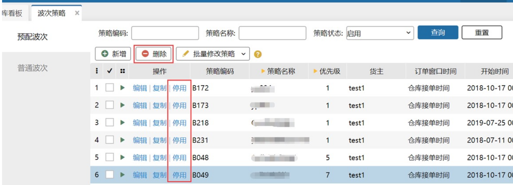
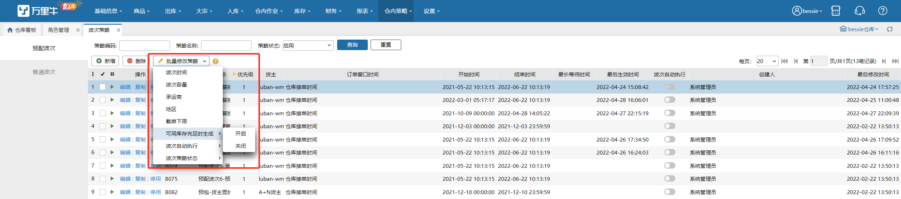
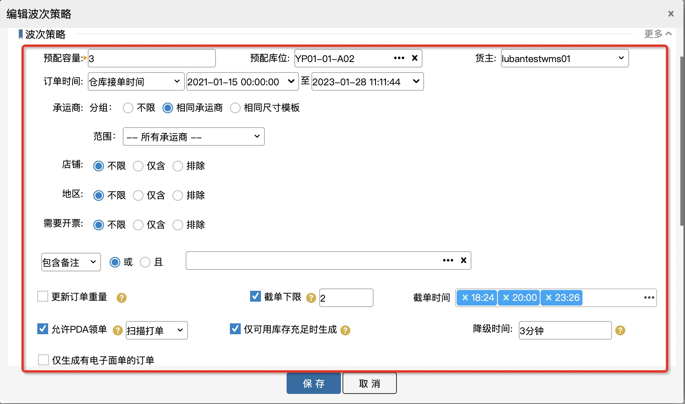
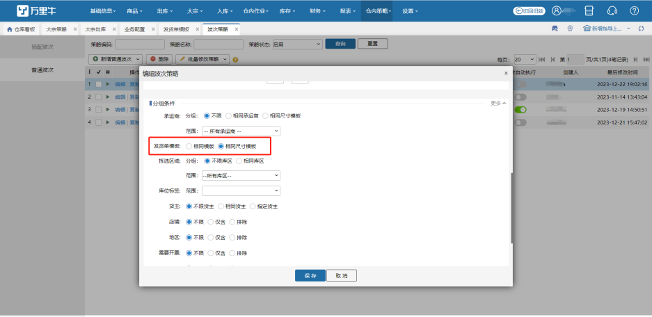
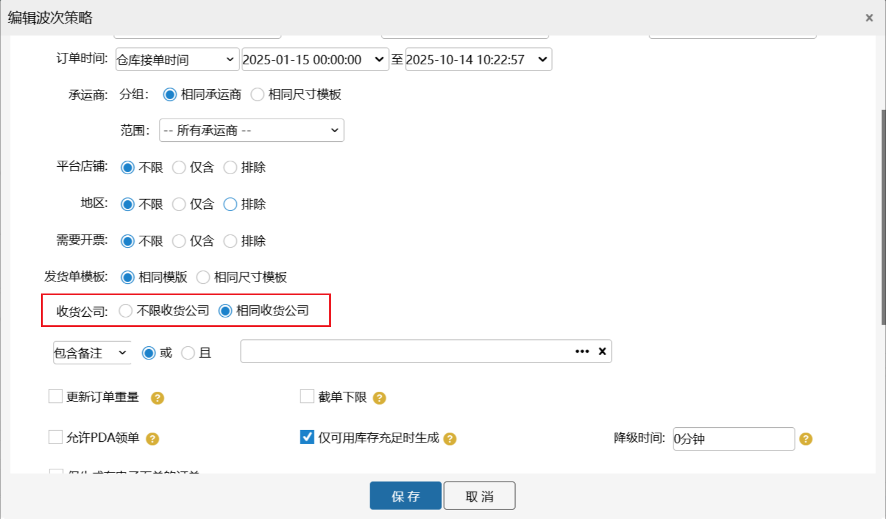

# 预配波次

预配波次:表示这些符合这个波次的商品其实在仓库已经打包好，只要订单推送到仓库就可以直接打印等出库，且这里的每个包裹里面的商品都是一样的，它可以加快仓库的出库效率。

简单的说就是:这个主要根据销售统计出哪些是热销的商品，可以仓库提前打包等，提升发货和出库的效率。

### 01.新增预配波次策略
如下图所示：

### **02. 波次策略复制**
若要建一个和已存在的策略类似的波次策略，则可以使用复制功能，具体如下图所示：

### **03 策略停用、启用、删除**
波次策略有停用和启用，这个可以根据用户的需求进行操作：

1）停用的策略可以开启；

2）删除策略需要先勾选策略，策略删除后就不能恢复，需要重新新建。

具体操作步骤如下图：

### **04.批量修改策略**
勾选多个波次可以进行批量修改，修改内容包括波次时间、波次容量、承运商、地区、截单下限，是否开启可用库存充足时生成、波次自动执行、波次策略状态。

1）地区可进行批量添加或覆盖，对地区不限无效

2）修改截单下限数量需开启截单下限开关，截单时间不为空

### **05.波次项目了解**

波次分为下面三个大块：策略概要、波次策略、选择商品。

#### a、策略概要
策略概要主要包括下面三点：

1.策略名称：表示波次策略的名称，必填；

2.策略编码：是该策略的身份标识,可以自己输入，也可自动生成，且在一个仓库内是唯一的；

3.优先级：表示该波次策略的优先级，只能为正数，且数字越大优先级越小，优先级可以重复；

#### b、波次策略
波次策略主要包括下面几点：

1.预配容量：表示一个波次最多有几个订单，必填；在没有开启截单下限时，若订单数量没到预配容量则订单不生成波次；

2. 预配库位：表示订单之后之后要拣货的库位，只能选择库位类型是“预配库位”的库位，且必填；

3.订单时间：时间类型包括仓库接单时间、客户下单时间、客户付款时间、订单审核时间、剩余发货时间；

1）若订单是符合这个时间段的，则会去查看是否能生成波次；

2）若订单不符合这个时间段，则订单会到零拣打单，不会生成波次；

4..承运商：订单只有满足所设置的承运商才会生成波次，否则会自动到零拣打单；

1）相同承运商：生成波次时，订单的承运商相同会生成同一个波次。例如：订单的其他条件都满足波次时，有5个订单的承运商为A，5个订单的承运商为B，则最后会生成两个波次，一个波次的承运商都为A，一个波次的承运商都为B；

2）相同打印模板：生成波次时，订单的承运商的打印模板是相同的会生成同一个波次。例如：订单的其他条件都满足波次时，有2个订单的承运商为A，3个订单的承运商为B，但它们的打印模板相同，则最后这5个订单只会生成1个波次；

3）指定承运商：生成波次时，订单的承运商要与这里指定的相同才会生成波次。例如：订单的其他条件都满足波次时且指定承运商A，有5个订单的承运商为A，5个订单的承运商为B，则最后会生成1个波次，一个波次的承运商都为A，承运商为B的订单会到零拣；

4）指定多个承运商+相同承运商：最终波次生成的时候，会根据承运商分组，一种承运商一个波次。

5）指定多个承运商+相同打印模板：最终波次生成的时候，会根据承运商分组，一种打印模板一个波次。

5.平台店铺：订单只要满足所设定的平台/店铺才会生成波次,否则会自动打到零拣，平台或店铺只能设置其中一种。

1）不限：不管订单来自哪个平台/店铺，可以生成波次；

2）仅含：只有属于这里设置平台/店铺的订单才能生成波次；

3）排除：只有不属于这里设置平台/店铺的订单才能生成波次；例如：波次策略排除店铺A，订单的其他条件都满足波次，5个来自店铺A，5个来自店铺B，只有来自店铺B的订单能生成波次，来自店铺A的订单打到零拣。

6.地区：订单只有满足所设定的地区才会生成波次,否则会自动打到零拣，这里的地区是指订单上的收货地址

1）不限：不管订单来自什么地区，可以生成波次；

2）仅含：只有属于这里设置地区的订单才能生成波次；

3）排除：只有不属于这里设置地区的订单才能生成波次；例如：波次策略排除地区新疆，订单的其他条件都满足波次，5个订单收货地址是新疆，5个订单收货地址是浙江，只有收货地址是浙江的订单能生成波次。

7.需要开票：订单只要满足所设定的开票信息才会生成波次,否则会自动打到零拣，这里的开票信息**针对普通发票或增值税发票，选择仅含或排除时可以多选这两种发票**，有电子发票的订单不算其中；

1）不限：不管订单是否有开票信息，都可以生成波次；例如：订单的其他条件都满足波次时，有5个订单的需开普通发票，5个订单不用开票，5个订单要开电子发票，则最后这3批订单都能生成波次；

2）仅含：订单有符合设置的开票信息的才会生成波次，没有的不会生成波次，有电子发票的也不会生成波次；例如：订单的其他条件都满足波次时，波次选择普通发票，有5个订单的需开普通发票，5个订单不用开票，5个订单要开电子发票，则最后要开普通发票的会生成1个波次，其余的都要零拣；

3）排除：订单是没有开票信息的或者只有开电子发票的才能生成波次，有开普通发票信息的不能生成波次；例如：订单的其他条件都满足波次时，波次选择普通发票，有5个订单的需开普通发票，5个订单不用开票，5个订单要开电子发票，则最后要开普通发票的订单到零拣，其余的都要生成波次；

8.包含备注：订单只有包含所设定的备注要求的才能生成波次，备注包含买家留言、线上备注和系统备注，最多可以设置20个，字数总数不能超过200字。包含备注这里包括两种形式：

1）或：or或者关系，订单填写的备注有这里添加的备注就能生成波次；例如： 订单的其他条件都满足波次时，设置备注A,B，则只要订单含备注A或含备注B就能生成波次

2）且：And关系，只要后面填写的备注都满足才能生成波次；例如：订单的其他条件都满足波次时，设置备注A,B，则只有含备注A且含备注B的订单，才会生成波次；

9.排除备注：订单只有不含所设定的备注要求的才能生成波次，备注包含买家留言、线上备注和系统备注，最多可以设置20个，字数总数不能超过200字。包含备注这里包括两种形式：

1）或：or或者关系，订单填写的备注有这里添加的备注就不会生成波次；例如： 订单的其他条件都满足波次时，设置备注A,B，则只要订单含备注A或含备注B就不能生成波次

2）且：And关系，只有订单填写的备注都不包含这里添加的备注才能生成波次；例如：订单的其他条件都满足波次时，设置备注A,B，则只有含备注A且含备注B的订单，不会生成波次；

10.更新订单重量：当订单生成波次后则会更新订单重量为设置的值；例如：订单的A满足预配波次，订单原始重量为3，波次有设置更新订单重量为4，则A生成波次是会自动更新订单重量为4，若波次策略没有设置这个重量，则订单生成波次后的重量仍然为3；

11.截单下限：开启后需要设置截单下限，且要设置截单时间，时间最多只能设置4个，则当波次轮循到达这个时间或刚超过这个时间执行生成波次这个动作，且生成波次的下限就是此处的截单下限，但若是满足波次的订单没有达到截单下限，则订单仍然不会生成波次。

12.最长等待时间：表示订单的最长等待时间；

1）订单进来首先会匹配优先级最高的波次策略，这个时间就是该订单在待分配等待的最长等待时间；

2）若超过最长等待时间订单还在待分配，则在下一次生成波次任务时

2.1）若此时该订单还有满足的波次策略，则订单会强行生成波次；

2.2）若此时该订单已没有满足的波次策略，则订单会自动打到零拣；

13.允许PDA领单                   

1）开启开关

①、选择扫描打单，波次其他条件符合的情况下，待打单的波次可以通过扫描打单领取到

②、选择料筐拣货，波次其他条件符合的情况下，待打单的波次可以通过料筐拣货领取到

2）关闭开关，不会被扫描打单/料筐拣货领取到

14.仅可用库存充足时生成：

①、开启后显示“降级时间”，默认9999分钟，时间范围：[0,99999]。填写降级时间后，订单落单后先匹配到预配波次，且在降级时间范围内，手动截单或自动生成波次因指定库位库存不足时，订单不会降级，仍匹配预配波次，但不会锁库，直至超出降级时间后，订单自动降级匹配普通波次，锁定到拣选库位。

②、开启后，全仓清单勾选预配波次时，若指定预配库位库存充足，则锁定到预配库位上，否则锁定到拣选库位上。

15.选择规格：订单的商品明细只有和此处设置的商品完全相同才会生成预配波次，且商品的个数也要完全相同。 

注意：支持添加生产批次商品，添加生产批次商品后须开启 仅可用库存充足时生成开关。

16.选择耗材：业务配置开启耗材管理，预配波次支持添加耗材，匹配到预配波次的订单使用耗材直接记录波次上添加的耗材。

17.发货单模板：生成波次时按照此配置订单分组去生成。（注：指定模板和非指定模板订单无法生成到同一波次内）

18.收货公司：生成波次时按照此配置订单分组去生成。选择不限收货公司：收货不限制，所有订单只要满足其他条件的都能生成波次；选择相同收货公司：订单的收货公司相同的会生成在同一个波次，不同收货公司的订单会生成在不同的波次中

> 更新: 2026-01-05 09:36:46  
> 原文: <https://hupun.yuque.com/unzko7/lsbfg0/gvrqcq1kd89vzzwd>