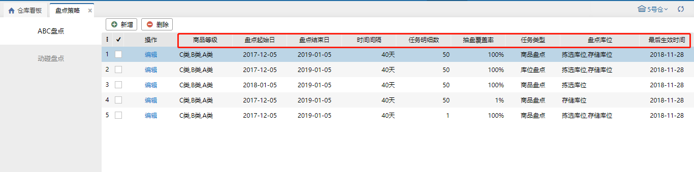

# 盘点策略

设置好盘点策略后，会根据设置条件自动生成盘点任务。

### 01.ABC盘点
  
abc盘点策略中对应商品等级的商品会根据策略规则生成盘点任务。  
1）盘点的对象为：策略中商品等级对应的商品。  
2）盘点起始日和结束日：盘点策略只会在起始日和结束日之间生效。  
3）生效时间：当前日期<盘点结束日且当前日期=盘点起始日+时间间隔*n（其中n为正整数）。  
4）任务明细：生成一个任务的明细数量最多数量。  
5）抽盘覆盖率：应当抽取个数=商品等级对应商品个数*抽盘率。  
   应当抽取个数<策略对应等级有库位库存商品个数时，实际生成：应当抽取个数。  
   应当抽取个数>策略对应等级有库位库存商品个数时，实际生成：策略对应等级有库位库存商品个数。  
6）任务类型：商品盘点和库位盘点两个类型可选，与盘点任务中的类型意义一致。  
7）盘点库位：会生成盘点任务的库位类型只有拣选库位和存储库位。

5号合

### 02.动碰盘点
  
动碰盘点策略主要是动碰过的商品或者库位，根据策略的规则，会自动生成盘点任务。  
1） a.动碰对象：盘商品。（策略生效当天-动碰时间）到（策略生效当天）这段范围内，有过流水的商品。【注意：除了仅盘点流水的商品】。  
       b.动碰对象：盘库位。（策略生效当天-动碰时间）到（策略生效当天）这段范围内，有过流水的库位。【注意：除了仅盘点流水的库位】。  
2）盘点起始日和结束日：盘点策略只会在起始日和结束日之间生效。  
3）生效时间：当前日期<盘点结束日且当前日期=盘点起始日+时间间隔*n（其中n为正整数）。  
4）任务明细：生成一个任务的明细数量最多数量。  
5）a.动碰对象为商品时的抽盘覆盖率：  
     应当抽取个数=全仓有流水对应商品个数*抽盘率。【注意：除了仅盘点流水的商品】。  
     应当抽取个数<盘点区域有库位库存商品个数时，实际生成：应当抽取个数。  
     应当抽取个数>盘点区域有库位库存商品个数时，实际生成：盘点区域有库位库存商品个数。  
     b.动碰对象为库位时的抽盘覆盖率：  
     实际生成个数=应当抽取个数=盘点区域下有流水的库位个数*抽盘率【注意：除了仅盘点流水的库位】。  
6）任务类型：商品盘点和库位盘点两个类型可选，与盘点任务中的类型意义一致。  
7）盘点区域：生成盘点任务时只会从选中的盘点区域下的库位中选择。【注意：新增或修改时，未勾选区域，将视为盘点区域为全仓】  
8）盘点库位：会生成盘点任务的库位类型只有拣选库位和盘点库位。

> 更新: 2023-12-19 16:05:31  
> 原文: <https://hupun.yuque.com/unzko7/lsbfg0/xz9ka960mbk6ubwx>