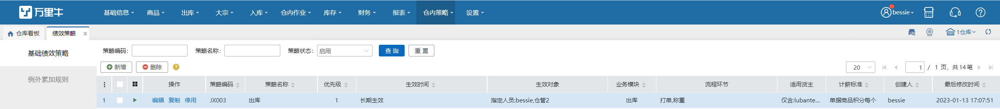

# 绩效策略

绩效策略是用户可以根据自己的需求来设定积分计算规则，可细分到不同模块、不同环节、不同货主、不同操作员等条件。

绩效策略分类两类：普通绩效策略和例外累加规则。

具体页面如下：

提示

基础绩效策略有优先级，最多只能匹配一个，优先级1最大，往后依次递减。同优先级时按策略编码从小到大匹配。

2.例外累加规则无优先级，支持匹配多个，有多个匹配时累加，并与基础绩效策略合计。详细的绩效策略介绍，请看【[基础绩效策略](https://hupun.yuque.com/unzko7/lsbfg0/dx7fs2lnqq24mnz1)】及【[例外累加规则](https://hupun.yuque.com/unzko7/lsbfg0/tf8nvibl37hxc42g)】

> 更新: 2023-12-18 17:25:50  
> 原文: <https://hupun.yuque.com/unzko7/lsbfg0/dcsnv5l389r9yhrv>